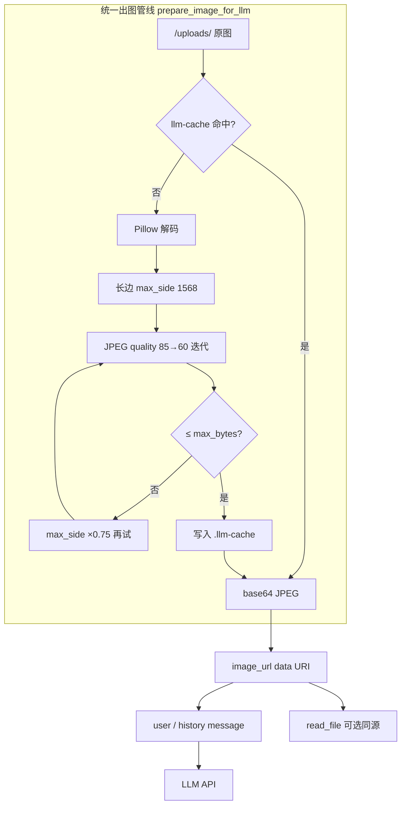

# 总管/员工 Agent 多模态入参

## 背景与缺口

**已有能力（无需改 agent 工厂）：**

- [`apps/server/src/service/agent/compatible_filesystem_middleware.py`](apps/server/src/service/agent/compatible_filesystem_middleware.py)：`read_file` 读图片 → `content_blocks` → sanitize 为 `image_url` **data URI（base64）**
- [`apps/server/src/llm/vision.py`](apps/server/src/llm/vision.py)：`active_model_supports_vision()`
- [`apps/server/src/service/basic_file_reader.py`](apps/server/src/service/basic_file_reader.py)：读盘、20MB API 硬上限、文档文本提取

**缺口：**

- [`chat_service.py`](apps/server/src/service/chat_service.py) 仅把 `extra_meta.files` 拼成路径字符串，agent 首包看不到像素
- **无图片压缩**：base64 膨胀 + 历史重建易占满 context（当前服务端 [`pyproject.toml`](apps/server/pyproject.toml) 无 Pillow）

**范围外：**

- 编排委派 [`execution.py`](apps/server/src/service/agent/orchestrator/execution.py)
- 前端上传/UI（已传 `{ path, name }`）

---

## 修正：不能依赖 read_file 做后续追问

| 问题 | 说明 |
|------|------|
| 非视觉模型 | read_file 的 image block 会被 sanitize 为纯文本提示 |
| Agent 行为 | 第二轮未必再调 read_file |
| 设计 | 用户上传应走 **HumanMessage 多模态**，追问靠 **history 重建 image_url** |

---

## 图片格式与 context 风险

所有发往 LLM 的 `image_url.url` 均为 **`data:{mime};base64,...`**（本地 `/uploads/`，无公网 URL）。

base64 约有 **33% 体积膨胀**；若历史多轮重建原图，极易爆 context。因此采用 **「压缩 + 历史 budget」双层**，budget 按**压缩后**字节计。



---

## 多模态策略（当前轮 + 历史轮）

| 场景 | 视觉模型 | 非视觉模型 |
|------|---------|-----------|
| **当前轮**图片 | text + 压缩后 `image_url` | 路径 + 切换视觉模型提示 |
| **历史轮**含图 user 消息 | 重建压缩后 `image_url`（见 budget） | 路径文本 |
| **文档** pdf/docx | 提取文本入 text（截断 ~8k） | 同左 |
| **纯文本附件** | 路径或小文件内联 | 同左 |

### 压缩参数（默认常量，放 `image_multimodal.py`）

| 常量 | 建议值 | 说明 |
|------|--------|------|
| `LLM_IMAGE_MAX_SIDE` | `1568` | 长边上限（OCR 场景可后续调 2048） |
| `LLM_IMAGE_MAX_BYTES` | `1_500_000` | 单张压缩后解码字节上限 |
| `LLM_IMAGE_SKIP_COMPRESS_BELOW` | `512_000` | 原图小于此且未超 max_bytes 则不压 |
| `LLM_IMAGE_JPEG_QUALITY_STEPS` | `(85, 75, 65, 60)` | 逐步降 quality |
| `LLM_IMAGE_HISTORY_BYTE_BUDGET` | `4_000_000` | 单次请求**历史**图片压缩后总字节 |
| `LLM_IMAGE_HISTORY_MESSAGE_LIMIT` | `3` | 最近 N 条含图 user 消息重建 image |
| `DASHSCOPE_MAX_MULTIMODAL_BYTES` | 已有 20MB | API 硬顶，压缩层应远低于此 |

**特殊格式：**

- PNG 透明 → JPEG 前铺白底
- GIF → 取首帧再压
- SVG → 不走像素压缩，仅路径/文本
- HEIC/HEIF → Pillow 可用则压，失败 fallback 原图或错误提示

### 磁盘 cache（避免历史每轮重压）

- 路径：`{conversation_dir}/uploads/.llm-cache/{hash}.jpg`
- Key：`sha256(path + mtime + compress_params)`
- **原图不变**（UI 预览 [`resource_service`](apps/server/src/service/resource_service.py) 仍读原文件）
- 仅 LLM 管线读 cache

### 历史 budget 与压缩配合

- 逆序扫描 user 消息，含 `extra_meta.files` 的图片条目调用 `prepare_image_for_llm`
- 每注入一张，从 `LLM_IMAGE_HISTORY_BYTE_BUDGET` 扣减**压缩后**字节
- 超出 budget 或超过 `HISTORY_MESSAGE_LIMIT`：较旧消息降级为 `[上传的文件]` 路径文本
- 当前轮图片**始终尝试**注入（走同一压缩层）

---

## 实现步骤

### 1. 新增 `image_multimodal.py` + 依赖

路径：[`apps/server/src/service/image_multimodal.py`](apps/server/src/service/image_multimodal.py)

- [`apps/server/pyproject.toml`](apps/server/pyproject.toml) 增加 `pillow>=10.0`
- `prepare_image_for_llm(path, *, max_bytes, max_side, ...) -> PreparedImage(base64, mime_type, decoded_bytes)`
- `to_image_url_block(base64, mime) -> dict` — 统一 data URI 格式（从 [`compatible_filesystem_middleware._normalize_image_block_for_api`](apps/server/src/service/agent/compatible_filesystem_middleware.py) 抽出）
- 内部：decode → resize(LANCZOS) → JPEG encode → quality/shrink 迭代 → cache 读写

### 2. 新增 `agent_message_builder.py`

路径：[`apps/server/src/service/agent_message_builder.py`](apps/server/src/service/agent_message_builder.py)

- `resolve_upload_path` — 对齐 [`resource_service._resolve_safe_path`](apps/server/src/service/resource_service.py)
- `build_file_context_lines(files) -> str`
- `build_image_blocks_from_files(...)` — 对每张图调用 `prepare_image_for_llm`，再 `to_image_url_block`
- `build_user_agent_content(...)` — 当前轮
- `build_history_user_content(msg, ..., remaining_byte_budget) -> tuple[dict, int]`

### 3. 重构 `ChatService.stream_conversation_answer`

文件：[`apps/server/src/service/chat_service.py`](apps/server/src/service/chat_service.py)

1. `_load_history_for_agent` 返回 enrich 后历史（含图重建 + budget）
2. 组装 mention / skill 前缀
3. `build_user_agent_content` 构建当前轮
4. `request_messages[-1]` 只赋值一次；删除总管 545 行重复覆写

DB 仍存原始 `content` + `extra_meta.files`。

### 4. 扩展 `_load_history_for_agent`

- 返回 `list[dict[str, Any]]`（`content: str | list`）
- 含图 user 消息 → `build_history_user_content`（压缩 + budget）

### 5. 可选：`read_file` 与 user 入参同源

[`handle_compatible_read_result`](apps/server/src/service/agent/compatible_filesystem_middleware.py) 在处理 `file_type == "image"` 时，改为经 `prepare_image_for_llm` 再返回 `content_blocks`，避免 tool 路径比 user 路径更大。**非追问主路径**，仅为体积一致。

### 6. 中间件与 Agent 工厂

无需改 orchestrator/employee 工厂；user/tool 的 `image_url` 仍经 sanitize。

### 7. 测试

[`apps/server/tests/test_image_multimodal.py`](apps/server/tests/test_image_multimodal.py)（新）：

| 用例 | 断言 |
|------|------|
| 4MB PNG | 压缩后 ≤ `LLM_IMAGE_MAX_BYTES` |
| 200KB PNG | 跳过压缩或体积接近原图 |
| quality 迭代 | 超大图最终落在 budget 内 |
| cache | 同文件二次调用读 cache |
| GIF 首帧 / 透明 PNG | 不报错，输出 JPEG |

[`apps/server/tests/test_agent_message_builder.py`](apps/server/tests/test_agent_message_builder.py)（新）：

| 用例 | 断言 |
|------|------|
| 当前轮 + 视觉 | list content 含 image_url |
| 历史重建 + budget | 较旧含图消息降级为路径 |
| 非视觉 | 无 image block |
| 文档 pdf | text 含提取内容 |

### 8. 验证

```bash
cd apps/server && uv sync && uv run pytest tests/test_image_multimodal.py tests/test_agent_message_builder.py tests/test_compatible_filesystem_middleware.py
```

手动：4MB 截图 + 提问 → 能识图且无明显超时；第二轮「右下角是什么」→ 直接回答；连续 3 轮引用同图 → context 可控。

---

## 关键文件

| 文件 | 变更 |
|------|------|
| [`apps/server/pyproject.toml`](apps/server/pyproject.toml) | 添加 `pillow` |
| [`apps/server/src/service/image_multimodal.py`](apps/server/src/service/image_multimodal.py) | 新建：压缩 + cache + image_url block |
| [`apps/server/src/service/agent_message_builder.py`](apps/server/src/service/agent_message_builder.py) | 新建：user/history 消息构建 |
| [`apps/server/src/service/chat_service.py`](apps/server/src/service/chat_service.py) | 接入 builder |
| [`apps/server/src/service/agent/compatible_filesystem_middleware.py`](apps/server/src/service/agent/compatible_filesystem_middleware.py) | 可选：read_file 走 prepare_image_for_llm |
| [`apps/server/tests/test_image_multimodal.py`](apps/server/tests/test_image_multimodal.py) | 新建 |
| [`apps/server/tests/test_agent_message_builder.py`](apps/server/tests/test_agent_message_builder.py) | 新建 |

不改：前端、编排 execution、agent 工厂。
