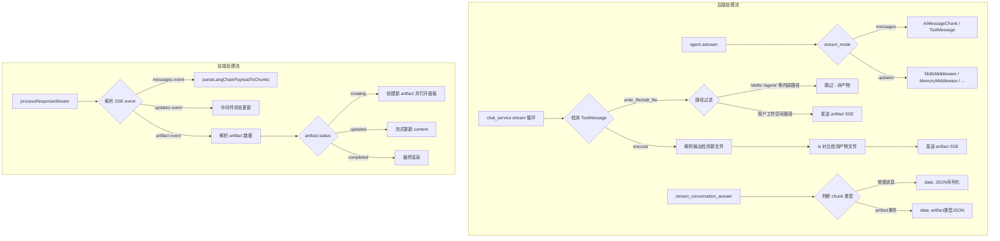

# Artifact 自定义 Stream 实现方案

## 现状分析

### 后端 Stream 机制

当前 `stream_conversation_answer` 使用 LangGraph 的 `agent.astream()` 并指定 `stream_mode=["messages", "updates"]`：

```345:351:apps/server/src/service/chat_service.py
async for chunk in agent.astream(
    {"messages": request_messages},
    stream_mode=["messages", "updates"],
    config={"configurable": {"thread_id": conversation_id}}
):
```

SSE 输出两种事件：

- `["messages", [AIMessageChunk/ToolMessage, metadata]]` - 流式文本和工具调用
- `["updates", {...}]` - 中间件状态更新（skills、memory、todos 等）

后端通过 `ChatService.convert_to_serializable()` 将 LangChain 消息对象序列化为 JSON，然后以 `data: {json}\n\n` 格式发送 SSE。

### 文件产物的会话隔离

文件产物目前**没有做会话级别隔离**：

1. `_CHECKPOINTER = MemorySaver()` 和 `_STORE = InMemoryStore()` 是进程级全局单例
2. `config={"configurable": {"thread_id": conversation_id}}` 让 LangGraph checkpoint 按 conversation_id 隔离
3. 但 `FilesystemBackend` 的 `root_dir` 指向实际磁盘路径，所有会话共享同一目录
4. `StoreBackend`（`/memories/`）也没有按会话隔离键

### 前端 Artifact 组件现状

前端已有完整的 artifact 组件体系：

- **类型**：`Artifact { id, type(text|code|sheet|image), title, content, language? }`（[artifact-types.ts](apps/web/src/components/artifact/artifact-types.ts)）
- **Store**：Zustand `useArtifactStore`（[artifact-store.ts](apps/web/src/stores/artifact-store.ts)）
- **面板**：侧边 600px 或全屏覆盖（[artifact-panel.tsx](apps/web/src/components/artifact/artifact-panel.tsx)）
- **预览**：嵌入消息流中的卡片（[artifact-preview.tsx](apps/web/src/components/artifact/artifact-preview.tsx)）
- **渲染器**：text / code(语法高亮) / sheet(表格) / image（[artifact-content/](apps/web/src/components/artifact/artifact-content/)）

### 当前 Artifact 触发机制

前端从**工具调用的输出**中提取 artifact（[artifact-utils.ts](apps/web/src/lib/chat/artifact-utils.ts)）：

```158:195:apps/web/src/lib/chat/artifact-utils.ts
function buildArtifactFromToolPart(part: ToolPart): Artifact | null {
  const output = getToolOutput(part)
  const input = getToolInput(part, output)
  const filePath = typeof input.file_path === "string" ? input.file_path : null
  const content = typeof input.content === "string" ? input.content : ...
  if (!filePath || content === null) return null
  ...
}
```

只匹配带有 `file_path` + `content`/`new_string` 的工具输出，即 `write_file` 和 `edit_file` 工具的调用结果。

## Artifact 过滤规则（关键约束）

并非所有文件操作都是"产物"。agent 在执行过程中会读写多种内部路径，这些**不能作为 artifact 展示**：

| 虚拟路径 | 对应 backend | 用途 | 是否产物 |
|---|---|---|---|
| `/skills/**` | skills_fs (skills_root) | 技能目录读写、SKILL.md、脚本执行 | **否** - 内部读取 |
| `/agent/**` | agent_fs (服务目录) | AGENTS.md 等配置 | **否** - agent 配置 |
| `/memories/**` | StoreBackend | 持久化记忆 | **否** - 内部状态 |
| `/large_tool_results/**` | FilesystemBackend | 工具结果溢出缓存 | **否** - 中间产物 |
| `/conversation_history/**` | FilesystemBackend | 历史消息溢出缓存 | **否** - 中间产物 |
| 其他（StateBackend 默认 / workspace） | workspace root_path | 用户请求创建的文件 | **是** - 产物 |

**过滤策略**：后端在拦截工具调用结果时，按 `file_path` 前缀判断是否属于产物。只有落到用户工作空间（非 `/skills/`、`/agent/`、`/memories/` 等内部路径）的文件操作才标记为 artifact。

```python
# artifact 过滤伪代码
ARTIFACT_EXCLUDED_PREFIXES = ("/skills/", "/agent/", "/memories/", "/large_tool_results/", "/conversation_history/")

def is_artifact_file(file_path: str) -> bool:
    return not any(file_path.startswith(prefix) for prefix in ARTIFACT_EXCLUDED_PREFIXES)
```

## 问题：当前方案的限制

1. **仅 write_file/edit_file 触发** - 不支持 `execute` 产出的文件、或其他工具的结果
2. **无法流式展示** - 前端必须等整个 ToolMessage 完成（`output-available`），无法在文件写入过程中实时预览
3. **没有 artifact 专用 stream 事件** - 所有数据都走通用的 messages/updates 通道，前端只能事后提取
4. **文件产物无会话隔离** - 所有会话的文件共享同一个 backend 目录
5. **无过滤机制** - 当前前端把所有带 `file_path` 的工具调用都当 artifact，技能文件读取等也被错误地展示为产物

## 实现方案

### 核心思路：自定义 SSE 事件 + 后端中间件拦截

利用 deepagents 0.5.3 的 middleware 机制，在 `FilesystemMiddleware` 的工具调用层（`wrap_tool_call` / `awrap_tool_call`）之后注入自定义的 artifact 事件。同时监听 `execute` 工具的输出，检测是否产生了新文件。



### 方案步骤

#### 第1步：后端 - 添加 Artifact SSE 事件（含过滤 + execute 检测）

在 `chat_service.py` 的 `stream_conversation_answer` 中：

1. 检测 `ToolMessage` 类型的 chunk，从中提取工具名和 file_path
2. **用路径前缀过滤**：只对 `/skills/`、`/agent/`、`/memories/`、`/large_tool_results/`、`/conversation_history/` **以外**的路径生成 artifact 事件
3. 对于 `write_file` 操作：发送 `status: "creating"` -> `status: "completed"` 的 artifact 事件
4. 对于 `edit_file` 操作：发送 `status: "updated"` 的 artifact 事件（内容为 new_string）
5. 对于 `execute` 操作：解析命令输出，如果产生了新文件（通过命令前后 ls 快照对比），也发送 artifact 事件

```python
# 过滤规则（在 chat_service.py 中）
ARTIFACT_EXCLUDED_PREFIXES = ("/skills/", "/agent/", "/memories/", "/large_tool_results/", "/conversation_history/")

def _is_artifact_file(file_path: str) -> bool:
    """判断文件操作是否应作为 artifact 展示。技能文件、记忆、agent配置等不算产物。"""
    normalized = file_path.replace("\\", "/")
    return not any(normalized.startswith(prefix) for prefix in ARTIFACT_EXCLUDED_PREFIXES)

def _build_artifact_event(file_path: str, content: str, conversation_id: int, status: str) -> dict:
    """构建 artifact SSE 事件"""
    return {
        "type": "artifact",
        "data": {
            "id": f"artifact:{conversation_id}:{file_path}",
            "type": infer_artifact_type(file_path),  # text/code/sheet/image
            "title": Path(file_path).name,
            "content": content,
            "language": infer_language(file_path),
            "conversation_id": conversation_id,
            "file_path": file_path,
            "status": status,  # creating / updated / completed
        }
    }
```

需要修改的文件：

- [apps/server/src/service/chat_service.py](apps/server/src/service/chat_service.py) - stream 循环中添加 artifact 检测 + 过滤 + SSE 发送逻辑

#### 第2步：后端 - 文件产物会话级隔离

在 `stream_conversation_answer` 中，为每个 conversation 创建隔离的工作目录：

- 使用 workspace 下的 `conversations/{conversation_id}/artifacts/` 作为产物目录
- `get_agent` 接受 `conversation_id` 参数，创建会话专用的 `FilesystemBackend` 路由
- 产物文件虚拟路径映射：`/artifacts/` -> `workspace/conversations/{id}/artifacts/`
- 技能、记忆等内部路径不受影响，仍然共享

```python
# agent.py 中修改 get_agent
def get_agent(skill_path, root_path, *, conversation_id: int | None = None, ...):
    # 会话隔离的 artifacts 目录
    if conversation_id:
        artifacts_dir = Path(root_path) / "conversations" / str(conversation_id) / "artifacts"
        artifacts_dir.mkdir(parents=True, exist_ok=True)
    else:
        artifacts_dir = Path(root_path)
    
    artifacts_fs = PosixVirtualFilesystemBackend(root_dir=str(artifacts_dir), virtual_mode=True)
    
    backend = WindowsCompatibleCompositeBackend(
        ...
        routes={
            "/memories/": StoreBackend(),
            "/skills/": skills_fs,
            "/agent/": agent_fs,
            "/artifacts/": artifacts_fs,  # 新增：会话隔离的产物目录
        },
    )
```

需要修改的文件：

- [apps/server/src/service/chat_service.py](apps/server/src/service/chat_service.py) - 传入 conversation_id 到 get_agent
- [apps/server/src/service/agent.py](apps/server/src/service/agent.py) - `get_agent` 接受 `conversation_id`，创建会话隔离的 artifacts backend

#### 第3步：前端 - SSE Schema 扩展（含过滤）

在 `langchain-sse-schema.ts` 中添加 artifact 事件的 schema 定义。后端已做过滤，前端作为第二道防线也可校验：

```typescript
export const ARTIFACT_EXCLUDED_PREFIXES = ["/skills/", "/agent/", "/memories/", "/large_tool_results/", "/conversation_history/"]

export const artifactEventSchema = z.tuple([
  z.literal("artifact"),
  z.object({
    id: z.string(),
    type: z.enum(["text", "code", "sheet", "image"]),
    title: z.string(),
    content: z.string(),
    language: z.string().optional(),
    conversation_id: z.number(),
    file_path: z.string().optional(),
    status: z.enum(["creating", "updated", "completed"]),
  }).refine(
    (data) => !data.file_path || !ARTIFACT_EXCLUDED_PREFIXES.some(p => data.file_path!.startsWith(p)),
    { message: "Internal file paths should not be treated as artifacts" }
  ),
])
```

同时更新前端 `artifact-utils.ts` 中的 `buildArtifactFromToolPart`，加上同样的过滤逻辑（防止旧消息回放时把技能文件当 artifact）。

需要修改的文件：

- [apps/web/src/lib/chat/langchain-sse-schema.ts](apps/web/src/lib/chat/langchain-sse-schema.ts) - 添加 artifact event schema + 过滤 refine
- [apps/web/src/lib/chat/artifact-utils.ts](apps/web/src/lib/chat/artifact-utils.ts) - 添加 `isArtifactFilePath()` 过滤函数

#### 第4步：前端 - Stream Parser 扩展

在 `langchain-stream-parser.ts` 中添加 artifact chunk 类型，或在 `processResponseStream` 中单独处理 artifact 事件。

需要修改的文件：

- [apps/web/src/lib/chat/langchain-stream-parser.ts](apps/web/src/lib/chat/langchain-stream-parser.ts) - 添加 artifact chunk 处理
- [apps/web/src/lib/chat/langchain-chat-transport.ts](apps/web/src/lib/chat/langchain-chat-transport.ts) - 解析 artifact SSE 事件

#### 第5步：前端 - Artifact Store 流式更新

给 `useArtifactStore` 添加流式更新能力，支持按 artifact id 增量追加 content：

```typescript
// artifact-store.ts 新增
updateArtifactContent: (id: string, contentDelta: string) => void
completeArtifact: (id: string) => void

// chat-panel.tsx 中处理 artifact stream events
React.useEffect(() => {
  // 监听 artifact 类型的 UIMessageChunk
  // status === "creating" -> addArtifact + openArtifact
  // status === "updated"  -> updateArtifactContent(delta)
  // status === "completed" -> completeArtifact
}, [artifacts, addArtifact, updateArtifactContent, completeArtifact])
```

需要修改的文件：

- [apps/web/src/stores/artifact-store.ts](apps/web/src/stores/artifact-store.ts) - 添加 `updateArtifactContent` / `completeArtifact` 方法
- [apps/web/src/components/chat/chat-panel.tsx](apps/web/src/components/chat/chat-panel.tsx) - 处理流式 artifact events
- [apps/web/src/components/artifact/artifact-panel.tsx](apps/web/src/components/artifact/artifact-panel.tsx) - 支持内容实时刷新渲染

## 替代方案对比

| 方案 | 优点 | 缺点 |
|------|------|------|
| **A. 自定义 SSE 事件（推荐）** | 完全控制 artifact 生命周期，支持流式 | 需要前后端都改 |
| **B. 纯前端从 ToolMessage 提取** | 只改前端，改动最小 | 不支持流式、只能事后提取 |
| **C. deepagents 自定义 Middleware** | 最优雅，复用框架能力 | 需要理解 langchain middleware 协议，调试成本高 |
| **D. 响应格式 response_format** | 结构化输出 | 不适合流式场景 |

**推荐方案 A**，因为它最灵活且能支持未来的流式 artifact 需求。

## 已确认的设计决策

1. **流式实时更新** - artifact 边写边展示，不是完成后一次性展示
2. **会话级隔离** - 文件产物按 `conversation_id` 隔离
3. **execute 产物也展示** - `execute` 工具产生的文件也作为 artifact 展示
