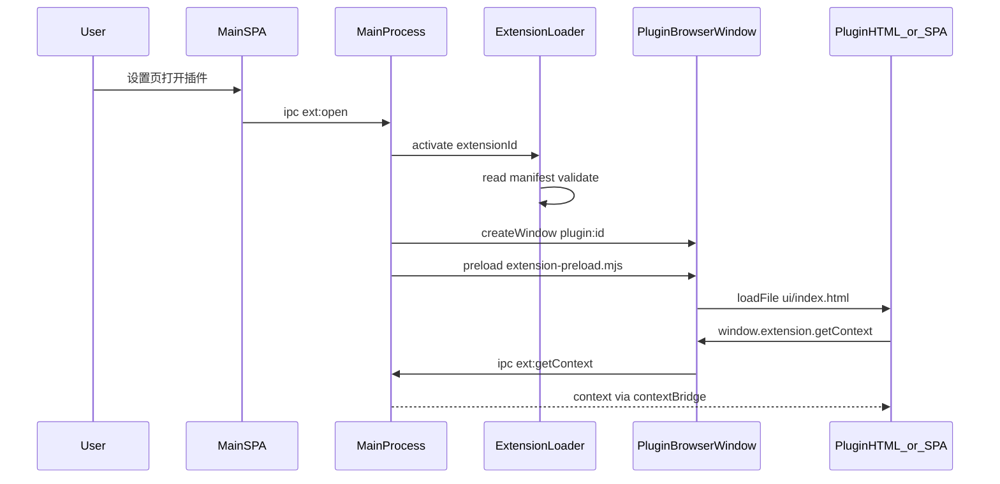
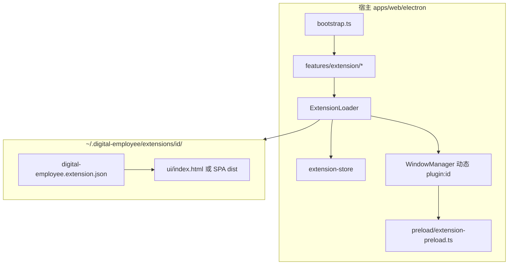

# Electron 插件（Extension）机制实施规划

## 目标与原则

| 原则 | 说明 |
|------|------|
| UI 零耦合 | 插件页面来自 `%userData%/extensions/<id>/ui/...`，**不**进入 [`apps/web/src/routes`](apps/web/src/routes)，**不** merge 进 [`electron/preload/electron-api.ts`](apps/web/electron/preload/electron-api.ts) |
| 薄宿主桥 | 插件窗口仅加载宿主打包的 [`extension-preload`](apps/web/electron/preload/extension-preload.ts)（新建），暴露 `window.extension` |
| 与内置 Feature 对齐 | 复用 [`IpcContribution`](apps/web/electron/core/ipc/types.ts) + [`IpcRegistry`](apps/web/electron/core/ipc/registry.ts) + [`Feature.activate`](apps/web/electron/core/feature.ts) 模式 |
| 主后端隔离 | 全局 [`startBackend()`](apps/web/electron/features/backend/backend-process.ts) 仍在 bootstrap；插件本地服务（形态3）**第二期**独立启停，不阻塞登录 |

用户已确认：**第一期 = 基础设施 + 形态2**；形态3 放第二期。

---

## 架构总览





---

## Manifest 契约（第一期字段）

路径：`<extensionsRoot>/<id>/digital-employee.extension.json`

`extensionsRoot` 与现有数据目录一致：[`getStoreDir()`](apps/web/electron/features/settings/settings-store.ts) → `~/.digital-employee/extensions/`

```json
{
  "id": "com.example.demo",
  "version": "1.0.0",
  "displayName": "示例插件",
  "minHostVersion": "0.0.49",
  "permissions": ["context.read"],
  "ui": {
    "entry": "ui/index.html",
    "title": "示例",
    "width": 960,
    "height": 720,
    "devEntry": "http://127.0.0.1:5199/"
  }
}
```

- 能力由块组合：`ui`（必填）+ 可选 `service`（本地子进程）；无 `kind` 字段
- `ui.entry`: 相对扩展根；生产用 `loadFile` 解析为绝对路径
- `ui.devEntry`: 开发时 `--load-extension` 或环境变量覆盖（见下）
- `permissions`: 控制 `getContext` 是否含 `authToken`（默认不含，需显式 `auth.read`）

---

## 新增目录与职责

在 [`apps/web/electron/features/extension/`](apps/web/electron/features/extension/) 新增自包含模块（与 auth/backend 同级）：

| 文件 | 职责 |
|------|------|
| `manifest-schema.ts` | Zod/手写校验 manifest（id 格式、路径安全） |
| `extension-paths.ts` | `getExtensionsRoot()`、`resolveExtensionPath(id, relative)`，禁止 `..` 穿越 |
| `extension-store.ts` | electron-store：`enabled: string[]`、可选 `devOverrides: Record<id, devEntry>` |
| `extension-loader.ts` | 扫描目录、加载 manifest、`activate`/`deactivate`、内存 Map 缓存 |
| `extension-window.ts` | `openExtensionWindow(id)` / `closeExtensionWindow(id)` |
| `extension-context.ts` | 组装 `ExtensionContext`（pluginId、version、hostVersion；有权限才带 token） |
| `ipc.ts` | `IpcContribution`：`ext:list`、`ext:open`、`ext:close`、`ext:getContext`、`ext:setEnabled` |
| `preload-bridge.ts` | **不**并入主 `electronApi`；仅供文档/类型导出 channel 常量 |

核心逻辑模块（放 `electron/core/extension/` 或 `features/extension/` 内均可，建议后者保持 feature 内聚）：

- **`ExtensionLoader`**: `scan()` → `list()` → `activate(id)` → 注册运行时状态
- **`ExtensionWindowHost`**: 创建窗口时使用 **独立 preload 路径**（见构建）

---

## 对现有代码的改动

### 1. WindowManager 支持动态插件窗

[`window-manager.ts`](apps/web/electron/core/services/window-manager.ts)：

- `WindowId` 改为 `BuiltinWindowId | \`plugin:${string}\``（或`string` + 类型守卫）
- `WindowDescriptor` 增加可选 `preloadPath?: string`、`loadUrl?: string`（与 `route` 二选一）
- `createWindow`：若提供 `loadUrl`/`loadFile`，**不**调用 [`buildHashRouteUrl`](apps/web/electron/core/runtime-paths.ts)

参考现有子窗模式 [`window-recruitment.ts`](apps/web/electron/features/recruitment/window-recruitment.ts)，但加载目标改为扩展 `ui.entry`。

### 2. 第二个 Preload 构建产物

[`vite.config.ts`](apps/web/vite.config.ts) `electron.preload`：

- 将 `input` 改为多入口：`electron/preload/index.ts` + `electron/preload/extension-preload.ts`
- 输出：`dist-electron/preload/index.mjs` + `dist-electron/preload/extension-preload.mjs`
- 在 [`runtime-paths.ts`](apps/web/electron/core/runtime-paths.ts) 增加 `getExtensionPreloadPath()`

**extension-preload 暴露 API（第一期最小集）**：

```ts
window.extension = {
  apiVersion: 1,
  getPluginId(): string      // 由主进程在 did-finish-load 前注入或 query ?pluginId=
  getContext(): Promise<ExtensionContext>
  close(): Promise<void>
  invoke(method: string, payload?: unknown): Promise<unknown>  // 预留，第一期可仅实现 getContext/close
}
```

插件窗口 **不** 调用 `exposeElectronAPI()` / **不** 暴露 `window.electronApi`，避免插件误依赖主应用 API。

### 3. Bootstrap 与 Feature 注册

[`bootstrap.ts`](apps/web/electron/core/bootstrap.ts)：

- `createAppContext` 之后：`ExtensionLoader.scan()` + 对 `enabled` 列表 `activate`（仅注册元数据，**不**自动开窗）
- [`features/index.ts`](apps/web/electron/features/index.ts) 追加 `extensionIpcContribution`

[`lifecycle.ts`](apps/web/electron/core/services/lifecycle.ts)：

- `quitApp` / `before-quit` 增加 `ExtensionLoader.deactivateAll()`（关插件窗；第二期再 `stopAllServices()`）

### 4. IPC Channels

[`shared/ipc-channels.ts`](apps/web/electron/shared/ipc-channels.ts) 增加 `ext:*` channel；**不**写入主应用 `IpcInvokeMap` 的强类型合并（或单独 `ExtensionIpcMap` 类型文件，避免污染现有 `ElectronApi`）。

主应用设置页通过 **现有** `window.electronApi` 新增 bridge 方法（合并进主 preload 的 extension 管理 API，仅宿主 SPA 使用）：

- `listExtensions()`、`openExtension(id)`、`setExtensionEnabled(id, boolean)`

### 5. 主应用设置页（第一期薄入口）

在 [`apps/web/src`](apps/web/src) 设置相关路由增加「插件」区块（列表 + 启用开关 + 打开），调用上述宿主 IPC。无插件 UI 嵌入。

### 6. 文档与示例

- 更新 [`electron/README.md`](apps/web/electron/README.md)「与未来插件扩展」为正式章节：Manifest、目录结构、dev 流程、`window.extension` API
- 新增 `examples/extension-demo/`：单文件 `ui/index.html` + manifest，用于手工复制到 `~/.digital-employee/extensions/`

---

## 开发体验

| 能力 | 实现 |
|------|------|
| 加载路径 | `~/.digital-employee/extensions/<id>/` |
| Dev 覆盖 | `EXTENSION_DEV_<SAFE_ID>=http://localhost:5174` 或 manifest `ui.devEntry` |
| CLI | `pnpm dev:app` 文档说明 `--load-extension=../examples/extension-demo` 复制/软链到 extensions 目录 |
| 日志 | `createLogger("extension")` + 按 `extensionId` 子 logger |

---

## 安全（第一期基线）

- 路径：`resolveExtensionPath` 规范化后必须以扩展根为前缀
- `loadURL`：仅允许 `file://`（扩展目录内）或 dev 时 `http://127.0.0.1:*` / `localhost`（可配置）
- `nodeIntegration: false`，`contextIsolation: true`（与 [`WindowManager` 默认](apps/web/electron/core/services/window-manager.ts) 一致）
- Token：仅 `permissions` 含 `auth.read` 时 `getContext` 返回 `authToken`

签名、企业分发、HTTP 代理 IPC → **后续迭代**。

---

## 第二期预告（形态3，本期不实现）

从 [`backend-process.ts`](apps/web/electron/features/backend/backend-process.ts) 抽出：

- `core/services/managed-process.ts`：spawn、ready 检测（stdout 正则 / health）、`taskkill` / 进程组清理
- `extension-service-host.ts`：按 manifest `service` 块启停，`port: 0` 动态分配
- `openExtensionWindow` 流程：**先** `startService` **再** `loadUI`，`getContext` 增加 `serviceBaseUrl`
- `lifecycle` 退出时 `stopAllExtensionServices()`

manifest `service` 块与 `headless`（仅 service、无 ui）在第二期 / 第三期分别启用。

---

## 验收标准（第一期）

1. 将 `examples/extension-demo` 放入 extensions 目录，设置页可见并可打开独立窗口
2. 插件页能 `await extension.getContext()` 拿到 `pluginId`、`displayName`（无 token 时无 `authToken`）
3. 关闭插件窗 / 禁用插件 / 退出应用不残留孤儿窗口
4. 主应用聊天路由与构建体积不受插件影响；`pnpm typecheck` 通过
5. 插件窗口 DevTools 仅 dev 模式可选开启（与 recruitment 一致）

---

## 实施顺序建议

1. manifest 校验 + paths + store  
2. extension-preload 双入口构建 + `getExtensionPreloadPath`  
3. WindowManager 扩展 + `extension-window.ts`  
4. ExtensionLoader + extension feature IPC  
5. bootstrap / lifecycle 挂钩  
6. 主 preload bridge（宿主管理 API）+ 设置页列表  
7. README + example 插件 + 手工验收  

第二期单独 PR：ManagedProcess + ServiceHost + manifest `service` 字段。
