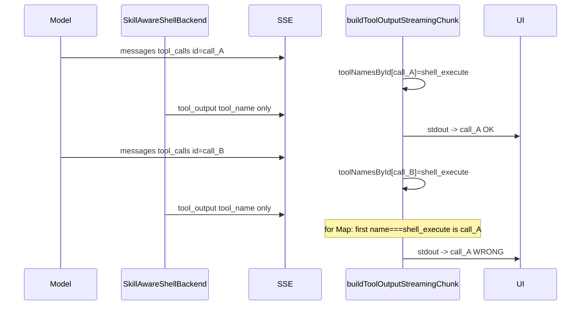
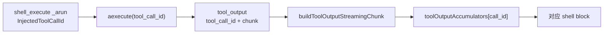

# Shell 流式输出归属错误修复计划

## 问题根因



- 后端 [`skill_shell_backend.py`](apps/server/src/service/skill_shell_backend.py) 的 `_emit_batch` 只发送 `tool_name: "shell_execute"`，无 `tool_call_id`（约 226-234 行）。
- 前端 [`buildToolOutputStreamingChunk`](apps/web/src/lib/chat/langchain-stream-parser.ts)（756-762 行）遍历 `toolNamesById`，**命中第一个** `shell_execute` 即 `break`，后续命令的输出都写入第一个 call 的 accumulator。
- 历史消息正确：[`buildToolOutputChunk`](apps/web/src/lib/chat/langchain-stream-parser.ts) 从 `ToolMessage.kwargs.tool_call_id` 直接关联，不经过上述逻辑。
- 备用路径 [`sse-parts-builder.ts`](apps/web/src/lib/chat/sse-parts-builder.ts) 的 `findToolCallIdByToolName`（119-126 行）存在相同缺陷，[`use-chat-stream.ts`](apps/web/src/hooks/use-chat-stream.ts) 会用到。

## 修复策略

**主方案**：后端注入 `tool_call_id` + 前端优先按 id 路由；保留无 `tool_call_id` 时的兼容回退（`activeToolCallId` → 按名称取**最后一个**匹配）。

---

## 1. 后端：在 `tool_output` 中附带 `tool_call_id`

### 1.1 工具层注入 call id

修改 [`shell_execute_tool.py`](apps/server/src/service/agent/shell_execute_tool.py)：

- 从 `langchain_core.tools` 引入 `InjectedToolCallId`（项目 `langchain>=1.2.3` 已支持）。
- 在 `_arun` / `_run` 签名增加：`tool_call_id: Annotated[str, InjectedToolCallId]`（不加入 `ShellExecuteInput` schema，仅函数参数注入）。
- 调用 `shell.aexecute(command, tool_call_id=tool_call_id)`。

### 1.2 Shell 执行层写入 SSE

修改 [`skill_shell_backend.py`](apps/server/src/service/skill_shell_backend.py)：

- `aexecute(..., tool_call_id: str | None = None)`（同步 `execute` 若存在流式路径也需一致，当前流式仅在 `aexecute`）。
- `_emit_batch` 的 `data` 增加字段：`"tool_call_id": tool_call_id`（有值才发，避免破坏旧客户端可选；建议始终发送字符串）。

无需改 [`stream_registry.py`](apps/server/src/service/stream_registry.py)：已对 `custom_data.type === "tool_output"` 原样广播。

---

## 2. 前端：Schema + 解析按 `tool_call_id` 路由

### 2.1 Zod schema

修改 [`langchain-sse-schema.ts`](apps/web/src/lib/chat/langchain-sse-schema.ts)：

```ts
export const toolOutputDataSchema = z.object({
  tool_name: z.string(),
  tool_call_id: z.string().optional(), // 新增
  chunk: z.string(),
  chunk_seq: z.number(),
  stream: z.string(),
})
```

### 2.2 主解析器（useChat / LangChainChatTransport）

修改 [`langchain-stream-parser.ts`](apps/web/src/lib/chat/langchain-stream-parser.ts) 中 `buildToolOutputStreamingChunk`：

1. **优先** `event.tool_call_id`（经 `getStringValue` 校验）。
2. **回退 A**：`state.activeToolCallId` 且 `toolNamesById.get(active) === tool_name`（与 `emitToolInputStartIfReady` 设置的当前执行工具一致；chunk 日志显示 messages 中 tool_calls 通常早于 `tool_output`）。
3. **回退 B**：新增 `findLastToolCallIdByToolName`（遍历 Map 保留最后一个同名工具），仅在前两者缺失时使用。
4. 仍无 id 则 `return null`（保持现状）。

同步更新 [`langchain-chat-transport.ts`](apps/web/src/lib/chat/langchain-chat-transport.ts) 内 `toolOutputData` 类型，传入完整 `data` 对象。

### 2.3 备用解析器（useChatStream）

修改 [`sse-parts-builder.ts`](apps/web/src/lib/chat/sse-parts-builder.ts)：

- `applyToolOutputEvent` 的 event data 类型增加 `tool_call_id?`。
- 将 `findToolCallIdByToolName` 改为与主解析器相同的三级解析逻辑（可抽共享 helper 到例如 `tool-output-routing.ts`，避免重复；若求最小 diff 可两处各写一小段）。

---

## 3. 文档（可选、低优先级）

- 更新 [`langchain-stream-parser-flow.md`](apps/web/src/lib/chat/langchain-stream-parser-flow.md) 中 “tool_name matched” 描述为 “tool_call_id 优先”。
- 文件末尾 ASCII 注释（`langchain-stream-parser.ts` 1005-1007 行）同步一句。

---

## 数据流（修复后）



---

## 验证清单

1. **复现场景**：与 chunk 日志相同——连续多次 `shell_execute`（如 `where msedge ...`、`where msedge`、`agent-browser open` 等）。
2. **实时流**：每个 shell block 仅显示本命令 stdout；第一个 block 不再堆积后续命令输出。
3. **历史加载**：刷新或重进会话，各 shell 输出仍与 `tool_call_id` 一致（回归，应无变化）。
4. **Resume**：若使用 `useChatStream` / resume SSE，确认第二条路径同样正确。
5. **提交前**：`pnpm typecheck`（web）；后端无测试目录，可手动 `pnpm dev:server` + `pnpm dev:app` 验证。

---

## 涉及文件一览

| 层级 | 文件 | 改动要点 |
|------|------|----------|
| 后端 | `shell_execute_tool.py` | InjectedToolCallId → 传入 aexecute |
| 后端 | `skill_shell_backend.py` | aexecute 参数 + `_emit_batch` 带 tool_call_id |
| 前端 | `langchain-sse-schema.ts` | schema 扩展 |
| 前端 | `langchain-stream-parser.ts` | 路由逻辑 |
| 前端 | `langchain-chat-transport.ts` | 传参类型 |
| 前端 | `sse-parts-builder.ts` | 同上（resume 路径） |

**不在本次范围**：`updates` 事件被跳过导致 tool input 晚到等问题（现有 messages 流已能提前注册 id）；并发多工具同名同时执行（当前 shell 串行，id 方案已足够）。
