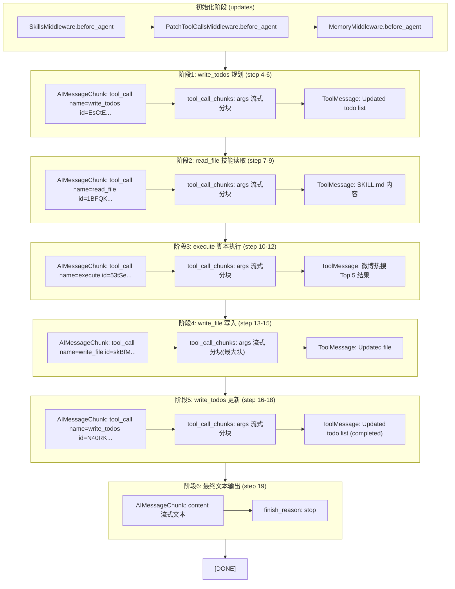

## 分析结果

### chunk.txt 完整事件时间线

文件共 1196 条 SSE data 行：1175 条 messages、20 条 updates、0 条 artifact、1 条 [DONE]。

用户请求："请使用hot-news技能回答这个问题：微博热搜top5，并写入文件"



### 工具调用映射表

| tool_call_id | 工具名称 | Step | 用途 |
|---|---|---|---|
| `EsCtEHoNR4ucerCCaejttc99jPGWqiLX` | write_todos | 4→6 | 创建 2 个 todo（获取热搜 in_progress + 写入文件 pending） |
| `1BFQKgt7FawkdFrzSaDTM9XNEvhwFqAb` | read_file | 7→9 | 读取 /skills/hot-news/SKILL.md |
| `53tSeIHvLQ49X8btVnGT1vhwa8L9WSxE` | execute | 10→12 | 执行 hot_news.py --type weibo --top 5 |
| `skBfMDeVqCPHzWhawtOwWzU7ix7AGTq0` | write_file | 13→15 | 写入 /artifacts/weibo_top5.txt |
| `N40RKVAYNmgtoAPYsToRy5Ns9wq5P11j` | write_todos | 16→18 | 标记所有 todo 为 completed |

---

### langchain-stream-parser-flow.md 是否需要更新？

**结论：需要小幅更新，但核心流程图不变。**

需要补充的内容：

1. **`updates` 事件的处理说明**：当前 flow.md 没有明确说明 `updates` 类型事件（SkillsMiddleware、PatchToolCallsMiddleware、MemoryMiddleware、TodoListMiddleware、model、tools）在管道中的角色。当前代码中 `unwrapStreamModePayload` 会将 `updates` 事件直接返回 `null` 跳过，这一点需要在文档中体现。

2. **ToolMessage 通过 `updates` 节点也能传递**：观察数据显示，有些 ToolMessage 既在 `messages` 事件中出现，也在 `updates` 的 `tools` 节点中出现。当前解析器只处理 `messages` 类型，`updates` 中的 tools 数据被跳过——这是正确行为但需要在文档中说明。

3. **每个模型调用结束的三信号模式**：`finish_reason` + `usage_metadata` + `chunk_position: last`，当前文档未提及。

4. **最终阶段只有文本没有工具调用**：flow.md 的流程图已经覆盖了这种情况（通过 `finish_reason: stop` 而非 `tool_calls`）。

---

### 最终输出数据（UIMessageChunk 序列）

经过 `parseLangChainPayloadToChunks` 解析后，前端 `useChat` 将收到以下 `UIMessageChunk` 序列：

```typescript
// ===================== 流开始 =====================
{ type: "start" }

// ===================== 阶段1: write_todos =====================
{ type: "tool-input-start", toolCallId: "EsCtEHoNR4ucerCCaejttc99jPGWqiLX", toolName: "write_todos" }
{ type: "tool-input-delta", toolCallId: "EsCtEHoNR4ucerCCaejttc99jPGWqiLX", inputTextDelta: "{\"todos\":[{\"content\":" }
{ type: "tool-input-delta", toolCallId: "EsCtEHoNR4ucerCCaejttc99jPGWqiLX", inputTextDelta: "\"使用 hot-news 技能获取微博热搜 top 5\"" }
// ... 更多 tool-input-delta 直到 JSON 完整 ...
{ type: "tool-input-available", toolCallId: "EsCtEHoNR4ucerCCaejttc99jPGWqiLX", toolName: "write_todos",
  input: { todos: [
    { content: "使用 hot-news 技能获取微博热搜 top 5", status: "in_progress" },
    { content: "将获取到的微博热搜 top 5 写入文件", status: "pending" }
  ]}}
{ type: "tool-output-available", toolCallId: "EsCtEHoNR4ucerCCaejttc99jPGWqiLX",
  output: { status: "success", text: "Updated todo list to [...]", toolName: "write_todos", input: {...}, inputText: "..." }}

// ===================== 阶段2: read_file =====================
{ type: "tool-input-start", toolCallId: "1BFQKgt7FawkdFrzSaDTM9XNEvhwFqAb", toolName: "read_file" }
{ type: "tool-input-delta", toolCallId: "1BFQKgt7FawkdFrzSaDTM9XNEvhwFqAb", inputTextDelta: "{\"file_path\":\"" }
// ... 更多 tool-input-delta ...
{ type: "tool-input-available", toolCallId: "1BFQKgt7FawkdFrzSaDTM9XNEvhwFqAb", toolName: "read_file",
  input: { file_path: "/skills/hot-news/SKILL.md", limit: 1000 }}
{ type: "tool-output-available", toolCallId: "1BFQKgt7FawkdFrzSaDTM9XNEvhwFqAb",
  output: { status: "success", text: "# Hot News Skill\n...(SKILL.md完整内容)...", toolName: "read_file", input: {...}, inputText: "..." }}

// ===================== 阶段3: execute =====================
{ type: "tool-input-start", toolCallId: "53tSeIHvLQ49X8btVnGT1vhwa8L9WSxE", toolName: "execute" }
{ type: "tool-input-delta", toolCallId: "53tSeIHvLQ49X8btVnGT1vhwa8L9WSxE", inputTextDelta: "{\"command\":\"" }
// ... 更多 tool-input-delta ...
{ type: "tool-input-available", toolCallId: "53tSeIHvLQ49X8btVnGT1vhwa8L9WSxE", toolName: "execute",
  input: { command: "python C:\\Users\\ruanz\\.digital-employee\\...\\hot_news.py --type weibo --top 5" }}
{ type: "tool-output-available", toolCallId: "53tSeIHvLQ49X8btVnGT1vhwa8L9WSxE",
  output: { status: "success", text: "1. 女子怒怼空乘不会中文还飞国际航班...\n...(微博热搜结果)...", toolName: "execute", input: {...}, inputText: "..." }}

// ===================== 阶段4: write_file =====================
{ type: "tool-input-start", toolCallId: "skBfMDeVqCPHzWhawtOwWzU7ix7AGTq0", toolName: "write_file" }
{ type: "tool-input-delta", toolCallId: "skBfMDeVqCPHzWhawtOwWzU7ix7AGTq0", inputTextDelta: "{\"content\":\"" }
// ... 大量 tool-input-delta（包含完整热搜内容的写入）...
{ type: "tool-input-available", toolCallId: "skBfMDeVqCPHzWhawtOwWzU7ix7AGTq0", toolName: "write_file",
  input: { content: "======\n【新浪微博热搜】...\n...", file_path: "/artifacts/weibo_top5.txt" }}
{ type: "tool-output-available", toolCallId: "skBfMDeVqCPHzWhawtOwWzU7ix7AGTq0",
  output: { status: "success", text: "Updated file /artifacts/weibo_top5.txt", toolName: "write_file", input: {...}, inputText: "..." }}

// ===================== 阶段5: write_todos (完成) =====================
{ type: "tool-input-start", toolCallId: "N40RKVAYNmgtoAPYsToRy5Ns9wq5P11j", toolName: "write_todos" }
{ type: "tool-input-delta", toolCallId: "N40RKVAYNmgtoAPYsToRy5Ns9wq5P11j", inputTextDelta: "{\"todos\":[..." }
// ... 更多 tool-input-delta ...
{ type: "tool-input-available", toolCallId: "N40RKVAYNmgtoAPYsToRy5Ns9wq5P11j", toolName: "write_todos",
  input: { todos: [
    { content: "使用 hot-news 技能获取微博热搜 top 5", status: "completed" },
    { content: "将获取到的微博热搜 top 5 写入文件", status: "completed" }
  ]}}
{ type: "tool-output-available", toolCallId: "N40RKVAYNmgtoAPYsToRy5Ns9wq5P11j",
  output: { status: "success", text: "Updated todo list to [...completed...]", toolName: "write_todos", input: {...}, inputText: "..." }}

// ===================== 阶段6: 最终文本输出 =====================
{ type: "text-start", id: "lc-part-xxxx-1" }
{ type: "text-delta", id: "lc-part-xxxx-1", delta: "已" }
{ type: "text-delta", id: "lc-part-xxxx-1", delta: "为" }
{ type: "text-delta", id: "lc-part-xxxx-1", delta: "您" }
// ... 更多 text-delta 分块 ...
{ type: "text-delta", id: "lc-part-xxxx-1", delta: "已为您获取微博热搜 Top 5，并将结果写入文件 `/artifacts/weibo_top5.txt`。\n\n**微博热搜 Top 5 内容如下：**\n1. 女子怒怼空乘不会中文还飞国际航班 🔥 115.7万\n2. 库克称苹果地图发布是首个重大错误 🔥 85.7万\n3. 人民海军成立77周年 🔥 67.0万\n4. 李小冉王濛唐艺昕hi6合照 🔥 48.3万\n5. 原来前额叶成熟是这样的 🔥 44.0万" }
{ type: "text-end", id: "lc-part-xxxx-1" }

// ===================== 流结束 =====================
{ type: "finish", finishReason: "stop" }
```

---

### 执行计划

#### 1. 更新 `langchain-stream-parser-flow.md`

需要添加以下内容：

- **Updates 事件处理**：在 Overview 流程图中添加 `updates` 类型事件被跳过的路径
- **三信号结束模式**：在 Parser State 或新增小节说明每个模型调用结束时的 `finish_reason` + `usage_metadata` + `chunk_position: last` 模式
- **Updates 事件的工具数据**：说明 `updates` 中 `tools` 节点也包含 ToolMessage，但被解析器有意跳过（因为 `messages` 事件已处理）

#### 2. 生成完整输出数据文件

基于 chunk.txt 的原始 SSE 数据，按照 `parseLangChainPayloadToChunks` 的逻辑，生成精确的 `UIMessageChunk[]` 输出序列。由于数据量巨大（1196 条 SSE 事件），生成完整输出需要一个脚本来自动化处理。

修改的文件：

- `[apps/web/src/lib/chat/langchain-stream-parser-flow.md](apps/web/src/lib/chat/langchain-stream-parser-flow.md)` — 添加 updates 事件说明和三信号模式
