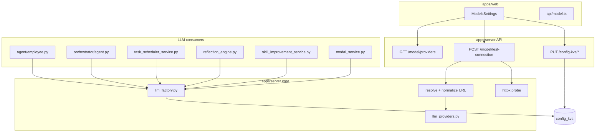

# 多供应商 LLM：目录 + 工厂 + 保存时绑定

## 目标与约束

- **目标**：支持 DashScope、DeepSeek 官方、OpenAI、Moonshot、智谱、SiliconFlow 等 OpenAI 兼容供应商切换；保存配置时根据 URL 匹配目录并探活校验。
- **约束**：不引入多 profile / 按员工分模型（二期）；继续用现有 KV 键落库，避免破坏远程 `sync_model_provider_from_remote` 与 [`config-kv.init.json`](apps/server/config-kv.init.json)。
- **不做**：运行时多供应商自动 failover；[`agent copy.py`](apps/server/src/service/agent%20copy.py) 死代码不在本期改动范围。

## 架构总览



## 1. 供应商目录（静态）

**新建** [`apps/server/src/service/llm_providers.py`](apps/server/src/service/llm_providers.py)

定义 `LlmProviderId`（Literal）与 `ProviderProfile` dataclass，字段建议：

| 字段 | 说明 |
|------|------|
| `id` | `dashscope` / `deepseek` / `openai` / `moonshot` / `zhipu` / `siliconflow` / `custom` |
| `display_name` | 中文展示名 |
| `base_url` | 规范默认端点（含 `/v1` 或供应商文档约定路径） |
| `url_hosts` | 用于从用户输入 URL 反推 `id`（如 `dashscope.aliyuncs.com`、`api.deepseek.com`） |
| `default_models` | 下拉建议列表（如 DashScope: `qwen2.5-72b-instruct`, `deepseek-v4-flash`；DeepSeek 官方: `deepseek-chat`, `deepseek-reasoner`） |
| `suggested_max_input_tokens` | 可选，供前端高级项提示（如 DeepSeek 128K → 120000） |
| `dashscope_error_patch` | 是否启用现有 [`model_patch.py`](apps/server/src/service/model_patch.py) 逻辑 |

**核心函数**：

- `list_providers() -> list[ProviderProfile]`（不含 api_key）
- `resolve_provider_id(base_url: str | None) -> LlmProviderId`：解析 URL host，匹配 `url_hosts`，否则 `custom`
- `get_provider(id) -> ProviderProfile | None`
- `normalize_openai_base_url(url: str) -> str`：去尾 `/`，无 path 时补 `/v1`（与 LangChain OpenAI 客户端习惯一致）

## 2. 单一 LLM 工厂

**新建** [`apps/server/src/service/llm_factory.py`](apps/server/src/service/llm_factory.py)

```python
def build_chat_model(
    *,
    temperature: float = 0,
    model: str | None = None,
    api_key: str | None = None,
    base_url: str | None = None,
) -> ChatOpenAI:
    settings = get_settings()
    # 合并显式参数与 settings；base_url 经 normalize
    # apply_model_profile(model, resolve_max_input_tokens(settings))
```

**替换**以下 6 处直接 `ChatOpenAI(...)` 构造（统一 import `build_chat_model`）：

- [`apps/server/src/service/agent/employee.py`](apps/server/src/service/agent/employee.py)
- [`apps/server/src/service/agent/orchestrator/agent.py`](apps/server/src/service/agent/orchestrator/agent.py)
- [`apps/server/src/service/task_scheduler_service.py`](apps/server/src/service/task_scheduler_service.py)（`parse_nl_cron` 内联调用）
- [`apps/server/src/service/reflection_engine.py`](apps/server/src/service/reflection_engine.py) `_build_llm`
- [`apps/server/src/service/skill_improvement_service.py`](apps/server/src/service/skill_improvement_service.py) `_build_llm`
- [`apps/server/src/service/modal_service.py`](apps/server/src/service/modal_service.py)（保留 `model_params` 覆盖 `model`/`temperature`，其余仍走工厂或工厂 + kwargs 扩展）

**[`model_patch.py`](apps/server/src/service/model_patch.py)**：在 [`server.py`](apps/server/src/server.py) 启动时改为 `model_patch.apply_if_needed(get_settings())`，仅当 `resolve_provider_id(settings.base_url)` 为 `dashscope`（或 profile 标记）时打补丁。

## 3. Settings 与 KV 扩展

**[`apps/server/src/core/config.py`](apps/server/src/core/config.py)**

- `Settings` 增加 `llm_provider: str | None`（读 `LLM_PROVIDER` KV）
- `load_settings()` 映射该字段；若 KV 为空，启动时用 `resolve_provider_id(base_url)` 推断（仅内存，不写库）

**[`config-kv.init.json`](apps/server/config-kv.init.json)**（insert-only seed）

- 增加 `"LLM_PROVIDER": "dashscope"`（与当前 `BASE_URL` 一致）

**远程同步** [`config_kv_service.sync_model_provider_from_remote`](apps/server/src/service/config_kv_service.py)

- 写入 `DEEPAGENT_MODEL` / `OPENAI_API_KEY` / `BASE_URL` 后，根据 `api_url` 推断并 upsert `LLM_PROVIDER`

## 4. 保存时 URL 推断 + 探活 API

扩展 [`apps/server/src/api/model_api.py`](apps/server/src/api/model_api.py)（router 已注册于 [`api/__init__.py`](apps/server/src/api/__init__.py)）：

### `GET /model/providers`

返回目录（id、display_name、base_url、default_models、suggested_max_input_tokens），无密钥。

### `POST /model/test-connection`

请求体示例：

```json
{
  "provider_id": "deepseek",
  "base_url": "https://api.deepseek.com",
  "api_key": "sk-...",
  "model": "deepseek-chat"
}
```

服务端流程：

1. 若传 `provider_id` 且非 `custom`，用目录默认 `base_url` 填充空 `base_url`
2. `normalize_openai_base_url(base_url)`
3. `resolved_provider = provider_id or resolve_provider_id(base_url)`
4. **探活**（超时 10–15s，与 `skill_remote_timeout` 同级）：
   - 优先 `GET {base}/models`（OpenAI 兼容）
   - 失败则 `POST {base}/chat/completions`，`max_tokens: 1`，极简 user message
5. 响应：`ok`, `provider_id`, `normalized_base_url`, `model`, `message`（失败时含 HTTP 状态/体摘要，不泄露完整 key）

**业务逻辑下沉**至 [`apps/server/src/service/llm_connection_service.py`](apps/server/src/service/llm_connection_service.py)（新建），供 API 与后续脚本复用。

### 绑定策略（保存前，前端驱动）

不在后端做「静默写库」；由设置页流程保证：

1. 用户点 **测试连接** → 仅调用 `test-connection`（不写 KV）
2. 测试通过后点 **保存** → `setManyConfigKv` 写入：
   - `LLM_PROVIDER` = 解析后的 `provider_id`
   - `BASE_URL` = 响应中的 `normalized_base_url`
   - `OPENAI_API_KEY` / `DEEPAGENT_MODEL` = 表单值
   - （可选）若高级项 `MODEL_MAX_INPUT_TOKENS` 为空且目录有 `suggested_max_input_tokens`，前端提示一键填入，不自动覆盖已有值

可选增强：新增 `POST /model/bind-config` 在服务端原子 upsert 上述键并 `_refresh_settings_cache()`，减少前端多次 PUT；若工期紧可 Phase 1 仍用现有 [`setManyConfigKv`](apps/web/src/api/config-kv.ts)。

## 5. 前端设置页

**[`apps/web/src/components/settings/models-settings.tsx`](apps/web/src/components/settings/models-settings.tsx)**

- 加载时并行：`getConfigKv`（含 `LLM_PROVIDER`）+ `GET /model/providers`
- **供应商** `<Select>`：目录项 +「自定义」
  - 切换供应商：填充 `base_url`、默认 `model`（取 `default_models[0]`），保留用户已改的 key
  - 选「自定义」：不覆盖 URL，仅依赖 URL 推断展示当前 provider
- **测试连接** 按钮：调用新 API；成功 `toast.success`，失败展示 `message`
- **保存**：若未测试过可 `confirm` 提示；写入 KV 含 `LLM_PROVIDER`
- 去掉或更新「开发中...」文案

**新建/扩展** [`apps/web/src/api/model.ts`](apps/web/src/api/model.ts)：`fetchLlmProviders()`, `testLlmConnection(payload)`

**共享类型（可选）** [`apps/web/src/lib/llm-providers.ts`](apps/web/src/lib/llm-providers.ts)：仅 UI 用的 `custom` 标签，主数据以服务端目录为准。

[`fetchRuntimeModelConfig`](apps/web/src/api/model.ts) 可扩展返回 `provider_id`（读 `LLM_PROVIDER` KV）。

## 6. 文档与验证

- 在 [`AGENTS.md`](AGENTS.md) 环境变量表补充 `LLM_PROVIDER` 与多供应商说明（DashScope vs DeepSeek 官方模型名不可混用）
- 提交前：`pnpm typecheck`、`pnpm lint`（web）；`apps/server` 下确认 import 无环

**手动测试清单**

| 步骤 | 预期 |
|------|------|
| DashScope + `deepseek-v4-flash` 探活 | 成功 |
| DeepSeek 官方 + `deepseek-chat` 探活 | 成功 |
| 错误 Key | `test-connection` 返回明确错误，不写入 KV |
| 保存后重启后端，发起对话 | Agent 正常流式；`main.log` 中 `model profile` 与 provider 一致 |
| 登录远程 sync | 三键 + `LLM_PROVIDER` 与 `apiUrl` host 一致 |

## 文件变更汇总

| 操作 | 路径 |
|------|------|
| 新建 | `llm_providers.py`, `llm_factory.py`, `llm_connection_service.py` |
| 修改 | `config.py`, `model_api.py`, `model_patch.py`, `server.py`, `config_kv_service.py`, 6 个 ChatOpenAI 调用点 |
| 修改 | `models-settings.tsx`, `api/model.ts`, `config-kv.init.json`, `AGENTS.md` |

## 风险与说明

- **探活**：部分供应商 `/models` 未开放，需 fallback `chat/completions`；智谱等 path 非标准 `/v1` 时在目录里写死完整 `base_url`，normalize 逻辑对已有 path 不再追加 `/v1`。
- **Agent 缓存**：`get_agent` 每次请求新建 model 实例，改 KV 后新对话即生效；[`checkpointer.py`](apps/server/src/service/agent/checkpointer.py) 的 `register_harness_profile(f"openai:{model}")` 在进程启动时固定，换模型名后需**重启后端**（与现有「保存后重启」提示一致）。
- **密钥**：`test-connection` 仅用于即时校验，日志禁止打印完整 `api_key`。
