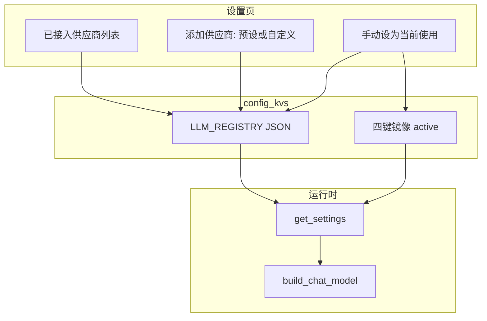

# 多供应商 LLM 注册表重构

## 问题与目标

**现状**：[`models-settings.tsx`](apps/web/src/components/settings/models-settings.tsx) 把 `LLM_PROVIDER` / `BASE_URL` / `OPENAI_API_KEY` / `DEEPAGENT_MODEL` 当作**全局唯一**配置。切换供应商并保存会覆盖上一家的 Key，切回去需重填。

**目标**：
- 展示**已接入**的供应商及其模型列表
- 可从 [`catalog.py`](apps/server/src/llm/providers/catalog.py) 预设新增，或自定义供应商（id / 显示名 / base_url / api_key / 模型列表）
- 各供应商凭证**独立持久化**
- 用户**手动**在列表中指定「当前使用」的供应商 + 模型（全局一套，供 Agent 调用）
- 第一期**不做**自定义请求头（Phase 2）



---

## 1. 数据模型（单 KV JSON）

新增主键 **`LLM_REGISTRY`**（Text JSON），结构建议：

```json
{
  "active_provider_id": "dashscope",
  "active_model_id": "deepseek-v4-flash",
  "providers": [
    {
      "id": "dashscope",
      "source": "builtin",
      "display_name": "阿里云 DashScope",
      "base_url": "https://dashscope.aliyuncs.com/compatible-mode/v1",
      "api_key": "sk-...",
      "models": [
        { "id": "deepseek-v4-flash", "display_name": "DeepSeek V4 Flash" }
      ]
    },
    {
      "id": "myprovider",
      "source": "custom",
      "display_name": "我的 AI 供应商",
      "base_url": "https://api.myprovider.com/v1",
      "api_key": "",
      "models": [{ "id": "model-id", "display_name": "显示名称" }]
    }
  ]
}
```

规则：
- **builtin**：`id` 必须匹配 catalog 中已知 id（`dashscope` 等）；同一 builtin id **只允许一条**
- **custom**：`id` 小写字母/数字/连字符/下划线；全局唯一
- **models**：至少 1 个；`id` 为 API model 名，`display_name` 可选（UI 展示用）
- **active**：可为 null；用户手动激活后才写入

**兼容镜像**：激活时同步 upsert 现有四键（`LLM_PROVIDER` / `BASE_URL` / `OPENAI_API_KEY` / `DEEPAGENT_MODEL`），保证 [`config.py`](apps/server/src/core/config.py) 与 [`build_chat_model()`](apps/server/src/llm/factory.py) 无需大改；长期以 registry 为真相源。

**迁移**：首次读取 registry 为空时，若四键已有值 → 自动合成 1 条 provider 并设为 active（在 [`llm/registry.py`](apps/server/src/llm/registry.py) 的 `load_registry()` 内完成，不写 destructive 逻辑）。

---

## 2. 后端：`src/llm/registry.py` + service

新建 [`apps/server/src/llm/registry.py`](apps/server/src/llm/registry.py)：
- Pydantic/dataclass：`LlmModelEntry`, `LlmProviderEntry`, `LlmRegistry`
- `load_registry(db|kv)` / `save_registry()` / `mask_api_key()`
- `upsert_provider()` / `remove_provider()` / `set_active()`
- `list_catalog_available()`：catalog 中尚未接入的 builtin

新建 [`apps/server/src/llm/registry_service.py`](apps/server/src/llm/registry_service.py)（或合并在 registry.py）：
- 校验 custom id 格式、URL normalize、builtin 不可重复
- 添加 preset 时从 catalog 填充 `display_name` / `base_url` / 默认 models
- 调用现有 [`test_connection()`](apps/server/src/llm/connection.py) 做探活

扩展 [`model_api.py`](apps/server/src/api/model_api.py)：

| 方法 | 路径 | 说明 |
|------|------|------|
| GET | `/model/registry` | 返回 registry；`api_key` 掩码 |
| POST | `/model/providers` | 新增（body: `source=preset\|custom` + 字段） |
| PUT | `/model/providers/{id}` | 更新凭证/模型列表 |
| DELETE | `/model/providers/{id}` | 删除；若删的是 active 则清空 active |
| PUT | `/model/active` | `{ provider_id, model_id }` 手动激活 + 镜像四键 |
| POST | `/model/providers/{id}/test` | 对指定 provider+model 探活 |

保留现有 `GET /model/providers`（catalog 目录）与 `POST /model/test-connection`（表单草稿探活，添加前用）。

更新 [`config_kv_service.sync_model_provider_from_remote`](apps/server/src/service/config_kv_service.py)：改为 upsert registry 中对应 builtin/custom 条目并可选设为 active，而非仅写四键。

---

## 3. 运行时读取

[`get_settings()`](apps/server/src/core/config.py)：
- 优先从 `LLM_REGISTRY.active` 解析 `api_key` / `base_url` / `deepagent_model` / `llm_provider`
- fallback 四键（兼容未迁移环境）

[`build_chat_model()`](apps/server/src/llm/factory.py)：逻辑不变，继续读 `Settings`；active 切换后 `get_settings.cache_clear()` 已存在。

---

## 4. 前端 UI 重构

替换 [`models-settings.tsx`](apps/web/src/components/settings/models-settings.tsx) 为列表 + 添加流：

### 4.1 主列表页
- **已接入供应商**（Card / Accordion）：显示名称、base_url（截断）、模型列表
- 每个模型行：**设为当前使用**（Radio 或按钮；active 高亮）
- 供应商级操作：编辑、删除、测试连接
- 顶部显示当前激活：`DashScope · deepseek-v4-flash`
- **添加供应商** 按钮

### 4.2 添加供应商（Dialog / Sheet，参考截图）
**步骤 A - 选择类型**：
- 预设列表：`GET /model/providers` 过滤已接入 id
- 「自定义供应商」入口

**步骤 B - 预设**：选 catalog 项 → 填 api_key → 勾选/编辑 models（默认 catalog.default_models）→ 测试 → 提交

**步骤 B - 自定义**（参考截图，无请求头）：
- 供应商 ID、显示名称、基础 URL、API Key（可选）
- 模型列表：动态行 `model-id` + `显示名称`，可增删
- 测试 + 提交

### 4.3 API 客户端
扩展 [`apps/web/src/api/model.ts`](apps/web/src/api/model.ts)：`fetchLlmRegistry`, `addLlmProvider`, `updateLlmProvider`, `deleteLlmProvider`, `setActiveLlmModel`, `testLlmProvider`

建议拆分子组件（同目录）：
- `connected-providers-list.tsx`
- `add-provider-dialog.tsx`
- `custom-provider-form.tsx`

删除当前单表单里的「切换供应商即覆盖 Key」逻辑。

---

## 5. 不在本期范围

- 自定义请求头（Phase 2，`ChatOpenAI` `default_headers`）
- 按员工/会话分模型
- 运行时自动 failover / 多 active

---

## 6. 文档与验证

- 更新 [`AGENTS.md`](AGENTS.md)：说明 `LLM_REGISTRY` 结构与手动激活流程
- `apps/web` 跑 `tsc --noEmit`
- 手动验证：
  1. 迁移：旧四键 → 自动出现 1 条已接入
  2. 接入 DashScope + DeepSeek 两家，各自 Key 保留
  3. 手动激活 DeepSeek 某模型 → 对话正常；切回 DashScope 无需重填 Key
  4. 自定义供应商添加 / 编辑 / 删除
  5. 远程 sync 写入 registry（若仍启用）
