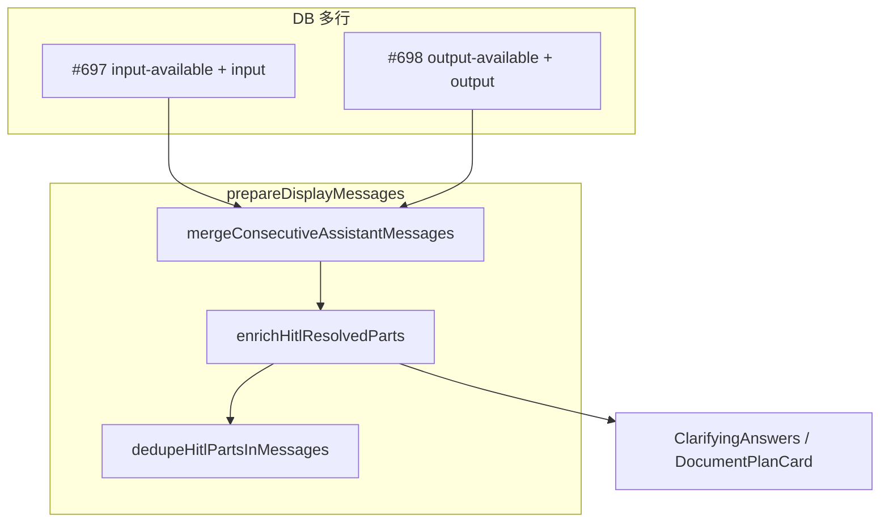

# 废弃 interrupt_payload + 展示层 input 合并

## 目标形态

**DB 层（分行存储，不改 approve 多行模型）**

| 行 | message_parts 片段 |
|----|-------------------|
| assistant #N（interrupted，后 approved_at） | `input-available` + 完整 `input` |
| assistant #N+1（resume 后） | `output-available` + `output.text`（顶层 `input` 常为 null） |

**展示层（合并后用户看到的逻辑 part）**

```json
{
  "type": "tool-submit_clarifying_questions",
  "toolCallId": "call_...",
  "state": "output-available",
  "input": { "context": "long_document", "questions": "[...]" },
  "output": {
    "status": "success",
    "text": "用户对长文档澄清问题的回答：\n\n1. ...",
    "toolName": "submit_clarifying_questions",
    "input": null,
    "inputText": ""
  }
}
```

展示层合并**只影响 UI**，不回写 DB。



---

## Phase 1：后端 — interrupt 写入 message_parts

（与原计划相同，略述）

- 新建 [`apps/server/src/service/hitl_pending_parts.py`](apps/server/src/service/hitl_pending_parts.py)：`build_pending_hitl_parts` + `extract_message_parts_for_interrupt`
- [`stream_registry.py`](apps/server/src/service/stream_registry.py)：interrupt flush 写 `message_parts`；删除 `extra_meta.interrupt_payload`；SSE 终态 `{ status, message_id, message_parts }`
- [`chat_service.py`](apps/server/src/service/chat_service.py)：`stream_ended` / `get_stream_status` 去掉 `interrupt_payload`
- `_extract_interrupt_payload` 保留，仅用于构建 parts，不落库

---

## Phase 2：前端 — 去掉 hitlPayload 双轨

（与原计划相同，略述）

- 删除 [`stored-message-hitl-utils.ts`](apps/web/src/lib/chat/stored-message-hitl-utils.ts) 及 `hitlPayload` session 状态链
- [`hitl-abort-message-utils.ts`](apps/web/src/lib/chat/hitl-abort-message-utils.ts)：`findPendingHitl` 跳过 `metadata.approved_at` 行
- [`langchain-chat-transport.ts`](apps/web/src/lib/chat/langchain-chat-transport.ts)：interrupt 时用 `message_parts` patch 最后一条 assistant
- [`chat-composer-area.tsx`](apps/web/src/components/chat/panel/chat-composer-area.tsx) 等：Dock 仅依赖 `findPendingHitl(messages)`

---

## Phase 3：展示层 input 合并（新增）

### 3.1 调整 pipeline 顺序

当前 [`prepareDisplayMessages`](apps/web/src/lib/chat/merge-consecutive-assistant-messages.ts)：

```typescript
mergeConsecutiveAssistantMessages(dedupeHitlPartsInMessages(messages))
```

**问题**：先 dedupe 会删掉 sealed 行的 `input-available` part，后续无法再给 `output-available` 补 `input`。

**改为**：

```typescript
export function prepareDisplayMessages(messages: UIMessage[]): UIMessage[] {
  const merged = mergeConsecutiveAssistantMessages(messages)
  const enriched = merged.map(enrichHitlResolvedPartsInMessage)
  return dedupeHitlPartsInMessages(enriched)
}
```

`composerMessages` / approve 仍用**未 merge、未 enrich** 的 `useChat` 列表（`findPendingHitl`、POST `/approve` 的 `message_id` 不受影响）。

### 3.2 新增 enrich 工具

新建 [`apps/web/src/lib/chat/hitl-display-enrich.ts`](apps/web/src/lib/chat/hitl-display-enrich.ts)：

```typescript
export function enrichHitlResolvedPartsInMessage(message: UIMessage): UIMessage
```

逻辑（单条已 merge 的 assistant 气泡内）：

1. 收集 HITL pending 源：`type ∈ { tool-submit_clarifying_questions, tool-submit_document_plan }` 且 `state === "input-available"` 且 `input` 非空
2. 建立索引：`toolCallId → input`（优先），`toolType → input`（同类型仅一条时的 fallback）
3. 遍历 `output-available` / 有 `output.text` 的同 type part：若顶层 `input` 为空/无效，从索引拷贝 `input`（浅拷贝 object）
4. 可选：同步 `output.input` 为同一引用（与 [`message_parts_extractor`](apps/server/src/service/message_parts_extractor.py) 形状一致）

**不修改** part 的 `state`，dedupe 仍按现有 [`hitl-abort-message-utils.ts`](apps/web/src/lib/chat/hitl-abort-message-utils.ts) 规则移除 pending。

### 3.3 对 classifier 的影响

[`message-classifier.ts`](apps/web/src/lib/chat/message-classifier.ts) 无需改逻辑，自动受益：

- **澄清**：`parseClarifyingQuestions(toolInput.questions)` + `buildClarifyAnswerItems` 在 enriched 后可正确配对 Q&A（现靠 `output.text` 编号解析兜底）
- **方案**：enriched 后 `hasDocumentPlanCardInput(toolInput)` 为 true → 历史可渲染完整 [`DocumentPlanCard`](apps/web/src/components/chat/message-blocks/document-plan-card.tsx)（`output-available` 时只读/已 resolve），而非仅 [`DocumentPlanApprovedSummary`](apps/web/src/components/chat/message-blocks/document-plan-approved-summary.tsx)。若产品 prefer 仅摘要，可在 classifier 对 `output-available + hasPlanInput` 增加只读分支——**默认采用完整卡片只读**，与「input+output 自洽」目标一致

---

## Phase 4：文档更新

更新 [`apps/server/docs/hitl-architecture.md`](apps/server/docs/hitl-architecture.md)：

- **§2.2**：删除 `interrupt_payload` 表行；改为 `message_parts` pending / completed 两段说明
- **新增 §2.3 展示层 enrich**：`prepareDisplayMessages` 三步 pipeline 图；明确 DB 与 UI 形态差异
- **§3.4**：interrupt flush 写 `message_parts`；SSE 终态字段变更
- **§3.6 / §八.3**：删除「方案 B：从 interrupt_payload 合成」；改为 `hitl-display-enrich` 展示层合并
- **§九 排查**：「刷新后无大纲」→ 检查 merge 后 enrich 是否执行、sealed 行是否含 `input-available` part

更新夹具：

- [`hitl_chunks.json`](apps/server/docs/hitl_chunks.json) id:203 → 含 `message_parts`
- [`chunks_hitl.json`](apps/web/src/lib/chat/chunks_hitl.json) → #697 含 pending part、#698 含 output-only part，供 enrich 单测/文档示例

---

## 硬切（不变）

- 旧数据仅含 `interrupt_payload`、无 pending `message_parts`：**不兼容**
- 新 interrupt 起生效

---

## 验收清单

1. interrupt → Dock 显示（pending part）
2. 澄清 approve → Answers 块题目+答案完整（enriched input + output.text）
3. 方案 approve → 历史气泡可见 outline（enriched DocumentPlanCard 或确认只读态）
4. `prepareDisplayMessages` 后 pending part 被 dedupe 移除，无重复卡片
5. Composer pending / approve `message_id` 仍正确
6. `pnpm typecheck` + 三视图 HITL 手动回归
