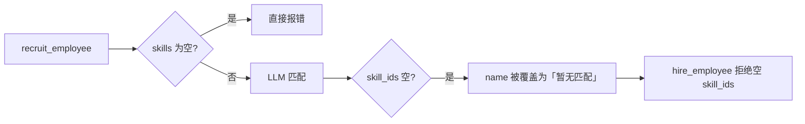
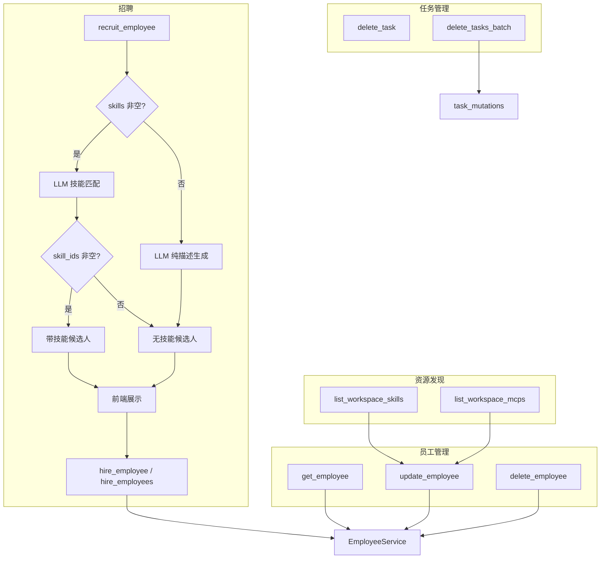

# 总管员工 CRUD 与招聘兜底改造

## 实施状态

**结论：原计划 6 项 + 扩展 9 项均已 completed。** 后端 pytest **35 passed**，前端 vitest **18 passed**。可选 UI 卡片与文档同步未做，不影响功能。

---

## 背景与问题（已解决）

原总管助手仅有 `list_workspace_employees` + `recruit_employee` + `hire_employee`，无更新/删除/详情工具；招聘链路在无匹配技能时会阻断录用。

改造后上述阻断点均已修复；并扩展了批量录用/删除、技能/MCP listing、前端专用卡片与 Session 隔离。

---

## 目标行为

| 场景 | 改造后 |
|------|--------|
| 技能库有匹配 | 带 skill_ids 的候选人，流程不变 |
| 技能库有但无匹配 | 保留 LLM 岗位名 + 描述，`skill_ids=[]`，可录用 |
| 技能库完全为空 | 纯 LLM 生成无技能候选人，可录用 |
| 用户要求改/删员工 | 总管调用 get/update/delete_employee |
| 删除总管助手 | 拒绝操作 |
| 批量录用 2+ 人 | 一次 `hire_employees`，`employees-hired` 卡片 |
| 批量删除 2+ 任务 | 一次 `delete_tasks_batch`，独立 Session，`tasks-deleted` 卡片 |
| 给员工分配技能 | 先 `list_workspace_skills` → `update_employee(skill_ids=...)` |
| 给员工分配 MCP | 先 `list_workspace_mcps` → `update_employee(mcp_ids=...)` |
| 对话内删/录员工后看通讯录 | 总管对话自动 invalidate `chatKeys.contacts()` |

---

## 已落地改动

### 兼容前提（编排/串流，与本计划正交）

| 改动 | 文件 |
|------|------|
| 总管 SSE 与员工流串流隔离 | [`execution.py`](apps/server/src/service/agent/orchestrator/execution.py) |
| 委派后禁止轮询、禁止代员工执行 | [`prompts.py`](apps/server/src/service/agent/orchestrator/prompts.py) |
| 总管会话 ↔ 执行日志关联 | [`orchestrator_conversation_links.py`](apps/server/src/service/orchestrator_conversation_links.py) |
| 串流问题文档 | [`orchestrator-employee-stream-isolation.md`](apps/server/docs/orchestrator-employee-stream-isolation.md) |

### 原计划（招聘 + CRUD）

| 项 | 关键文件 |
|----|----------|
| 招聘生成兜底 | [`employee_generation_service.py`](apps/server/src/service/employee_generation_service.py) |
| 录用允许空 skill_ids | [`recruitment.py`](apps/server/src/service/agent/orchestrator/recruitment.py)、[`recruitment_tools.py`](apps/server/src/service/agent/orchestrator/recruitment_tools.py) |
| 员工 CRUD tools | [`employee_tools.py`](apps/server/src/service/agent/orchestrator/employee_tools.py)、[`agent.py`](apps/server/src/service/agent/orchestrator/agent.py) |
| Prompt 员工管理 | [`prompts.py`](apps/server/src/service/agent/orchestrator/prompts.py) |
| 前端录用消息 | [`recruitment-tool-payload.ts`](apps/web/src/lib/chat/recruitment-tool-payload.ts) |

### 扩展阶段

| 项 | 关键文件 |
|----|----------|
| 批量删除任务（Session 隔离） | [`task_mutations.py`](apps/server/src/service/agent/orchestrator/task_mutations.py)、[`tools.py`](apps/server/src/service/agent/orchestrator/tools.py) |
| `delete_tasks_batch` 命名遮蔽修复 | `tools.py` 导入别名 `run_delete_tasks_batch` |
| 共享 Session 脏读修复 | [`runtime.py`](apps/server/src/service/agent/orchestrator/runtime.py) `invalidate_orchestrator_db_cache()` |
| 批量录用 fresh Session | [`recruitment.py`](apps/server/src/service/agent/orchestrator/recruitment.py) `hire_candidates_batch` |
| 员工写操作 fresh Session | `employee_tools.py` update/delete |
| 技能库 listing | `employee_tools.py` `list_workspace_skills` |
| MCP listing | `employee_tools.py` `list_workspace_mcps`（离线返回 notice） |
| 前端专用卡片 | [`block-registry.ts`](apps/web/src/lib/chat/tools/block-registry.ts)、[`message-classifier.ts`](apps/web/src/lib/chat/message-classifier.ts)、[`block-render-map.tsx`](apps/web/src/components/chat/message-blocks/block-render-map.tsx) |
| 通讯录自动刷新 | [`use-invalidate-contacts-on-team-changes.ts`](apps/web/src/hooks/use-invalidate-contacts-on-team-changes.ts) → [`curator-view.tsx`](apps/web/src/components/chat/curator/curator-view.tsx) |

---

## 当前总管 Tool 清单（agent.py）

| 类别 | Tools |
|------|-------|
| 团队 | `list_workspace_employees`, `get_employee`, `update_employee`, `delete_employee` |
| 资源 | `list_workspace_skills`, `list_workspace_mcps` |
| 招聘 | `recruit_employee`, `hire_employee`, `hire_employees` |
| 编排 | `create_orchestration_plan`, `confirm_orchestration_plan`, `cancel_plan` |
| 任务 | `list_tasks`, `update_task`, `delete_task`, `delete_tasks_batch` |

---

## 前端 Block kinds（专用卡片）

| kind | tool |
|------|------|
| `recruitment-candidates` | `recruit_employee` |
| `employee-hired` | `hire_employee` |
| `employees-hired` | `hire_employees` |
| `employee-detail` / `employee-updated` / `employee-deleted` | `get_employee` / `update_employee` / `delete_employee` |
| `tasks-deleted` | `delete_tasks_batch` |

`list_workspace_skills` / `list_workspace_mcps` 仍走通用 tool 行（可选后续做卡片）。

---

## 数据流（改造后）

---

## 验证清单

### 自动化（已通过）

- `cd apps/server && uv run pytest` → **35 passed**
- `cd apps/web && pnpm exec vitest run src/lib/chat/*-tool-payload.test.ts` → **18 passed**

### 建议手动 E2E

1. **有匹配**：总管招聘「需要飞书助手」→ 候选人带 skill_ids → 录用成功
2. **无匹配**：需求与技能库无关 → name 合理、skill_ids=[] → 录用成功
3. **空技能库**：仍能生成并录用
4. **CRUD**：总管改描述 / 分配技能 / 删除员工均生效
5. **保护**：删除/改名总管助手被拒绝
6. **批量删任务**：删 3 个任务无 `database is locked`，出现 `tasks-deleted` 卡片
7. **全部录用**：招聘卡片「全部录用」→ `hire_employees` + 批量入职卡片
8. **技能/MCP**：`list_workspace_skills` / `list_workspace_mcps` → `update_employee`
9. **通讯录**：录用/删除员工后左侧列表自动刷新
10. **回归**：confirm 委派后总管仍不轮询 `list_tasks`、不代员工 shell/read

---

## 危险操作 HITL 确认门（已完成）

总管删除类 tool（`delete_employee`、`delete_task`、`delete_tasks_batch`）执行前经 HITL interrupt 暂停，前端展示 `DestructiveDeleteConfirmCard` 三按钮：

| 按钮 | 行为 |
|------|------|
| 确认删除 | approve，本次执行；后续仍 interrupt |
| 取消 | reject，不执行 |
| 确认，本会话不再询问 | approve + `session_flags.skip_destructive_hitl`，同会话后续删除免确认 |

**后端**：`destructive_hitl.py`、`conversations.session_flags`、`build_orchestrator_interrupt_on`、`ApproveRequest.destructive_hitl`  
**前端**：`destructive-delete` handler/block、`DestructiveDeleteConfirmCard`、composer 阻塞、`approveHitl` 扩展  
**文档**：[`hitl-architecture.md`](../apps/server/docs/hitl-architecture.md) 已补充 tool 列表与 approve 字段  
**测试**：`test_destructive_hitl.py` + `destructive-delete-payload.test.ts`

---

## 可选后续（未做）

| 项 | 说明 |
|----|------|
| `workspace_skills` / `workspace_mcps` 专用 UI 卡片 | 目前 JSON 走通用 tool 行 |
| `delete_task` 单删专用卡片 | 当前返回纯文本 |
| `CHAT_DATA_TYPES.md` 同步 | 不影响运行 |

---

## 完整性结论

| 维度 | 状态 |
|------|------|
| 后端总管 tools | ✅ 闭环 |
| Session 隔离 + 脏读修复 | ✅ |
| 前端卡片接线 | ✅ |
| 工具标签 | ✅ |
| 测试 | ✅ 35 + 18 |
| 文档 `CHAT_DATA_TYPES.md` | ⏭️ 可选 |
| 技能/MCP 列表专用卡片 | ⏭️ 可选 |
