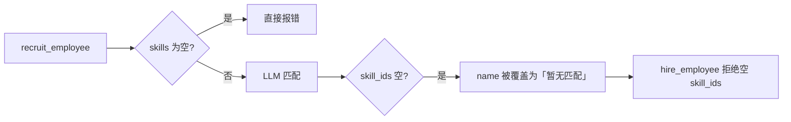
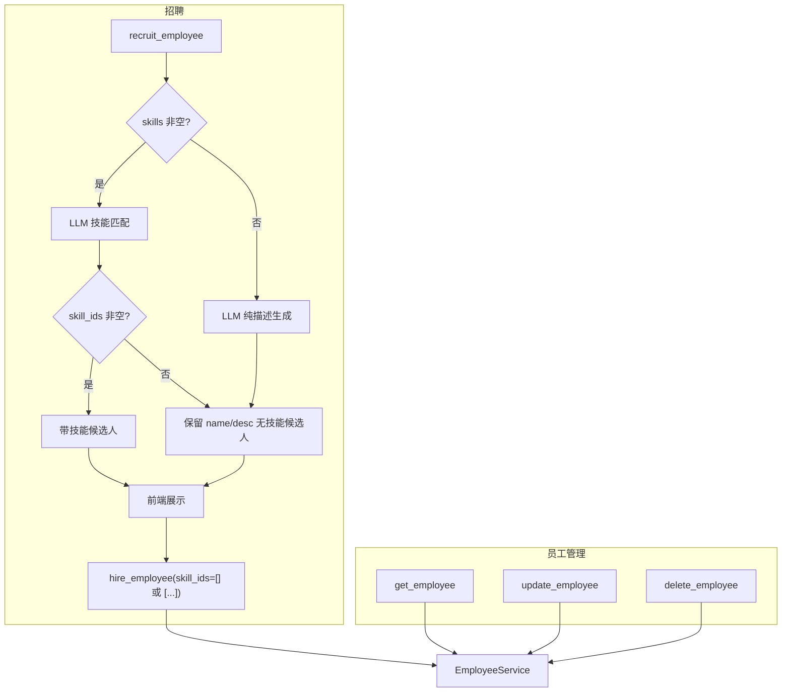

# 总管员工 CRUD 与招聘兜底改造

## 近期已完成（与本计划无关，无需重复做）

以下改动已落地，**不改变本计划范围**，实施 CRUD/招聘时需与之兼容：

| 改动 | 文件 | 与本计划关系 |
|------|------|--------------|
| 总管 SSE 与员工流串流隔离 | [`execution.py`](apps/server/src/service/agent/orchestrator/execution.py) `_start_employee_stream_when_orchestrator_idle` | 编排 confirm 行为不变；招聘/CRUD 不涉及 |
| 委派后禁止轮询、禁止代员工执行 | [`prompts.py`](apps/server/src/service/agent/orchestrator/prompts.py)「委派执行后」「确认策略」等 | **prompt 增量合并**，勿覆盖已有 section |
| 工具 docstring 收紧 | [`tools.py`](apps/server/src/service/agent/orchestrator/tools.py) `confirm_orchestration_plan` / `list_tasks` / `list_workspace_employees` | 新建 employee tools 应沿用同一 docstring 风格 |
| 总管会话 ↔ 执行日志关联（阶段一） | [`orchestrator_conversation_links.py`](apps/server/src/service/orchestrator_conversation_links.py)、`task_execution_logs.orchestrator_conversation_id`、`useCuratorTaskExecutions` | 员工 CRUD 为 workspace 级，与多对话隔离正交 |
| 串流问题文档 | [`orchestrator-employee-stream-isolation.md`](apps/server/docs/orchestrator-employee-stream-isolation.md) | 参考即可 |

**结论：本计划 6 项 todo 仍为 pending**，招聘阻断点（`employee_generation_service` / `recruitment.py` / `recruitment_tools.py`）**尚未改动**；`employee_tools.py` 尚未创建。

---

## 背景与问题

当前总管助手（orchestrator agent）仅有 `list_workspace_employees` + `recruit_employee` + `hire_employee`，**无更新/删除/详情**工具。

招聘链路存在三处阻断，导致「无匹配技能 = 招不到人」：



关键代码位置：

- 技能库为空直接失败：[`employee_generation_service.py`](apps/server/src/service/employee_generation_service.py) L341-342、`recruit_candidates` L61-65
- 无匹配时覆盖 name：[`employee_generation_service.py`](apps/server/src/service/employee_generation_service.py) L223-235
- 录用拒绝空技能：[`recruitment.py`](apps/server/src/service/agent/orchestrator/recruitment.py) L128-129、[`recruitment_tools.py`](apps/server/src/service/agent/orchestrator/recruitment_tools.py) L57-58

底层 `EmployeeService.create_employee` **已支持** `skill_ids=[]`，无需改 schema。

---

## 目标行为

| 场景 | 改造后 |
|------|--------|
| 技能库有匹配 | 带 skill_ids 的候选人，流程不变 |
| 技能库有但无匹配 | 保留 LLM 生成的岗位名 + 描述，`skill_ids=[]`，可录用 |
| 技能库完全为空 | 跳过匹配，纯 LLM 生成无技能候选人，可录用 |
| 用户要求改/删员工 | 总管调用新 tools，复用 EmployeeService |
| 删除总管助手 | 拒绝操作 |

---

## 改造方案

### 1. 招聘生成：优先匹配 + 无技能兜底

**文件：** [`apps/server/src/service/employee_generation_service.py`](apps/server/src/service/employee_generation_service.py)

**1.1 调整 LLM prompt（`_generate_profiles_from_skills`）**

- 规则 2 保留：不强行匹配不相关技能
- 规则 3 改为：若 `skill_ids` 为空，仍须根据用户需求生成**合理的岗位名称与职责描述**（2-4 字中文名或「XX助手」风格），禁止「暂无匹配」等占位名
- 补充：description 应说明「当前技能库暂无匹配，后续可手动分配技能」

**1.2 修复解析逻辑（`_parse_skill_profiles`）**

- 当 `skill_ids` 为空时：**保留** LLM 返回的 `name` 和 `description`，删除强制 `name="暂无匹配"` 的分支
- 若 name 为空才 fallback 到「待命名员工 N」

**1.3 新增无技能库兜底生成**

新增 `_generate_profiles_without_skills(user_request, count)`：

- 不传入技能列表，仅根据用户需求生成 name + description + 空 skill_ids
- 模型失败时 fallback 到 `_build_default_profiles`

**1.4 改造 `generate_candidates_for_orchestrator`**

```python
skills = await get_available_skills(...)
if skills:
    profiles = await generate_employee_profiles_async(user_request, skills, count)
else:
    profiles = await _generate_profiles_without_skills(user_request, count)
return profiles, skills  # skills 可为 []
```

**1.5 同步招聘页 API（同一套逻辑）**

[`employee_api.py`](apps/server/src/api/employee_api.py) 的 `/generate-employees` 也调用 `generate_employee_profiles_async`，上述 prompt/解析改动会自动惠及招聘窗口，无需单独 fork 逻辑。

---

### 2. 录用链路：允许空 skill_ids

**文件：** [`recruitment.py`](apps/server/src/service/agent/orchestrator/recruitment.py)

- `recruit_candidates`：删除 `if not skills: return 错误`；skills 为空时仍生成 profiles
- `hire_candidate`：删除 L128-129 的空 skill_ids 校验；`EmployeeCreate(skill_ids=skill_ids or [])` 照常创建
- `_skills_summary`：无技能时返回「暂未配置技能（录用后可手动分配）」替代「（未匹配技能）」
- payload `hint` 补充：无技能候选人录用时传 `skill_ids="[]"`

**文件：** [`recruitment_tools.py`](apps/server/src/service/agent/orchestrator/recruitment_tools.py)

- `hire_employee`：`skill_ids` 默认 `"[]"`；允许空数组；仅校验 JSON 格式与整数类型
- docstring 说明无技能员工传 `[]`

---

### 3. 总管员工 CRUD 工具（新建）

**新建：** [`apps/server/src/service/agent/orchestrator/employee_tools.py`](apps/server/src/service/agent/orchestrator/employee_tools.py)

复用 [`EmployeeService`](apps/server/src/service/employee_service.py) + [`EmployeeUpdate`](apps/server/src/schemas/employee.py)，通过 `runtime.get_db()` / `get_workspace_id()` / `get_auth_token()` 取上下文。

| Tool | 参数 | 行为 |
|------|------|------|
| `get_employee` | `employee_id: int` | 返回 `employee_detail_dict` JSON（id、name、description、skills、mcp、is_curator） |
| `update_employee` | `employee_id` + 可选 `employee_name`, `capability_desc`, `skill_ids`(JSON str), `mcp_ids`(JSON str) | 构造 `EmployeeUpdate`，仅设置传入字段；调用 `EmployeeService.update_employee` |
| `delete_employee` | `employee_id: int` | 查员工；若 `is_curator` 则拒绝；否则 `EmployeeService.delete_employee` |

**安全约束（写在 tool 实现 + prompt）：**

- 禁止修改/删除 `is_curator=True` 的员工
- 禁止将普通员工改名为「总管助手」/ `curator`
- `delete_employee` 在 service 层加一道 curator 保护（[`employee_service.py`](apps/server/src/service/employee_service.py) L740），防止 API 与 tool 双入口一致

**注册：** [`agent.py`](apps/server/src/service/agent/orchestrator/agent.py) 的 `tools=[...]` 加入上述 3 个 tool。

---

### 4. Prompt 更新（增量合并，勿覆盖近期改动）

**文件：** [`prompts.py`](apps/server/src/service/agent/orchestrator/prompts.py)

`prompts.py` 已在近期大幅更新（委派后禁止轮询、confirm 策略、优先用注入员工表等）。本计划**只追加/微调**，不重写「委派执行后」「确认策略」等已有 section。

**新增「员工管理」section**（建议放在「招聘流程」之后）：

- 查看：`list_workspace_employees`（Prompt 已注入表时优先用表）/ `get_employee(employee_id)`
- 修改：`update_employee`（含 skill_ids 分配/替换）
- 删除：`delete_employee`（不可删 `is_curator` 员工）
- 变更后若需最新团队信息，再调 `list_workspace_employees`（与现有招聘流程第 5 步一致）

**微调「招聘流程」section**（L21-27 附近）：

- 匹配不到技能时仍会生成无技能候选人，不是失败
- `hire_employee` 无技能时传 `skill_ids="[]"`
- 无技能录用成功后，提示用户可在员工设置页或通过 `update_employee` 补技能

**同步 tool docstring**（与 [`tools.py`](apps/server/src/service/agent/orchestrator/tools.py) 现有风格一致）：

- `get_employee` / `update_employee` / `delete_employee` 写明何时调用、禁止删总管

可选：`build_employee_capability_context` 表格增加 `is_curator` 列，方便总管识别不可删员工。

---

### 5. 前端小改（降低录用失败率）

**文件：** [`apps/web/src/lib/chat/recruitment-tool-payload.ts`](apps/web/src/lib/chat/recruitment-tool-payload.ts)

`buildRecruitmentHireMessage` 从仅发 `录用{name}` 改为附带结构化信息，例如：

```
录用「数据分析师」
description: ...
skill_ids: []
```

减少总管从对话上下文推断 `skill_ids` 的出错概率。

**文件：** [`recruitment-candidate-badge.tsx`](apps/web/src/components/chat/message-blocks/recruitment-candidate-badge.tsx)

无技能时在详情区显示「暂未配置技能，录用后可在员工设置中分配」——纯 UX，非必须。

---

## 数据流（改造后）



---

## 验证清单

1. **有匹配**：总管招聘「需要飞书助手」→ 候选人带 skill_ids → 录用成功
2. **无匹配**：需求与技能库无关 → 候选人 name 合理、skill_ids=[] → 录用成功
3. **空技能库**：新 workspace / 无本地技能 → 仍能生成并录用
4. **CRUD**：总管「把员工 3 的描述改成…」「给员工 3 加上技能 [-101]」「删除员工 5」均生效
5. **保护**：删除/改名总管助手被拒绝
6. **招聘页**：`/generate-employees` 无匹配时不再返回「暂无匹配」占位名
7. **回归**：confirm 委派后总管仍不轮询 `list_tasks`、不代员工 shell/read（与 [`orchestrator-employee-stream-isolation.md`](apps/server/docs/orchestrator-employee-stream-isolation.md) 一致）
8. 运行 `pnpm typecheck`（前端若有改动）+ `cd apps/server && uv run pytest`（若补单测）

---

## 建议实施顺序

1. 招聘生成 + 录用（核心用户诉求，改动集中）
2. 员工 CRUD tools + prompt + curator 删除保护
3. 前端录用消息 + 无技能 UX 文案

预估改动：**6-8 个文件**，其中 1 个新建（`employee_tools.py`），无 DB migration。
