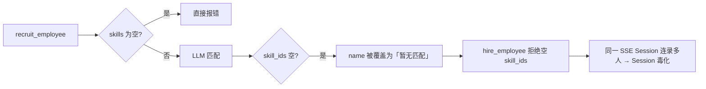
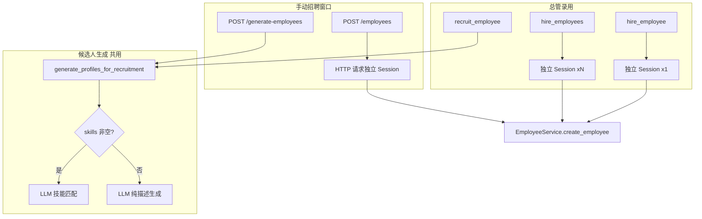

# 总管员工 CRUD 与招聘兜底改造

**状态：已完成**（含计划外 follow-up：批量录用 Session 修复、手动招聘零技能库对齐）

---

## 实施摘要

| 能力 | 状态 | 关键文件 |
|------|------|----------|
| 无技能 / 空技能库生成候选人 | 已完成 | `employee_generation_service.py` |
| 总管单人录用 `hire_employee` | 已完成 | `recruitment.py`, `recruitment_tools.py` |
| 总管批量录用 `hire_employees` | 已完成 | `recruitment.py`, `recruitment_tools.py`, `agent.py` |
| 录用独立 DB Session（不污染 SSE Session） | 已完成 | `recruitment.py`, `employee_tools.py` |
| `employee_code` 唯一占位 | 已完成 | `employee_service.py` (`pending-{uuid}`) |
| 总管员工 CRUD tools | 已完成 | `employee_tools.py`, `agent.py`, `prompts.py` |
| 手动招聘 `/generate-employees` 零技能库 | 已完成 | `employee_api.py` → `generate_profiles_for_recruitment` |
| 前端总管录用消息 + 无技能 UX | 已完成 | `recruitment-tool-payload.ts`, `recruitment-candidate-badge.tsx` |

---

## 背景与问题（改造前）

总管助手仅有 `list_workspace_employees` + `recruit_employee` + `hire_employee`，无更新/删除/详情工具。

招聘链路存在多层阻断：

手动招聘 `/generate-employees` 在技能库为空时直接返回 500，与总管行为不一致。

---

## 目标行为（已实现）

| 场景 | 行为 |
|------|------|
| 技能库有匹配 | 带 skill_ids 的候选人 |
| 技能库有但无匹配 | 合理岗位名 + 描述，`skill_ids=[]`，可录用 |
| 技能库完全为空 | 纯 LLM 生成无技能候选人（总管 + 招聘窗口） |
| 总管录 1 人 | `hire_employee`，独立 Session |
| 总管录 2～5 人 | **一次** `hire_employees(candidates JSON)`，逐人独立 Session |
| 手动招聘窗口 | `POST /generate-employees` 与总管共用 `generate_profiles_for_recruitment`；录用仍走 `POST /employees`（每次独立 HTTP Session） |
| 总管改/删员工 | `get_employee` / `update_employee` / `delete_employee` |
| 删除总管 | 拒绝（tool + API） |

---

## 已落地改造

### 1. 招聘生成（共用 `generate_profiles_for_recruitment`）

**文件：** [`employee_generation_service.py`](apps/server/src/service/employee_generation_service.py)

- Prompt：无匹配时仍生成合理岗位名，禁止「暂无匹配」
- `_parse_skill_profiles`：保留 LLM 的 name/description
- `_generate_profiles_without_skills`：技能库为空时的兜底
- **`generate_profiles_for_recruitment`**：总管 Tool 与 `/generate-employees` 统一入口
- `generate_candidates_for_orchestrator` 委托上述方法

**文件：** [`employee_api.py`](apps/server/src/api/employee_api.py)

- 删除「技能列表为空 → 500」分支，改调 `generate_profiles_for_recruitment`

### 2. 录用链路

**文件：** [`recruitment.py`](apps/server/src/service/agent/orchestrator/recruitment.py)

- `hire_candidate` / `hire_candidates_batch`：每人 `_hire_one_with_fresh_session()`
- 允许 `skill_ids=[]`；批量返回 `type: employees_hired`

**文件：** [`recruitment_tools.py`](apps/server/src/service/agent/orchestrator/recruitment_tools.py)

- `hire_employee`：单人，默认 `skill_ids="[]"`
- `hire_employees`：多人 JSON 数组，最多 5 人

### 3. 员工创建稳定性

**文件：** [`employee_service.py`](apps/server/src/service/employee_service.py)

- 创建前占位 `employee_code`：`pending-{uuid}`（非固定 `"0"`），避免 `(workspace_id, employee_code)` 唯一约束在连录/并发时冲突

### 4. 总管员工 CRUD

**文件：** [`employee_tools.py`](apps/server/src/service/agent/orchestrator/employee_tools.py)

- `get_employee` / `update_employee` / `delete_employee`
- 写操作（update/delete）使用独立 Session + 失败 rollback
- 已注册于 [`agent.py`](apps/server/src/service/agent/orchestrator/agent.py)

**文件：** [`prompts.py`](apps/server/src/service/agent/orchestrator/prompts.py)

- 「员工管理」section；招聘流程含无技能兜底与 `hire_employees` 说明
- 员工表增加「总管」列

### 5. 前端（总管对话）

- [`recruitment-tool-payload.ts`](apps/web/src/lib/chat/recruitment-tool-payload.ts)：`buildRecruitmentHireMessage` 携带 description + skill_ids
- [`recruitment-candidate-badge.tsx`](apps/web/src/components/chat/message-blocks/recruitment-candidate-badge.tsx)：无技能提示文案
- [`tool-label-registry.ts`](apps/web/src/lib/chat/tool-label-registry.ts)、[`recruitment.ts`](apps/web/src/lib/chat/tools/handlers/recruitment.ts)：`hire_employees` 展示

**未改：** 招聘窗口 UI（`hire-sheet.tsx`）、`createEmployee` API——手动录用流程不受影响。

---

## 数据流（当前）

---

## 与编排/多对话改动的关系

以下已存在改动**与本计划正交**，实施时已增量合并 Prompt，未覆盖「委派执行后」等 section：

- 总管 SSE 串流隔离：[`orchestrator-employee-stream-isolation.md`](apps/server/docs/orchestrator-employee-stream-isolation.md)
- 总管多对话 / 执行日志关联：[`总管多对话分阶段_b7c72e90.plan.md`](总管多对话分阶段_b7c72e90.plan.md)

---

## 验证清单

- [x] 有匹配：候选人带 skill_ids → 录用成功
- [x] 无匹配：合理 name、`skill_ids=[]` → 录用成功
- [x] 空技能库：总管 + 招聘窗口均能生成候选人
- [x] 批量录用：`hire_employees` 一次录多人，无 Session rollback 连锁错误
- [x] CRUD：总管 update/delete/get；不可删总管
- [x] 手动招聘：零技能库下 `/generate-employees` 不再 500
- [x] 批量录用 UI：`hire_employees` → `EmployeesHiredBatchCard` 工牌网格（非 tool-action-row）
- [ ] 可选后续：招聘窗口「全部录用」按钮 → 组装 `candidates` 调总管或批量 API

---

## 可选后续（未做）

1. 招聘窗口候选人卡片「全部录用」按钮（前端组装 JSON，仍走现有 `createEmployee` 循环或新增批量 REST）
2. 为 `generate_profiles_for_recruitment` / `hire_candidates_batch` 补 pytest
