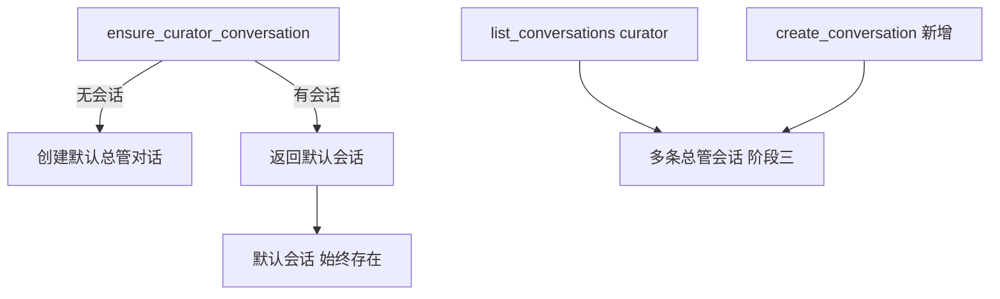
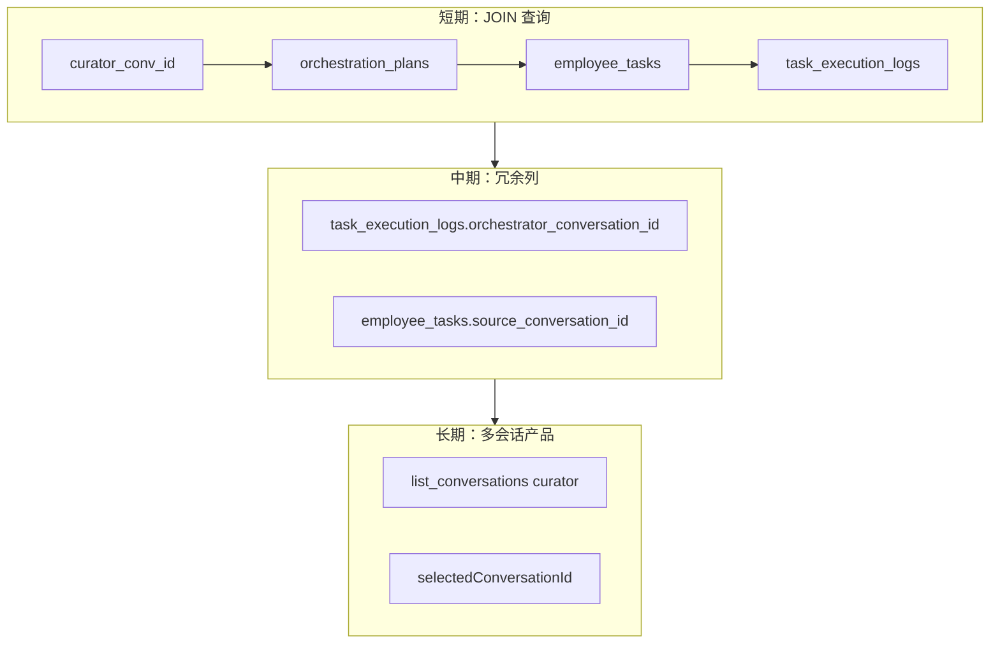
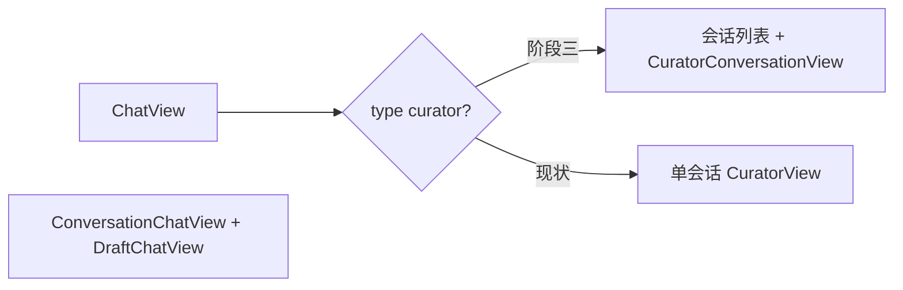
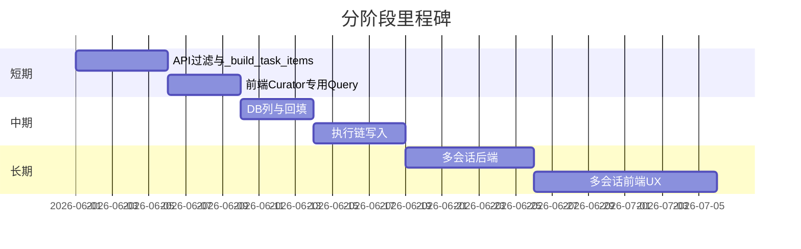

# 总管任务关联会话 · 短中长期分阶段计划

## 背景与目标

当前数据语义：

| 字段 / 对象 | 含义 |
|-------------|------|
| `OrchestrationPlan.conversation_id` | 创建编排计划时的**总管会话**（已存在） |
| `EmployeeTask.orchestration_plan_id` | 子任务归属计划（已存在） |
| `TaskExecutionLog.conversation_id` | **员工执行会话**，不是总管会话 |

缺口：总管 UI（[`curator-view.tsx`](apps/web/src/components/chat/curator/curator-view.tsx)）用 [`useAllTaskExecutions`](apps/web/src/hooks/use-schedule-monitor-queries.ts) 拉全工作区日志；执行 API（[`task_api.py`](apps/server/src/api/task_api.py)）无 `orchestrator_conversation_id` 过滤；子任务启动（[`execution.py`](apps/server/src/service/agent/orchestrator/execution.py)）未把 `plan.conversation_id` 写入执行链。

## 设计决策（已确认）

**[`ChatService.ensure_curator_conversation`](apps/server/src/service/chat_service.py) 三阶段均保留**，职责不变：**保证每个 workspace 至少有一条可用的总管会话**（无则创建，标题默认「总管对话」；并校正 `target_id` 与 `ensure_curator_employee` 一致）。

- 阶段一、二：继续作为 [`GET .../chat/curator/conversation`](apps/server/src/api/chat_api.py)、[`useCuratorConversationQuery`](apps/web/src/hooks/use-chat-queries.ts)、派单同步、总管定时任务等入口的**默认会话**来源。
- 阶段三：**不删除、不废弃**该 API/方法；仅扩展语义——在「至少一条默认会话」之上，允许通过 `create_conversation` + `list_conversations` 新增更多 `target_type=curator` 会话。多对话时 `ensure_curator_conversation` 返回**默认会话**（建议：最早创建的一条，或标题为「总管对话」的一条），新建会话走独立接口。





---

## 阶段一：短期（1–2 个迭代）— 查询与展示隔离，不改表

**目标**：在仍为「每 workspace 一条总管会话」的前提下，总管时间线、编排详情只展示**当前总管会话**下发的任务；统一 API 语义，避免前端全量拉取后客户端过滤。

### 1.1 后端：按总管会话过滤

**编排计划列表** — [`orchestration_api.py`](apps/server/src/api/orchestration_api.py) `list_plans`：

- 增加 Query：`conversation_id: int | None`
- `WHERE workspace_id = ? AND (conversation_id = ? OR 参数省略)`

**任务执行日志** — [`task_api.py`](apps/server/src/api/task_api.py) + [`TaskService.list_execution_logs`](apps/server/src/service/task_service.py)：

- 增加 Query：`orchestrator_conversation_id: int | None`
- 实现方式（无新列）：`TaskExecutionLog` JOIN `EmployeeTask` ON `task_id`，再 JOIN `OrchestrationPlan` ON `orchestration_plan_id`，`WHERE orchestration_plans.conversation_id = :id`
- 可选：`orchestration_plan_id` 过滤，供计划详情页复用

**编排任务项** — [`orchestration_api.py`](apps/server/src/api/orchestration_api.py) `_build_task_items`：

- 填充已有 schema 字段 [`OrchestrationTaskItem.conversation_id`](apps/server/src/schemas/orchestration.py)（取最新 `TaskExecutionLog.conversation_id`，即员工执行会话）
- 新增响应字段 `orchestrator_conversation_id`（取自 `plan.conversation_id`），前后端类型同步

**文档**：在 [`apps/web/src/lib/chat/CHAT_DATA_TYPES.md`](apps/web/src/lib/chat/CHAT_DATA_TYPES.md) 或 [`docs/task-lifecycle.md`](docs/task-lifecycle.md) 用一小节固定命名：`conversation_id`（员工执行）vs `orchestrator_conversation_id`（总管来源）。

### 1.2 前端：总管视图按会话取数

| 文件 | 改动 |
|------|------|
| [`use-schedule-monitor-queries.ts`](apps/web/src/hooks/use-schedule-monitor-queries.ts) | 新增 `useCuratorTaskExecutions(conversationId)`，请求带 `orchestrator_conversation_id`；`page_size` 提高到合理值（如 100）或循环分页 |
| [`curator-view.tsx`](apps/web/src/components/chat/curator/curator-view.tsx) | 将 `useAllTaskExecutions` 替换为 `useCuratorTaskExecutions(curatorConversationId)`，`conversationId` 为空时不请求 |
| [`curator-overview-section.tsx`](apps/web/src/components/chat/contacts/curator-overview-section.tsx) | **保持** `useAllTaskExecutions`（工作区级概况，不按会话过滤） |
| [`use-chat-queries.ts`](apps/web/src/hooks/use-chat-queries.ts) `useOrchestrationPlansQuery` | 增加 `conversationId` 参数传给列表 API |

**保持不变**（短期）：[`notification-center.tsx`](apps/web/src/components/chat/notifications/notification-center.tsx)、[`use-task-execution-notifications.ts`](apps/web/src/hooks/use-task-execution-notifications.ts) 仍可用全量 executions（全局通知合理）。

### 1.3 验收标准

- 总管对话 A 下发的编排任务，其终态 `ExecutionReportCard` 只出现在会话 A 时间线（当前单会话下即「当前唯一总管会话」）
- `GET /orchestration/plans?conversation_id=X` 只返回该会话计划
- `pnpm typecheck` / `pnpm lint` 通过

### 1.4 阶段一已完成补丁

- [`chat-layout.tsx`](apps/web/src/components/chat/shell/chat-layout.tsx)：workspace SSE 时同步 `invalidateQueries` `curator-executions` 前缀（与 `all-task-executions` 一致），避免总管时间线仅依赖 15s 轮询

### 1.5 后续修复（未做，记入计划）

**执行记录分页截断**（`useAllTaskExecutions` / `useCuratorTaskExecutions`）：

| Hook | 现状 | 目标 |
|------|------|------|
| `useAllTaskExecutions` | 未传 `page_size`，API 默认 **20** 条 | 概况/通知等需拉全或循环分页 |
| `useCuratorTaskExecutions` | `page_size=100` 单页 | 同上，或按时间窗口查询 |

建议在阶段一收尾或阶段二并行：抽 `fetchAllTaskExecutions(params)` 循环 `page` 直至 `items.length < page_size`，或后端提供 `page_size` 上限放宽 + 文档约定。

### 1.6 已知局限（接受为短期债）

- 非编排来源任务（手动员工任务、远程派单）无法仅靠 plan JOIN 关联总管会话，时间线仍可能缺卡片或需阶段二字段

---

## 阶段二：中期（2–3 个迭代）— 落库关联字段 + 执行链写入 + 历史回填

**目标**：不依赖 JOIN 即可按总管会话查任务/日志；总管定时任务、派单同步可绑定会话；为阶段三多会话提供稳定外键。

### 2.1 数据库与模型

在 [`init_db.py`](apps/server/src/db/init_db.py) 增加 `ensure_column`：

| 表 | 列 | 说明 |
|----|-----|------|
| `employee_tasks` | `source_conversation_id INTEGER` | 任务来源总管会话；编排创建时 = `plan.conversation_id` |
| `task_execution_logs` | `orchestrator_conversation_id INTEGER` | 本次执行归属的总管会话 |

更新 ORM：[`employee_task.py`](apps/server/src/models/employee_task.py)、[`task_execution_log.py`](apps/server/src/models/task_execution_log.py)  
更新 Pydantic：[`schemas/task.py`](apps/server/src/schemas/task.py)、[`schemas/orchestration.py`](apps/server/src/schemas/orchestration.py)

**回填脚本**（一次性，可放在 `apps/server` 管理命令或迁移注释中）：

```sql
UPDATE employee_tasks SET source_conversation_id = (
  SELECT conversation_id FROM orchestration_plans WHERE id = employee_tasks.orchestration_plan_id
) WHERE orchestration_plan_id IS NOT NULL;

UPDATE task_execution_logs SET orchestrator_conversation_id = (
  SELECT p.conversation_id FROM employee_tasks t
  JOIN orchestration_plans p ON t.orchestration_plan_id = p.id
  WHERE t.id = task_execution_logs.task_id
) WHERE task_id IS NOT NULL;
```

### 2.2 写入路径（创建/执行时赋值）

| 路径 | 文件 | 写入 |
|------|------|------|
| 创建编排子任务 | [`orchestrator/tools.py`](apps/server/src/service/agent/orchestrator/tools.py) `create_orchestration_plan` | `EmployeeTask.source_conversation_id = conversation_id` |
| 即时执行子任务 | [`orchestrator/execution.py`](apps/server/src/service/agent/orchestrator/execution.py) `start_task_as_conversation` | `run_log.orchestrator_conversation_id = plan.conversation_id`；`registry.start(..., orchestrator_conversation_id=plan.conversation_id)` |
| 总管定时任务 | [`task_scheduler_service.py`](apps/server/src/service/task_scheduler_service.py) `_start_curator_task` | `run_log.orchestrator_conversation_id = conv.id`（与 `conversation_id` 同为总管会话，语义区分：前者=来源总管，后者=执行发生在总管会话内） |
| 远程派单注入 | [`dispatch_order_sync_service.py`](apps/server/src/service/dispatch_order_sync_service.py) | 写入当前 `ensure_curator_conversation` 的 id 到 `source_conversation_id` / log（中期仍单会话，阶段三再改为可配置） |

`list_execution_logs` 优先用 `orchestrator_conversation_id` 列过滤，JOIN 作为 fallback（兼容未回填行）。

### 2.3 前端类型与 Query

- [`TaskExecution`](apps/web/src/types/schedule-monitor.ts) 增加 `orchestrator_conversation_id?: number | null`
- `useCuratorTaskExecutions` 改用新查询参数（与列名一致）
- 计划卡片 / 执行卡片如需跳转员工会话，继续用 `conversation_id`（员工执行会话）

### 2.4 验收标准

- 新建编排任务后，`employee_tasks.source_conversation_id` 与 `orchestration_plans.conversation_id` 一致
- 子任务执行完成后，`task_execution_logs.orchestrator_conversation_id` 正确
- 回填后历史计划在总管时间线仍可展示（抽样 3–5 条旧 plan）

---

## 阶段三：长期（3+ 迭代）— 总管多对话产品化

**目标**：总管与普通员工一致——多会话列表、新建会话、切换会话；清空/资源/未读按会话隔离。

### 3.1 后端：在保留 ensure 的前提下支持多会话

| 组件 | 阶段三调整 |
|------|------------|
| [`ChatService.ensure_curator_conversation`](apps/server/src/service/chat_service.py) | **保留** get-or-create；查询改为「默认会话」策略（例如 `ORDER BY id ASC LIMIT 1` 或 `title='总管对话'` 优先），**不再**用「全 workspace 只能有一条 curator 会话」限制新建 |
| [`GET .../chat/curator/conversation`](apps/server/src/api/chat_api.py) | **保留**，仍调用 `ensure_curator_conversation` 返回默认会话（旧客户端、工作台、宠物语音等无需改入口） |
| [`list_conversations`](apps/server/src/api/chat_api.py) + [`create_conversation`](apps/server/src/api/chat_api.py) | 总管多会话的列表/新建主路径；`target_type=curator`, `target_id=curator_employee.id` |
| [`_start_curator_task`](apps/server/src/service/task_scheduler_service.py) | 不再裸 `select ... limit(1)`；无绑定时 fallback 到 `ensure_curator_conversation` 的默认 id |
| [`delete_all_task_executions`](apps/server/src/api/task_api.py) | 新增按 `orchestrator_conversation_id` 的 scoped 删除；**不**影响 ensure 创建的默认会话除非用户显式清空该会话 |

`create_conversation` 已支持任意 `target_type`；新增总管会话与 `ensure` 并存，互不替代。

### 3.2 前端：对齐员工多会话 UX



主要改动：

- [`chat-view.tsx`](apps/web/src/components/chat/views/chat-view.tsx)：总管走「会话列表 + 当前会话聊天」，复用 [`ConversationChatView`](apps/web/src/components/chat/views/chat-conversation-view.tsx) 或扩展 `CuratorView` 接受 `conversationId` prop
- [`chat-layout.tsx`](apps/web/src/components/chat/shell/chat-layout.tsx)、[`use-chat-queries.ts`](apps/web/src/hooks/use-chat-queries.ts)：总管 `useConversationsQuery` + `selectedConversationId`（与员工共用 store 字段或 curator 专用）
- [`useResetCuratorConversation`](apps/web/src/hooks/use-chat-queries.ts)：仅删除**当前**会话消息 + 关联 executions/plans（调用阶段二 scoped delete API），去掉 `deleteAllTaskExecutions()`
- [`workbench-content-split.tsx`](apps/web/src/components/workbench/workbench-content-split.tsx)：资源面板 `conversationId` 随选中总管会话变化
- 宠物/语音总管（[`use-pet-voice-curator.ts`](apps/web/src/components/pet/use-pet-voice-curator.ts)）：发送时绑定当前选中总管会话

### 3.3 产品与兼容

- **默认会话**：`ensure_curator_conversation` 保证始终存在；首次进入总管可默认选中 ensure 返回的会话，或「最近更新」的一条
- **数据迁移**：历史由 ensure 创建的单条会话即为 default；用户新建会话 `title` 可编辑，不影响 ensure 逻辑
- **文档**：更新 [`AGENTS.md`](AGENTS.md) 总管会话说明；可选补充 `docs/curator-multi-conversation.md`

### 3.4 验收标准

- 可创建 ≥2 条总管会话，切换后消息/执行卡片/资源目录互不影响
- 会话 A 下发编排，会话 B 时间线无该执行卡片
- 清空会话 B 不影响会话 A 与全局通知（若通知仍全 workspace，需在 PRD 中明确）

---

## 推荐实施顺序与依赖



**原则**：阶段二完成前不要大改总管 UI 路由；阶段一即可显著减少「任务串台」；阶段三依赖阶段二的 `orchestrator_conversation_id` / `source_conversation_id` 做 scoped 删除与列表过滤。

---

## 风险与决策点

1. **ensure 与多会话**：若用户删除「默认」总管会话，下次 `ensure_curator_conversation` 应再创建一条（与现有一致）；列表 UI 需避免误删最后一条且无替代，或删除后自动触发 ensure。
2. **字段命名**：建议统一 `orchestrator_conversation_id`（与 [`stream_registry`](apps/server/src/service/stream_registry.py) 参数一致），避免 `curator_conversation_id` 与 `orchestrator_*` 混用。
3. **总管亲自执行 vs 编排下发**：总管会话内 orchestrator 流式对话的 log 是否也要 `orchestrator_conversation_id`？建议：总管自身执行（定时任务）`conversation_id == orchestrator_conversation_id`；员工子任务两者不同。
4. **通知中心**：长期是否按会话过滤通知——若否，在阶段三 PRD 中单列「已知：通知仍为 workspace 级」。

阶段一、二可在当前单会话总管上独立交付价值；阶段三再改交互，无需等待阶段二全部回填完成即可并行设计 UI 稿。
