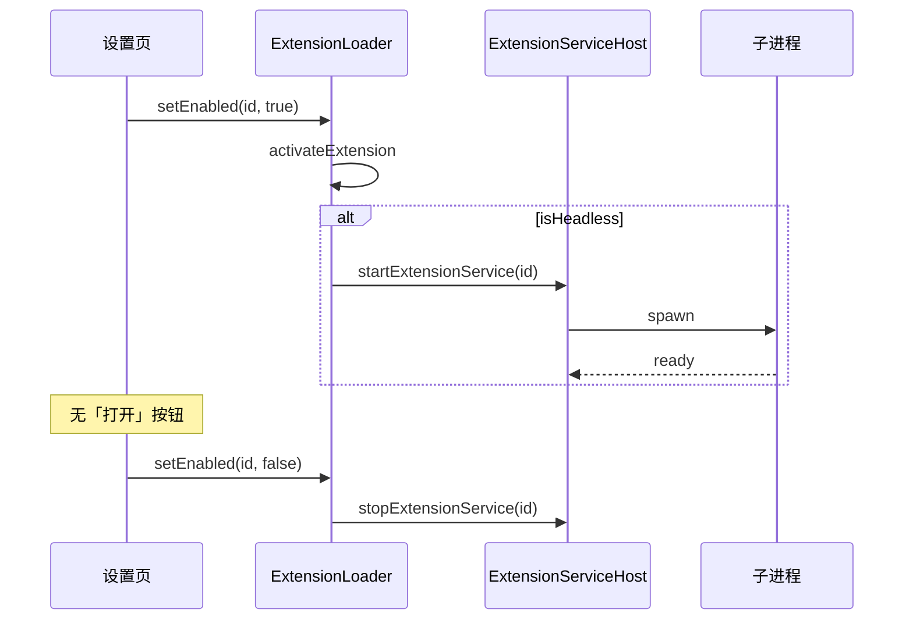
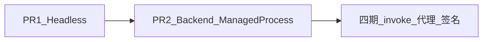

# Electron 插件机制 · 三期实施计划

## 范围（已确认）

| 包含 | 不包含（四期+） |
|------|----------------|
| **Headless**：manifest 仅 `service`、无 `ui`；启用/启动时拉起子进程 | `extension.invoke` 宿主能力路由 |
| **Backend 重构**：[`backend-process.ts`](apps/web/electron/features/backend/backend-process.ts) 内部改用 [`managed-process.ts`](apps/web/electron/core/services/managed-process.ts) | HTTP 代理 IPC、域名白名单 |
| 设置页与列表 API 适配 headless | 插件包签名、企业分发/自动更新 |

一期/二期资产：无 `kind` 字段；`ui` / `service` 块组合；[`ExtensionServiceHost`](apps/web/electron/features/extension/extension-service-host.ts)；`ext:host:*` / `ext:plugin:*`。

---

## 形态矩阵（三期后）

| `ui` | `service` | 行为 |
|------|-----------|------|
| 有 | 无 | 仅插件窗（一期） |
| 有 | 有 | 开窗前启服务（二期） |
| 无 | 有 | **Headless**：启用即 `startExtensionService`，无 BrowserWindow |
| 无 | 无 | 非法 manifest |

推断函数（[`manifest-schema.ts`](apps/web/electron/features/extension/manifest-schema.ts)）：

```ts
hasExtensionUi(m)      // m.ui != null
hasExtensionService(m) // 已有
isHeadlessExtension(m) // service && !ui
```

---

## 一、Headless 插件

### 目标流程



### 1. Manifest 与扫描

- [`manifest-schema.ts`](apps/web/electron/features/extension/manifest-schema.ts)：`ui` 改为 **optional**（`ExtensionUiSchema.optional()`）
- `superRefine` 替换当前 headless 占位错误：
  - 至少存在 `ui` 或 `service` 之一
  - 删除 `"service without ui is not supported yet"`
- 新增 `hasExtensionUi()` / `isHeadlessExtension()`

### 2. 启停与生命周期

| 入口 | 改动 |
|------|------|
| [`activateExtension`](apps/web/electron/features/extension/extension-loader.ts) | headless 且已启用时 **`await startExtensionService(id)`**（需改为 async 或内部 `void start...().catch` + 日志） |
| [`initExtensions`](apps/web/electron/features/extension/extension-loader.ts) | 启动时对 `enabled` 且 headless 的 id 拉起服务（与二期「仅元数据 activate」区分） |
| [`deactivateExtension`](apps/web/electron/features/extension/extension-loader.ts) | 已有 `stopExtensionService`，保持不变 |
| [`openExtensionWindow`](apps/web/electron/features/extension/extension-window.ts) | 无 `ui` 时 **throw** 明确错误（如 `Extension has no UI`），避免误开窗 |
| [`ext:host:open`](apps/web/electron/features/extension/ipc.ts) | 同上，设置页 toast 展示错误 |

**注意**：二期 `activateExtension` 仅 `markExtensionActivated`；headless 需在 **enable** 与 **app 启动恢复 enabled** 两条路径都启服务，避免「已启用但进程未跑」。

### 3. 列表 API 与设置页

[`extension-ipc-channels.ts`](apps/web/electron/shared/extension-ipc-channels.ts) / [`extension-loader.ts`](apps/web/electron/features/extension/extension-loader.ts)：

- `ExtensionListItem` 增加：
  - `hasUi: boolean`
  - `serviceRunning: boolean`（来自 `isExtensionServiceRunning(id)`）
- 保留 `hasService` 或合并语义（建议保留，便于 UI 文案）

[`extensions-settings.tsx`](apps/web/src/components/settings/extensions-settings.tsx)：

- `hasUi === false`：隐藏「打开」，显示状态（如「服务运行中 / 已停止」）
- headless 启用失败：`withElectronApi` + `toast.error`（与二期 open 失败一致）

可选宿主 channel（二期可省略）：`ext:host:get-status`；若不加，列表刷新时带 `serviceRunning` 即可。

### 4. Headless 的 getContext

- 无插件窗时 **不** 走 `ext:plugin:get-context`
- 若后续四期需要，可再加 `ext:host:get-context`；三期可不做

### 5. 示例与文档

- 新增 `examples/extension-demo-headless/com.example.demo-headless/`：`service/server.mjs`（复用 demo-service 逻辑），**无 `ui/`**
- 更新 [`electron/README.md`](apps/web/electron/README.md) 形态表与 headless 启停说明
- 更新 [`examples/extension-demo-service/README.md`](examples/extension-demo-service/README.md) 交叉引用

### 6. Headless 验收

1. 仅 `ui` / `ui+service` 行为与二期一致
2. headless 示例：启用后任务管理器可见子进程；设置页无「打开」
3. 禁用 / 退出应用：进程清理
4. 对 headless 调 `openExtension`：失败提示，不影响主应用
5. `pnpm typecheck`（`apps/web`）通过

---

## 二、主后端迁移 ManagedProcess

### 目标

减少 [`backend-process.ts`](apps/web/electron/features/backend/backend-process.ts) 与插件服务重复的 spawn/ready/kill 逻辑；**对外 API 不变**：`startBackend()`、`stopBackend()`、`getBackendPort()`、现有 IPC。

### 实现要点

1. **配置封装**（可放在 `backend-process.ts` 或 `backend-managed-config.ts`）  
   - **生产**：`command: [exePath]`，`cwd: pyServerPath`，`port: BACKEND_PORT`，`ready: { type: "stdout", pattern: ... }`（复用 `isUvicornReadyLine` 的端口匹配逻辑，或改为 health `GET /docs` / 现有 health 路径）  
   - **开发**：保留 `arch -arm64 uv ...` 分支；作为 `command`/`cwd` 传入 `startManagedProcess`（不在 ManagedProcess 内写死）

2. **状态**  
   - 用 `ManagedProcessHandle` 替代手写 `backendProcess` + `killProcessTree`  
   - `stopBackend()` → `handle.stop()`  
   - `onExit`：在 ManagedProcess 或 backend 层监听子进程退出，重置 `backendReady`（若需，可为 ManagedProcess 增加可选 `onExit` 回调）

3. **ManagedProcess 小扩展（按需）**  
   - 固定端口模式：`port` 已指定时不再 `allocateLocalPort`（当前已支持）  
   - 可选 `onExit` / 保留 `pid` 供日志  
   - dev 下 uvicorn `--reload` 子进程：保持与现网相同测试矩阵（**Windows / macOS arm64**）

4. **风险与测试**  
   - 登录 / splash 路径依赖 `startBackend()` 就绪，须手工验证：冷启动、退出、后端崩溃重启  
   - 与 headless **独立 PR** 更稳：建议 **先 headless，再 backend 重构**

### Backend 验收

1. `pnpm dev:app`：开发模式后端正常就绪，主窗可登录  
2. 打包产物路径下后端启动正常（若有条件）  
3. 退出无 `backend.exe` / uvicorn 残留  
4. 插件 headless 服务与主后端端口/进程互不影响

---

## 建议实施顺序与 PR 拆分



| PR | 内容 | 风险 |
|----|------|------|
| **PR1** | manifest optional ui、loader/window/settings、demo-headless、文档 | 低 |
| **PR2** | backend-process → ManagedProcess、必要时扩展 ManagedProcess | 中（影响启动链） |

---

## 四期备忘（本期不做）

- `ext:plugin:invoke` + 权限表 + 宿主方法注册表（通知、主窗等）
- `ext:plugin:fetch` 或 session 代理 + manifest `network.allowlist`
- 扩展目录 zip 安装、`ed25519` 签名校验、`minHostVersion` 与吊销
- `activateExtension` 与主应用事件总线（任务完成通知插件等）
