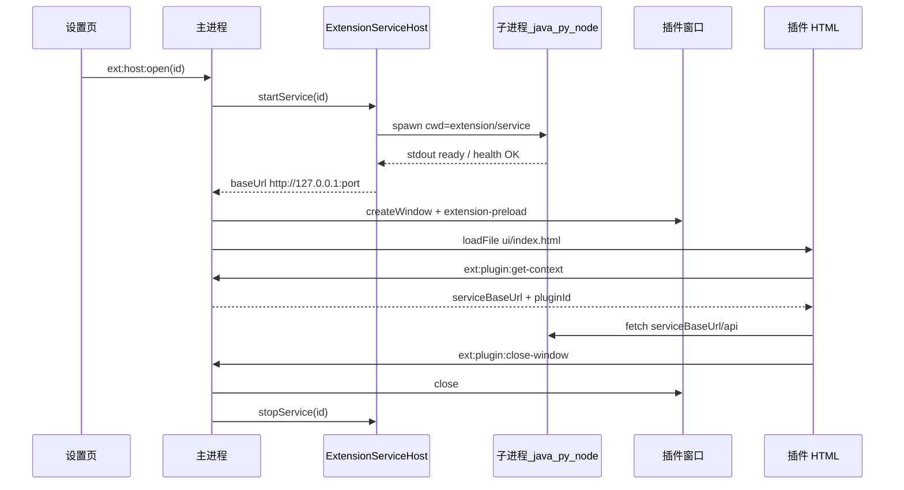

# Electron 插件机制 · 二期实施计划

## 范围（已确认）

| 包含 | 不包含（三期） |
|------|----------------|
| `kind: "ui-service"` + manifest `service` 块 | `kind: "headless"` |
| 通用 `ManagedProcess`（spawn / ready / 杀进程树） | `extension.invoke` 业务路由 |
| `ExtensionServiceHost` 按插件启停 | HTTP 代理 IPC、签名校验 |
| 打开插件：**先启服务再 load UI** | 重构主 `backend-process` 改用 ManagedProcess（可选后续 PR） |
| `getContext().serviceBaseUrl` | 企业分发 / 自动更新插件 |

一期资产复用：[`features/extension/*`](apps/web/electron/features/extension/)、[`extension-ipc-channels.ts`](apps/web/electron/shared/extension-ipc-channels.ts)（`ext:host:*` / `ext:plugin:*`）、双 preload 构建、独立插件窗。

---

## 目标架构



---

## 1. 抽取 `ManagedProcess`（不先动主后端）

新建 [`apps/web/electron/core/services/managed-process.ts`](apps/web/electron/core/services/managed-process.ts)，从 [`backend-process.ts`](apps/web/electron/features/backend/backend-process.ts) 提炼**可配置**能力：

| 能力 | 说明 |
|------|------|
| `spawn(options)` | `command[]`、`cwd`、`env`、`stdio: pipe`、非 Win `detached: true` |
| Ready 检测 | `stdout` 正则 **或** `http://host:port{healthPath}` 轮询（二选一，manifest 配置） |
| 动态端口 | `port: 0` 时用 `net.createServer(0)` 分配，注入 `env.PORT` / `env.SERVER_PORT`（manifest 可配置 env 名） |
| 停止 | 复用现有 Win `taskkill /T /F`、Unix 进程组 `SIGTERM` → `SIGKILL` 逻辑 |
| 超时 | 默认 30s ready，可 per-service 覆盖 |
| 日志 | `createLogger(scope)` 参数，扩展服务用 `extension:service:{id}` |

**二期不重构** `startBackend()`，避免影响登录/splash 路径；待稳定后可单独 PR 让 `backend-process` 内部调用 `ManagedProcess`（减少重复）。

---

## 2. Manifest 扩展

更新 [`manifest-schema.ts`](apps/web/electron/features/extension/manifest-schema.ts)：

```ts
kind: z.enum(["ui", "ui-service"])  // 二期仅增 ui-service

// ui-service 必填 ui + service
service: z.object({
  command: z.array(z.string()).min(1),
  cwd: z.string().default("."),           // 相对扩展根
  env: z.record(z.string()).optional(),
  port: z.number().int().min(0).default(0), // 0 = 自动分配
  host: z.string().default("127.0.0.1"),
  envPortKey: z.string().default("PORT"), // 写入子进程环境变量
  ready: z.discriminatedUnion("type", [
    z.object({ type: z.literal("stdout"), pattern: z.string() }),
    z.object({
      type: z.literal("health"),
      path: z.string().default("/health"),
      intervalMs: z.number().default(500),
      timeoutMs: z.number().default(30_000),
    }),
  ]),
  bundledBinary: z.string().optional(),   // 可选：相对路径单文件 exe/jar
}).optional()
```

校验规则（Zod `superRefine`）：

- `kind === "ui"` → 不得有 `service`
- `kind === "ui-service"` → 必须有 `service` + `ui`
- `command` 禁止 shell 元字符拼接；`cwd` 经 [`resolveExtensionPath`](apps/web/electron/features/extension/extension-paths.ts) 解析

---

## 3. `ExtensionServiceHost`

新建 [`apps/web/electron/features/extension/extension-service-host.ts`](apps/web/electron/features/extension/extension-service-host.ts)：

```ts
interface RunningService {
  extensionId: string
  port: number
  baseUrl: string
  managed: ManagedProcessHandle
}

// startService(extensionId): Promise<string>  // 返回 baseUrl
// stopService(extensionId): void
// stopAllServices(): void
// getServiceBaseUrl(extensionId): string | undefined
// isServiceRunning(extensionId): boolean
```

- 内存 `Map<extensionId, RunningService>`
- `startService`：已运行则直接返回已有 `baseUrl`（幂等）
- `command` 解析：若 `bundledBinary` 则 `command` 首项替换为扩展目录内绝对路径
- 失败时 `stopService` 清理并向上抛错（设置页 / 开窗可 toast）

---

## 4. 开窗与服务生命周期挂钩

修改 [`extension-window.ts`](apps/web/electron/features/extension/extension-window.ts)：

```ts
export async function openExtensionWindow(extensionId: string): Promise<void> {
  const manifest = getExtensionManifest(extensionId)
  let serviceBaseUrl: string | undefined

  if (manifest.kind === "ui-service") {
    serviceBaseUrl = await startExtensionService(extensionId)
  }

  // 现有 createWindow ...
  // 将 serviceBaseUrl 存入 Map<extensionId, string> 供 getContext 读取
}

// closed 回调：ui-service 时 stopExtensionService(extensionId)
```

修改 [`extension-context.ts`](apps/web/electron/features/extension/extension-context.ts)：

```ts
export interface ExtensionContextPayload {
  // ...现有字段
  serviceBaseUrl?: string  // ui-service 且服务已启动时
}
```

修改 [`ipc.ts`](apps/web/electron/features/extension/ipc.ts)：

- `ext:host:open` handler 改为 `async`，`await openExtensionWindow(id)`，失败 rethrow
- `ext:host:close` / 插件窗 `closed`：除关窗外 `stopService`
- `deactivateExtension`：关窗 + `stopService`

修改 [`lifecycle.ts`](apps/web/electron/core/services/lifecycle.ts)：

- `deactivateAllExtensions()` 内增加 `stopAllExtensionServices()`（在关窗之后或之前，顺序：停服务 → 关窗）

**一期行为保持**：`kind: "ui"` 插件无 `service` 块，流程不变。

---

## 5. IPC / Preload（最小改动）

- [`ExtensionContextPayload`](apps/web/electron/shared/extension-ipc-channels.ts) 增加可选 `serviceBaseUrl`
- 宿主 `ext:host:open` 在 `IpcInvokeMap` / preload 侧类型仍为 `Promise<void>`；失败由 invoke reject 传递（设置页 `withElectronApi` 已有 onError 模式可补 toast）
- **不新增** plugin channel（仍用 `getContext` 取 URL）

可选：`ext:host:open` 返回 `{ serviceBaseUrl? }` 供宿主调试——二期可省略。

---

## 6. 示例与文档

### 示例插件 `examples/extension-demo-service/`

结构建议：

```
com.example.demo-service/
├── digital-employee.extension.json   # kind: ui-service
├── ui/index.html                     # fetch(serviceBaseUrl + '/api/hello')
└── service/
    └── server.mjs                    # 极简 Node http（无额外依赖）
```

manifest `ready` 示例：`stdout` 匹配 `listening on` 或 `health` 轮询 `/health`。

更新 [`examples/extension-demo/README.md`](examples/extension-demo/README.md) 或新建 README，说明 ui vs ui-service。

### README

[`electron/README.md`](apps/web/electron/README.md) 增加二期章节：manifest `service` 字段、启停时机、`serviceBaseUrl`、与主 Python 后端区别。

---

## 7. 安全与内网约束（二期基线）

- `service.command` 仅允许 manifest 声明的 argv 数组，禁止 `shell: true`
- `cwd`、可执行文件路径必须在扩展根内（`resolveExtensionPath`）
- 服务只监听 `127.0.0.1`（manifest `host` 默认，二期可拒绝 `0.0.0.0`）
- 单插件单服务实例；重复 `open` 复用同一进程
- 并发插件多服务：各自 `port: 0`，互不影响

---

## 8. 实施顺序

1. `managed-process.ts` + 单元级手工验证（spawn 假命令 / 本地 node 脚本）
2. `manifest-schema` 扩展 + registry 扫描兼容 `ui-service`
3. `extension-service-host.ts`
4. `extension-window` / `extension-context` / `ipc` / `lifecycle` 串联
5. `ext:host:open` async + 设置页错误提示（可选小改 [`extensions-settings.tsx`](apps/web/src/components/settings/extensions-settings.tsx)）
6. 示例 `extension-demo-service` + README
7. `pnpm typecheck` + 手工验收

---

## 9. 验收标准

1. `kind: "ui"` 示例插件行为与一期一致（无 service）
2. `ui-service` 示例：设置页打开 → 子进程启动 → 插件页 `getContext().serviceBaseUrl` 可访问 → `fetch` 本地 API 成功
3. 点击「关闭窗口」或 `ext:host:close`：窗口关闭且子进程被清理（任务管理器无残留）
4. 退出应用：`stopAllExtensionServices` + 无孤儿进程
5. 服务启动失败：开窗失败，主应用与主 Python 后端不受影响
6. `pnpm typecheck` 通过

---

## 10. 三期预告（备忘）

- `headless`：启用时 `startService` 不创建 BrowserWindow
- `extension.invoke` 宿主能力路由
- `backend-process` 迁移至 `ManagedProcess`
- HTTP 代理、插件包签名
