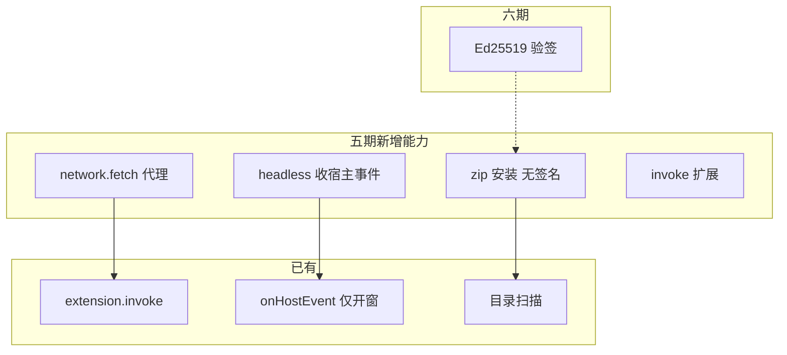
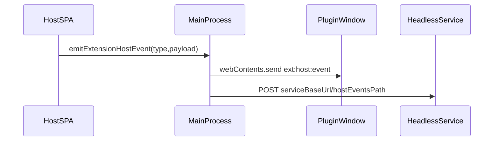
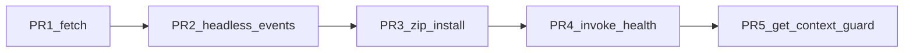

# Electron 插件机制 · 五期实施计划

## 背景与基线

一至四期已完成：目录扫描、UI/service/headless、[`extension.invoke`](apps/web/electron/features/extension/extension-invoke-router.ts)、[`listInvokeMethods`](apps/web/electron/features/extension/extension-permissions.ts)、[`ext:host:get-context`](apps/web/electron/features/extension/ipc.ts)、宿主事件仅推**已开窗**插件（[`extension-host-events.ts`](apps/web/electron/features/extension/extension-host-events.ts)）。

四期明确留五期的能力见 [四期计划 §六](.cursor/plans/插件机制四期_71c2adec.plan.md)。当前插件安装仍为**手工复制**到 `~/.digital-employee/extensions/<id>/`，无 zip 安装流程；插件渲染进程**无法**代发受控外网请求（也缺少 SSRF 防护）。

---

## 五期范围总览（含场景）

| 能力块 | 典型场景（为什么需要） | 用户/系统可见结果 |
|--------|------------------------|-------------------|
| **A. 受控网络 `fetch`** | 插件 UI 要调企业 OpenAPI（带 Cookie/Token），但渲染进程受 CSP/无 cookie 限制；若直接放开 `fetch` 会 SSRF 打内网 | 插件 `extension.fetch(url, init)`，仅 manifest 声明的域名可走宿主代发 |
| **B. zip 安装（无签名）** | 运营/IT 下发 `.zip`，用户不想手拷目录；内网/开发环境先打通安装链路 | 设置页「从 zip 安装」→ 解压 + manifest 校验 → 出现在列表 |
| **C. headless 收宿主事件** | 后台同步插件：主应用完成任务后要通知**无窗** service 拉数/写库 | `emitExtensionHostEvent` 同时 POST 到 headless 的 `serviceBaseUrl`（可配置路径） |
| **D. invoke 扩展（MVP）** | 插件要根据后端是否就绪展示状态、读用户设置、联动桌宠 | 新增 `backend.health`、`settings.get` 等少量方法 |
| **E. 安全加固（薄）** | 防止任意页面误调 `getExtensionContext` 拿 token | `ext:host:get-context` 校验调用方为主窗 webContents；开发模式保留日志 |

**本期不做（五期）**：**Ed25519 签名校验**、publisher 信任根、`sign-extension` 脚本、插件市场、自动更新扩展包、完整吊销列表服务、invoke 全覆盖（宠物/招聘等全部能力）、企业 MDM 策略下发。

**六期承接**：zip 签名校验与供应链，见 [六期：zip 签名与供应链](#六期zip-签名与供应链)。

---

## A. 受控网络：`extension.fetch` + `network.allowlist`

### 场景说明

1. **企业 API 集成**：插件面板展示审批列表，需 `GET https://api.corp.com/...`，且希望宿主注入 `authToken`（已声明 `auth.read`）或统一 User-Agent。
2. **避免 SSRF**：恶意/劣质插件若可请求 `http://127.0.0.1:58000` 或 `file://`，可探测本机后端与元数据；必须在主进程统一校验目标 URL。
3. **与 invoke 分工**：`invoke` 适合短命令；HTTP 用专用 `fetch` API，便于返回 status/headers/body，后续可扩展超时/大小限制。

### 设计要点

| 项 | 内容 |
|----|------|
| Manifest | 新增可选块 `network: { allowlist: string[] }`（主机名或 `*.domain.com`，见 zod） |
| Permission | `host.network`（或 `network.fetch`，与 allowlist 并存：无 allowlist 则拒绝） |
| API | `window.extension.fetch(input, init?)` → IPC `ext:plugin:fetch` |
| 实现 | 新建 [`extension-fetch-proxy.ts`](apps/web/electron/features/extension/extension-fetch-proxy.ts)：解析 URL → 主机名匹配 allowlist → 拒绝私有/链路本地 IP（`127.0.0.0/8`、`10.*`、`169.254.*` 等，**例外**可配置 `allowLocalhost: true` 仅 dev）→ 使用 Node `fetch`/`undici` 发请求 |
| 响应 | 结构化克隆友好：`{ ok, status, headers: Record<string,string>, body: string }`（MVP 仅 text；二进制六期） |
| 限制 | MVP：`maxBodyBytes`（如 5MB）、`timeoutMs`（如 30s）、禁止 redirect 到非 allowlist 域（或禁止 redirect） |

### 改动文件

- [`manifest-schema.ts`](apps/web/electron/features/extension/manifest-schema.ts)：`network` + permission 枚举
- [`extension-permissions.ts`](apps/web/electron/features/extension/extension-permissions.ts)：若用 invoke 风格则登记；推荐独立 API 不进入 `EXTENSION_INVOKE_METHOD_PERMISSIONS`
- [`extension-ipc-channels.ts`](apps/web/electron/shared/extension-ipc-channels.ts) + [`ipc.ts`](apps/web/electron/features/extension/ipc.ts) + [`extension-preload.ts`](apps/web/electron/preload/extension-preload.ts)
- 示例：[`examples/extension-demo-fetch/`](examples/extension-demo-fetch/)（allowlist + 调公开 API 或 mock）
- [`electron/README.md`](apps/web/electron/README.md) 五期：场景表 + allowlist 规则

### 验收

- allowlist 含 `api.example.com` 时请求 `https://api.example.com/x` 成功；请求 `https://evil.com` 明确 reject
- 请求 `http://127.0.0.1:58000` 默认 reject
- 未声明 `host.network` 或 allowlist 为空时 reject

---

## B. zip 安装（五期：无 Ed25519）

### 场景说明

1. **交付**：内部发布 `com.acme.report-1.0.0.zip`，用户双击安装路径复杂；设置页选文件即可，替代手工复制到 `extensions/`。
2. **供应链（六期补齐）**：zip 被中间人替换时应有签名校验拒绝加载；五期**不验签**，文档明确「仅安装来源可信的 zip」，防篡改由六期 Ed25519 承接。
3. **与现网共存**：安装后仍走现有 `scanExtensionRegistry`；`id` 与目录名一致规则不变。

### 设计要点

| 项 | 内容 |
|----|------|
| 包结构 | zip 根含 `digital-employee.extension.json` + 约定目录（`ui/`、`service/` 等） |
| 安全（五期基线） | 解压路径规范化（防 zip slip）；仅允许写入 `getExtensionsRoot()`；manifest zod 校验；`minHostVersion` 校验（扫描阶段已有 [`isHostVersionCompatible`](apps/web/electron/features/extension/manifest-schema.ts)，安装时再次校验） |
| IPC | `ext:host:install-from-path`（args: zip 路径）+ 设置页 `dialog.showOpenDialog` |
| 流程 | 解压到临时目录 → 校验 manifest → 若目标 id 已存在则版本策略（拒绝 / 覆盖，MVP：**拒绝并提示先卸载**）→ 移动到 `getExtensionsRoot()/<id>/` → `scanExtensions()` |
| **五期不做** | `digital-employee.extension.sig`、`trusted-publishers.json`、`extension-signature.ts`、`sign-extension.mjs`、`publisher` 字段（均六期） |

### 改动文件

- 新建 [`extension-installer.ts`](apps/web/electron/features/extension/extension-installer.ts)（仅安装逻辑，无验签模块）
- [`ipc.ts`](apps/web/electron/features/extension/ipc.ts) + [`preload-bridge.ts`](apps/web/electron/features/extension/preload-bridge.ts) + [`extensions-settings.tsx`](apps/web/src/components/settings/extensions-settings.tsx)（「安装插件…」按钮）
- [`electron/README.md`](apps/web/electron/README.md)：安装流程 + **安全声明**（六期将强制签名）

### 验收

- 结构合法 zip 安装后列表可见、可启用
- manifest 非法 / zip slip / id 冲突 → 错误 toast，extensions 目录无残留
- **不验收**签名、篡改包拒绝等用例（属六期）

---

## C. headless 消费宿主事件

### 场景说明

1. **后台同步**：headless 插件 `service` 每 5 分钟同步飞书表；主应用完成 OAuth 或切换 workspace 时，宿主 `emitExtensionHostEvent('workspace.changed', …)`，service 立即增量同步而非等下一轮。
2. **补齐四期缺口**：四期仅 `webContents.send` 到插件窗；headless 无窗则永远收不到。

### 设计要点

| 项 | 内容 |
|----|------|
| 推送方式 | 主进程对**已启用且 service 运行中**的 headless：`POST http://{serviceBaseUrl}{hostEventsPath}` |
| Manifest | `service.hostEventsPath` 默认 `/_digital-employee/host-events`（仅 127.0.0.1） |
| 权限 | 仍要求 `host.events`；service 进程自行鉴权（如 shared secret 环境变量，MVP 可仅 bind localhost） |
| 与 UI 插件 | UI 仍走现有 `EXTENSION_HOST_EVENT_CHANNEL`；同一 `emitHostEvent` 内分支 |
| 失败 | 推送失败记 log，不阻塞宿主；可选重试 1 次 |

### 改动文件

- [`extension-host-events.ts`](apps/web/electron/features/extension/extension-host-events.ts) + [`manifest-schema.ts`](apps/web/electron/features/extension/manifest-schema.ts)
- 示例：扩展 [`extension-demo-headless`](examples/extension-demo-headless) 增加最小 HTTP 路由接收事件
- README：headless 与 UI 事件对比表

### 验收

- headless 启用且 service 就绪：设置页发测试事件 → service 日志/health 端点可见 payload
- 无 `host.events` 的 headless 不 POST
- UI 插件行为与四期一致

---

## D. invoke 扩展（MVP，按需 2～4 个）

### 场景说明

| 方法 | 场景 |
|------|------|
| `backend.health` | 插件设置页显示「本地 AI 后端是否在线」；避免插件自己猜端口 |
| `settings.get` / `settings.set`（可选） | 读写在宿主 [`settings-store`](apps/web/electron/features/settings/settings-store.ts) 中的**插件命名空间**键，与 `host.storage`（插件私有 store）区分：前者适合与主应用共享的开关 |
| `window.openSettings`（可选） | 插件引导用户去「插件/通用设置」页 |

实现仍走 [`extension-invoke-router.ts`](apps/web/electron/features/extension/extension-invoke-router.ts)，权限项写入 [`extension-permissions.ts`](apps/web/electron/features/extension/extension-permissions.ts)，并自动进入 `listInvokeMethods()`。

**建议五期只做 `backend.health` + 文档占位**，settings 类若牵涉主应用键名规范，可与产品确认后合入或拆六期。

---

## E. 安全加固（薄）

### 场景说明

- 四期 [`ext:host:get-context`](apps/web/electron/features/extension/ipc.ts) 任意渲染进程可传 `extensionId` 取 token；五期限制为**仅主应用 BrowserWindow** 可调用（校验 `event.sender` 与 `getMain()` webContents 一致）。

### 验收

- 插件窗内若尝试通过伪造 bridge 调用 host getContext → reject
- 设置页 / 主 SPA 正常

---

## 实施顺序与 PR 拆分

| PR | 内容 | 风险 |
|----|------|------|
| PR1 | fetch 代理 + manifest `network` + demo-fetch + README | 中（安全规则需单测/清单） |
| PR2 | headless POST 事件 + demo-headless 接收 | 低 |
| PR3 | zip 安装（**无验签**）+ 设置页 | 低～中 |
| PR4 | `backend.health` invoke + README 方法表 | 低 |
| PR5 | `get-context` caller 校验 | 低 |

PR1 与 PR3 可并行开发，但建议 **先合并 PR1**（外网能力依赖最多安全评审）。

---

## 整体验收标准

1. **fetch**：allowlist + SSRF 拒绝用例通过；示例插件可完成一次合法 HTTPS 请求
2. **安装**：合法 zip 安装成功；非法包不污染目录（**不要求**签名；篡改检测属六期）
3. **headless 事件**：无 UI 插件在 service 运行时可收到宿主测试事件
4. **invoke**：`backend.health` 返回与主后端一致的就绪信息
5. **回归**：一至四期示例（demo / service / headless / invoke）行为不变；[`apps/web` `pnpm typecheck`](apps/web/package.json) 通过

---

## 六期：zip 签名与供应链

### 场景说明

| 场景 | 说明 |
|------|------|
| **防篡改安装** | 五期 zip 可被替换；六期安装前校验 Ed25519，无签名或签名不对则拒绝加载，避免恶意 `service.command` |
| **多发布方** | manifest 可选 `publisher` 与宿主内置 `trusted-publishers.json` 公钥 id 对应 |
| **企业分发** | `scripts/sign-extension.mjs` 对 manifest + 文件树 hash 或 zip 字节签名（**实施时二选一并写进 README**）；CI 产出 `.sig` 随包发布 |

### 设计要点（六期实施）

| 项 | 内容 |
|----|------|
| 签名文件 | zip 内或同目录 `digital-employee.extension.sig`（Ed25519） |
| 信任根 | 宿主内置 publisher 公钥列表；开发模式 `EXTENSION_SKIP_SIGNATURE=1` |
| 安装集成 | 在现有 [`extension-installer.ts`](apps/web/electron/features/extension/extension-installer.ts) 中插入验签步骤：**验签失败不写入 extensions 目录** |
| 生产策略 | 生产默认强制验签；未签名 zip 拒绝（dev 可跳过） |

### 验收（六期）

- 合法签名 zip 安装成功；篡改 zip 或签名失败 → 错误 toast，extensions 目录无残留
- 未签名 zip 在生产配置下拒绝

---

## 六期其他备忘

- `fetch` 二进制/流式、上传 multipart
- 插件市场 CDN、版本升级、吊销列表在线拉取
- invoke 扩展：桌宠、招聘窗、后端代理 API
- `extension.fetch` 与主应用 `request.ts` KV 转发统一
