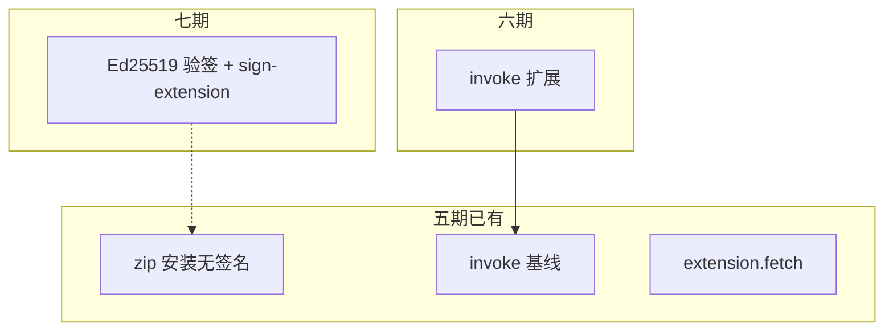
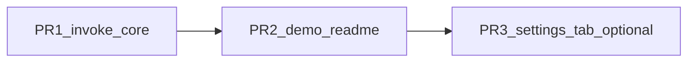

# Electron 插件机制 · 六期实施计划

## 背景与基线

五期已完成（见 [插件机制五期](.cursor/plans/插件机制五期_da6598e7.plan.md)）：

- `extension.fetch` + `network.allowlist` + SSRF 防护
- zip 安装（[`extension-installer.ts`](apps/web/electron/features/extension/extension-installer.ts)，**无验签**，继续有效）
- headless 宿主事件 POST
- `backend.health` invoke
- `ext:host:*` 敏感 API：`assertTrustedHostCaller`（禁止插件窗，允许 main/settings 等宿主窗）

[五期计划](.cursor/plans/插件机制五期_da6598e7.plan.md) 原「六期：zip 签名与供应链」**整体移至七期**；**六期不做签名供应链**。

---

## 六期范围总览（含场景）

| 能力块 | 典型场景（为什么需要） | 用户/系统可见结果 |
|--------|------------------------|-------------------|
| **A. invoke：打开设置** | 插件内「去启用/安装扩展」按钮，需跳到宿主设置页 | `invoke('window.openSettings')` → 打开 [`settings`](apps/web/electron/features/settings/window-settings.ts) 窗口 |
| **B. invoke：桌宠** | 插件任务完成后用桌宠做轻量提醒（不抢主窗焦点时可只显桌宠） | `pet.show` / `pet.hide` 控制 [`showPetWindow`](apps/web/electron/features/pet/pet-window.ts) / `hidePetWindow` |
| **C. invoke：招聘窗** | 插件引导用户「招聘数字员工」进入现有招聘流程 | `recruitment.open` → 现有招聘窗 IPC |

**本期不做（六期）**：

- **Ed25519 签名校验**、`trusted-publishers`、`sign-extension.mjs`、安装/扫描验签策略（**七期**）
- `fetch` 二进制/multipart、插件市场 CDN、扩展包 OTA、在线吊销列表
- `settings.get/set` 读写主应用 [`settings-store`](apps/web/electron/features/settings/settings-store.ts)（含 `apiKey` 等敏感键）
- `extension.fetch` 与 [`request.ts`](apps/web/src/lib/request.ts) KV 统一

---

## A. invoke：打开设置窗

### 场景说明

1. **引导配置**：插件检测到未启用自身，提示用户点击「打开设置」完成启用（无需用户记路径）。
2. **与 zip 安装配合**：五期已在设置页提供「从 zip 安装」；插件完成引导后 `openSettings`，用户在同一窗口完成安装（仍**无验签**，直至七期）。

### 设计要点

| 项 | 内容 |
|----|------|
| 方法 | `window.openSettings` |
| Permission | `host.window.settings` |
| 实现 | 调用 [`createSettingsWindow()`](apps/web/electron/features/settings/window-settings.ts)（与主应用 `electronApi.openSettings` 一致） |
| 可选 payload | `{ tab?: "extensions" }`：若实现成本低，[`settings-page.tsx`](apps/web/src/components/settings/settings-page.tsx) 支持初始 tab；否则六期仅打开设置窗默认 tab |

### 验收

- 声明 `host.window.settings` 后调用成功，设置窗置前
- 未声明 permission → 明确 reject

---

## B. invoke：桌宠

### 场景说明

1. **任务完成反馈**：插件跑完一轮同步，调用 `pet.show` 吸引注意，用户点击桌宠再回到主应用。
2. **收起干扰**：`pet.hide` 在插件进入「勿扰」模式时隐藏桌宠。

### 设计要点

| 项 | 内容 |
|----|------|
| 方法 | `pet.show`、`pet.hide` |
| Permission | `host.pet`（两个方法共用） |
| 实现 | **`pet.show` → `showPetWindow()`**；**`pet.hide` → `hidePetWindow()`** |
| 文档 | 必须与 preload [`petBridge.showMainWindow`](apps/web/electron/features/pet/preload-bridge.ts)（实际 `petShow`、聚焦**主窗**）区分；已有 `window.focusMain` 用于聚焦主窗 |

### 验收

- `pet.show` 后桌宠窗可见（在 `petEnabled` 等宿主设置允许前提下）
- `pet.hide` 后桌宠隐藏
- 未声明 `host.pet` → reject

---

## C. invoke：招聘窗

### 场景说明

1. **一体化入口**：集成类插件在配置完成后，一键 `recruitment.open` 进入宿主招聘流程，避免插件内嵌完整招聘 UI。
2. **与主应用一致**：行为对齐主应用 [`recruitmentBridge.openRecruitment`](apps/web/electron/features/recruitment/preload-bridge.ts)。

### 设计要点

| 项 | 内容 |
|----|------|
| 方法 | `recruitment.open` |
| Permission | `host.recruitment` |
| 实现 | 复用 recruitment feature 的 `openRecruitment` / 开窗逻辑（见 [`recruitment/ipc.ts`](apps/web/electron/features/recruitment/ipc.ts)） |

### 验收

- 声明 `host.recruitment` 后招聘窗打开
- 未声明 → reject

---

## 共用实现约定

- 路由：[`extension-invoke-router.ts`](apps/web/electron/features/extension/extension-invoke-router.ts)
- 权限：[`extension-permissions.ts`](apps/web/electron/features/extension/extension-permissions.ts) → 自动进入 `listInvokeMethods()`
- Manifest：[`manifest-schema.ts`](apps/web/electron/features/extension/manifest-schema.ts) `permissions` 枚举新增三项（`host.window.settings`、`host.pet`、`host.recruitment`）
- 类型：[`extension-ipc-channels.ts`](apps/web/electron/shared/extension-ipc-channels.ts) 更新 `ExtensionInvokeMethod` 与 JSDoc
- 示例：[`examples/extension-demo-invoke`](examples/extension-demo-invoke) 增加演示按钮
- 文档：[`electron/README.md`](apps/web/electron/README.md) 六期 invoke 方法表

**安全**：不通过 invoke 暴露全局 `SettingsData` 任意键；桌宠/招聘仅暴露计划内窄接口。

---

## 实施顺序与 PR 拆分

| PR | 内容 | 风险 |
|----|------|------|
| PR1 | permissions + invoke router + ipc 类型 | 低 |
| PR2 | demo-invoke + electron/README 六期章节 | 低 |
| PR3（可选） | `openSettings({ tab: "extensions" })` + settings-page 初始 tab | 低 |

六期体量较小，可单 PR 合并 PR1+PR2。

---

## 整体验收标准

1. **invoke**：`window.openSettings`、`pet.show`、`pet.hide`、`recruitment.open` 在声明对应 permission 时可用
2. **listInvokeMethods**：新方法出现且 `allowed` 与 manifest 一致
3. **回归**：四期 invoke/事件、五期 fetch/zip/headless/health、一至三期示例行为不变
4. **zip 安装**：仍为五期无验签行为（**不因六期改变**）
5. [`apps/web`](apps/web/package.json) `pnpm typecheck` 通过

---

## 七期：签名供应链（自五期/原六期移入）

### 场景说明

| 场景 | 说明 |
|------|------|
| **防篡改安装** | zip 被替换时安装前 Ed25519 验签，失败不写 `extensions/` |
| **多发布方** | manifest `publisher` + [`trusted-publishers.json`](apps/web/electron/features/extension/trusted-publishers.json) |
| **企业分发** | [`scripts/sign-extension.mjs`](scripts/sign-extension.mjs)；manifest + 文件树 payload 哈希签名 |
| **扫描加固** | 生产打包环境下无有效 `.sig` 的目录不进入 discovered |

### 设计要点（七期实施，六期仅规划）

- `digital-employee.extension.sig` + `extension-signature.ts`
- 在 [`extension-installer.ts`](apps/web/electron/features/extension/extension-installer.ts) 插入验签
- `EXTENSION_SKIP_SIGNATURE=1` / dev 跳过策略
- 验收：合法签名 zip 可装；篡改/无签名（生产）拒绝

（详细步骤可参考原六期计划 A–C 章节，实施时在七期计划文档中展开。）

---

## 七期其他备忘

| 项 | 场景简述 |
|----|----------|
| fetch 二进制 / multipart | 插件上传附件、下载 PDF |
| 插件市场 / OTA | 从 CDN 拉 zip + 验签 + 版本升级 |
| 在线吊销列表 | 撤销 compromised publisher |
| `settings.get/set` | 仅白名单键，避免泄露 `apiKey` |
| `extension.fetch` + KV | 与主应用远端 API 统一走 server 转发 |
