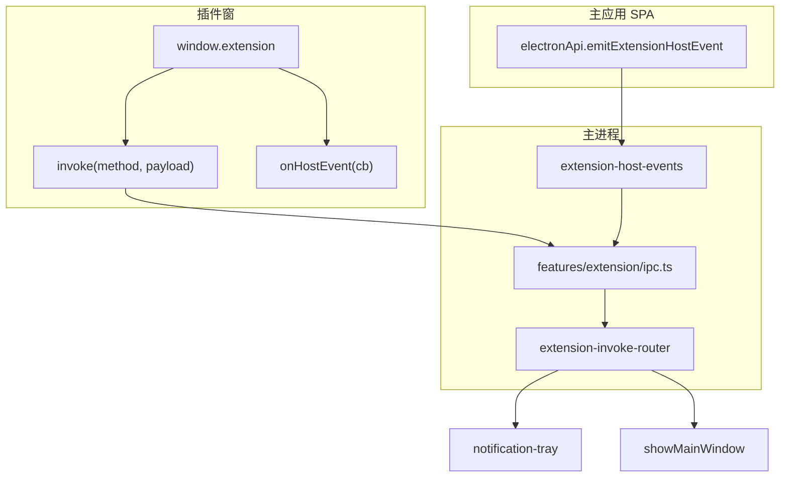
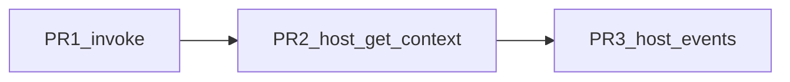

# Electron 插件机制 · 四期实施计划

## 范围（已确认）

| 包含 | 不包含（五期+） |
|------|----------------|
| **extension.invoke**：插件窗调用宿主能力（白名单方法 + manifest `permissions`） | HTTP 代理 IPC、`network.allowlist` |
| **ext:host:get-context**：headless / 宿主侧按 id 读取插件上下文 | 插件 zip 签名、企业分发、扩展自动更新 |
| **宿主事件总线**：主应用/主进程事件推送给已启用且已开窗的插件 | headless 收事件（HTTP/轮询，五期） |

三期基线：[`manifest-schema.ts`](apps/web/electron/features/extension/manifest-schema.ts)（`ui`/`service` 组合）、[`ExtensionServiceHost`](apps/web/electron/features/extension/extension-service-host.ts)、[`extension-ipc-channels.ts`](apps/web/electron/shared/extension-ipc-channels.ts)。`ext:plugin:invoke` 已在 [`extension-preload.ts`](apps/web/electron/preload/extension-preload.ts) 暴露，[`ipc.ts`](apps/web/electron/features/extension/ipc.ts) 仍抛错未实现。

---

## 目标架构

---

## 一、extension.invoke（宿主能力路由）

### 设计原则

- 方法名稳定字符串：`"<domain>.<action>"`（如 `notification.show`、`window.focusMain`）
- manifest `permissions` 显式声明；未声明则 reject
- 主进程集中注册：新建 [`extension-invoke-router.ts`](apps/web/electron/features/extension/extension-invoke-router.ts)
- 各 handler 用 zod 校验 payload

### Manifest 扩展 permissions（MVP）

| permission | 方法 |
|------------|------|
| `context.read` | 已有（getContext 基础字段） |
| `auth.read` | 已有（`authToken`） |
| `host.notification` | `notification.show` |
| `host.window.main` | `window.focusMain` |
| `host.storage` | `storage.get` / `storage.set` |
| `host.backend.read` | `backend.getPort`（只读端口） |
| `host.events` | 允许 `onHostEvent` 订阅（见第三节） |

### MVP 方法实现依赖

| method | 实现 |
|--------|------|
| `notification.show` | [`sendNotification`](apps/web/electron/features/notification-tray/notification.ts) + 主窗 |
| `window.focusMain` | [`showMainWindow`](apps/web/electron/features/notification-tray/tray.ts) |
| `storage.get` / `storage.set` | 新建 `extension-plugin-store.ts`（`electron-store`，按 `pluginId` 分 key） |
| `backend.getPort` | [`getBackendPort`](apps/web/electron/features/backend/backend-process.ts) |

### 改动文件

- [`manifest-schema.ts`](apps/web/electron/features/extension/manifest-schema.ts)：扩展 `permissions` 枚举
- [`ipc.ts`](apps/web/electron/features/extension/ipc.ts)：`ext:plugin:invoke` → router（`resolveExtensionIdFromEvent` + permission 校验）
- [`extension-ipc-channels.ts`](apps/web/electron/shared/extension-ipc-channels.ts)：补充 invoke 方法 JSDoc / 类型说明
- 示例：[`examples/extension-demo-invoke/`](examples/extension-demo-invoke/)
- [`electron/README.md`](apps/web/electron/README.md) 四期章节：方法表与 permission 对照

---

## 二、ext:host:get-context（headless 可用）

### 问题

headless 无 BrowserWindow，无法使用 `ext:plugin:get-context`（依赖 `event.sender` 映射）。

### 方案

| 项 | 内容 |
|----|------|
| Channel | `ExtensionHostIpcChannels.getContext = "ext:host:get-context"`，args: `[extensionId]` |
| Handler | `buildExtensionContext(manifest, { serviceBaseUrl })`；不要求插件窗存在 |
| Preload | [`preload-bridge.ts`](apps/web/electron/features/extension/preload-bridge.ts) 增加 `getExtensionContext(extensionId)` |
| 类型 | 更新 `ExtensionHostInvokeMap` |

四期文档约定：主要由设置页/可信宿主调用；严格 caller 校验可五期再加。

---

## 三、宿主事件总线

### 推送模型

- 主进程 `emitHostEvent(type, payload)` → 向**已启用且插件窗已打开**的 extension `webContents.send("ext:host:event", envelope)`
- 插件 preload：`extension.onHostEvent(handler)`，返回 unsubscribe
- Envelope：`{ type: string, payload?: unknown, timestamp: number }`

### 权限

- manifest 声明 `host.events`
- [`extension-context.ts`](apps/web/electron/features/extension/extension-context.ts) 的 `ExtensionContextPayload` 增加 `permissions: string[]`，preload 无 `host.events` 不注册 listener

### 宿主触发（MVP）

- 新建 [`extension-host-events.ts`](apps/web/electron/features/extension/extension-host-events.ts)：`emitHostEvent`、`broadcastToOpenExtensionWindows`
- 宿主 channel：`ext:host:emit-event`（args: `type, payload`）或合并进现有 host bridge
- [`electron-api.ts`](apps/web/electron/preload/electron-api.ts) + bridge：`emitExtensionHostEvent(type, payload)`
- 设置页：开发/调试区「发送测试事件」按钮
- headless 四期不推送（主进程 log 即可），五期再定 service 侧消费

### Preload 注意

`contextBridge` 下 `onHostEvent` 用 `ipcRenderer.on` 包装，回调参数需可结构化克隆；提供 `off` 或返回 cleanup 函数。

---

## 四、实施顺序与 PR 拆分

| PR | 内容 | 风险 |
|----|------|------|
| PR1 | invoke router + permissions + plugin store + demo-invoke + README | 低 |
| PR2 | ext:host:get-context + preload + headless 文档 | 低 |
| PR3 | extension-host-events + onHostEvent + electronApi emit + 设置页测试 | 中 |

---

## 五、验收标准

1. 声明 `host.notification` 后 `invoke('notification.show', …)` 成功；未声明则明确 reject
2. `invoke('window.focusMain')` 聚焦主窗口
3. headless 启用且服务已起：宿主 `getExtensionContext(id)` 返回含 `serviceBaseUrl`
4. 打开带 UI 且含 `host.events` 的插件：设置页发测试事件 → `onHostEvent` 收到
5. 未启用或无 `host.events` 的插件不收事件
6. 一至三期行为不变；`apps/web` 下 `pnpm typecheck` 通过

---

## 六、五期备忘

- `ext:plugin:fetch` + manifest `network.allowlist`（SSRF 防护）
- 扩展目录 zip 安装、`ed25519` 签名校验
- headless 消费宿主事件
- invoke 扩展：设置、宠物、后端 health 等
