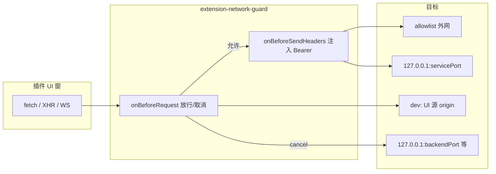

# 插件网络：移除 extension.fetch，改用 webRequest

## 目标行为



| 请求来源 | 策略 |
|----------|------|
| 非插件 `webContents`（主窗、登录、设置） | **不注册过滤**（在 handler 内 `getExtensionIdForWebContents` 为空即 `callback({})` 放行） |
| 插件窗 + **无** `host.network` | 禁止一切 `http/https/ws/wss`，**例外**：本插件 `getServiceBaseUrl()` 的 origin；dev 下 UI `devEntry`/store/env 的 origin（与 [`isAllowedDevUrl`](apps/web/electron/features/extension/extension-paths.ts) 一致） |
| 插件窗 + **`host.network`** | 允许 `manifest.network.allowlist` 主机；**永远拒绝** `127.0.0.1`/`localhost` 上 [`getBackendPort()`](apps/web/electron/features/backend/backend-process.ts)（默认 `34567`，`VITE_BACKEND_PORT`） |
| 插件窗 + **`auth.read`** | 对**已通过放行**的请求，在 [`onBeforeSendHeaders`](https://www.electronjs.org/docs/latest/api/session#seswebrequestonbeforesendheadersfilter-listener) 中若尚无 `Authorization` 则注入 `Bearer ${token}`（逻辑与现 [`extension-fetch-proxy.ts`](apps/web/electron/features/extension/extension-fetch-proxy.ts) 109-117 行一致） |
| **`service` 子进程** | 不经过 `webRequest`，保持现状（全放行） |
| **`getContext().authToken`** | 按你的选择 **保留**（与自动注入并存） |

插件窗 **仅** 在 [`extension-window.ts`](apps/web/electron/features/extension/extension-window.ts) 的 `overrides.webPreferences` 增加 `webSecurity: false`，实现「取消跨域限制」；主应用窗口不变。

---

## 实现步骤

### 1. 抽取网络策略 + 新建 guard

新建 [`apps/web/electron/features/extension/extension-network-policy.ts`](apps/web/electron/features/extension/extension-network-policy.ts)：

- 从 [`extension-fetch-proxy.ts`](apps/web/electron/features/extension/extension-fetch-proxy.ts) 迁出并导出：
  - `hostnameMatchesAllowlist`
  - `isPrivateOrLocalHost`
  - `evaluateExtensionRequest(extensionId, urlString): { allow: boolean; reason?: string }`
- `evaluateExtensionRequest` 合并规则：
  1. 解析 URL，`protocol` 非 `http/https/ws/wss` → 放行（`file://` 等不走 HTTP 过滤器）
  2. **主后端 SSRF**：`hostname` 为 `localhost`/`127.0.0.1`/`::1` 且 `port === getBackendPort()` → **拒绝**（dev/prod 均拒绝，不再沿用 fetch 代理里「dev 允许 localhost」的宽松逻辑）
  3. **本插件 service**：`getServiceBaseUrl(extensionId)` 存在且 URL 的 `origin` 与其完全一致 → **允许**（不要求 `host.network`）
  4. **dev UI 源**：`!app.isPackaged` 且 URL `origin` 等于该插件当前 dev UI URL（复用 registry 中 `resolveExtensionUiTarget` 的 dev 解析，或抽 `getExtensionDevOrigin(extensionId)`）→ **允许**
  5. **外网 allowlist**：需 `host.network` + `network.allowlist` 非空 + 主机名匹配 → **允许**
  6. 其余私网/本地（含未声明的 `127.0.0.1` 其它端口）→ **拒绝**

新建 [`apps/web/electron/features/extension/extension-network-guard.ts`](apps/web/electron/features/extension/extension-network-guard.ts)：

- `registerExtensionNetworkGuard()`：在 [`initExtensions()`](apps/web/electron/features/extension/extension-loader.ts) 末尾调用一次
- `session.defaultSession.webRequest.onBeforeRequest`（`urls: ['http://*/*','https://*/*','ws://*/*','wss://*/*']`）：
  - `getExtensionIdForWebContents(details.webContentsId)` 无值 → 放行
  - 有值 → `evaluateExtensionRequest`；拒绝则 `callback({ cancel: true })` 并 `log.warn`
- `onBeforeSendHeaders`（同 URL filter）：
  - 仅插件窗 + manifest 含 `auth.read` + 请求已通过策略（再次调用 `evaluateExtensionRequest` 或缓存本次 URL 结果）+ 无现有 `Authorization` → 合并 `Authorization: Bearer ...`

### 2. 插件窗 webSecurity

[`extension-window.ts`](apps/web/electron/features/extension/extension-window.ts) `overrides` 增加：

```ts
webPreferences: {
  webSecurity: false,
}
```

（与 `preloadPath` 等合并进 `createWindow` 的 `overrides.webPreferences`。）

### 3. 移除 extension.fetch

| 文件 | 变更 |
|------|------|
| [`extension-fetch-proxy.ts`](apps/web/electron/features/extension/extension-fetch-proxy.ts) | **删除**（逻辑已迁入 policy） |
| [`ipc.ts`](apps/web/electron/features/extension/ipc.ts) | 移除 `fetch` handler 与 `proxyExtensionFetch` import |
| [`extension-ipc-channels.ts`](apps/web/electron/shared/extension-ipc-channels.ts) | 移除 `fetch` channel、`ExtensionFetchInit/Response`、映射表项 |
| [`extension-preload.ts`](apps/web/electron/preload/extension-preload.ts) | 移除 `fetch` 方法与相关 type import |
| [`extension-renderer.d.ts`](apps/web/electron/extension-renderer.d.ts) | 随 `ExtensionApi` 自动更新 |

### 4. 示例与文档

- [`examples/extension-demo-fetch/`](examples/extension-demo-fetch/)：`index.html` 改为原生 `fetch()`；README/标题改为「webRequest + allowlist」；manifest 可增加 `auth.read` 演示自动带头（可选第二条按钮说明无需手写 Authorization）。
- [`apps/web/electron/README.md`](apps/web/electron/README.md)：删除 `extension.fetch` 表格行；新增「插件 UI 出网」：`host.network` + `network.allowlist` + 原生 `fetch`；`auth.read` 自动带头；禁止访问主后端端口；service 子进程不受限。
- `.cursor/plans/插件机制五期_*.plan.md`：不修改历史计划文件（仅 README 为对外契约）。

### 5. 验证

- `pnpm typecheck --filter=web`
- 手工：
  - demo-fetch：合法域名成功；`evil.com` 被 cancel（Network failed / ERR_BLOCKED）
  - 插件窗请求 `http://127.0.0.1:${getBackendPort()}/health` 失败；`invoke('backend.health')` 仍可用（主进程 IPC，非渲染层 HTTP）
  - demo-service：UI `fetch(serviceBaseUrl + '/...')` 成功
  - dev：带 `devEntry` 的插件 UI 与 HMR 不被误杀
  - 主应用窗口访问 `localhost:3399`/后端不受影响

---

## 安全说明（写入 README）

- **硬边界**：仅插件 UI 的 Chromium 出站；`service` 仍可任意出网（与现架构一致）。
- **`backend.getPort` invoke**：仍返回端口，但渲染层 HTTP 到该端口被拦；避免插件误用原生 `fetch` 打主后端。
- **`authToken` 仍进 context**：插件仍可自行读 token；自动注入仅为便利。若以后要「token 不可见」，需另开破坏性变更移除 `authToken`。

---

## 不在本期范围

- service 子进程出站代理 / allowlist
- 响应体 5MB 限制（随 `extension.fetch` 移除，由浏览器原生处理）
- 七期 Ed25519 签名
