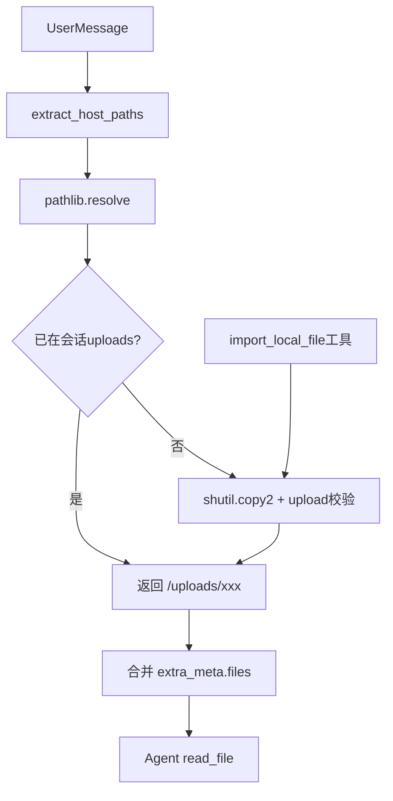

# 本机文件导入 `/uploads/` 实施计划

## 背景与目标

当前 deepagents 的 `read_file` 经 `validate_path` 拒绝 `C:\...`；Unix 绝对路径（如 `/Users/...`）虽可能通过校验，但会在 `virtual_mode=True` 下被错误解析到 `artifacts/` 子目录。用户已确认采用 **「先复制到 `/uploads/` 再 `read_file`」** 策略，并需 **Windows + macOS + Linux** 三端一致。

**目标：**

- 用户消息或 Agent 显式给出的本机绝对路径 → 复制到 `{artifacts_path}/{conversation_id}/uploads/`
- 返回虚拟路径 `/uploads/文件名`，注入 `extra_meta.files` 或工具返回值
- Agent 后续只用 `read_file("/uploads/...")`，不再对磁盘路径调 `read_file`



---

## 核心模块（新建）

### 1. [`apps/server/src/service/local_file_import.py`](apps/server/src/service/local_file_import.py)

跨平台路径识别与安全校验，**不依赖 `sys.platform` 分支**（统一 `pathlib`）。

**常量：**

```python
VIRTUAL_PREFIXES = (
    "/artifacts/", "/uploads/", "/skills/", "/skills-draft/",
    "/memories/", "/agent/", "/conversation_history/",
)
MAX_IMPORTS_PER_MESSAGE = 5  # 防滥用
```

**函数职责：**

| 函数 | 说明 |
|------|------|
| `is_virtual_path(path: str) -> bool` | 已是虚拟路径则跳过 |
| `normalize_host_path(raw: str) -> Path` | `strip` 引号 → `expanduser/expandvars` → `resolve()` |
| `is_host_absolute_path(path: str) -> bool` | `Path.is_absolute()` 且非虚拟前缀 |
| `extract_host_paths_from_text(text: str) -> list[str]` | 从用户消息提取候选路径（去重保序） |
| `try_map_to_existing_virtual(root, conv_id, resolved) -> str \| None` | 若文件已在当前会话 `uploads/` 或 `artifacts/`，直接返回对应虚拟路径，免复制 |
| `is_safe_to_import(resolved: Path) -> bool` | 必须是普通文件；`resolve()` 后存在；拒绝目录/块设备等 |

**路径提取策略（三端通用）：**

1. 引号内片段：`"..."` / `'...'` 中含 `/` 或 `:\`
2. 按空白分割 token，对每个 token 尝试 `normalize_host_path` + `is_file()`
3. 补充 regex（去重）：`[A-Za-z]:[\\/][^\s"']+`（Windows）、`/(?:Users|home|tmp|var|opt|mnt)[^\s"']+`（Unix，**排除**已匹配虚拟前缀的 token）

**`import_paths_from_message(root_path, conversation_id, text) -> list[dict]`**

- 遍历提取结果，调用 `ResourceService.import_local_file`
- 返回 `[{"path": "/uploads/foo.md", "name": "foo.md", "source": "/Users/..."}]`
- 单条失败记日志、不阻断其余；超限截断并 log warning

---

### 2. 扩展 [`apps/server/src/service/resource_service.py`](apps/server/src/service/resource_service.py)

新增 `import_local_file(root_path, conversation_id, source: Path) -> ResourceUploadResult | str`：

```python
# 伪代码
def import_local_file(...):
    if not source.is_file():
        return "文件不存在或不是普通文件"
    existing = try_map_to_existing_virtual(...)  # 来自 local_file_import
    if existing:
        return ResourceUploadResult(name=..., path=existing, size=...)
    file_bytes = source.read_bytes()
    return ResourceService.upload_file(
        root_path, conversation_id, source.name, file_bytes
    )
```

**复用现有约束**（无需重复实现）：

- [`upload_file`](apps/server/src/service/resource_service.py) 的大小限制 `MAX_UPLOAD_FILE_SIZE`（200MB）
- `ALLOWED_UPLOAD_EXTENSIONS`、图片多模态上限
- 重名 `_1`、`_2` 命名逻辑

---

### 3. Agent 工具 [`apps/server/src/service/agent/import_local_file_tool.py`](apps/server/src/service/agent/import_local_file_tool.py)

仿照 [`shell_execute_tool.py`](apps/server/src/service/agent/shell_execute_tool.py) 模式：

```python
def create_import_local_file_tool(
    *, root_path: str, conversation_id: int | None
) -> BaseTool:
    ...
```

- **工具名：** `import_local_file`
- **参数：** `local_path: str`（本机绝对路径，支持 `~`）
- **返回：** 成功时 `已导入：/uploads/xxx.md（源：/Users/...）`；失败时明确错误文案
- `conversation_id is None` 时返回「当前无会话，无法导入」

---

## 集成点（修改）

### 4. [`apps/server/src/service/chat_service.py`](apps/server/src/service/chat_service.py)

在 `stream_conversation_answer` 中，**写入 user 消息之后、注入 `[上传的文件]` 之前**（约 L497–505）：

```python
# 自动导入用户消息中的本机路径
imported = import_paths_from_message(
    settings.artifacts_path, conversation_id, question
)
if imported:
    files = list(extra_meta.get("files") or []) if extra_meta else []
    existing_paths = {f["path"] for f in files}
    for item in imported:
        if item["path"] not in existing_paths:
            files.append({"path": item["path"], "name": item["name"]})
    extra_meta = {**(extra_meta or {}), "files": files}
```

现有注入逻辑不变：

```500:505:apps/server/src/service/chat_service.py
        if extra_meta and extra_meta.get("files"):
            file_lines = [f"- {f.get('name', f['path'])} (路径: {f['path']})" for f in extra_meta["files"]]
            file_context = "[上传的文件]:\n" + "\n".join(file_lines)
            question = file_context + "\n\n" + question
```

**说明：** 仅改 Agent 运行时 `question` 注入，DB 中 user 消息 `content` 保持用户原文（与现有附件行为一致）。

**不改动：** `resume_conversation_stream`、HITL approve 路径（无新用户路径输入）。

---

### 5. [`apps/server/src/service/agent/employee.py`](apps/server/src/service/agent/employee.py)

- `conversation_id` 存在时注册 `create_import_local_file_tool(root_path=root_path, conversation_id=conversation_id)`
- 加入 `extra_tools`（与 `shell_execute` 同级）

编排子任务路径 [`orchestrator/execution.py`](apps/server/src/service/agent/orchestrator/execution.py) 已调用 `get_agent(..., conversation_id=...)`，**无需额外改动**。

---

### 6. [`apps/server/src/service/agent/orchestrator/agent.py`](apps/server/src/service/agent/orchestrator/agent.py)

- `conversation_id` 存在时，将 `import_local_file` 加入 `tools=[...]`（在 `shell_execute` 之后）
- 使用 `settings.artifacts_path` 作为 `root_path`（与 uploads 路由一致）

---

### 7. Prompt 更新 [`apps/server/src/service/agent/prompts.py`](apps/server/src/service/agent/prompts.py)

在 `build_filesystem_prompt_section` 的「文件工具」小节追加（跨平台表述，不写死 `C:\`）：

- **禁止**对磁盘绝对路径（`C:\...`、`/Users/...`、`/home/...`）调用 `read_file` / `write_file`
- 读取用户本机文件：**优先**使用上下文 `[上传的文件]` 中的 `/uploads/` 路径；若无则调用 `import_local_file`，再 `read_file("/uploads/...")`
- 仅 `import_local_file` 失败时，才用 `shell_execute`（Windows: `type`；macOS/Linux: `cat`）

可选：在 [`apps/server/src/service/agent/AGENTS.md`](apps/server/src/service/agent/AGENTS.md) 加一句引用，保持与 system prompt 一致。

---

### 8. Harness 工具描述（可选）[`apps/server/src/service/agent/checkpointer.py`](apps/server/src/service/agent/checkpointer.py)

在 `tool_description_overrides` 中为 `import_local_file` 增加简短中文描述，帮助模型在 tool list 中优先选择。

---

## 测试

新建 [`apps/server/tests/test_local_file_import.py`](apps/server/tests/test_local_file_import.py)（`tmp_path` fixture，跨平台）：

| 用例 | 验证点 |
|------|--------|
| `extract` Windows 路径 | `C:\Users\a\file.md`、带引号路径 |
| `extract` Unix 路径 | `/Users/x/a.md`、`/home/x/a.md` |
| 排除虚拟路径 | `/uploads/x.md`、`/artifacts/x.md` 不提取 |
| `import_local_file` 成功 | 复制后虚拟路径、文件内容一致 |
| 重名处理 | 第二次导入同名 → `_1` 后缀 |
| 已在 uploads 短路 | 指向 `{conv}/uploads/foo.md` → 返回 `/uploads/foo.md` 不重复复制 |
| 非法路径 | 目录、不存在文件 → 错误字符串 |
| `import_paths_from_message` 上限 | 超过 5 个只处理前 5 个 |

不新增前端改动：自动导入对 UI 透明；导入后的文件会出现在现有 uploads 资源列表中。

---

## 安全边界

- **只处理用户消息文本中显式出现的路径**（自动扫描）或 Agent 调用工具时传入的路径；不做目录遍历
- 沿用 `upload_file` 扩展名与大小限制
- `resolve()` + `is_file()` 防软链目录逃逸（不跟随目录软链导入）
- 不尝试读取 `/etc`、`C:\Windows\System32` 等敏感路径的 **特殊放行**；依赖 OS 进程权限自然失败并返回错误
- 日志记录 `source` → `virtual_path`，便于排查

---

## 验收清单

1. Windows：用户发送 `请读 C:\Users\...\Desktop\test.md` → Agent 首轮 `read_file("/uploads/test.md")` 成功，无 `Windows absolute paths` 报错
2. macOS/Linux：用户发送 `/Users/.../file.md` 或 `/home/.../file.md` → 同样导入并成功读取
3. 聊天附件上传 + 文本路径并存 → `extra_meta.files` 合并无重复
4. Agent 中途发现新路径 → `import_local_file` → `read_file` 成功
5. PDF/Word 导入后 → `BasicFileFilesystemBackend` 正常提取文本
6. `pnpm --filter web` 不涉及；后端 `cd apps/server && uv run pytest tests/test_local_file_import.py` 通过

---

## 不在本次范围

- 修改 deepagents `validate_path` 或全局去掉虚拟路径
- 前端拖拽本地路径（非上传）到输入框
- 导入整个目录、批量 glob
- 总管无 `conversation_id` 场景（工具返回明确错误即可）
