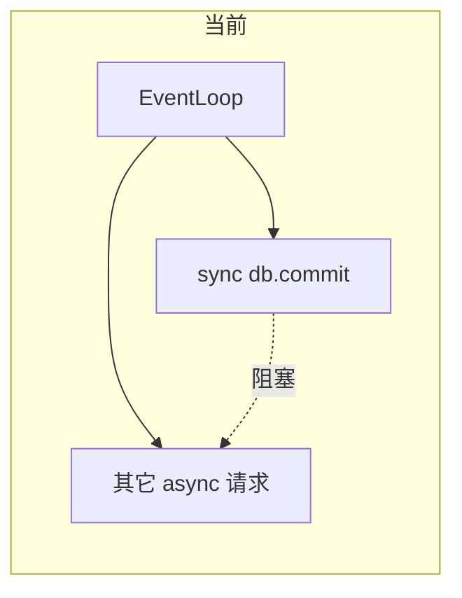
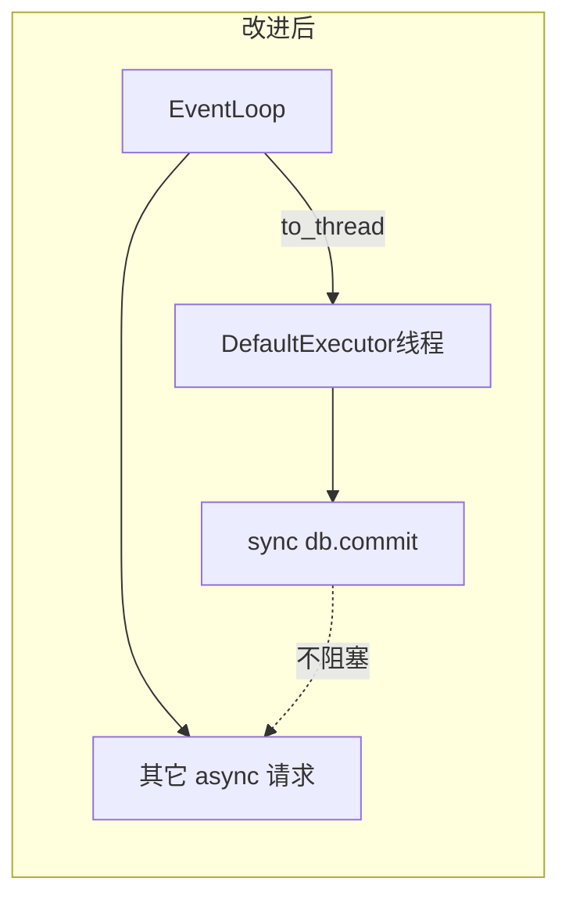

# 流式取消后 API 挂起：非阻塞改进方案

## 问题根因（简要）

[`StreamRegistry._run_agent_background`](apps/server/src/service/stream_registry.py) 是 `async def`，但其中：

- `_flush_to_db` / `_flush_terminal` 内直接 `db.get`、`db.commit`（同步 I/O）
- `_maybe_heartbeat` 在 **agent 消费循环里同步调用** `_flush_heartbeat(db, ...)`（见约 280–289、356 行），每次触发都会在事件循环线程上 `commit`
- 心跳协程里同样 **同步** `_flush_heartbeat(hb_db, ...)`（约 237–244 行）
- checkpoint 分支里在主循环 **同步** 调用 `extract_message_parts_from_buffer`（约 342–354 行）

取消后 `await self._flush_terminal(...)` 等路径会长时间占用事件循环；SQLite `busy_timeout` 可达约 30s，表现为「cancel 后其它接口等很久」。

## 改进策略

把「会话 + 提交 + 关闭」封装为 **纯同步** 函数，在协程里用 **`await asyncio.to_thread(...)`** 调用（与现有 `_finalize_task_stream` 的 `run_in_executor` 思路一致；Python 3.9+ 推荐 `to_thread` 语义更清晰）。

**线程安全**：不在线程间传递同一个 `Session`。每个 flush/heartbeat 在同步函数内部 `get_session_local()()`，用完 `close()`（与 [`_finalize_task_stream`](apps/server/src/service/stream_registry.py) 相同模式）。

## 具体改动（文件级）

### 1. [`apps/server/src/service/stream_registry.py`](apps/server/src/service/stream_registry.py)

**新增模块级同步函数**（命名可微调），把现有逻辑搬入并保持重试语义：

- **`_flush_to_db_sync(...)`**  
  - 参数：`stream_msg_id`, `buffer_cursor: int`, `state`, `content`, `error_message`, `message_parts`（均为值类型或 `None`，不再传 `StreamEventBuffer` / `Session`）。  
  - 内部：`db = get_session_local()()` → 现有 `get` / 赋值 / `commit` → `finally: db.close()`。  
  - 将原 `OperationalError` 重试里的 `await asyncio.sleep` 改为 **`time.sleep`**（重试逻辑完全在 worker 线程内）。

- **`_flush_heartbeat_sync(conversation_id: int) -> None`**  
  - 从当前 [`_flush_heartbeat`](apps/server/src/service/stream_registry.py) 抽出：在函数内新建 session，逻辑与现有一致。

- **`_flush_terminal_sync(stream_msg_id, buffer_events_snapshot: list[dict], state, content, error_message)`**  
  - 在 worker 内：`extract_message_parts_from_buffer(buffer_events_snapshot)` → `json.dumps` → 调用 `_flush_to_db_sync(...)`。  
  - 这样 **parts 抽取与 DB 写** 同在线程，避免主协程上大 buffer 的 CPU 阻塞。

**删除或停用** `_run_agent_background` 顶层的长期 `db = get_session_local()()`，以及 `finally` 里的 `db.close()`（改为各 sync 函数自管 session）。

**协程侧替换调用**：

- 将所有 `await self._flush_to_db(db, ...)` 改为 `await asyncio.to_thread(_flush_to_db_sync, ...)`，传入 `task.buffer.cursor` 而非 `buffer` 对象。  
- `_flush_terminal`：可改为薄包装 `await asyncio.to_thread(_flush_terminal_sync, ...)`，传入 `list(task.buffer._events)` 的快照（与当前 `list(buffer._events)` 一致）。  
- **`_maybe_heartbeat`**：改为 **`async def`**，内部 `await asyncio.to_thread(_flush_heartbeat_sync, conversation_id)`；主循环里改为 **`await _maybe_heartbeat()`**（当前是同步调用，这是重要漏点）。  
- **`_heartbeat_loop`**：把 `_flush_heartbeat(hb_db, ...)` 改为 **`await asyncio.to_thread(_flush_heartbeat_sync, conversation_id)`**，并 **删除** 协程里长期持有的 `hb_db`（避免无用连接）。

**类方法**：原 `async def _flush_to_db` / `_flush_terminal` 可删除或保留为仅组装参数再 `to_thread` 的薄层，避免重复维护两套逻辑。

### 2. 其它文件

- **[`apps/server/src/service/message_parts_extractor.py`](apps/server/src/service/message_parts_extractor.py)**：无需改接口；仅调用位置迁到 `_flush_terminal_sync` 所在线程。  
- **[`apps/server/src/api/chat_api.py`](apps/server/src/api/chat_api.py)** / **[`apps/server/src/server.py`](apps/server/src/server.py)** / **[`apps/server/src/service/agent.py`](apps/server/src/service/agent.py)**：无需为本次问题必改；SQLite 与 `AsyncSqliteSaver` 仍可能竞争写锁，但等待发生在 **线程池** 而非事件循环。

### 3. 验证

- 本地：`pnpm dev:server` 或 `uv run uvicorn ...`，并发：一条流式对话 + 调用 cancel + 同时打轻量 API（如 list conversations），确认其它请求 **不再与 cancel 收尾同量级卡顿**。  
- 运行 [`pnpm typecheck`](CLAUDE.md) 若前端无改动可省略；Python 侧至少保证无语法/导入错误（仓库无统一 Python CI 脚本时可手动 `uv run python -m compileall apps/server/src`）。

## 风险与可选后续

- **默认线程池大小**：大量并发流同时 flush 可能排队；若未来并发很高，可显式 `ThreadPoolExecutor` 或合并写队列。  
- **同一条 message 的写顺序**：当前代码路径基本是顺序 await flush，保留 `await to_thread` 即可维持顺序；若日后并行多写同一行，再加 **每 `conversation_id` 的 `asyncio.Lock`**。  
- **`_agent_it.aclose()`**：仍可能在事件循环上阻塞最多约 5s；若仍成瓶颈，可再评估 `to_thread` 包一层（需确认 aclose 是否线程安全，一般优先保持 await）。
