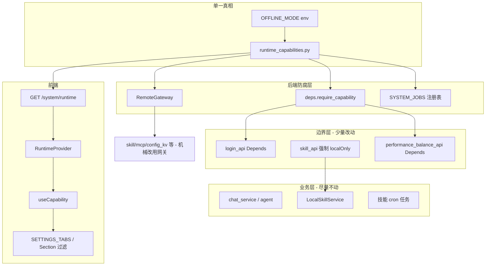

# 离线模式（OFFLINE_MODE）— 可拔插实现计划

## 目标（不变）

`OFFLINE_MODE=1`（或 `true`/`yes`/`on`）时纯本地运行：跳过登录、禁用远程平台集成，保留本地聊天/Agent、本地与内置技能、cron 技能任务、设置页手动 LLM KV。**LLM 推理**仍走本机 KV 配置的供应商 API，与「远程模型配置同步」无关。

| 禁用 | 保留 |
|------|------|
| 登录/注册/改密/部门树/OAuth/飞书 OpenAPI | 本地聊天 + Agent |
| 远程技能/MCP/Agent Interface | 本地/内置技能、本地员工 CRUD |
| 远程绩效、派单 sync、评分回传 | 本地任务调度 |
| 登录后 model registry 远程拉取 | 设置页本地 LLM 配置 |
| Electron 自动更新 | SQLite + config_kv |

---

## 设计原则

1. **业务代码不读 `OFFLINE_MODE`** — 只读 `RuntimeCapabilities` 或由基础设施代读。
2. **远程出口单点** — 出网 httpx 经 `RemoteGateway`；离线时统一 `503` + 日志，不散落 service 内 `if offline`。
3. **API 边界拔插** — 纯远程路由用 `Depends(require_capability(...))`；合并型路由（如技能列表）在 API 层 1 行强制 `localOnly`。
4. **前端声明式** — Tab/Section 元数据挂 `capability`；业务卡片组件零改，由薄包装或子组件自判。
5. **不改** [`apps/server/config-kv.init.json`](apps/server/config-kv.init.json) 种子；在线/离线仅 env 切换。

---

## 架构



---

## 1. 后端基础设施（新建，无业务逻辑）

### 1.1 环境变量与 Settings

[`apps/server/src/core/config.py`](apps/server/src/core/config.py)：

- `is_offline_mode() -> bool`
- `Settings.offline_mode: bool`（`get_settings()` 填充）

### 1.2 能力表（拔插开关）

新建 [`apps/server/src/core/runtime_capabilities.py`](apps/server/src/core/runtime_capabilities.py)：

```python
@dataclass(frozen=True)
class RuntimeCapabilities:
    remote_login: bool           # login/register/dept/password 转发
    remote_model_sync: bool      # ConfigKvService.sync_model_provider_from_remote
    remote_skills: bool          # SkillService / skill 远程路由
    remote_mcp: bool
    remote_performance: bool
    dispatch_order_sync: bool
    oauth: bool
    feishu_platform: bool        # feishu_api + feishu_*_service
    skill_rating_upload: bool
    mcp_task_execution: bool       # 调度器内远程 MCP 调用

def get_capabilities() -> RuntimeCapabilities:
    if is_offline_mode():
        return RuntimeCapabilities(*(False,) * n)
    return RuntimeCapabilities(*(True,) * n)
```

在线默认全 `True`；离线全 `False`。新增远程能力时只改此表 + 路由注册，不搜全局 `if offline`。

### 1.3 远程网关

新建 [`apps/server/src/core/remote_gateway.py`](apps/server/src/core/remote_gateway.py)：

- `OfflineUnavailableError`（携带 capability 名）
- `RemoteGateway.ensure(capability: str)` — 离线抛错
- `sync_get` / `sync_post` / `async_request` 包装 — 内部 `ensure` 后调 httpx

新建 [`apps/server/src/core/deps.py`](apps/server/src/core/deps.py)：

```python
def require_capability(name: str):
    def _dep():
        if not getattr(get_capabilities(), name):
            raise HTTPException(503, detail=f"离线模式不可用: {name}")
    return _dep
```

### 1.4 运行时 API

新建 [`apps/server/src/api/system_api.py`](apps/server/src/api/system_api.py)：

- `GET /system/runtime` → `{ offline_mode, capabilities: { remote_skills: false, ... } }`
- 注册到 [`apps/server/src/api/__init__.py`](apps/server/src/api/__init__.py)

---

## 2. 后端：边界层拔插（改 API/调度，少改 service）

### 2.1 机械迁移到 RemoteGateway（service 内无 offline 分支）

将下列文件的 **httpx 调用**改为走 `RemoteGateway`（逻辑不变，仅换调用点）：

| Service | 文件 |
|---------|------|
| 远程技能 | [`skill_service.py`](apps/server/src/service/skill_service.py) |
| Agent Interface | [`agent_interface_service.py`](apps/server/src/service/agent_interface_service.py) |
| MCP | [`mcp_service.py`](apps/server/src/service/mcp_service.py) |
| 模型同步 | [`config_kv_service.py`](apps/server/src/service/config_kv_service.py) `sync_model_provider_from_remote` |
| 绩效远程 | [`performance_balance_service.py`](apps/server/src/service/performance_balance_service.py) |
| 评分回传 | [`skill_rating_service.py`](apps/server/src/service/skill_rating_service.py) |
| 飞书 | [`feishu_token_service.py`](apps/server/src/service/feishu_token_service.py)、[`feishu_bitable_service.py`](apps/server/src/service/feishu_bitable_service.py) |

> **已移除**：员工 ZIP 远程同步（`GET .../employees/sync`、`employee_zip_sync`）不在本仓库，无需 capability / Depends / 网关迁移。

[`login_api.py`](apps/server/src/api/login_api.py) 的 httpx 留在 API 层，用 `Depends` 即可（不必抽 service）。

### 2.2 API 路由 Depends（不碰 handler 业务体）

| Router | 能力 | 路由示例 |
|--------|------|----------|
| [`login_api.py`](apps/server/src/api/login_api.py) | `remote_login` | `/login`, `/register`, `/update-password`, `/dept-tree` |
| [`login_api.py`](apps/server/src/api/login_api.py) | `remote_model_sync` | 登录成功回调里 `sync_model_provider_from_remote` 前 `RemoteGateway.ensure` |
| [`oauth_api.py`](apps/server/src/api/oauth_api.py) | `oauth` | `/{provider}/authorize`, `callback` |
| [`feishu_api.py`](apps/server/src/api/feishu_api.py) | `feishu_platform` | 全部 |
| [`performance_balance_api.py`](apps/server/src/api/performance_balance_api.py) | `remote_performance` | `/performance/monthly-balance`, `dispatch-orders` |
| [`skill_api.py`](apps/server/src/api/skill_api.py) | `remote_skills` | `GET /skills/{id}`, `/skills/remote/*`, 远程 install POST |
| [`mcp_api.py`](apps/server/src/api/mcp_api.py) | `remote_mcp` | 远程列表/详情路由 |

**技能列表** [`skill_api.py`](apps/server/src/api/skill_api.py) `list_skills`：在现有 `local_only` 分支前加 1 行：

```python
if local_only or not get_capabilities().remote_skills:
    return ResponseBase(data=local_data)
```

复用已有 81–82 行逻辑，**不修改** `SkillService` 合并逻辑。

本地路由（`/skills/local/*`、`performance_record` 纯 DB）**不加** Depends。

### 2.3 系统 Job 注册表

[`task_scheduler_service.py`](apps/server/src/service/task_scheduler_service.py)：

- 抽出 `SYSTEM_JOBS = [(capability, fn, cron, id), ...]`
- `_register_system_jobs` 仅注册 `getattr(caps, name)` 为 True 的 job
- 首期登记：`dispatch_order_sync` → `run_dispatch_order_sync_job`
- [`dispatch_order_sync_service.py`](apps/server/src/service/dispatch_order_sync_service.py) 入口可加 `RemoteGateway.ensure` 作双保险（1 行）

`_execute_mcp_tool_call`：执行前 `ensure("mcp_task_execution")`，失败写 task log（避免静默挂起）。

---

## 3. Electron（共享 env 解析）

新建 [`apps/web/electron/core/runtime-env.ts`](apps/web/electron/core/runtime-env.ts)：

```typescript
export function isOfflineMode(): boolean { ... } // 与 Python 解析规则一致
```

- [`bootstrap.ts`](apps/web/electron/core/bootstrap.ts)：抽 `resolveInitialWindow(): 'main' | 'login'`，离线 → `main`（`isOfflineMode() || hasToken()`）
- [`auto-updater.ts`](apps/web/electron/features/update/auto-updater.ts)：`if (isOfflineMode()) return`
- [`backend-process.ts`](apps/web/electron/features/backend/backend-process.ts) 已通过 `...process.env` 传递，**无需改**

---

## 4. 前端（RuntimeProvider + 声明式 UI）

### 4.1 API 与 Provider

- 新建 [`apps/web/src/api/system.ts`](apps/web/src/api/system.ts)：`fetchRuntimeConfig()`
- 新建 [`apps/web/src/lib/runtime/runtime-types.ts`](apps/web/src/lib/runtime/runtime-types.ts)：与后端 capabilities 对齐的 TS 类型
- 新建 [`apps/web/src/lib/runtime/runtime-provider.tsx`](apps/web/src/lib/runtime/runtime-provider.tsx)：
  - React Query 拉 `/system/runtime`
  - 导出 `useCapability(name)`、`useOfflineMode()`（`offline_mode` 简写）
  - 模块级 `let runtimeCapabilities` 供 [`request.ts`](apps/web/src/lib/request.ts) 同步读取
- 在 [`apps/web/src/routes/__root.tsx`](apps/web/src/routes/__root.tsx) 包裹 `<RuntimeProvider><Outlet /></RuntimeProvider>`

### 4.2 请求层（唯一横切）

[`request.ts`](apps/web/src/lib/request.ts) `onResponseError`：若 `runtimeCapabilities` 表明离线，**跳过** 401/403 → `#/login`。

### 4.3 UI — 改元数据/薄包装，不改业务卡片

| 改动 | 文件 | 方式 |
|------|------|------|
| 设置 Tab | [`settings-types.ts`](apps/web/src/components/settings/settings-types.ts) | `SETTINGS_TABS` 增加可选 `capability?: keyof Capabilities`（如 `account` → `remote_login`） |
| Tab 过滤 | [`settings-sidebar.tsx`](apps/web/src/components/settings/settings-sidebar.tsx) | `filter(tab => !tab.capability \|\| useCapability(tab.capability))` |
| 默认 Tab | [`settings-page.tsx`](apps/web/src/components/settings/settings-page.tsx) | 离线时默认 `general`（`useEffect` 校正非法 tab） |
| 绩效区 | 新建 `workbench-performance-section.tsx` | `if (!useCapability('remote_performance')) return null`；[`workbench-left-panel.tsx`](apps/web/src/components/workbench/workbench-left-panel.tsx) 只换引用 |
| 远程技能 | [`remote-skills-section.tsx`](apps/web/src/components/skills/remote-skills-section.tsx) | 顶部 `if (!useCapability('remote_skills')) return null` — **skills-list-view 不动** |
| 绩效 Query | [`use-performance-queries.ts`](apps/web/src/hooks/use-performance-queries.ts) | `enabled: useCapability('remote_performance')` |
| MCP/技能表单 | 已有空态 | 后端返回 `[]` 即可，**hire-sheet 等不改** |

[`models-settings.tsx`](apps/web/src/components/settings/models-settings.tsx)、聊天/Agent 相关：**零改**。

---

## 5. 文档

更新 [`AGENTS.md`](AGENTS.md)：

```powershell
$env:OFFLINE_MODE="1"; pnpm dev:server
$env:OFFLINE_MODE="1"; pnpm --filter digital-employee dev:app
```

说明离线最小 KV（`LLM_REGISTRY` 或遗留四键）、架构入口文件（`runtime_capabilities.py`、`RemoteGateway`）。

---

## 6. 验证清单（同原 plan）

1. Electron 离线启动 → 无登录窗
2. `GET /system/runtime` → `offline_mode: true` + capabilities 全 false
3. 技能页仅本地；远程 install → 503
4. 工作台无绩效区；`/performance/monthly-balance` → 503
5. 日志无派单 job；无远程 httpx 错误刷屏
6. 模型设置本地保存 + 探活可用
7. 未设 `OFFLINE_MODE` 时行为与现网一致
8. `pnpm typecheck` + `pnpm lint`

---

## 改动量（对比原 plan）

| 类别 | 原 plan | 可拔插 plan |
|------|---------|-------------|
| 新建 | 1 API | + `runtime_capabilities`, `remote_gateway`, `deps`, `runtime-env`, `runtime-provider` |
| 业务 service | ~10 处 `if offline` | **0**；至多 httpx 改调网关（机械） |
| API | 内联判断 | **Depends + 1 行 localOnly** |
| 前端业务组件 | 3–4 文件内联 if | **0**；sidebar/types/section 包装 |
| _scheduler | 1 处 if | **SYSTEM_JOBS 表** |

**拔插含义**：去掉 `OFFLINE_MODE` 即恢复在线能力，无需回滚各 service 内的临时分支。
