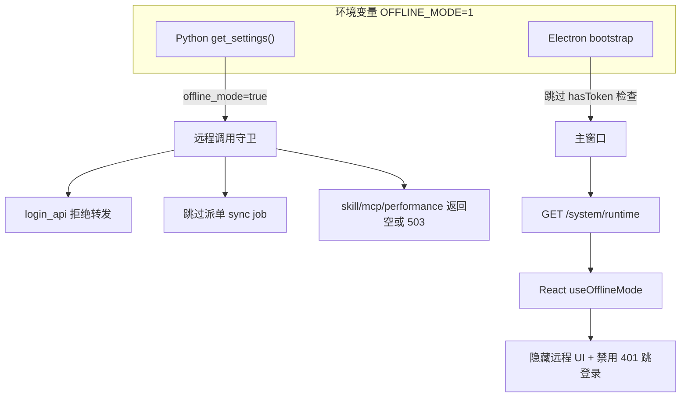

# 离线模式（OFFLINE_MODE）实现计划

## 目标

设置 `OFFLINE_MODE=1`（或 `true`/`yes`/`on`）后，应用以**纯本地**方式运行：

| 禁用 | 保留 |
|------|------|
| 登录/注册/改密/部门树/飞书 OAuth | 本地聊天 + Agent |
| 远程技能市场、远程 MCP 目录 | 本地/内置技能（`localOnly`） |
| 员工 ZIP 远程同步 | 本地员工 CRUD |
| 绩效远程查询、派单定时同步 | 本地任务调度（cron 技能任务） |
| 登录后远程模型 KV 拉取 | 设置页手动配置 `BASE_URL` / `OPENAI_API_KEY` / `DEEPAGENT_MODEL` |
| Electron 自动更新（依赖 REMOTE_API_BASE_URL） | 本地 SQLite + config_kv |

**注意**：LLM **推理**仍走用户在本机 KV 中配置的 API（如 DashScope），这与「远程模型配置同步」是两回事。

---

## 架构



**单一真相源**：后端 [`apps/server/src/core/config.py`](apps/server/src/core/config.py) 读取 `OFFLINE_MODE`；Electron 启动阶段读同一变量（`process.env` 经 `managed-process` 传给子进程）；渲染进程通过新 API 二次确认并驱动 UI。

---

## 1. 后端：配置与运行时 API

### 1.1 解析环境变量

在 [`config.py`](apps/server/src/core/config.py) 新增：

```python
def is_offline_mode() -> bool:
    return os.getenv("OFFLINE_MODE", "").strip().lower() in ("1", "true", "yes", "on")
```

- `Settings` 增加字段 `offline_mode: bool`
- `get_settings()` 填充该字段

### 1.2 暴露给前端

新建 [`apps/server/src/api/system_api.py`](apps/server/src/api/system_api.py)：

- `GET /system/runtime` → `{ "offline_mode": true }`
- 在 [`apps/server/src/api/__init__.py`](apps/server/src/api/__init__.py) 注册 router

---

## 2. 后端：远程能力守卫

统一模式：`if get_settings().offline_mode: return 空/503`，并在日志中打 `offline_mode` 说明。

| 模块 | 文件 | 行为 |
|------|------|------|
| 派单同步 job | [`task_scheduler_service.py`](apps/server/src/service/task_scheduler_service.py) `_register_system_jobs` | offline 时不注册 `run_dispatch_order_sync_job` |
| 派单同步服务 | [`dispatch_order_sync_service.py`](apps/server/src/service/dispatch_order_sync_service.py) | 入口 early return |
| 绩效远程 | [`performance_balance_service.py`](apps/server/src/service/performance_balance_service.py) | 抛 503 或返回空结构 |
| 绩效 API | [`performance_balance_api.py`](apps/server/src/api/performance_balance_api.py) | 503 + 明确 detail |
| 登录代理 | [`login_api.py`](apps/server/src/api/login_api.py) | 全部转发接口 503；不调用 `sync_model_provider_from_remote` |
| 远程模型同步 | [`config_kv_service.py`](apps/server/src/service/config_kv_service.py) `sync_model_provider_from_remote` | offline 直接 return False |
| 远程技能 | [`skill_service.py`](apps/server/src/service/skill_service.py) | list/detail 返回 `[]`/`None` |
| 技能列表 API | [`skill_api.py`](apps/server/src/api/skill_api.py) | offline 时等同 `localOnly=true`；远程 install/detail 503 |
| Agent Interface | [`agent_interface_service.py`](apps/server/src/service/agent_interface_service.py) | 返回空 |
| MCP 远程 | [`mcp_service.py`](apps/server/src/service/mcp_service.py) | 返回 `[]` |
| 技能评分远程回传 | [`skill_rating_service.py`](apps/server/src/service/skill_rating_service.py) | 跳过 httpx.post（本地评分仍写入 DB） |
| OAuth | [`oauth_api.py`](apps/server/src/api/oauth_api.py) | 503 |
| MCP 任务执行 | [`task_scheduler_service.py`](apps/server/src/service/task_scheduler_service.py) `_execute_mcp_tool_call` | offline 时标记失败并 log（避免静默挂起） |

本地 **performance_records** 查询 API 可保留（纯 DB），但工作台 UI 会隐藏远程绩效卡片。

---

## 3. Electron：启动与后端 env

### 3.1 跳过登录

[`apps/web/electron/core/bootstrap.ts`](apps/web/electron/core/bootstrap.ts)：

```typescript
function isOfflineMode(): boolean {
  const v = process.env.OFFLINE_MODE?.trim().toLowerCase()
  return v === "1" || v === "true" || v === "yes" || v === "on"
}

// 后端就绪后：
if (isOfflineMode() || hasToken()) {
  await options.createMainWindow()
} else {
  createLoginWindow()
}
```

- 后端启动失败时：**仍**走现有 splash 错误流程（离线也需要本地 FastAPI）
- 不在 offline 模式注入假 token；后端 `get_user_id()` 已默认 `"1"`

### 3.2 环境变量传递

[`backend-process.ts`](apps/web/electron/features/backend/backend-process.ts) 的 `startManagedProcess` 已通过 `...process.env` 继承 `OFFLINE_MODE`，**dev/prod 均无需额外改动**。打包时需在启动脚本或安装说明中设置该变量。

### 3.3 自动更新

[`auto-updater.ts`](apps/web/electron/features/update/auto-updater.ts)：`initAutoUpdater` 开头若 `isOfflineMode()` 则 return，不注册 feed。

---

## 4. 前端：运行时感知与 UI

### 4.1 共享 hook

- 新建 [`apps/web/src/api/system.ts`](apps/web/src/api/system.ts)：`fetchRuntimeConfig()`
- 新建 [`apps/web/src/hooks/use-offline-mode.ts`](apps/web/src/hooks/use-offline-mode.ts)：React Query 拉 `/system/runtime`
- 可选：Electron 主进程 IPC 暴露 `isOfflineMode()` 供极早期判断（非必须，bootstrap 已处理登录）

### 4.2 请求层

[`request.ts`](apps/web/src/lib/request.ts) `onResponseError`：offline 模式下**不**因 401/403 跳转 `#/login`。

### 4.3 UI 调整（按 offline 隐藏/降级）

| 位置 | 改动 |
|------|------|
| [`workbench-left-panel.tsx`](apps/web/src/components/workbench/workbench-left-panel.tsx) | 隐藏「考核指标」+ `PerformanceMetricsCard` |
| [`skills-list-view.tsx`](apps/web/src/components/skills/skills-list-view.tsx) | offline 时 `fetchSkillList({ localOnly: true })` 或隐藏 `RemoteSkillsSection` |
| [`settings-types.ts`](apps/web/src/components/settings/settings-types.ts) + [`settings-page.tsx`](apps/web/src/components/settings/settings-page.tsx) | 隐藏「账号与隐私」tab；默认 tab 改为 `general` |
| [`models-settings.tsx`](apps/web/src/components/settings/models-settings.tsx) | 确认无「从平台同步」入口（当前已是本地 KV + 探活，无需大改） |
| 员工表单 MCP 选择 | [`hire-sheet.tsx`](apps/web/src/components/employee/hire-sheet.tsx) 等：`fetchMcpList` offline 返回 `[]`，UI 已有空态即可 |
| 登录/注册路由 | 保留文件但 offline 下 Electron 不会打开；Web dev 可直接访问 `/` |

### 4.4 App 启动

在 [`app-toolbar.tsx`](apps/web/src/components/chat/shell/app-toolbar.tsx) 或 root layout 预拉 `useOfflineMode`，保证设置页/技能页能读到状态。

---

## 5. 文档与使用方式

更新 [`AGENTS.md`](AGENTS.md)：

```bash
# 开发（PowerShell）
$env:OFFLINE_MODE="1"; pnpm dev:server
$env:OFFLINE_MODE="1"; pnpm --filter digital-employee dev:app

# 或写入 apps/server/.env（若项目后续支持 dotenv 加载）
OFFLINE_MODE=1
```

说明离线版最小 KV：`DEEPAGENT_MODEL`、`OPENAI_API_KEY`、`BASE_URL`（及可选 `LLM_PROVIDER`）。

---

## 6. 验证清单

1. `OFFLINE_MODE=1` 启动 Electron → 无登录窗，直接进入主界面
2. `GET /system/runtime` → `offline_mode: true`
3. 技能页仅本地/内置；远程安装 API 返回 503
4. 工作台无绩效卡片；`/performance/monthly-balance` 503
5. 日志无派单 sync job 注册；5 分钟后无远程 httpx 错误刷屏
6. 设置 → 模型：本地保存 + 探活仍可用；登录后不触发远程 model sync
7. `OFFLINE_MODE` 未设置时，现有在线行为不变
8. `pnpm typecheck` + `pnpm lint`

---

## 改动量评估

- **后端**：~12 文件（1 新建 API + config + 10 处守卫）
- **前端/Electron**：~8 文件（bootstrap、request、hook、3–4 处 UI）
- **文档**：AGENTS.md

刻意**不**改 `config-kv.init.json` 种子内容——离线与否由 env 控制，避免影响在线部署默认值。
