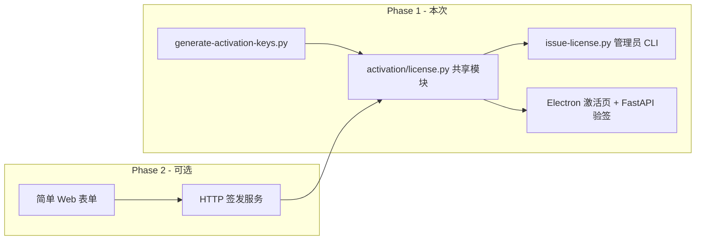
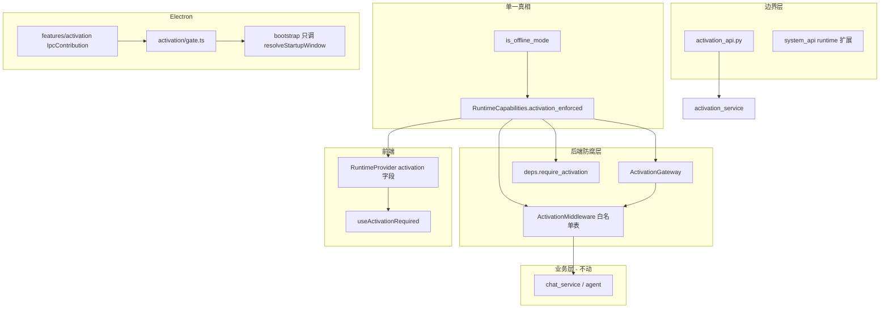
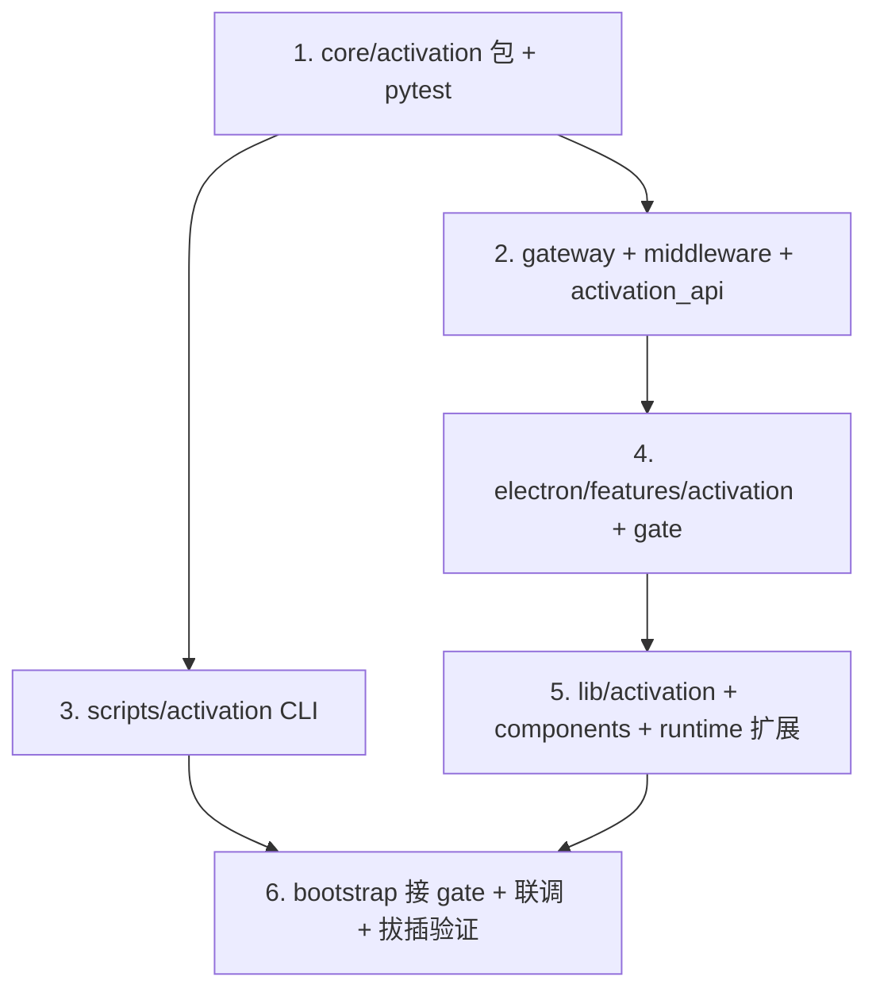

# 离线版 MAC 绑定激活（CLI 签发优先）

## 结论：管理员端要不要先做服务？

**不需要。** 你们已选择「1–2 个技术管理员本机 CLI 签发」，与纯离线、人工审批流程完全匹配：

| 方式 | 适用 | 本次 |
|------|------|------|
| **CLI 脚本** | 技术管理员、飞书/邮件收设备码、零部署 | **Phase 1（本次）** |
| 简单 Web 页 | 非技术管理员也要点选 | 以后按需 |
| HTTP 服务 + 审计 | 多人管理、集中存私钥、签发记录 | 以后按需 |

CLI 与客户端可**并行开发**，前提是先定好 **授权码格式 + 密钥对**，两边共用同一套 Python 验签/签名逻辑。



---

## 业务流程（与需求对齐）

1. 用户首次启动离线包 → 展示 **设备码**（由物理 MAC 集合 + 平台 machine-id 哈希，格式 `XXXX-XXXX-XXXX-XXXX-XXXX`）
2. 用户将设备码发给管理员
3. 管理员运行 CLI：`issue-license.py --device ... --expires 2026-12-31` → 输出 **授权码**
4. 用户在激活页粘贴授权码 → 客户端验签 + 设备匹配 + 写本地 → 进入主界面
5. 到期后启动拦截，再次展示设备码，重复 2–4

---

## 代码组织与拔插原则

对齐现有离线模式架构（[`runtime_capabilities.py`](apps/server/src/core/runtime_capabilities.py) + [`RemoteGateway`](apps/server/src/core/remote_gateway.py) + [`deps.require_capability`](apps/server/src/core/deps.py) + Electron [`IpcContribution`](apps/web/electron/core/ipc/types.ts)），激活模块同样采用 **「能力表 + 网关 + 边界层 + 业务零分支」**：

### 设计原则

1. **业务代码不读 activation.json / 不算 MAC** — chat、agent、skill 等 service 零改动
2. **远程出口式单点 enforcement** — 后端经 `ActivationGateway.ensure_activated()`；Electron 经 `activation/gate.ts`
3. **API 边界薄路由** — 新建独立 `activation_api.py`，不堆进现有 handler 业务体
4. **前端声明式** — `useActivationRequired()` / `ActivationSection` 包装，业务卡片零改
5. **管理员工具与运行时解耦** — CLI 只 import `activation.license`，不依赖 FastAPI/Electron

### 拔插开关（单一真相）

| 开关 | 来源 | 效果 |
|------|------|------|
| `offline_mode` | 现有 `.offline` / `OFFLINE_MODE` | 离线功能集 |
| `activation_enforced` | `offline_mode && !ACTIVATION_BYPASS` | 是否要求激活 |
| `ACTIVATION_BYPASS=1` | 仅开发 env | 本地调试跳过激活（不进生产包） |

扩展 [`runtime_capabilities.py`](apps/server/src/core/runtime_capabilities.py) 增加 `activation_enforced: bool`；`/system/runtime` 同步返回 `activation` 块，前端 [`runtime-types.ts`](apps/web/src/lib/runtime/runtime-types.ts) 对齐。



### 目录结构（按层拆分）

**Python 运行时（`apps/server/src/`）**

```
core/activation/
  __init__.py          # 对外 re-export：verify_license, normalize_device_code
  license.py           # 纯函数：sign / verify / parse payload（无 IO）
  device.py            # 设备码 normalize / format（与 Electron 算法文档一致）
  storage.py           # activation.json 读写（唯一 IO 点）
  policy.py            # is_enforced / is_expired / clock_skew 规则
  keys.py              # 加载 embedded public_key.pem
service/
  activation_service.py  # 编排：activate / get_status / resolve_device
core/
  activation_gateway.py  # ensure_activated()，类似 RemoteGateway
  deps.py                # + require_activation()
api/
  activation_api.py      # GET/POST /activation/*（独立 router）
middleware/
  activation_middleware.py  # 白名单 PATH_ALLOWLIST 常量表
```

**管理员 CLI（`scripts/activation/`，薄封装）**

```
scripts/activation/
  generate_keys.py     # 调 license.generate_keypair
  issue_license.py     # 调 license.sign_license
  README.md            # 运维说明（或写入 AGENTS.md 一节）
```

**Electron（`apps/web/electron/features/activation/`）**

```
activation/
  index.ts             # 导出 activationIpcContribution
  device-fingerprint.ts
  activation-store.ts  # 可选缓存；真相仍在后端 activation.json
  gate.ts              # resolveActivationGate(): blocked | ok
  window-activation.ts
  ipc.ts
  preload-bridge.ts
```

[`bootstrap.ts`](apps/web/electron/core/bootstrap.ts) 仅增加：

```typescript
const gate = await resolveActivationGate()
if (gate === "activation") { createActivationWindow(); return }
// 现有 offline/login/main 分支
```

**前端（`apps/web/src/`）**

```
lib/activation/
  types.ts
  use-activation.ts      # useActivationStatus / useDeviceCode（IPC + Query）
api/activation.ts        # fetchActivationStatus / activateLicense
components/activation/
  activation-form.tsx    # 设备码 + 输入框（activation 路由与 about 复用）
  activation-about-section.tsx  # about 页薄包装
routes/activation.tsx    # 仅 compose ActivationForm
```

### 边界白名单（可维护）

[`activation_middleware.py`](apps/server/src/middleware/activation_middleware.py) 内集中维护 `ACTIVATION_ALLOWLIST: tuple[str, ...]`，新增公开端点时只改一处。初始包含：

- `/system/runtime`
- `/activation/device`
- `/activation/activate`
- `/activation/status`
- `/docs`, `/openapi.json`（开发）

路由前缀统一 **`/activation/*`**（不与 `/system/*` 混放），便于 middleware 匹配与日后整模块移除。

### 后续扩展拔插点（预留，本次可不实现）

| 扩展 | 挂点 |
|------|------|
| HTTP 签发服务 | 复用 `license.sign_license`，新 `scripts/activation/server.py` |
| 审计日志 | `activation_service.activate` 后写 optional `activation_audit` 表 |
| 公钥轮换 | payload `v` + `keys.py` 多公钥表 |
| 替换指纹算法 | 只改 `device.py` + Electron `device-fingerprint.ts` + 文档 |

---

## 技术设计

### 1. 设备指纹（Electron 主进程）

[`apps/web/electron/features/activation/device-fingerprint.ts`](apps/web/electron/features/activation/device-fingerprint.ts)：

- `os.networkInterfaces()` 收集非 internal、非 `00:00:00:00:00:00` 的 MAC，过滤常见虚拟网卡名（docker/veth/Hyper-V 等）
- 平台 machine-id：
  - Windows：读 `HKLM\SOFTWARE\Microsoft\Cryptography\MachineGuid`（`reg` 或 `winreg` 等价实现）
  - Linux：读 `/etc/machine-id`
  - macOS：读 `ioreg` 的 `IOPlatformUUID` 或 fallback hostname（文档说明稳定性）
- `device_code = formatGroups(SHA256(sortedMacs + machineId).hex.slice(0, 20))`

### 2. 授权码格式（`core/activation/license.py`）

[`apps/server/src/core/activation/license.py`](apps/server/src/core/activation/license.py) — **纯函数、无 FastAPI 依赖**，CLI / Service / pytest 共用：

**Payload（JSON，紧凑字段名）：**

```json
{"d":"设备码无横线","exp":"2026-12-31T23:59:59Z","v":1}
```

**授权码：** `base64url(payload) + "." + base64url(ed25519_signature)`

- 使用 **Ed25519**（`cryptography` 库，需加入 [`apps/server/pyproject.toml`](apps/server/pyproject.toml)）
- 公钥嵌入客户端：[`apps/server/src/core/activation/public_key.pem`](apps/server/src/core/activation/public_key.pem)（仅公钥，可入库）
- 私钥：**不进仓库**，管理员本机 `~/.digital-employee-admin/private_key.pem` 或通过 `--private-key` 指定

**管理员 CLI（薄封装）：** [`scripts/activation/generate_keys.py`](scripts/activation/generate_keys.py)、[`scripts/activation/issue_license.py`](scripts/activation/issue_license.py)

```bash
# 首次（管理员本机一次）
python scripts/activation/generate_keys.py --out-dir ~/.digital-employee-admin

# 日常签发
python scripts/activation/issue_license.py \
  --private-key ~/.digital-employee-admin/private_key.pem \
  --device ABCD-EFGH-IJKL-MNOP-QRST \
  --expires 2026-12-31
```

### 3. 本地持久化（`core/activation/storage.py`）

路径：`~/.digital-employee/data/activation.json`（与 [`apps/web/electron/core/data-paths.ts`](apps/web/electron/core/data-paths.ts) 一致）；**仅** `storage.py` 读写，Service 不直接 open 文件。

```json
{
  "device_code": "...",
  "license_code": "...",
  "expires_at": "2026-12-31T23:59:59Z",
  "activated_at": "2026-05-30T10:00:00Z"
}
```

Electron `activation-store.ts` 仅作 IPC 侧可选缓存；**enforcement 真相源**为后端 `activation_service` + `activation.json`。

### 4. 后端 API + Gateway + Middleware

**独立路由** [`apps/server/src/api/activation_api.py`](apps/server/src/api/activation_api.py)（注册到 [`api/__init__.py`](apps/server/src/api/__init__.py)）：

| 端点 | 说明 |
|------|------|
| `GET /activation/status` | `{ enforced, activated, expires_at, days_remaining, reason? }` |
| `POST /activation/activate` | body: `{ device_code, license_code }` → 调 `activation_service.activate()` |
| `GET /activation/device` | 可选；或由 Electron IPC 算 device 后随 activate 提交 |

[`system_api.py`](apps/server/src/api/system_api.py) 的 `GET /system/runtime` **只扩展字段**，不写激活业务：

```python
"activation": {
  "enforced": caps.activation_enforced,
  "activated": status.activated,
  "expires_at": status.expires_at,
}
```

[`activation_gateway.py`](apps/server/src/core/activation_gateway.py)：`ensure_activated()` — 未 enforced 时 no-op；否则未激活/过期抛 `ActivationRequiredError`。

[`activation_middleware.py`](apps/server/src/middleware/activation_middleware.py)：仅当 `activation_enforced` 时挂载；内部调 gateway + `ACTIVATION_ALLOWLIST`。

[`deps.py`](apps/server/src/core/deps.py)：`require_activation()` — 供个别路由显式 Depends（与 middleware 双保险，通常 middleware 足够）。

> 设备码在 Electron 主进程计算；激活 POST 携带 `device_code`，后端 `device.normalize()` 后与 license payload 比对（算法与 CLI 一致，单测覆盖 cross-platform normalize）。

### 5. Electron 启动拦截（gate 模块）

[`activation/gate.ts`](apps/web/electron/features/activation/gate.ts) 封装：

```typescript
export type StartupGate = "activation" | "login" | "main"

export async function resolveStartupGate(): Promise<StartupGate> {
  if (!isOfflineMode()) return hasToken() ? "main" : "login"
  if (process.env.ACTIVATION_BYPASS === "1") return "main"
  const status = await fetchActivationStatusFromBackend()
  if (status.enforced && !status.activated) return "activation"
  return "main"
}
```

[`bootstrap.ts`](apps/web/electron/core/bootstrap.ts) **只 switch gate**，不内联激活逻辑。

完整 Feature 注册（同 auth/settings 模式）：

- [`features/activation/index.ts`](apps/web/electron/features/activation/index.ts) → `allIpcContributions`
- IPC：[`ipc-channels.ts`](apps/web/electron/shared/ipc-channels.ts) 增加 `getDeviceCode`、`activateLicense`、`activationSuccess`
- preload：[`preload/electron-api.ts`](apps/web/electron/preload/electron-api.ts) spread `activationBridge`

### 6. 前端（组件复用 + 声明式）

- [`components/activation/activation-form.tsx`](apps/web/src/components/activation/activation-form.tsx) — 设备码、输入框、错误态（**单组件**）
- [`routes/activation.tsx`](apps/web/src/routes/activation.tsx) — 薄路由，compose `ActivationForm`
- [`components/activation/activation-about-section.tsx`](apps/web/src/components/activation/activation-about-section.tsx) — `if (!useActivationRequired()) return null`
- [`about-settings.tsx`](apps/web/src/components/settings/about-settings.tsx) — 仅 `<ActivationAboutSection />`，无内联逻辑
- 激活成功 → IPC `activationSuccess` → gate 重跑或关窗开 main

### 7. 到期策略（默认）

- **无宽限期**：`now >= expires_at` 即失效
- 剩余 **7 天**内在主界面 toast 提醒（读 `/system/activation`）
- 记录 `last_seen_at` 防极端时钟回拨（回拨 >24h 要求重新激活）

---

## 实施顺序（推荐）



**关键路径：** `core/activation/` 纯模块 + 单测先行；边界层（API/Middleware/Gate）再叠；业务 service 全程不碰激活。

---

## 验证清单

1. 离线包未激活 → 仅见激活窗，API 403
2. 错误授权码 / 其他机器设备码签发的码 → 激活失败
3. 正确授权码 → 进主界面，`activation.json` 写入
4. 修改系统时间到过期后 → 拦截并提示过期
5. CLI `--expires +7d` 签发 → 7 天后失效，用户复制同一设备码续签
6. 在线版（无 `.offline`）→ `activation_enforced=false`，Middleware 不挂载
7. 开发 `ACTIVATION_BYPASS=1` → 离线包可跳过激活窗（仅 dev）
8. 移除 `activation_api` 注册 + middleware 一行 → 其余业务无编译错误（拔插验证）
9. `pnpm typecheck` + `uv run pytest tests/test_activation*.py`

---

## 文档与运维

更新 [`AGENTS.md`](AGENTS.md) 新增 **Activation 架构** 小节（对齐 Offline 模式文档风格）：

- 目录树与拔插开关说明
- 管理员 CLI 用法、密钥保管
- 设备码变更场景（换网卡/VPN）
- `ACTIVATION_BYPASS` 仅开发用
- 客户端验签为**防 casual 拷贝**，非 DRM

`.gitignore` 增加 `**/private_key.pem`、管理员 out-dir 示例路径。

---

## 后续可选（不在本次范围）

- 将 `issue-license.py` 包一层 FastAPI（`POST /admin/issue`）+ 静态 HTML 表单
- 签发记录 SQLite（审计）
- 公钥 version 轮换机制（payload `v` 字段已预留）
