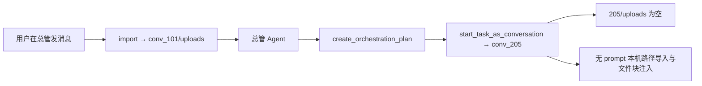
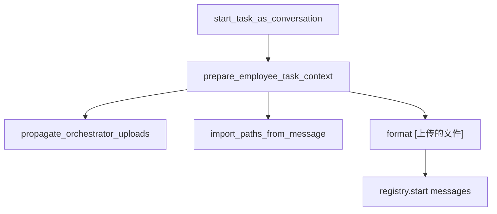

# 编排子任务上下文传播计划

## 问题确认（本期范围）

总管委派时，员工子任务在**独立会话**中执行，与总管会话的 `uploads/` 隔离，导致 `read_file` 失败。



| 断点 | 现状 | 后果 |
|------|------|------|
| 文件隔离 | 导入在总管 `conv_101/uploads`，员工用 `conv_205` | `read_file("/uploads/...")` 找不到文件 |
| 无 prompt 增强 | 员工只收到裸 `task.user_prompt` | 无 `[上传的文件]`、无本机路径自动导入 |
| 同员工多子任务 | 总管常拆「读文档 + 扩写」两条 | 上下文更难传递；应合并为单任务 |

**本期不处理 `depends_on`：** 跨员工先后依赖、前置任务 output/artifacts 传递、完成后再解锁后继任务等，属于**后续群聊协同**能力，本文档仅记录现状，不改动 [`execution.py`](apps/server/src/service/agent/orchestrator/execution.py) 中 `depends_on` 语义。

---

## 子任务拆分原则（明令禁止）

**同一 `employee_id` 不得拆成多个子任务。** 子任务拆分预留给**多名员工分工**（未来群聊协同）；单人多步（读文档 → 扩写）必须**一条** `user_prompt`。

| 场景 | 错误做法 | 正确做法 |
|------|----------|----------|
| 同一员工：读文档 → 扩写 | 任务 A + 任务 B | **单任务**：prompt 写清先 read `/uploads/...` 再 write `/artifacts/...` |
| 多员工：张三查、李四写 | （未来群聊） | 本期可拆多条，但 `depends_on` 行为**不保证**，prompt 须自包含 |

**落地：**

1. [`orchestrator/prompts.py`](apps/server/src/service/agent/orchestrator/prompts.py)：禁止同员工多子任务；`depends_on` 标注为「群聊阶段再完善」
2. [`orchestrator/tools.py`](apps/server/src/service/agent/orchestrator/tools.py)：`validate_orchestration_tasks` — 同 `employee_id` 且 `len(tasks)>1` → 报错拒绝建 plan

**示例（单任务 prompt）：**

```text
请先 read_file("/uploads/数字员工agent流程初略全貌.md") 理解全文，
再扩写并写入 /artifacts/数字员工agent流程全貌.md：
（保持结构、补充细节、正式书面语、Markdown）
```

---

## 目标行为（本期）

**单员工单任务**（读 + 扩写同一员工）：

1. `start_task_as_conversation` 时从总管 `source_conversation_id` 的 `uploads/` 复制到员工会话 `uploads/`
2. 对 `task.user_prompt` 调用 `import_paths_from_message`（prompt 里若仍有 `C:\...`）
3. 拼接 `[上传的文件]` + 原 `user_prompt` 作为 Agent 首条用户消息
4. 员工在同一会话内完成读源文件与写 artifacts

**多员工多子任务（本期）：**

- 各任务**独立**获得总管 `uploads/` 传播 + 各自 prompt 导入（并行启动逻辑不变）
- **不**注入 `[前置任务输出]`、**不**复制前置 `artifacts/`
- 总管 prompt 应要求各员工任务**自包含**所需信息，或明确虚拟路径（员工侧仅有自己会话下的 `/uploads/`）

---

## 架构设计（精简）

新建 [`apps/server/src/service/orchestration_task_context.py`](apps/server/src/service/orchestration_task_context.py)：



### 核心函数（本期）

| 函数 | 职责 |
|------|------|
| `propagate_orchestrator_uploads(root, orch_conv_id, emp_conv_id) -> list[FileMeta]` | 总管 `uploads/` → 员工 `uploads/`（重名规则同 `upload_file`） |
| `build_employee_task_user_content(prompt, file_metas) -> str` | `[上传的文件]` + 原 `user_prompt` |
| `prepare_employee_task_context(db, task, emp_conv_id, root_path) -> PreparedContext` | 解析 `orch_conv_id`（`source_conversation_id` / plan）、传播 + 导入 + 拼 prompt |

复用：[`local_file_import.py`](apps/server/src/service/local_file_import.py)、[`resource_service.py`](apps/server/src/service/resource_service.py)。

**本期不做：** `propagate_predecessor_artifacts`、`fetch_predecessor_output`、`resolve_predecessor_task`、`on_task_finalized` 链式启动。

---

## 集成点

### 1. [`execution.py`](apps/server/src/service/agent/orchestrator/execution.py)

`start_task_as_conversation` 在写 `user_msg` / `messages` 前：

```python
ctx = prepare_employee_task_context(db, task, conversation.id, root_path)
user_content = ctx.user_content
```

### 2. [`orchestrator/prompts.py`](apps/server/src/service/agent/orchestrator/prompts.py) + [`tools.py`](apps/server/src/service/agent/orchestrator/tools.py)

- 同员工禁止多子任务
- 子任务 prompt 使用 `/uploads/` 而非 `C:\...`
- 不承诺 `depends_on` 跨任务传递（群聊阶段）

### 3. [`chat_service.py`](apps/server/src/service/chat_service.py)

抽出 `format_uploaded_files_context(files)` 供 chat 与 orchestration 共用。

---

## 测试

[`apps/server/tests/test_orchestration_task_context.py`](apps/server/tests/test_orchestration_task_context.py)：

| 用例 | 验证 |
|------|------|
| `propagate_orchestrator_uploads` | 总管 uploads → 员工 uploads，虚拟路径一致 |
| prompt 含 `C:\...` | 员工会话可 `read_file` |
| `build_employee_task_user_content` | `[上传的文件]` 块格式 |
| `validate_orchestration_tasks` | 同员工两条 → 拒绝 |

[`apps/server/tests/test_orchestration_task_validation.py`](apps/server/tests/test_orchestration_task_validation.py)：同员工拒绝、多员工允许建 plan。

---

## 不在本次范围

- **`depends_on` 完成门控**（前置 success 后再启后继）— 群聊协同
- **前置任务 `output_json` / `artifacts/` 传播** — 群聊协同
- 总管会话 `artifacts/` 自动传播
- `depends_on` 从下标改为 `task_id`
- 前端任务卡片展示传播文件列表

---

## 后续：群聊协同阶段（仅规划占位）

- `depends_on` 等待前置 **completed** 再启动后继
- `on_task_finalized` → `start_ready_dependent_tasks`
- 跨员工：`[前置任务输出]` + 前置 `artifacts/` 复制
- 群聊内多员工会话与文件共享模型

---

## 验收清单（本期）

1. 总管消息含本机路径 → **单员工单任务** → 员工 `read_file("/uploads/...")` 成功
2. 同员工 2+ 子任务 → `create_orchestration_plan` **报错**
3. 多员工并行子任务各自获得总管 `uploads/` 传播（互不依赖 `depends_on`）
4. `uv run pytest tests/test_orchestration_task_context.py tests/test_orchestration_task_validation.py` 通过
