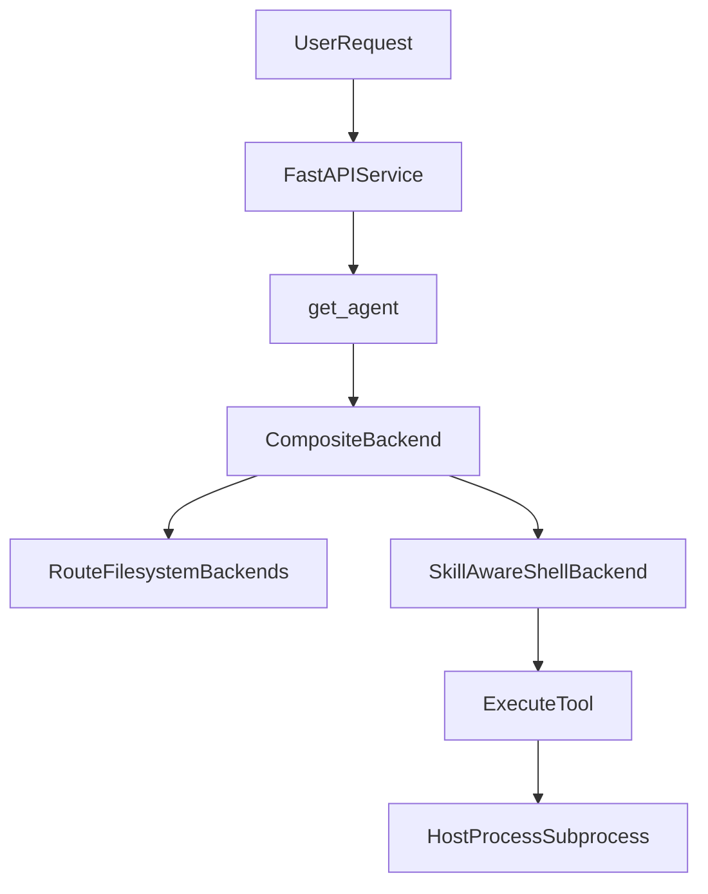

# 深度 Agent 执行与安全优化文档

## 1. 背景与目标

本文聚焦 `apps/server` 中 Deep Agent 的执行面与安全边界，目标是让团队明确：

- 当前执行模型是什么，以及风险落点在哪里。
- 哪些能力已经具备，哪些还需要补齐。
- 如何按优先级逐步优化，而不影响现有业务节奏。

本文件是工程落地文档，不替代渗透测试报告与合规审计文档。

## 2. 当前实现与执行模型

当前 Agent 在服务端通过 `CompositeBackend` 组合多个文件系统路由，并以 `SkillAwareShellBackend` 作为默认后端。

- 代码入口：[`e:/code/digital-employe-client-web-m/apps/server/src/service/agent.py`](e:/code/digital-employe-client-web-m/apps/server/src/service/agent.py)
- Shell 后端：[`e:/code/digital-employe-client-web-m/apps/server/src/service/skill_shell_backend.py`](e:/code/digital-employe-client-web-m/apps/server/src/service/skill_shell_backend.py)
- 官方参考：[LangChain Deep Agents Backends](https://docs.langchain.com/oss/python/deepagents/backends)

核心事实：

1. 技能中的 Python 脚本是通过 shell `execute` 在服务进程所在环境中执行。
2. 该模式继承了 `LocalShellBackend` 的能力边界，不是隔离沙箱。
3. `virtual_mode=True` 可以约束文件工具路径，但不能将 shell `execute` 变成强隔离边界。

执行链路如下：

## 3. 风险模型与边界说明

### 3.1 主要风险类型

- 任意命令执行风险：一旦 `execute` 被滥用，影响范围可能超出技能目录。
- 敏感信息泄露风险：环境变量、配置文件、可访问目录中的凭据可能被读取。
- 资源消耗风险：CPU、内存、磁盘、网络被异常占用，影响服务可用性。
- 多租户隔离风险：若部署模型未做隔离，可能出现跨用户或跨会话影响。
- 供应链风险：不可信技能脚本或依赖可能引入恶意行为。

### 3.2 现有控制与盲区

当前已有控制：

- `FilesystemPermission` 已拒绝写入 `/skills/**` 与 `/agent/**`（见 `agent.py`）。
- 技能路径和草稿路径通过路由区分，具备一定结构化约束。
- shell 执行超时已设置（默认 30 秒）。

仍需强调的盲区：

- 仅靠文件写权限规则，不等价于 shell 执行隔离。
- shell 执行一旦可用，真实约束主要来自操作系统权限与部署隔离。

## 4. 与当前代码的一一映射

### 4.1 Backend 组合与路由

- `get_agent` 中创建 `CompositeBackend(default=shell_backend, routes=...)`。
- `/memories/`、`/skills/`、`/agent/`、`/artifacts/`（以及条件挂载 `/skills-draft/`）分别绑定到 `FilesystemBackend`。

参考：[`e:/code/digital-employe-client-web-m/apps/server/src/service/agent.py`](e:/code/digital-employe-client-web-m/apps/server/src/service/agent.py)

### 4.2 Shell 执行能力

- `SkillAwareShellBackend` 继承 `LocalShellBackend`。
- 在 `execute` 前会把 `/skills/` 与 `/skills-draft/` 的虚拟路径映射到真实路径，再调用 `subprocess.run(...)` 执行。

参考：[`e:/code/digital-employe-client-web-m/apps/server/src/service/skill_shell_backend.py`](e:/code/digital-employe-client-web-m/apps/server/src/service/skill_shell_backend.py)

### 4.3 权限规则

- `FilesystemPermission(operations=["write"], paths=["/skills/**", "/agent/**"], mode="deny")` 用于禁止指定路径写入。
- 该规则是文件操作层控制，不能替代 shell 层的系统级隔离。

参考：[`e:/code/digital-employe-client-web-m/apps/server/src/service/agent.py`](e:/code/digital-employe-client-web-m/apps/server/src/service/agent.py)

## 5. 优化建议（按可落地程度分层）

### 5.1 部署与运行时隔离

- 使用专用低权限系统账号运行后端进程，禁止不必要目录访问。
- 将 Agent 执行环境与核心数据库、密钥管理网络边界分离。
- 在容器部署时启用只读根文件系统、最小权限挂载、资源限额。
- 禁止在与办公终端混用的宿主机直接承载可执行 Agent 服务。

### 5.2 执行面收窄与审批

- 对 `execute` 引入策略开关（按租户、按环境、按角色）。
- 对高风险命令引入人机审批（HITL）或默认拒绝策略。
- 约束技能脚本入口：固定启动器、固定参数模板、显式允许列表。
- 对不可信来源技能默认禁用 `execute`，降级为只读文件工具能力。

### 5.3 供应链与变更治理

- 建立技能仓库来源准入规则，要求代码评审与责任人签名。
- 锁定依赖版本并定期扫描，减少隐式升级带来的运行时漂移。
- 对 `SKILL.md` 和脚本变更做双人复核，避免提示词绕过与误授权。

### 5.4 审计与可观测性

- 记录命令审计字段：会话 ID、员工 ID、技能名、命令摘要、退出码、耗时。
- 对日志做敏感信息脱敏，避免输出密钥与令牌。
- 监控关键指标：`execute` 调用量、失败率、超时率、重试率、异常资源占用。
- 对高危错误设置告警并沉淀排障手册。

## 6. 与流式能力优化的关系

执行安全优化与流式传输优化是两条并行路线：

- 本文关注执行安全、隔离边界、审计与治理。
- 流式与断线恢复设计见：[`e:/code/digital-employe-client-web-m/apps/server/docs/resumable-stream-implementation.md`](e:/code/digital-employe-client-web-m/apps/server/docs/resumable-stream-implementation.md)。

建议在架构评审中分开验收，避免将安全问题误判为传输稳定性问题，或反之。

## 7. 实施路线图（P0 / P1 / P2）

### P0：基线固化（1-2 周）

目标：先把“当前真实边界”说清楚并可观测。

- 工程：补齐执行面文档、风险清单、值班排障入口。
- 运维：确认运行账号权限最小化、目录权限与网络边界基线。
- 安全：定义敏感命令与敏感路径最小规则集。
- 产出：基线检查清单 + 周报可见的核心指标看板。

### P1：策略化控制（2-4 周）

目标：从“可见风险”升级为“可控风险”。

- 工程：为 `execute` 加策略开关与分级控制点（环境/租户/角色）。
- 产品：定义需要审批的场景与用户体验边界。
- 安全：上线 HITL 审批策略或等价替代流程，形成审计闭环。
- 运维：建立告警阈值与自动化处置预案。

### P2：隔离架构升级（4-8 周）

目标：将高风险执行迁移到隔离执行面。

- 工程：评估并落地沙箱后端或独立执行代理服务。
- 运维：实施执行节点池化、配额隔离、弹性扩缩容。
- 安全：完成隔离有效性验证与逃逸演练。
- 产品：明确高安全模式下的功能降级策略和用户告知方案。

## 8. 责任边界建议（产品 / 安全 / 工程）

- 产品负责定义“可执行能力边界”与业务可接受风险。
- 安全负责定义策略规则、审批标准、审计要求与例外流程。
- 工程负责落实技术控制、监控告警、故障恢复与持续改进。

三方共同对“风险认知一致性”负责：不将文件权限规则误认为执行沙箱，不将文档声明替代技术隔离。

## 9. 附录

- 官方文档：[https://docs.langchain.com/oss/python/deepagents/backends](https://docs.langchain.com/oss/python/deepagents/backends)
- 项目迁移说明：[`e:/code/digital-employe-client-web-m/apps/server/MIGRATION_deepagents.md`](e:/code/digital-employe-client-web-m/apps/server/MIGRATION_deepagents.md)
- 生产实现入口：[`e:/code/digital-employe-client-web-m/apps/server/src/service/agent.py`](e:/code/digital-employe-client-web-m/apps/server/src/service/agent.py)
- Shell 后端实现：[`e:/code/digital-employe-client-web-m/apps/server/src/service/skill_shell_backend.py`](e:/code/digital-employe-client-web-m/apps/server/src/service/skill_shell_backend.py)

注：历史实验文件（如 `agent copy.py`）可用于回溯思路，但不建议作为生产方案依据。
