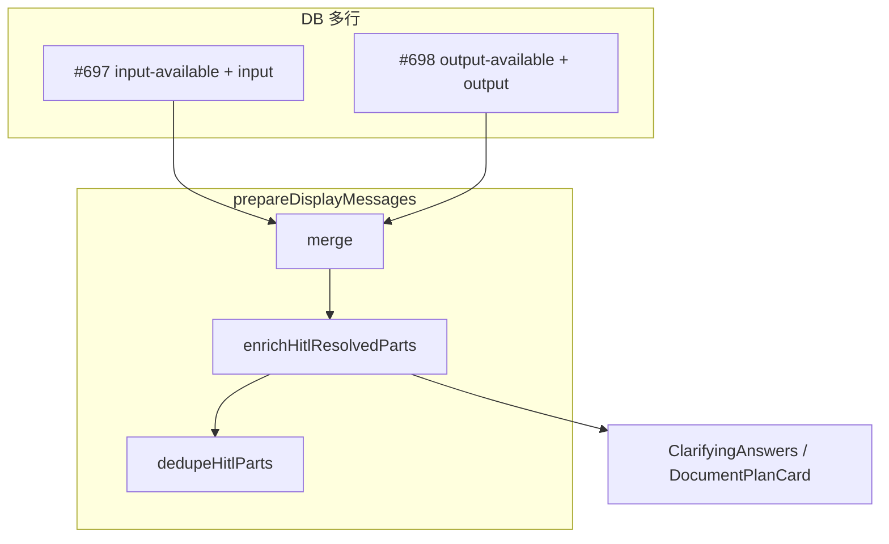
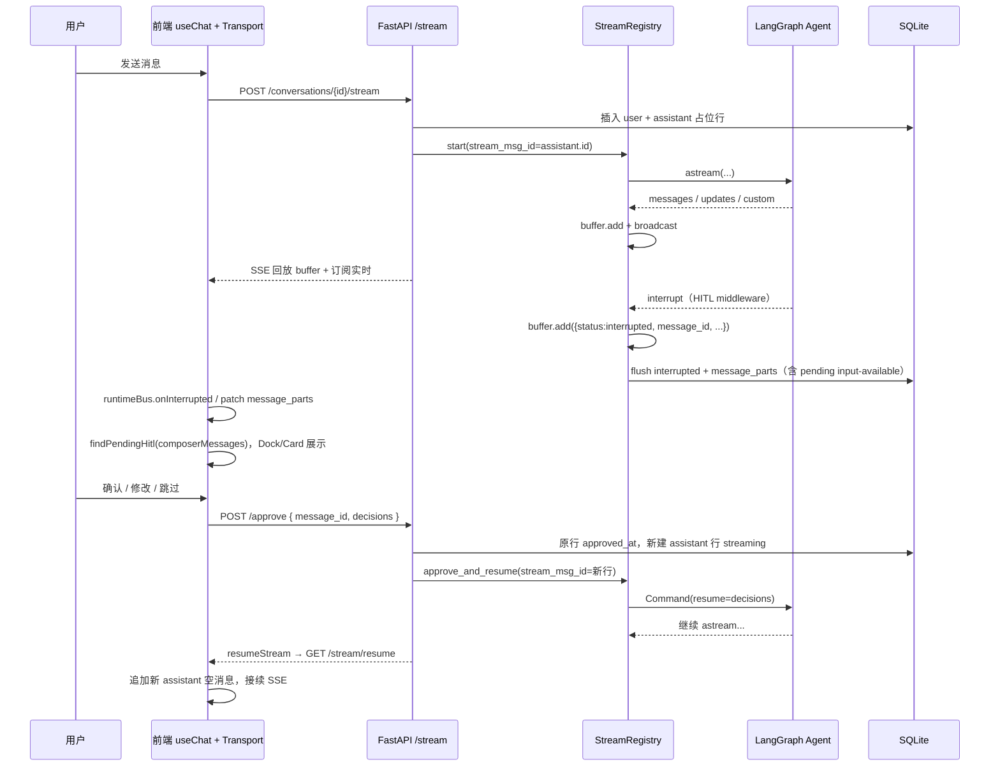

# HITL（Human-in-the-Loop）架构全貌

本文描述数字员工客户端中 **澄清题 / 文档方案确认** 等人机协同（HITL）的端到端设计、数据流与关键代码位置。可恢复流（SSE buffer、resume）的通用机制见 [resumable-stream-architecture.md](./resumable-stream-architecture.md)。

**手工测试场景**见 [hitl-test-scenarios.md](./hitl-test-scenarios.md)。

---

## 一、目标与范围


| 目标       | 说明                                                         |
| -------- | ---------------------------------------------------------- |
| **可中断**  | Agent 在指定工具调用前暂停，等待用户确认后再继续                                |
| **可恢复**  | 刷新页面、断线后能从 DB + SSE resume 恢复 UI 与审批态                      |
| **历史清晰** | 每次 interrupt / approve 对应明确的 DB 行，避免 `message_parts` 被整列覆盖 |
| **审批锚点** | 使用 `**conversation_id` + `message_id`（assistant 行）** 标识待办段 |


**当前已接入 HITL 的会话类型**

- `target_type === "employee"`：员工单聊（长文档技能：`submit_clarifying_questions`、`submit_document_plan`）
- `target_type === "group"`：群聊（若技能启用同类 middleware）

**已接入 HITL 的会话类型（续）**

- `target_type === "curator"`：总管助手（`CuratorView` + `ChatComposerArea`；`get_orchestrator_agent` 在**用户明确要求总管亲自执行**时具备与员工相同的 HITL 工具与 `interrupt_on`；默认仍以编排下发为主）

**涉及的工具名（前端常量）**

- `submit_clarifying_questions` — 澄清问卷（底部 Dock）
- `submit_document_plan` — 方案大纲确认（`DocumentPlanCard`）
- `delete_employee` / `delete_task` / `delete_tasks_batch` — 危险删除确认（`DestructiveDeleteConfirmCard`，仅总管 orchestrator）

**会话级免确认（`conversations.session_flags`）**

- JSON 字段，v1 键：`skip_destructive_hitl: true`
- 用户点「确认，本会话不再询问」时，`POST /approve` body 携带 `destructive_hitl: { skip_for_conversation: true }`，写入 DB 后重建 agent 的 `interrupt_on` 移除三个删除 tool
- 新建总管会话或清空对话后 `session_flags` 为空，恢复确认门

**Approve 扩展字段**

```json
{
  "message_id": 123,
  "decisions": [{ "type": "approve" }],
  "destructive_hitl": { "skip_for_conversation": true }
}
```

`decisions` 仍为标准 `approve` / `reject`；`destructive_hitl` 可选，仅危险删除确认卡使用。

---

## 二、核心概念

### 2.1 LangGraph 线程 vs DB 消息行

```
LangGraph thread_id  = conversation_id     （整轮任务状态一份，不因 HITL 分段而断开）

DB 消息（一轮用户提问内可多段 assistant）:
  user
  assistant #1  streaming → interrupted     ← 澄清或方案门
  [POST /approve(message_id=#1)]
  assistant #2  streaming → interrupted
  [POST /approve(message_id=#2)]
  assistant #3  streaming → completed
```

- **图状态**：`configurable.thread_id = conversation_id`，`Command(resume=decisions)` 在 approve 后恢复。
- **展示状态**：每段 `astream` 对应 **一行** `conversation_message`（`role=assistant`），段结束为 `stream_state=interrupted|completed|error`。

### 2.2 message_parts：pending 与 completed 两段

一次 interrupt 落库后，assistant 行的 `message_parts` 同时承载 **已完成** 与 **待审批** 片段：


| 片段形态 | 条件 | 示例 |
| -------- | ---- | ---- |
| `input-available` + 完整 `input` | interrupt flush 写入的 **pending** HITL part | 澄清 Dock / 方案卡参数 |
| `output-available` + `output.text` | approve 后 resume 段或 extractor 抽取的 **已完成** tool | 澄清 Answers、方案确认文案 |
| `text` | 段内展示文案 | 气泡正文 |

**不再**使用 `extra_meta.interrupt_payload`（硬切：旧数据仅含 payload、无 pending part 的不兼容）。

`stream_state=interrupted` + 无 `approved_at` → 待办；写入 `approved_at` 后行封存，pending part 仍保留在 DB 供展示层 enrich。

### 2.3 展示层 enrich（DB 与 UI 形态差异）

DB 多行存储（approve 仍新建 assistant 行），列表渲染经 `prepareDisplayMessages` 三步：

```
mergeConsecutiveAssistantMessages → enrichHitlResolvedPartsInMessage → dedupeHitlPartsInMessages
```

- **merge**：同一 user 轮次内连续 assistant 合并为一条气泡（`parts` 拼接）。
- **enrich**（`hitl/display-enrich.ts`）：在同泡内，将 sealed 行的 `input-available.input` 浅拷贝回填到 `output-available` 且顶层 `input` 为空的 HITL part（仅 UI，不回写 DB）。
- **dedupe**：移除已 resolve 的重复 pending part。

`composerMessages` / `findPendingHitl` / `POST /approve` 的 `message_id` 仍用 **未 merge、未 enrich** 的 `useChat` 列表。



---

## 三、端到端数据流（主路径）

### 3.1 总览图




### 3.2 后端：发起流

**入口**：`POST /chat/conversations/{id}/stream` → `ChatService.stream_conversation_answer`

1. 写入 user 消息。
2. `_append_message` 创建 **assistant 占位**（先不写 `streaming`，避免 `start` 失败留僵尸行）。
3. `registry.start(..., stream_msg_id=assistant_msg.id)` 启动后台 `_run_agent_background`。
4. `start` 成功后：`assistant.stream_state = streaming`，`conversation.status = running`。
5. `async for chunk in resume_conversation_stream(...)` 向客户端吐 SSE（无额外管理首包；interrupt 时见 §3.3）。

关键文件：

- `apps/server/src/service/chat_service.py` — `stream_conversation_answer`
- `apps/server/src/service/stream_registry.py` — `start`, `_run_agent_background`

### 3.3 后端：流式事件与 buffer

后台循环 `agent.astream(..., stream_mode=[...])`：

- 普通 LangGraph 事件 → `task.buffer.add(serializable)` → `broadcast` 给 SSE 订阅者。
- `tool_output` 自定义事件 → 同样进 buffer。
- Checkpoint：buffer 事件数超过阈值时写 `message_parts` 兜底（见 resumable-stream 文档）。

**SSE 形态**（live / resume 共用）：

```
id: {seq}
data: {"type":"messages","data":[...]}

id: {seq}
data: {"status":"interrupted","message_id":672,"message_parts":[...]}

data: [DONE]
```

管理事件（已结束再连 resume）：

```json
{"type":"stream_ended","data":{"status":"interrupted","message_id":672}}
```

### 3.4 后端：检测 interrupt 并落库

`_run_agent_background` 在 `astream` 结束后：

1. `agent.aget_state(config)`，检查 `state.next` 与 `state.tasks[].interrupts`。
2. 若有中断：`_extract_interrupt_payload` → 仅用于构建 pending parts（**不落库**）。
3. `buffer.add({ status: "interrupted", message_id: stream_msg_id, message_parts: [...] })`。
4. `_flush_terminal(..., state="interrupted")`：
  - `message_parts` ← `extract_message_parts_for_interrupt(buffer, payload, stream_msg_id)`（已完成 parts + pending `input-available`）
  - `stream_state` ← `interrupted`

关键文件：

- `apps/server/src/service/stream_registry.py` — interrupt 分支
- `apps/server/src/service/hitl_pending_parts.py` — `build_pending_hitl_parts`、`extract_message_parts_for_interrupt`
- `apps/server/src/service/message_parts_extractor.py` — parts 抽取

### 3.5 后端：审批与恢复

**入口**：`POST /chat/conversations/{id}/approve`  
Body：`{ "message_id": <int>, "decisions": [...] }`

`ChatService.approve_trigger`：

1. 校验：`message_id` 存在、`role=assistant`、`stream_state=interrupted`、未 `approved_at`。
2. 原行：`extra_meta.approved_at = now`（保持 `interrupted`，封存段）。
3. **新建** assistant 行：`stream_state=streaming`，`stream_cursor=0`。
4. 按 `target_type` 重建 agent（employee / **curator orchestrator**）。
5. `registry.approve_and_resume(..., stream_msg_id=new_msg.id, decisions=...)`：
  - 内部 `Command(resume={"decisions": decisions})` 继续图执行。
6. 返回：`approved_message_id`、`assistant_message_id`。

关键文件：

- `apps/server/src/schemas/conversation.py` — `ApproveRequest`
- `apps/server/src/api/chat_api.py` — approve 路由
- `apps/server/src/service/chat_service.py` — `approve_trigger`
- `apps/server/src/service/stream_registry.py` — `approve_and_resume`

### 3.6 前端：SSE → UI 状态

**全景（DB / composer / 展示三管道、hydrate、refetch）**：[conversation-message-flow.md](../../web/src/lib/chat/conversation-message-flow.md)

**Transport**：`LangChainChatTransport`（`apps/web/src/lib/chat/langchain-chat-transport.ts`）


| SSE 载荷                     | 行为                                                             |
| -------------------------- | -------------------------------------------------------------- |
| `status === "interrupted"` | `emitInterrupted` + `buildHitlInterruptStreamChunks(message_parts)` + `onInterrupted` |
| `type === "stream_ended"`  | `emitTerminal`；`interrupted` 时 `onInterrupted`（无 payload 时靠 DB hydrate） |
| `type === "messages"` 等    | `parseLangChainPayloadToChunks` → `useChat` parts              |
| `[DONE]`                   | 正常结束                                                           |


**会话单例状态**：`useConversationSession`

- `hitlMessageId` / pending 态：由 `findPendingHitl(composerMessages)` 推导（跳过 `metadata.approved_at` 行）。
- interrupt 时 bus 用 `message_parts` patch 目标 assistant 行。
- `tryResumeOnce`：最后一条 assistant `stream_state===streaming` 时 `resumeStream()`。
- `onHitlApproved`：`approve` 成功后 `setMessages` 追加新 assistant 行，再 `resumeStream()`。

**已接 HITL 的视图**

- `ConversationChatView`、`DraftChatView` → `ChatPanel` → `ChatComposerArea`（Dock + 占位符锁定）
- `CuratorView` → 时间线内 `RenderClassifiedBlocks` + 底部 `ChatComposerArea`
- `DocumentPlanCard` / `ClarifyingQuestionsDock` → `approveHitl(conversationId, messageId, decisions)`

**DB → UI 还原**

- `mapStoredMessagesToUIMessages`：直接映射 `message_parts`（含 pending `input-available`）。
- `prepareDisplayMessages`：merge → enrich → dedupe（见 §2.3）。
- `findPendingHitl`：扫描未 approve 行的 `input-available` HITL part，驱动 Dock / Composer 锁定。

关键文件：

- `apps/web/src/lib/chat/hitl/` — `display-pipeline.ts`、`display-enrich.ts`、`pending.ts`、`interrupt-stream-chunks.ts`、`session-patch.ts` 等（ barrel：`hitl/index.ts`）
- `apps/web/src/lib/chat/conversation-runtime-bus.ts`
- `apps/web/src/components/chat/panel/chat-composer-area.tsx`
- `apps/web/src/components/chat/message-blocks/document-plan-card.tsx`
- `apps/web/src/components/chat/message-blocks/clarifying-questions-dock.tsx`
- `apps/web/src/api/conversation.ts` — `approveHitl`

---

## 四、decisions 与工具行为（摘要）

前端 `HitlDecision` 与 LangGraph HITL middleware 对齐，例如：

- `{ "type": "approve" }` — 按原 args 继续
- `{ "type": "edit", "edited_action": { "name", "args" } }` — 改稿后继续
- `{ "type": "reject", "message": "..." }` — 拒绝/跳过

具体工具展示与校验见 `document-plan-card.tsx`、`clarifying-questions-dock.tsx` 及 `hitl/constants.ts`。

澄清 Dock 的 **Skip** 与「提交全部」同链路：对当前 `message_id` 调用 `POST /approve`，decision 为 `{ type: "reject", message: "用户跳过澄清" }`，成功后 `onHitlApproved` 清 HITL 并 `resumeStream`。**不要**调用 `POST /stream/cancel`（interrupt 后 registry 通常已无活跃流，会 400）。

---

## 五、与可恢复流的关系


| 场景               | 行为                                                                                 |
| ---------------- | ---------------------------------------------------------------------------------- |
| 流式进行中刷新          | `GET /stream/resume` 全量回放 buffer → 订阅 live；前端 `stream_cursor` 可用来跳过已持久化段（**优化待办**） |
| 已 interrupted    | `get_stream_status` → 直接 `stream_ended` + `message_id`，无 agent 事件           |
| 僵尸 `streaming` 行 | resume 时自动修为 `error` 并结束 SSE                                                       |


详见 [resumable-stream-architecture.md](./resumable-stream-architecture.md)。

---

## 六、状态机（assistant 行）

```
(创建占位) → streaming → interrupted   [用户审批]
                ↓              ↓
            completed      (approved_at 写入，行封存)
                ↓
            error / cancelled
```

approve 后 **新行** 再次 `streaming → ...`，旧行保持 `interrupted`。

---

## 七、关键文件索引


| 层级                 | 路径                                                                                  |
| ------------------ | ----------------------------------------------------------------------------------- |
| API                | `apps/server/src/api/chat_api.py`                                                   |
| 流与审批               | `apps/server/src/service/chat_service.py`                                           |
| Buffer / interrupt | `apps/server/src/service/stream_registry.py`                                        |
| Parts 抽取           | `apps/server/src/service/message_parts_extractor.py`                                |
| Schema             | `apps/server/src/schemas/conversation.py`                                           |
| SSE 解析             | `apps/web/src/lib/chat/langchain-chat-transport.ts`                                 |
| Chunk 解析           | `apps/web/src/lib/chat/langchain-stream-parser.ts`                                  |
| 会话 HITL 状态         | `apps/web/src/hooks/use-conversation-session.ts`                                    |
| 展示 enrich / pipeline | `apps/web/src/lib/chat/hitl/`（`display-enrich.ts`、`display-pipeline.ts`）         |
| Pending parts 构建     | `apps/server/src/service/hitl_pending_parts.py`                                     |
| UI                 | `chat-composer-area.tsx`, `document-plan-card.tsx`, `clarifying-questions-dock.tsx` |


---

## 八、待办与优化

以下按优先级列出。**实现状态：流程已打通（员工单聊）**；表中「待做」为体验与覆盖范围增强。

### P0 — 体验 / 性能

#### 1. 大文档 resume 回放卡顿（部分完成）

**现象**：写长文档时 buffer 累积数千条 SSE 事件；刷新或 `resumeStream` 时前端大量 `enqueue` UIMessageChunk，`useChat` 触发密集 React 更新，页面明显卡顿。

**根因**：

- 后端 `resume_conversation_stream` Phase 1 **全量回放** `task.buffer._events`（见 `chat_service.py`）。
- 正常 `POST /stream` 使用 rAF 批处理；resume 冷回放会在短时间内推送与 buffer 等量的 SSE。
- `hydrateFromServer` 已用 DB `message_parts` 恢复 UI，随后 `resumeStream` 仍可能从 buffer 头重放，存在 **重复 apply / 重复 part** 风险（待验证与治理）。

**验收**：同一会话 3000+ buffer 事件，刷新后 1–2s 内可交互，无明显长时间白屏/假死；回放结束后正文与 HITL 状态正确。

##### 1.1 已实现 — Reconnect 专用批处理

**位置**：`apps/web/src/lib/chat/langchain-chat-transport.ts`

| 项 | 说明 |
| --- | --- |
| 触发条件 | `processResponseStream(..., reconnectAbort)`，即 `reconnectToStream` / `GET .../stream/resume` |
| 批处理 | 48ms 时间窗 **或** 单批最多 256 个 chunk 后 `flushSync`；批内 `mergeAdjacentTextDeltas` |
| 让出主线程 | 每处理 320 条有效 SSE 事件：`flushSync` + `setTimeout(0)` |
| 正常发消息 | 仍用 rAF 批处理（`createChunkFlushBatcher`），不受影响 |
| 调试 | DEV 控制台 `[sse:resume] reconnect batching`，对比 `chunksScheduled` vs `chunksEnqueued` |

##### 1.2 待做 — 后续优化（按优先级记录，视效果再排期）

**A. 后端 cursor 增量回放（网络侧减负）**

- API：`GET /stream/resume?from_cursor={stream_cursor}`，仅推送 `seq > cursor` 的事件。
- `stream_cursor` 来源：DB `conversation_message.stream_cursor`（列表接口已返回，前端 `Message.streamCursor`）。
- 与 Phase 2「补扫 subscribe 后遗漏事件」对齐，避免漏 tail。

**B. 前端 `stream_cursor` 过滤 enqueue（不改后端协议也可做）**

- `tryResumeOnce` / `chatTransport` 传入最后一条 assistant 的 `streamCursor`。
- 解析 SSE `id: {seq}` 行：`seq <= cursor` 的事件 **不** `schedule(chunk)`（parser state 是否仍需推进需单独评估，避免 tail 错乱）。
- 可与 A 叠加：后端少推 + 前端少 enqueue。

**C. DB 优先 + 只追 tail（产品 / 会话层）**

- 刷新后列表以 `mapStoredMessagesToUIMessages` + `message_parts` 为准先渲染。
- `resumeStream` 仅消费 **tail**（依赖 A/B 或后端 `replay_complete` 类标记）。
- **注意**：`stream_registry` 中 `BUFFER_CHECKPOINT_LEN = 10000`，checkpoint 前 DB `message_parts` 可能偏旧，中途刷新仍依赖 replay；若加强 C，可考虑降低 checkpoint 间隔（后端，见 D）。

**D. 后端 checkpoint 频率（与 C 联动）**

- 位置：`apps/server/src/service/stream_registry.py` `BUFFER_CHECKPOINT_LEN`。
- 降低后刷新时 DB 快照更接近实时，减轻「必须全量 replay 才看得全」的压力。

**E. Hydrate 与 replay 去重（`use-conversation-session`）**

- 排查 `setMessages(initialMessages)` 后 `resumeStream` 是否在 `useChat` 中 **重复追加** 已存在于 `message_parts` 的 parts。
- 若重复：resume 前对齐 assistant 行 id；reconnect 路径避免多余 `{ type: "start" }`；或 replay 阶段不 enqueue 已由 DB 覆盖的 chunk。

**F. 展示冻结（replay 期间 UI 不跟高频 `messages`）**

- 会话级 `replayPhase: "frozen" | "live"`：frozen 时 `ChatPanel` 读 hydrate 快照，live 后切回 `useChat.messages`。
- 切换时机：replay 批处理结束 / 收到首个 tail 事件 / 超时兜底（后端暂无 `replay_complete` 事件）。

**G. 渲染层辅助**

- 回放期间减少 `VirtualizedMessageList` 对末条 assistant 的 `measureElement` 频率。
- 非末条消息 `React.memo` + 稳定 props，降低 `classifyMessageParts` 重复计算。

**方案组合建议**：

| 阶段 | 建议 |
| --- | --- |
| 当前 | 1.1 已上线，先观察 `[sse:resume]` 与真实长文档场景 |
| 仍卡 | 优先 B + E（纯前端，不动协议） |
| 仍卡且可改后端 | A + D |
| 要「秒开可滚动」 | C + F，并配合 D |

**说明**：`apps/web/src/lib/chat/resume-flow.md` 中 `_lastSeqByChat`、`?cursor=` 等为设计稿，**以本表与源码为准**；实现 cursor 后应同步更新 `resume-flow.md`。

---

### P1 — 功能覆盖

#### 2. 界面消息合并展示（已完成）

**现状**：每次 approve 新建一条 assistant DB 行，列表中出现 **多条连续 assistant 气泡**（同轮用户提问内），历史可读但占屏。

**目标**：**数据层仍多行**（利于审计与 `message_id` 审批），**展示层**将「上一 user 之后、下一 user 之前」的连续 assistant 合并为 **一条气泡**。

**实现**（`merge-consecutive-assistant-messages.ts` + `hitl-display-enrich.ts`）：

- `prepareDisplayMessages` = merge → enrich → dedupe；用于三视图列表与 timeline。
- 合并规则：`parts` 拼接；`metadata.streamState` 取组内最后一条（含 `streaming`）；`metadata.hitlAnchorMessageId` 指向组内未 approve 的 `interrupted` 行；同一 user 轮次内连续 assistant（含 streaming 行）均为一条气泡。
- `composerMessages` / `useChat` 仍用 **未合并** 列表；`resolveHitlApproveMessageId` 识别 `hitlAnchorMessageId` / `mergedAssistantIds`。

**验收**：一轮内澄清 + 方案 + 正文，UI 显示为一个 assistant 块；approve 仍带正确 `message_id`。

#### 3. 已 approve 方案/澄清历史展示（展示层 enrich）

**现象**：approve 后 resume 段的 `message_parts` 中 HITL tool 常为 `input: null`、仅有 `output.text`。

**当前实现**（`hitl-display-enrich.ts`）：

- merge 后同泡内，从 sealed 行的 `input-available` part 回填 `input` 到 `output-available` part。
- 澄清：`ClarifyingAnswers` 可正确配对题目与 `output.text` 答案。
- 方案：`DocumentPlanCard` 只读态可展示完整 outline（`hasDocumentPlanCardInput` 为 true）。

**硬切**：不再从 `extra_meta.interrupt_payload` 合成 part；旧 DB 行需重新走 interrupt 或手动迁移 `message_parts`。

---

### P2 — 数据与运维


| 项                               | 说明                                                             |
| ------------------------------- | -------------------------------------------------------------- |
| `message_parts` pending part | interrupt flush 经 `hitl_pending_parts` 写入；极端情况下需查 buffer 与 extractor 日志 |
| Curator 多段 HITL                 | 与员工相同的多行 assistant 模型；合并展示后需回归                                 |
| 长文档产物目录                      | 每次任务使用 `/artifacts/<doc-slug>/` 子目录（见 `agent/AGENTS.md`、方案门 `planned_artifacts`） |


---

## 九、排查清单


| 症状                                 | 可能原因                                                                                |
| ---------------------------------- | ----------------------------------------------------------------------------------- |
| Dock 不显示                           | `message_parts` 无 `input-available` pending part；或行已有 `approved_at` |
| approve 404 / 状态错误                 | `message_id` 不是 `interrupted` 行，或已 `approved_at`                                    |
| resume 后 tool invocation not found | 见专文 [hitl-tool-invocation-not-found.md](./hitl-tool-invocation-not-found.md)（回放顺序、`ensureToolInvocationBeforeOutput`、`toolCallId` 不一致） |
| 刷新后只有方案卡无澄清 Answers                | merge 后 enrich 未执行；或 sealed 行缺 `input-available` part                          |
| 刷新后无大纲只有确认文案                      | enrich 未回填 `input`；检查 #697 类 sealed 行是否含 pending part、`prepareDisplayMessages` pipeline |
| 卡顿                                 | 见 [§八.1 大文档 resume](#1-大文档-resume-回放卡顿部分完成)；DEV 看 `[sse:resume]` 压缩比              |


---

## 十、修订记录


| 日期         | 说明                                                       |
| ---------- | -------------------------------------------------------- |
| 2026-05-24 | 初版：message_id 模型、数据流、待办（resume 性能 / Curator HITL / 消息合并） |
| 2026-05-23 | §八.1：Reconnect 批处理已实现；其余 resume 优化（cursor / DB 优先 / hydrate 去重等）记入待做 |
| 2026-05-23 | 长文档写作：产物统一写入 `/artifacts/<doc-slug>/`（AGENTS.md、prompts、方案门 UI 占位） |
| 2026-05-23 | §八.3：`DocumentPlanApprovedSummary` 展示已 approve 方案的 `output.text`；A/B/C 备选记入文档 |
| 2026-05-24 | 新增 [hitl-tool-invocation-not-found.md](./hitl-tool-invocation-not-found.md) |
| 2026-05-23 | 废弃 `interrupt_payload`：pending 写入 `message_parts`；展示层 `hitl-display-enrich` 回填 input |
| 2026-05-25 | 新增 [hitl-test-scenarios.md](./hitl-test-scenarios.md) 手工测试场景手册 |
| 2026-05-23 | 前端 HITL 逻辑收拢至 `apps/web/src/lib/chat/hitl/`；`hitlMessageId` 由 session 下发至 ChatPanel |
| 2026-05-23 | 新增前端消息流转全景 `apps/web/src/lib/chat/conversation-message-flow.md` |


