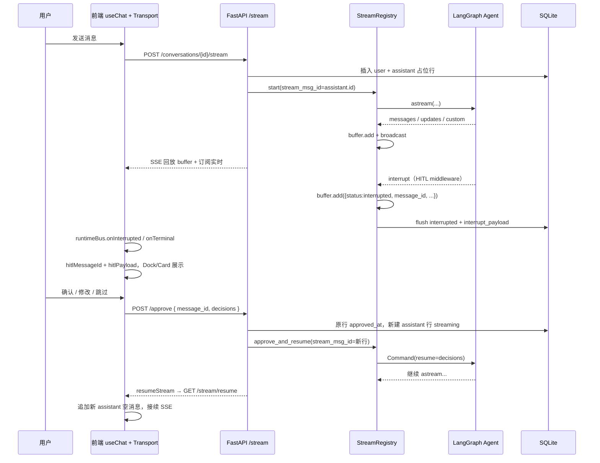

# HITL（Human-in-the-Loop）架构全貌

本文描述数字员工客户端中 **澄清题 / 文档方案确认** 等人机协同（HITL）的端到端设计、数据流与关键代码位置。可恢复流（SSE buffer、resume）的通用机制见 [resumable-stream-architecture.md](./resumable-stream-architecture.md)。

---

## 一、目标与范围

| 目标 | 说明 |
|------|------|
| **可中断** | Agent 在指定工具调用前暂停，等待用户确认后再继续 |
| **可恢复** | 刷新页面、断线后能从 DB + SSE resume 恢复 UI 与审批态 |
| **历史清晰** | 每次 interrupt / approve 对应明确的 DB 行，避免 `message_parts` 被整列覆盖 |
| **审批锚点** | 使用 **`conversation_id` + `message_id`（assistant 行）** 标识待办段 |

**当前已接入 HITL 的会话类型**

- `target_type === "employee"`：员工单聊（长文档技能：`submit_clarifying_questions`、`submit_document_plan`）
- `target_type === "group"`：群聊（若技能启用同类 middleware）

**已接入 HITL 的会话类型（续）**

- `target_type === "curator"`：总管助手（`CuratorView` + `ChatComposerArea`；`get_orchestrator_agent` 在**用户明确要求总管亲自执行**时具备与员工相同的 HITL 工具与 `interrupt_on`；默认仍以编排下发为主）

**涉及的工具名（前端常量）**

- `submit_clarifying_questions` — 澄清问卷（底部 Dock）
- `submit_document_plan` — 方案大纲确认（`DocumentPlanCard`）

---

## 二、核心概念

### 2.1 LangGraph 线程 vs DB 消息行

```
LangGraph thread_id  = conversation_id     （整轮任务状态一份，不因 HITL 分段而断开）

DB 消息（一轮用户提问内可多段 assistant）:
  user
  assistant #1  streaming → interrupted     ← 澄清或方案门
  [POST /approve(message_id=#1)]
  assistant #2  streaming → interrupted
  [POST /approve(message_id=#2)]
  assistant #3  streaming → completed
```

- **图状态**：`configurable.thread_id = conversation_id`，`Command(resume=decisions)` 在 approve 后恢复。
- **展示状态**：每段 `astream` 对应 **一行** `conversation_message`（`role=assistant`），段结束为 `stream_state=interrupted|completed|error`。

### 2.2 同一条 assistant 上的两套数据

一次 interrupt 落库后，**同一条** assistant 消息上常同时存在：

| 字段 | 内容 | 用途 |
|------|------|------|
| `message_parts` | 从 buffer 抽取的 **已完成** tool（如澄清已提交）+ text | 气泡内历史展示 |
| `extra_meta.interrupt_payload` | **待审批** 的 `action_requests` / `review_configs` | HITL 卡片参数、Composer 锁定 |
| `stream_state` | `interrupted` | 会话/消息状态机 |
| `content` | 中断前最后一段展示文案 | 纯文本兜底 |

`interrupt_payload` **不会**自动进入 `message_parts`（extractor 主要认 ToolMessage 流事件）。刷新后需 **`stored-message-hitl-utils`** 合成 pending tool part。

---

## 三、端到端数据流（主路径）

### 3.1 总览图



### 3.2 后端：发起流

**入口**：`POST /chat/conversations/{id}/stream` → `ChatService.stream_conversation_answer`

1. 写入 user 消息。
2. `_append_message` 创建 **assistant 占位**（先不写 `streaming`，避免 `start` 失败留僵尸行）。
3. `registry.start(..., stream_msg_id=assistant_msg.id)` 启动后台 `_run_agent_background`。
4. `start` 成功后：`assistant.stream_state = streaming`，`conversation.status = running`。
5. `async for chunk in resume_conversation_stream(...)` 向客户端吐 SSE（无额外管理首包；interrupt 时见 §3.3）。

关键文件：

- `apps/server/src/service/chat_service.py` — `stream_conversation_answer`
- `apps/server/src/service/stream_registry.py` — `start`, `_run_agent_background`

### 3.3 后端：流式事件与 buffer

后台循环 `agent.astream(..., stream_mode=[...])`：

- 普通 LangGraph 事件 → `task.buffer.add(serializable)` → `broadcast` 给 SSE 订阅者。
- `tool_output` 自定义事件 → 同样进 buffer。
- Checkpoint：buffer 事件数超过阈值时写 `message_parts` 兜底（见 resumable-stream 文档）。

**SSE 形态**（live / resume 共用）：

```
id: {seq}
data: {"type":"messages","data":[...]}

id: {seq}
data: {"status":"interrupted","message_id":672,"action_requests":[...],"review_configs":[...]}

data: [DONE]
```

管理事件（已结束再连 resume）：

```json
{"type":"stream_ended","data":{"status":"interrupted","message_id":672,"interrupt_payload":{...}}}
```

### 3.4 后端：检测 interrupt 并落库

`_run_agent_background` 在 `astream` 结束后：

1. `agent.aget_state(config)`，检查 `state.next` 与 `state.tasks[].interrupts`。
2. 若有中断：`_extract_interrupt_payload` → `action_requests` / `review_configs`。
3. `buffer.add({ status: "interrupted", message_id: stream_msg_id, ...payload })`。
4. `_flush_terminal(..., state="interrupted", interrupt_payload=...)`：
   - `message_parts` ← `extract_message_parts_from_buffer(全 buffer)`
   - `extra_meta.interrupt_payload` ← payload
   - `stream_state` ← `interrupted`

关键文件：

- `apps/server/src/service/stream_registry.py` — `_extract_interrupt_payload`、interrupt 分支
- `apps/server/src/service/message_parts_extractor.py` — parts 抽取

### 3.5 后端：审批与恢复

**入口**：`POST /chat/conversations/{id}/approve`  
Body：`{ "message_id": <int>, "decisions": [...] }`

`ChatService.approve_trigger`：

1. 校验：`message_id` 存在、`role=assistant`、`stream_state=interrupted`、未 `approved_at`。
2. 原行：`extra_meta.approved_at = now`（保持 `interrupted`，封存段）。
3. **新建** assistant 行：`stream_state=streaming`，`stream_cursor=0`。
4. 按 `target_type` 重建 agent（employee / **curator orchestrator**）。
5. `registry.approve_and_resume(..., stream_msg_id=new_msg.id, decisions=...)`：
   - 内部 `Command(resume={"decisions": decisions})` 继续图执行。
6. 返回：`approved_message_id`、`assistant_message_id`。

关键文件：

- `apps/server/src/schemas/conversation.py` — `ApproveRequest`
- `apps/server/src/api/chat_api.py` — approve 路由
- `apps/server/src/service/chat_service.py` — `approve_trigger`
- `apps/server/src/service/stream_registry.py` — `approve_and_resume`

### 3.6 前端：SSE → UI 状态

**Transport**：`LangChainChatTransport`（`apps/web/src/lib/chat/langchain-chat-transport.ts`）

| SSE 载荷 | 行为 |
|----------|------|
| `status === "interrupted"` | `conversationRuntimeBus.emitInterrupted` + `onInterrupted`，关闭流 |
| `type === "stream_ended"` | `emitTerminal`；若 `interrupted` 同样恢复 HITL |
| `type === "messages"` 等 | `parseLangChainPayloadToChunks` → `useChat` parts |
| `[DONE]` | 正常结束 |

**会话单例状态**：`useConversationSession`（`apps/web/src/hooks/use-conversation-session.ts`）

- `hitlMessageId` / `hitlPayload`：来自 bus 或 **hydrate**（`extractInterruptStateFromStoredMessages`）。
- `tryResumeOnce`：最后一条 assistant `stream_state===streaming` 时 `resumeStream()`。
- `onHitlApproved`：`approve` 成功后 `setMessages` 追加新 assistant 行，再 `resumeStream()`。

**已接 HITL 的视图**

- `ConversationChatView`、`DraftChatView` → `ChatPanel` → `ChatComposerArea`（Dock + 占位符锁定）
- `CuratorView` → 时间线内 `RenderClassifiedBlocks` + 底部 `ChatComposerArea`
- `DocumentPlanCard` / `ClarifyingQuestionsDock` → `approveHitl(conversationId, messageId, decisions)`

**DB → UI 还原**

- `mapStoredMessagesToUIMessages` + `enrichAssistantPartsFromStoredMessage`：为 `interrupted` 行合成 pending `tool-*` part，便于卡片渲染。
- `dedupeHitlPartsInMessages`：去掉已 resolve 的重复 HITL part。

关键文件：

- `apps/web/src/lib/chat/stored-message-hitl-utils.ts`
- `apps/web/src/lib/chat/conversation-runtime-bus.ts`
- `apps/web/src/components/chat/panel/chat-composer-area.tsx`
- `apps/web/src/components/chat/message-blocks/document-plan-card.tsx`
- `apps/web/src/components/chat/message-blocks/clarifying-questions-dock.tsx`
- `apps/web/src/api/conversation.ts` — `approveHitl`

---

## 四、decisions 与工具行为（摘要）

前端 `HitlDecision` 与 LangGraph HITL middleware 对齐，例如：

- `{ "type": "approve" }` — 按原 args 继续
- `{ "type": "edit", "edited_action": { "name", "args" } }` — 改稿后继续
- `{ "type": "reject", "message": "..." }` — 拒绝/跳过

具体工具展示与校验见 `document-plan-card.tsx`、`clarifying-questions-dock.tsx` 及 `hitl-tool-call-resolve.ts`。

澄清 Dock 的 **Skip** 与「提交全部」同链路：对当前 `message_id` 调用 `POST /approve`，decision 为 `{ type: "reject", message: "用户跳过澄清" }`，成功后 `onHitlApproved` 清 HITL 并 `resumeStream`。**不要**调用 `POST /stream/cancel`（interrupt 后 registry 通常已无活跃流，会 400）。

---

## 五、与可恢复流的关系

| 场景 | 行为 |
|------|------|
| 流式进行中刷新 | `GET /stream/resume` 全量回放 buffer → 订阅 live；前端 `stream_cursor` 可用来跳过已持久化段（**优化待办**） |
| 已 interrupted | `get_stream_status` → 直接 `stream_ended` + `interrupt_payload`，无 agent 事件 |
| 僵尸 `streaming` 行 | resume 时自动修为 `error` 并结束 SSE |

详见 [resumable-stream-architecture.md](./resumable-stream-architecture.md)。

---

## 六、状态机（assistant 行）

```
(创建占位) → streaming → interrupted   [用户审批]
                ↓              ↓
            completed      (approved_at 写入，行封存)
                ↓
            error / cancelled
```

approve 后 **新行** 再次 `streaming → ...`，旧行保持 `interrupted`。

---

## 七、关键文件索引

| 层级 | 路径 |
|------|------|
| API | `apps/server/src/api/chat_api.py` |
| 流与审批 | `apps/server/src/service/chat_service.py` |
| Buffer / interrupt | `apps/server/src/service/stream_registry.py` |
| Parts 抽取 | `apps/server/src/service/message_parts_extractor.py` |
| Schema | `apps/server/src/schemas/conversation.py` |
| SSE 解析 | `apps/web/src/lib/chat/langchain-chat-transport.ts` |
| Chunk 解析 | `apps/web/src/lib/chat/langchain-stream-parser.ts` |
| 会话 HITL 状态 | `apps/web/src/hooks/use-conversation-session.ts` |
| 历史还原 | `apps/web/src/lib/chat/stored-message-hitl-utils.ts` |
| UI | `chat-composer-area.tsx`, `document-plan-card.tsx`, `clarifying-questions-dock.tsx` |

---

## 八、待办与优化

以下按优先级列出。**实现状态：流程已打通（员工单聊）**；表中「待做」为体验与覆盖范围增强。

### P0 — 体验 / 性能

#### 1. 大文档 resume 回放卡顿（待做）

**现象**：写长文档时 buffer 累积数千条 SSE 事件；刷新或 `resumeStream` 时前端逐条 `enqueue` UIMessageChunk，`useChat` 触发大量 React 更新，页面明显卡顿。

**根因**：

- 后端 `resume_conversation_stream` Phase 1 **全量回放** `task.buffer._events`（见 `chat_service.py`）。
- 前端 `LangChainChatTransport` 默认 **rAF 批处理**仍会在高密度流下产生成千上万次状态更新。

**建议方案**（可组合）：

| 方向 | 做法 |
|------|------|
| 后端 | `GET /stream/resume?from_cursor={stream_cursor}`，只回放 `seq > cursor` 的事件；cursor 来自 DB `conversation_message.stream_cursor` |
| 前端 | reconnect 模式：**合并 enqueue**（每 32–48ms 或每 N 个 chunk 批量 `controller.enqueue`），replay 结束后再恢复逐帧 |
| 产品 | 刷新后若已有 `message_parts`，列表以 DB 为准，resume 只追 **tail** 增量（需与 `tryResumeOnce` 协调） |

**验收**：同一会话 3000+ buffer 事件，刷新后 1–2s 内可交互，无明显长时间白屏/假死。

---

### P1 — 功能覆盖

#### 2. 界面消息合并展示（待做）

**现状**：每次 approve 新建一条 assistant DB 行，列表中出现 **多条连续 assistant 气泡**（同轮用户提问内），历史可读但占屏。

**目标**：**数据层仍多行**（利于审计与 `message_id` 审批），**展示层**将「上一 user 之后、下一 user 之前」的连续 assistant 合并为 **一条气泡**。

**建议**：

- 新增 `mergeConsecutiveAssistantMessages(messages)`，仅用于渲染 pipeline（`ConversationChatView` / `DraftChatView` / `CuratorView` timeline 输入前）。
- 合并规则：`parts` 拼接；`metadata.streamState` 取最后一条；`metadata.hitlAnchorMessageId` 指向 `interrupted` 行 id，供 `DocumentPlanCard` approve。
- `useChat` / composer 仍用 **未合并** 列表，避免 toolCallId 错乱。

**验收**：一轮内澄清 + 方案 + 正文，UI 显示为一个 assistant 块；approve 仍带正确 `message_id`。

---

### P2 — 数据与运维

| 项 | 说明 |
|----|------|
| `message_parts` 与 interrupt 一致性 | 极端情况下 parts 仅含已完成 tool，pending 靠 `interrupt_payload` + 合成 part |
| Curator 多段 HITL | 与员工相同的多行 assistant 模型；合并展示后需回归 |

---

## 九、排查清单

| 症状 | 可能原因 |
|------|----------|
| Dock 不显示 | `hitlPayload` 未写入（Draft 未接 session、或未收到 interrupted） |
| approve 404 / 状态错误 | `message_id` 不是 `interrupted` 行，或已 `approved_at` |
| resume 后 tool invocation not found | resume 流缺少 `tool-input-start`；检查 `langchain-stream-parser` 与 approve 后新 assistant 行 |
| 刷新后只有方案卡无澄清 Answers | `message_parts` 被覆盖或解析格式不符；检查 `clarifying-questions-utils` |
| 卡顿 | 见 [§八.1 大文档 resume](#1-大文档-resume-回放卡顿待做) |

---

## 十、修订记录

| 日期 | 说明 |
|------|------|
| 2026-05-24 | 初版：message_id 模型、数据流、待办（resume 性能 / Curator HITL / 消息合并） |
