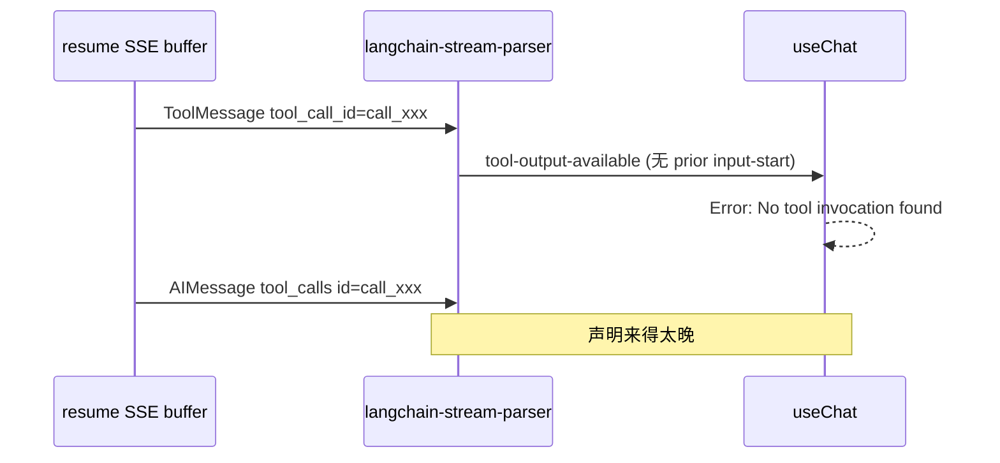

# HITL / Resume：`No tool invocation found for tool call ID` 说明

本文说明聊天流式场景下前端报错 **`No tool invocation found for tool call ID "call_…"`** 的成因与修复方式。与 [hitl-architecture.md](./hitl-architecture.md) 中的 HITL、resume 机制配套阅读。

---

## 1. 现象

- 出现在 **浏览器控制台** 或界面异常，多在以下操作之后：
  - 刷新页面后自动 **`resumeStream()`**（`GET /stream/resume`）
  - HITL **approve** 成功后再次 `resumeStream()`
  - 长文档流式过程中切走再切回会话
- 典型文案（来自 `@ai-sdk/react` 的 `useChat` 内部校验）：

```text
No tool invocation found for tool call ID "call_171c8e1e8b2444e0bbd0e55d"
```

- 含义：当前这条 assistant 消息的 parts 状态里，**尚未登记** `toolCallId === call_…` 的 tool 调用，却收到了该 id 的 **`tool-output-*` / `tool-output-available`** 等 chunk。

---

## 2. 机制：`useChat` 对 tool 的生命周期要求

前端 `LangChainChatTransport` 把 SSE 解析为 `UIMessageChunk` 序列，`useChat` 要求对**每个** `toolCallId` 大致按序出现：

```text
tool-input-start
  → tool-input-available（可选 tool-input-delta）
    → tool-output-available / tool-output-error
```

若 **先** 收到 `tool-output-available` 且之前没有 `tool-input-start`，SDK 会抛上述错误。

相关实现：

| 文件 | 作用 |
|------|------|
| `apps/web/src/lib/chat/langchain-stream-parser.ts` | LangGraph `messages` / `updates` → UIMessageChunk |
| `apps/web/src/lib/chat/hitl/interrupt-stream-chunks.ts` | interrupt 时从 `message_parts` 补 `tool-input-start` |
| `apps/web/src/lib/chat/langchain-chat-transport.ts` | SSE 读取、reconnect 批处理、interrupt 收尾 |

---

## 3. 根因（按常见程度）

### 3.1 Resume 回放事件顺序与 live 不一致（最常见）

后端 `resume_conversation_stream` **Phase 1** 会按 buffer **时间顺序** 全量回放 LangGraph 事件（见 `chat_service.py`）。

回放里经常出现：

1. 先出现 **ToolMessage**（工具已执行完，`tool_call_id = call_xxx`）
2. 更晚才出现带 **`tool_calls`** 的 AIMessageChunk（声明 `call_xxx`）

在 **live 流** 里顺序通常相反；**resume 冷回放** 则容易颠倒。  
若解析器直接 `enqueue(tool-output-available)` 而未先补 `tool-input-start`，即触发报错。



### 3.2 ToolMessage 缺少 `name`，补登记被跳过

`buildToolOutputChunksFromToolMessage` 中，仅当能解析出 **`resolvedToolName`** 时才会调用 `ensureToolInvocationBeforeOutput`：

```880:890:apps/web/src/lib/chat/langchain-stream-parser.ts
  if (resolvedToolName && !pending?.sentInputStart) {
    pending = ensureToolInvocationBeforeOutput(
      state,
      {
        toolCallId,
        toolName: resolvedToolName,
        ...
      },
      result
    )
  }
```

若 buffer 里 ToolMessage **只有** `tool_call_id`、没有 `name`，且此前 `updates` 也未登记该 id，则**不会**补 `tool-input-start`，仍会 `tool-output-available` → 报错。

### 3.3 `toolCallId` 不一致（合成 id vs 真实 call_*）

| 来源 | 典型 id |
|------|---------|
| DB `message_parts` / `build_pending_hitl_parts` 回退 | `hitl-{stream_msg_id}-0` |
| LangGraph / OpenAI 流 | `call_171c8e1e8b2444e0bbd0e55d` |

- **刷新 hydrate**：`stored-message-hitl-utils` 用 `hitl-{messageId}` 合成 pending part。
- **resume 回放**：事件里是真实 **`call_*`**。

若同一条逻辑工具在 UI 上混用两套 id（合成 pending + 回放 output），也会出现「有 output 找不到 invocation」。

后端在 flush interrupt 时会尽量从 buffer 取真实 id（`hitl_pending_parts._extract_tool_call_id_from_buffer`）；取不到才回退 `hitl-{msgId}`。

### 3.4 HITL approve 后 `resumeStream` 与本地 messages 状态

`onHitlApproved` 会：

1. 往 `useChat.messages` **追加**新的空 assistant 行（`assistant_message_id`）
2. `resumeStream()` → 新 SSE 从 `{ type: "start" }` 开始，再回放 buffer + tail

若回放片段里含有**上一轮**工具调用的 `call_*` output，而当前 parser 状态未在该连接上为先前注册 input-start，仍会报错。常见于 **buffer 很大、多段 HITL/多工具** 的会话。

### 3.5 Interrupt 包里的 `message_parts` 只在「当次 interrupt 流末尾」注入

`langchain-chat-transport` 在收到 `status === "interrupted"` 时，于流结束前调用 `buildHitlInterruptStreamChunks(message_parts)` 补 `tool-input-start` / `tool-input-available`。

**`GET /stream/resume` 回放** 走的是普通 `parseLangChainPayloadToChunks` 路径，**不会**自动在连接开头重放 DB 里 pending 的 `message_parts`（除非事件流里再次带上 interrupted 包）。

因此：**仅靠 interrupt 当次补 chunks，无法保证 resume 回放顺序安全。**

### 3.6 其它

- 同一连接 **重复** `resumeStream()`，前一次 parser/`useChat` 状态与后一次 chunk 交错（已有 `status === "streaming"` 防护，但竞态仍可能发生）。
- Reconnect 批处理只减少 enqueue 次数，**不改变** chunk 类型顺序。

---

## 4. 已实现修复（仓库现状）

### 4.1 `ensureToolInvocationBeforeOutput` + `resolveToolNameForInvocation`（核心）

**文件**：`apps/web/src/lib/chat/langchain-stream-parser.ts`

在输出 **`tool-output-available` / `tool-output-error` / 流式 tool_output** 之前，若本 SSE 连接尚未对该 `toolCallId` 发送 `tool-input-start`，则先补：

- `tool-input-start`
- `tool-input-available`（有 `input` / `inputText` 时）

用于缓解 **resume 回放 ToolMessage 早于 tool_calls 声明** 的问题。

**§5.1（2026-05-24）**：ToolMessage 无 `name` 时通过 `resolveToolNameForInvocation` 回退为 `"tool"`，不再跳过补登记。

### 4.2 Interrupt 时 `buildHitlInterruptStreamChunks`

**文件**：`apps/web/src/lib/chat/hitl/interrupt-stream-chunks.ts`

当 live 流以 `status: "interrupted"` 结束且带 `message_parts` 时，对其中 `state === "input-available"` 的 HITL 工具补 input chunks，保证 **当次 interrupt 收尾** 时 `useChat` 有 invocation。

### 4.3 后端 pending parts 对齐真实 `tool_call_id`

**文件**：`apps/server/src/service/hitl_pending_parts.py`

`extract_message_parts_for_interrupt` 从 buffer **倒序扫描** `updates` 里 AIMessage 的 `tool_calls.id`，写入 `message_parts` 的 `toolCallId`，减少 `hitl-{id}` 与 `call_*` 不一致。

### 4.4 Reconnect 批处理（性能，非本错误根因）

**文件**：`langchain-chat-transport.ts`  
减轻 resume 卡顿，不直接修复 invocation 顺序。

---

## 5. 仍出现报错时的修复方式

### 5.1 前端：加强 `ensureToolInvocationBeforeOutput` 触发条件（已实现）

**问题**：§3.2 仅在 `resolvedToolName` 非空时补登记。

**实现**（`apps/web/src/lib/chat/langchain-stream-parser.ts`）：

- `resolveToolNameForInvocation`：hint → pending → `toolNamesById` → 回退 `"tool"`。
- `buildToolOutputChunks` / `buildToolOutputStreamingChunks`：只要有 `toolCallId` 且未 `sentInputStart`，一律先 `ensureToolInvocationBeforeOutput`。

**验收**：resume 同一会话不再出现 `No tool invocation found`；HITL approve 后继续写文档正常。

### 5.2 前端：Resume 连接开头注入「已登记 tool」快照（可选）

在 `reconnectToStream` 的 `processResponseStream` 中，若已知当前会话最后一条 assistant 的 `message_parts` 含 `input-available` 的 HITL part：

1. 在 `{ type: "start" }` 之后、读取 buffer 之前，`enqueue(buildHitlInterruptStreamChunks(parts))`
2. 仅针对 **尚未 output** 的 pending part，避免与已完成 tool 重复

适用于：**刷新后立刻 resume** 且 DB 里仍有 pending（未 approve）的场景。

### 5.3 前端：Hydrate 与回放 id 统一（可选）

- `enrichAssistantPartsFromStoredMessage` 合成 part 时，若 `extra_meta` / buffer 能关联真实 `call_*`，勿仅用 `hitl-{messageId}`。
- 或 resume 前 `setMessages` 清空当前轮 assistant 上**无对应 invocation 的** tool parts（激进，需仔细验证）。

### 5.4 后端：Resume 只追 tail（中长期）

见 [hitl-architecture.md §八.1](./hitl-architecture.md#1-大文档-resume-回放卡顿部分完成)：

- `from_cursor` 增量回放，或
- 刷新后 UI 以 DB `message_parts` 为准，resume 只推 `cursor` 之后事件

减少全量 replay 里「历史 ToolMessage 乱序」砸在当前 `useChat` 状态上的概率。

### 5.5 产品侧规避

- approve 后若新 assistant 行已开始 streaming，避免再次触发 `tryResumeOnce`（已有 status 判断，保持即可）。
- 长文档会话刷新后，先展示 DB 历史，**延迟** `resumeStream`（`requestIdleCallback` / 双 rAF），降低与 hydrate 竞态。

---

## 6. 排查清单

| 检查项 | 做法 |
|--------|------|
| 是否发生在 **resume 之后** | 看 Network 是否 `GET .../stream/resume`；看 DEV `[sse:resume]` 日志 |
| 报错里的 **toolCallId** | `call_*` → 多为 buffer 回放；`hitl-*` → 多为 DB 合成与回放不一致 |
| 该 id 是否在 **message_parts** | `GET .../messages` 看同轮 assistant 的 `toolCallId`、`state` |
| buffer 顺序 | 后端日志 `[resume] full buffer replay: N events`，对照是否 ToolMessage 早于 tool_calls |
| 是否 **approve 后** 立即 resume | 看 `onHitlApproved` → `resumeStream` 与新 `assistant_message_id` |
| `ensureToolInvocation` 是否命中 | 在 `buildToolOutputChunksFromToolMessage` 对 `resolvedToolName` 为空加临时日志 |

---

## 7. 与 HITL 数据模型的关系

- **未 approve** 的 `interrupted` 行：应用 `interrupt_payload` / `message_parts` 展示 Dock、方案卡；不依赖本次 resume 回放顺序。
- **已 approve** 的行：封存；后续工具 output 在**新 assistant 行**的 `message_parts` 或 resume 事件中，必须使用**与回放一致的 `toolCallId`** 先完成 input-start 登记。

报错本身**不是**后端 LangGraph 未执行工具，而是 **前端 SSE→chunk 顺序与 `useChat` 状态机不一致**。

---

## 8. 修订记录

| 日期 | 说明 |
|------|------|
| 2026-05-24 | 初版：成因、已实现修复、后续改法、排查表 |
| 2026-05-24 | §5.1 落地：`resolveToolNameForInvocation`，output 前一律补 invocation |
