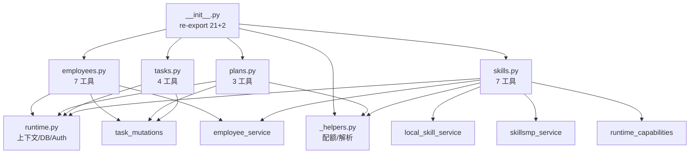

# 总管工具布局（`orchestrator/tools/`）

> 2026-06-01 重构：将 812 行单文件 `tools.py` + 旁路 `employee_tools.py` / `recruitment_tools.py` 拆分为 4 类子包。本文件是重构后的**唯一权威参考**，新增/移动工具前请先看这里。

---

## 一、设计原则

1. **按"职能域"分组**，不按"技术细节"分层——招聘录用和员工 CRUD 都属于"员工管理"，放同一文件。
2. **每个子模块一个 docstring 概述职责**；不需要到工具函数级别再加注释。
3. **`@tool` 装饰器必须保留**；函数名、参数 schema、docstring 是 LangGraph checkpointer 序列化的依据，**禁止改动**。
4. **公共导入统一走 `__init__.py` re-export**：测试、文档、其他模块只 import `from src.service.agent.orchestrator.tools import xxx`。
5. **私有 helper 以下划线开头**，仅供本子模块内部使用；如需跨模块复用，提升到 `_helpers.py`。

---

## 二、子模块职责矩阵

| 子模块 | 工具 | 关键依赖 | 备注 |
|--------|------|----------|------|
| `employees.py` | `list_workspace_employees`<br>`get_employee`<br>`update_employee`<br>`delete_employee`<br>`recruit_employee`<br>`hire_employee`<br>`hire_employees` | `runtime`、`recruitment`、`employee_service`、`db.session`、`json_list_parse` | 7 个工具；含 `build_employee_update_payload` / `_ensure_workspace_employee` / `_is_reserved_name` 三个 helper |
| `plans.py` | `create_orchestration_plan`<br>`confirm_orchestration_plan`<br>`cancel_plan` | `runtime`、`confirmation_policy`、`execution`、`task_validation`、`_helpers.parse_orchestration_task_list` | 3 个工具；编排计划生命周期 |
| `tasks.py` | `list_tasks`<br>`update_task`<br>`delete_task`<br>`delete_tasks_batch` | `runtime`、`task_mutations` | 4 个工具；子任务管理 |
| `skills.py` | `list_workspace_skills`<br>`get_workspace_skill_detail`<br>`list_builtin_skills`<br>`install_builtin_skill`<br>`search_market_skills`<br>`get_market_skill_detail`<br>`install_market_skill` | `runtime`、`_helpers`（市场配额）、`local_skill_service`、`skillsmp_service`、`employee_service`、`runtime_capabilities` | 7 个工具；含 `format_workspace_skills_list` 公共 helper + 8 个内部 helper |
| `_helpers.py` | — | `runtime` | **非工具**，仅共享辅助：`parse_orchestration_task_list`、`resolve_conv_id`、`reset_market_detail_count` / `take_market_detail_slot`（市场配额状态）、`SKILL_MARKET_URL`、`MARKET_SKILL_SEARCH_LIMIT=3`、`MARKET_SKILL_DETAIL_MAX=3` |
| `__init__.py` | — | 全部子模块 | 模块概览 + 21 个公共符号的全量 re-export |

合计 **21 个 `@tool` 工具 + 2 个公共 helper**（`format_workspace_skills_list`、`build_employee_update_payload`）。

---

## 三、依赖图



**关键约束**：
- 任何子模块不得反向 import `__init__.py`（避免循环）
- `_helpers.py` 是叶子节点，只被 `plans.py` 和 `skills.py` 引用
- `recruitment.py` 是**业务后端**（非工具），只被 `tools/employees.py` 引用

---

## 四、`__init__.py` re-export 清单

```python
from src.service.agent.orchestrator.tools._helpers import (
    MARKET_SKILL_DETAIL_MAX,
    MARKET_SKILL_SEARCH_LIMIT,
    SKILL_MARKET_URL,
    parse_orchestration_task_list,
    reset_market_detail_count,
    resolve_conv_id,
    take_market_detail_slot,
)
from src.service.agent.orchestrator.tools.employees import (
    build_employee_update_payload,   # 公共 helper
    delete_employee,
    get_employee,
    hire_employee,
    hire_employees,
    list_workspace_employees,
    recruit_employee,
    update_employee,
)
from src.service.agent.orchestrator.tools.plans import (
    cancel_plan,
    confirm_orchestration_plan,
    create_orchestration_plan,
)
from src.service.agent.orchestrator.tools.skills import (
    format_workspace_skills_list,    # 公共 helper
    get_market_skill_detail,
    get_workspace_skill_detail,
    install_builtin_skill,
    install_market_skill,
    list_builtin_skills,
    list_workspace_skills,
    search_market_skills,
)
from src.service.agent.orchestrator.tools.tasks import (
    delete_task,
    delete_tasks_batch,
    list_tasks,
    update_task,
)
```

**使用建议**：
- 生产代码（`agent.py`）：统一 `from ...tools import xxx` 一次拉全部
- 测试代码：按子模块 `from ...tools.{employees,skills,...} import xxx` 精确 import，mock 路径也用子模块路径
- 公共 helper（`format_workspace_skills_list`、`build_employee_update_payload`）：从 `tools/` 或具体子模块都能拿到，按需选

---

## 五、Agent 注册

`src/service/agent/orchestrator/agent.py:223-254` 一次性 import 21 个工具，传给 `create_deep_agent(tools=[...])`：

```python
from src.service.agent.orchestrator.tools import (
    cancel_plan, confirm_orchestration_plan, create_orchestration_plan,
    delete_employee, delete_task, delete_tasks_batch,
    get_employee, get_market_skill_detail, get_workspace_skill_detail,
    hire_employee, hire_employees,
    install_builtin_skill, install_market_skill,
    list_builtin_skills, list_tasks, list_workspace_employees,
    list_workspace_skills,
    recruit_employee, search_market_skills,
    update_employee, update_task,
    # HITL 门：用户明确要求总管亲自执行时使用
    submit_clarifying_questions, submit_document_plan,
    # 通用工具（不属于 tools/ 包）
    shell_execute_tool, remember_memory_tool,
)
```

**新增工具的注册清单**：
1. 在对应子模块添加 `@tool def xxx()` 函数
2. 在 `tools/__init__.py` 的对应 import 块 + `__all__` 列表加入
3. 在 `agent.py` 的 `tools=[...]` 列表加入
4. 跑 `uv run pytest` 验证（150+ 测试应全绿）

---

## 六、测试要点

### 现有测试覆盖

| 测试文件 | mock 目标 | 覆盖范围 |
|---------|----------|---------|
| `tests/test_employee_tools.py`（11 项） | `tools.skills.LocalSkillService.list_local_skills` / `get_local_skill_detail` | 技能 listing、CRUD、Session 失效 |
| `tests/test_create_orchestration_plan.py`（1 项） | `tools.create_orchestration_plan` | plan 数字 ID 返回 |
| `tests/test_orchestration_task_list.py`（3 项） | `tools.parse_orchestration_task_list` | JSON/数组解析 |
| `tests/test_task_mutations.py`（10 项） | `tools.delete_task` / `update_task` / `delete_tasks_batch` / `list_tasks` | 子任务 CRUD + Session 隔离 |
| `tests/test_skillsmp_service.py`（5 项） | `skillsmp_service` 内部 | SkillsMP 协议 |
| `tests/test_recruitment.py`（5 项） | `recruitment.py` 内部 | 招聘录用业务后端 |
| `tests/test_orchestrator_runtime_auth.py`（1 项） | runtime.auth | Auth token 解析 |
| `tests/conftest.py:73` fixture `patched_employee_tools_db` | `tools.employees.get_session_local` | 测试库 Session 注入 |

### 关键 mock 路径模板

```python
# 技能 listing 相关
monkeypatch.setattr(
    "src.service.agent.orchestrator.tools.skills.LocalSkillService.list_local_skills",
    lambda workspace_id: [...],
)

# Session 隔离（Employee CRUD）
monkeypatch.setattr(
    "src.service.agent.orchestrator.tools.employees.get_session_local",
    lambda: session_factory,
)
```

**注意**：mock 路径必须使用 `tools.{employees,skills,...}` 子模块路径，而非 `tools` 包路径。

### 添加新工具的测试 checklist

- [ ] 在对应子模块加 `@tool` 函数
- [ ] 若涉及 DB/远程服务，添加 fixture（参考 `patched_employee_tools_db`）
- [ ] 若涉及 LangChain tool calling，添加 `.invoke({...})` 单测
- [ ] `uv run pytest` 跑通；总测试数 +1

---

## 七、迁移与历史

| 阶段 | 文件 | 备注 |
|------|------|------|
| 重构前 | `tools.py`（812 行单文件）<br>+ `employee_tools.py`（435 行）<br>+ `recruitment_tools.py`（112 行） | 三个文件分散，文档无统一概览 |
| 第一轮（6 子模块） | `tools/_helpers.py` / `employees.py` / `plans.py` / `tasks.py` / `builtin_skills.py` / `market_skills.py` | 拆得略细，技能相关分散在 builtin + market + employee_tools 三个地方 |
| **第二轮（4 子模块，最终态）** | `tools/_helpers.py` / `employees.py` / `plans.py` / `tasks.py` / `skills.py` | 技能统一到 `skills.py`；员工管理（含招聘）统一到 `employees.py`；21 个工具 re-export |

详见 `docs/changelog-2026-06-01.md` 第 10 节。
