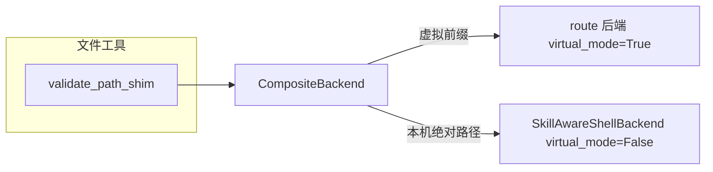

# 物理路径能力复盘报告

> 最后更新：2026-06-11

> ⚠️ **P1 已切换为「单轨真实路径」（去虚拟前缀）**：CompositeBackend 虚拟路由、
> `/artifacts/` 等前缀寻址、`validate_path_shim`、shell rewrite **均已删除**；Agent
> 全部使用真实磁盘绝对路径，目录经 env 注入（`$ARTIFACTS_DIR`/`$SKILLS_DIR`/
> `$UPLOADS_DIR`/`$SKILLS_DRAFT_DIR`/`$MEMORIES_DIR`）；放行绝对路径的逻辑已并入
> `compatible_filesystem_middleware.install_compatible_filesystem_middleware()`；
> **技能目录放开写**（agent 可改技能）。设计见
> [`docs/superpowers/specs/2026-06-11-remove-virtual-paths-design.md`](../../../docs/superpowers/specs/2026-06-11-remove-virtual-paths-design.md)，
> P1 计划见
> [`docs/superpowers/plans/2026-06-11-remove-virtual-paths-p1-server-core.md`](../../../docs/superpowers/plans/2026-06-11-remove-virtual-paths-p1-server-core.md)。
> **资源 API / 工作台分桶 / browserctl（P2-P4）尚未适配**，下文「双轨」描述为被取代的旧设计，留作背景。

单机桌面数字员工（P1 前）默认 **物理路径模式**（`AGENT_VIRTUAL_MODE=0`）：Agent 可直接读写本机绝对路径，同时保留 `/artifacts/`、`/uploads/`、`/skills/` 等虚拟交付物体系。

---

## 1. 架构：双轨路径



| 层级 | 模块 | 框架原生支持本机路径后 |
|------|------|------------------------|
| **Shim** | `validate_path_shim.py` | 整文件删除 |
| **Pure** | `host_paths.py`、`virtual_paths.py` | 保留 |
| **Prompt** | `prompt_rules.py` | 保留 |
| **集成** | `employee.py`、`orchestrator/agent.py`、`server.py` | 删 `install()` 一行 |

**关键区分**：shell 里 `/skills/` → 磁盘路径的 rewrite 是**产品逻辑**，不是 shim；物理模式下同样需要。

---

## 2. 虚拟 route 状态（`/skills/`、`/artifacts/` 等）

所有 route 在物理模式下仍 **`virtual_mode=True`**，行为与改造前一致。

| 虚拟前缀 | 后端 | read | write | edit | ls |
|----------|------|------|-------|------|-----|
| `/skills/` | `FilesystemBackend` | ✅ | 权限 deny 写 | UTF-8 | ✅ |
| `/agent/` | `FilesystemBackend` | ✅ | deny | UTF-8 | ✅ |
| `/memories/` | `FilesystemBackend` | ✅ | ✅ | UTF-8 only | ✅ |
| `/artifacts/` | `BasicFileFilesystemBackend` | ✅ GBK 回退 | ✅ UTF-8 | ✅ GBK 读→UTF-8 写 | ✅ |
| `/uploads/` | `BasicFileFilesystemBackend` | ✅ | ✅ | ✅ | ✅ |
| `/skills-draft/` | `BasicFileFilesystemBackend` | ✅ | ✅ | ✅ | ✅（员工会话） |
| `/conversation_history/` | `FilesystemBackend` | ✅ | ✅ | UTF-8 | ✅ |

集成测试：[`tests/test_virtual_route_integration.py`](../../tests/test_virtual_route_integration.py)（artifacts write/read/ls、uploads read/ls、skills ls）。

**总管 vs 员工差异**（改造前即有，非回归）：

- 总管无 `/skills-draft/`
- 无 `conversation_id` 时无 `/uploads/`

---

## 3. 本机绝对路径

| 工具 | 行为 |
|------|------|
| **read_file** | shim 放行；文本 GBK→UTF-8 回退链 |
| **edit_file** | 同上读；**写回统一 UTF-8**（GBK 文件 edit 后会变 UTF-8） |
| **write_file** | 新建 UTF-8；已存在文件拒绝（deepagents 语义） |
| **ls** | shim 放行绝对路径 |

默认配置：

- `AGENT_VIRTUAL_MODE` 默认 `"0"`（[`path_access/config.py`](../src/service/agent/path_access/config.py)）
- Electron 未显式设置时注入 `"0"`（[`backend-process.ts`](../../../web/electron/features/backend/backend-process.ts)）

---

## 4. shell_execute 虚拟前缀 rewrite

[`virtual_paths.map_virtual_token`](../src/service/agent/path_access/virtual_paths.py) 在 shell 命令中映射：

| 虚拟 token | 映射目标 |
|------------|----------|
| `/artifacts/` | 会话产物目录（shell cwd） |
| `/uploads/` | 会话 uploads 目录（若存在） |
| `/skills/` | 员工 skills 根目录 |
| `/skills-draft/` | 草稿 skills 目录（若存在） |
| `/memories/` | 员工 memories 目录 |

**物理模式与虚拟模式均 rewrite**（与 `LocalShellBackend.virtual_mode` 无关）。

测试：[`tests/test_shell_virtual_rewrite.py`](../../tests/test_shell_virtual_rewrite.py)。

---

## 5. 三端兼容

| 项 | Windows | macOS | Linux |
|----|---------|-------|-------|
| 路径 shim | `C:/`、`D:\` | `/Users/...` | `/home/...` |
| 虚拟前缀 | 一致 | 一致 | 一致 |
| 文本 GBK 回退 | 主要场景 | 少见 | 少见 |
| **shell prompt** | cmd 规范 | bash/zsh + `/Users/` | bash + `/home/` |
| 多行 `python -c` 落盘 | ✅ NT only | — | — |
| 真机 E2E | 已手动验证 read/edit | 单测覆盖路径 | 单测覆盖路径 |

shell 环境说明由 [`build_shell_environment_section()`](../src/service/agent/path_access/prompt_rules.py) 按 `platform.system()` 分支，注入 [`build_system_prompt()`](../src/service/agent/prompts.py)。

测试：[`tests/test_shell_environment_prompt.py`](../../tests/test_shell_environment_prompt.py)。

文件工具三端示例见 `prompt_rules.build_file_tool_rules(virtual_mode=False)`。

---

## 6. 测试覆盖（97 passed）

| 文件 | 覆盖 |
|------|------|
| `test_host_paths.py` | 三端绝对路径、虚拟前缀边界 |
| `test_virtual_paths.py` | map_virtual_token 全前缀 |
| `test_validate_path_shim.py` | monkey-patch 开关 |
| `test_shell_virtual_rewrite.py` | skills/artifacts/uploads rewrite |
| `test_virtual_route_integration.py` | CompositeBackend read/write/ls |
| `test_basic_file_reader/backend.py` | GBK read、edit→UTF-8 |
| `test_shell_environment_prompt.py` | OS 分支 prompt |

---

## 7. 已知限制与剩余风险

### 已缓解

- ~~shell 中 `/artifacts/` 不 rewrite~~ → 已补 `artifacts_root` / `uploads_root`
- ~~prompt 硬编码 Windows~~ → 已按 OS 分支
- ~~缺虚拟 route 集成测试~~ → 已补

### 仍待关注（低优先级）

1. **`/memories/`、`/skills/` route 的 edit** 仍为 deepagents 硬 UTF-8（应用目录通常 UTF-8，暂未改）。
2. **edit 本机 GBK 文件 → 静默转 UTF-8**：旧版 Notepad 可能乱码（产品选择）。
3. **UNC 路径 `\\server\share`**：shim 不识别。
4. **相对路径 `Desktop/x.md`**：非绝对路径，相对 shell cwd 解析，易读错。
5. **shim 依赖 monkey-patch**：deepagents 升级需回归；见 PEEL_OFF.md。
6. **`AGENT_VIRTUAL_MODE=1`**：本机绝对路径被拒，虚拟 route 仍可用。

---

## 8. 手动回归清单

重启后端（日志应含 `Agent physical path mode: file tools accept host absolute paths`）后：

1. `read_file("C:/Users/.../test.md")` — GBK/UTF-8
2. `edit_file` 同上 — 内容正确，文件变 UTF-8
3. `write_file("/artifacts/demo.md", ...)`
4. 上传附件后 `read_file("/uploads/...")`
5. `shell_execute("python /artifacts/script.py")` — 命令中路径被 rewrite
6. （可选）`AGENT_VIRTUAL_MODE=1` — 本机路径被拒，虚拟路径正常

---

## 9. 相关文件索引

```
path_access/
  __init__.py              # install(), get_path_access_config()
  config.py                # AGENT_VIRTUAL_MODE
  host_paths.py            # is_host_absolute_path
  virtual_paths.py         # map_virtual_token（含 artifacts/uploads）
  validate_path_shim.py    # 可剥离
  prompt_rules.py          # 文件工具 + shell 环境 prompt
  PEEL_OFF.md

basic_file_backend.py      # basic_file_read / basic_file_edit
basic_file_reader.py       # 编码回退
skill_shell_backend.py     # shell rewrite + read/edit 委托
employee.py / orchestrator/agent.py  # CompositeBackend 构建
```
