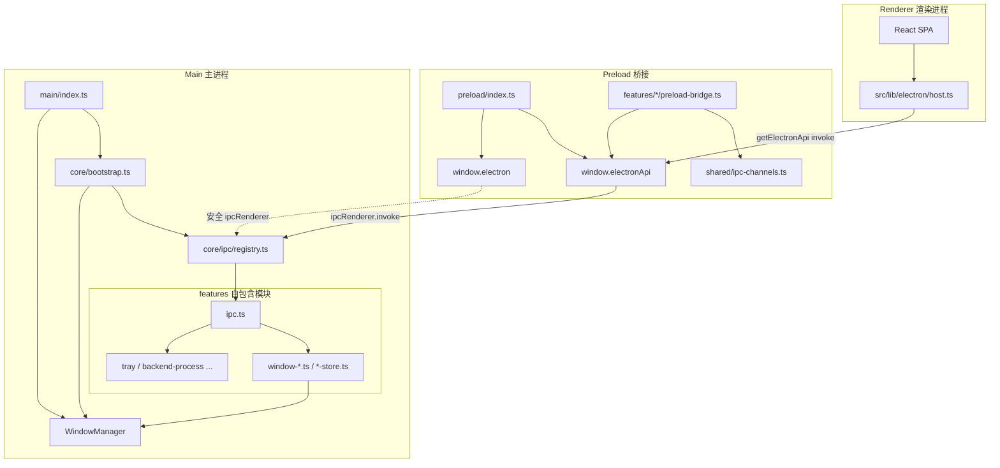
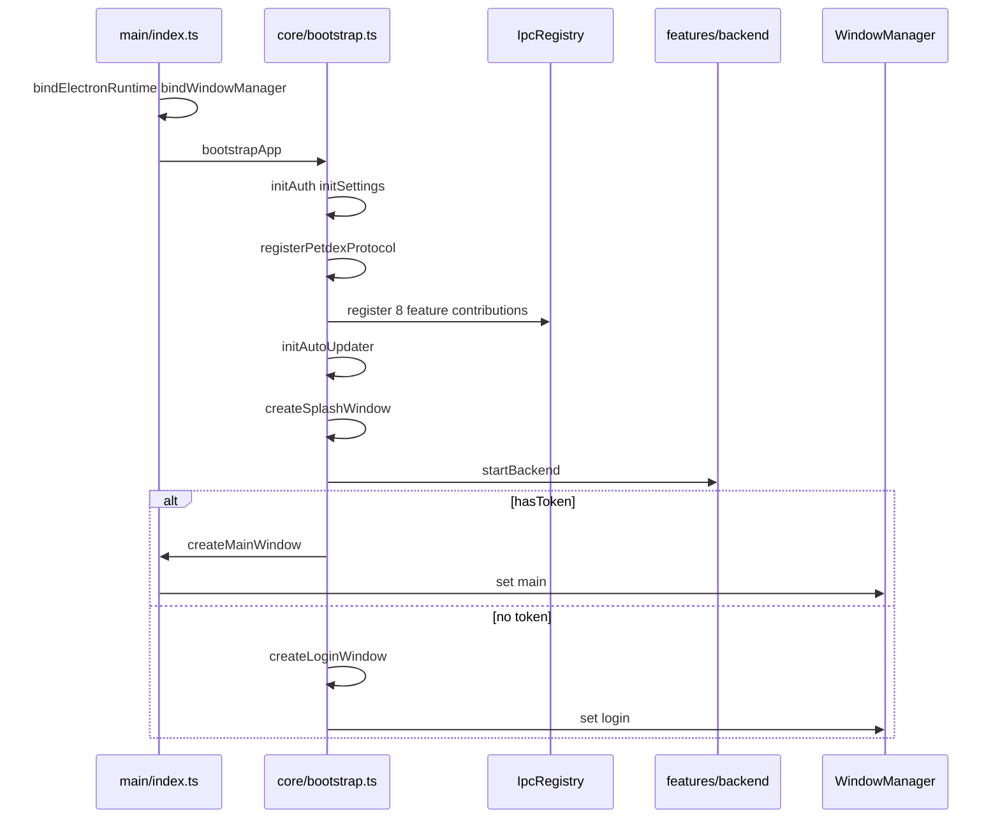
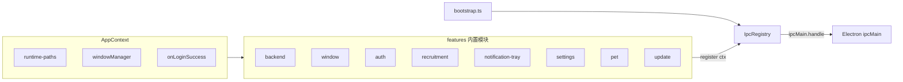
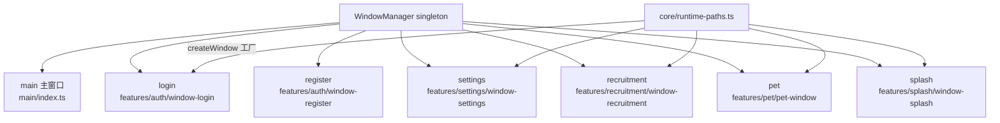
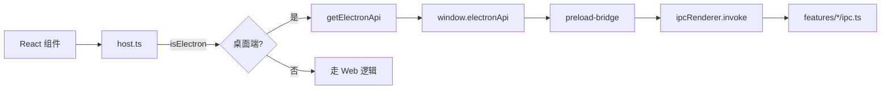
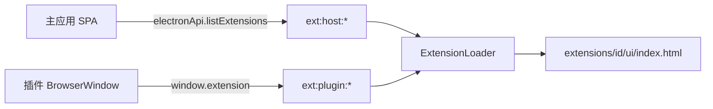

# Electron 架构

## 目录

```
electron/
├── core/                    # 基础设施层
│   ├── app-context.ts       # 共享应用上下文
│   ├── bootstrap.ts         # 启动编排
│   ├── feature.ts           # Feature 接口
│   ├── logger.ts            # electron-log 初始化 + createLogger
│   ├── ipc/
│   │   ├── registry.ts      # IPC 集中注册
│   │   ├── wrap-handler.ts  # IPC 错误边界
│   │   └── types.ts         # IPC 类型定义
│   ├── petdex-protocol.ts   # 协议处理
│   ├── runtime-paths.ts     # 路径工具
│   └── services/
│       ├── lifecycle.ts     # 生命周期管理
│       ├── managed-process.ts   # 通用子进程 spawn/ready/kill
│       ├── window-manager.ts    # 窗口工厂 + 管理
│       └── window-registry.ts   # 单例绑定
├── features/                # 功能模块（自包含：窗口 + Store + IPC + Bridge）
│   ├── index.ts             # 聚合所有 IpcContribution
│   ├── auth/
│   │   ├── auth-store.ts    # 认证持久化
│   │   ├── window-login.ts  # 登录窗口
│   │   ├── window-register.ts # 注册窗口
│   │   ├── ipc.ts           # IPC handlers
│   │   └── preload-bridge.ts # Preload bridge
│   ├── backend/
│   │   ├── backend-process.ts # Python 后端进程管理
│   │   ├── ipc.ts
│   │   └── preload-bridge.ts
│   ├── notification-tray/
│   │   ├── tray.ts          # 系统托盘
│   │   ├── notification.ts  # 系统通知
│   │   ├── ipc.ts
│   │   └── preload-bridge.ts
│   ├── pet/
│   │   ├── pet-window.ts    # 桌面宠物窗口
│   │   ├── pet-main-sync.ts # 宠物与主窗口显隐同步
│   │   ├── ipc.ts
│   │   └── preload-bridge.ts
│   ├── recruitment/
│   │   ├── window-recruitment.ts # 招聘窗口
│   │   ├── ipc.ts
│   │   └── preload-bridge.ts
│   ├── settings/
│   │   ├── settings-store.ts # 全局设置持久化
│   │   ├── window-settings.ts # 设置窗口
│   │   ├── auto-launch.ts   # 开机自启
│   │   ├── ipc.ts
│   │   └── preload-bridge.ts
│   ├── splash/
│   │   └── window-splash.ts # 启动屏窗口
│   ├── update/
│   │   ├── auto-updater.ts  # 自动更新
│   │   ├── ipc.ts
│   │   └── preload-bridge.ts
│   ├── extension/           # 插件（独立 UI + extension preload）
│   │   ├── extension-loader.ts
│   │   ├── extension-registry.ts
│   │   ├── extension-window.ts
│   │   ├── extension-service-host.ts
│   │   ├── extension-store.ts
│   │   ├── manifest-schema.ts
│   │   ├── ipc.ts
│   │   └── preload-bridge.ts
│   └── window/
│       ├── ipc.ts
│       └── preload-bridge.ts
├── main/                    # 应用入口 + 跨 feature 基础设施
│   ├── index.ts             # Electron 主入口
│   ├── application-menu.ts  # macOS 应用菜单
│   ├── app-product.ts       # 产品常量
│   └── pin-window-title.ts  # 窗口标题固定工具
├── preload/                 # Preload 脚本
│   ├── index.ts             # 主应用 contextBridge
│   ├── extension-preload.ts # 插件窗口专用（window.extension）
│   ├── invoke.ts            # 类型安全 invoke 封装
│   └── electron-api.ts      # 主应用 API 聚合
├── shared/
│   └── ipc-channels.ts      # Channel 常量 + IpcInvokeMap
└── electron.d.ts            # 全局类型声明
```

## 架构图

### 总览：主进程 / Preload / 渲染进程



### 启动编排



### IPC 注册（Contribution 模式）



每个 feature **自包含**（窗口、Store、服务逻辑与 IPC 同目录），成对暴露 Preload：

| 职责 | 典型文件 | Preload |
|------|----------|---------|
| IPC handlers | `features/foo/ipc.ts` | `features/foo/preload-bridge.ts` |
| 窗口创建 | `window-*.ts` / `pet-window.ts` | — |
| 持久化 / 服务 | `*-store.ts` / `backend-process.ts` / `tray.ts` | — |
| 注册 | `IpcRegistry.register` | 合并进 `preload/electron-api.ts` |

**跨 feature 引用**：通过 `../other-feature/module`（如 `auth/ipc.ts` → `notification-tray/tray`）。  
**保留在 `main/`**：仅入口 `index.ts`、macOS 菜单、产品常量、`pin-window-title` 等无业务域归属的工具。

Channel 名称统一来自 [`shared/ipc-channels.ts`](shared/ipc-channels.ts)。

### 窗口登记（WindowManager）



窗口类 IPC（最小化/关闭/最大化）通过 `ctx.windowManager.getMain()` 操作主窗，不再维护独立的 `mainWin` 模块变量。

### 渲染层 API 访问路径



### 插件（Extension）机制

插件 UI **与主应用 SPA 完全解耦**：任意 `index.html` 或独立 SPA，安装在 `~/.digital-employee/extensions/<id>/`。



| 角色 | API | 说明 |
|------|-----|------|
| 主应用设置页 | `listExtensions` / `openExtension` / `setExtensionEnabled` / `installExtensionFromZip` / `uninstallExtension` | 管理插件，不加载插件 UI |
| 插件页面 | `window.extension.getContext` / `close` | `ext:plugin:*`（如 `ext:plugin:close-window`） |

Channel 约定见 [`shared/extension-ipc-channels.ts`](shared/extension-ipc-channels.ts)：`ext:host:*`（宿主管理）、`ext:plugin:*`（插件窗 API），与主应用 `IpcChannels` 分离。

**Manifest**：`digital-employee.extension.json`（见 [`examples/extension-demo`](../../../examples/extension-demo)）。

**开发**：复制示例到 `~/.digital-employee/extensions/com.example.demo/`，或设置 `EXTENSION_DEV_COM_EXAMPLE_DEMO=http://127.0.0.1:端口/`。

#### 二期：manifest `service`（独立 UI + 本地子进程）

| manifest | 行为 |
|----------|------|
| 仅有 `ui` | 仅加载插件 HTML |
| `ui` + `service` | 打开前先启停 `service` 子进程，再加载 UI |

流程：`ext:host:open` → [`extension-service-host`](features/extension/extension-service-host.ts) 使用 [`ManagedProcess`](core/services/managed-process.ts) spawn → 等待 `ready`（stdout 正则或 `/health` 轮询）→ 创建插件窗 → `getContext().serviceBaseUrl` 注入插件 UI。

与主 Python 后端（`backend-process`）无关；各插件 `port: 0` 时由宿主分配端口并写入子进程 `PORT`（可配置 `envPortKey`）。

退出 / 关窗 / 禁用：`stopExtensionService` / `stopAllExtensionServices`（见 `lifecycle.ts`、`extension-window.ts`）。

示例：[`examples/extension-demo-service`](../../../examples/extension-demo-service)。

#### 三期：Headless 与主后端 ManagedProcess

| manifest | 行为 |
|----------|------|
| 仅有 `service` | **Headless**：启用 / 应用启动恢复 enabled 时 `startExtensionService`，无 BrowserWindow |
| 无 `ui` 且无 `service` | 非法 manifest |

- 设置页：`hasUi === false` 时隐藏「打开」，展示 `serviceRunning`
- `ext:host:open` 对 headless 返回明确错误
- 示例：[`examples/extension-demo-headless`](../../../examples/extension-demo-headless)

主 Python 后端 [`backend-process.ts`](features/backend/backend-process.ts) 已改用 [`ManagedProcess`](core/services/managed-process.ts)（对外 API 不变：`startBackend` / `stopBackend` / `getBackendPort`）。

#### 四期：invoke / 宿主事件 / headless get-context

| 能力 | API |
|------|-----|
| 插件调宿主 | `window.extension.invoke(method, payload)`，需 manifest `permissions` |
| 列举 invoke | `window.extension.listInvokeMethods()` → `{ method, permission, allowed }[]` |
| 宿主读上下文 | `electronApi.getExtensionContext(extensionId)`（headless 无窗可用） |
| 宿主推事件 | `electronApi.emitExtensionHostEvent(type, payload)` → 已开窗且含 `host.events` 的插件 `onHostEvent` |

invoke 方法：见 [`extension-permissions.ts`](features/extension/extension-permissions.ts)（含四至六期方法）。插件内可调用 `await extension.listInvokeMethods()` 获取完整方法表及当前 manifest 是否 `allowed`。

示例：[`examples/extension-demo-invoke`](../../../examples/extension-demo-invoke)。

**权限**：`permissions` 含 `auth.read` 时 `getContext()` 才返回 `authToken`；`getContext().permissions` 返回已声明列表。

#### 五期：插件 UI 出网 / zip 安装 / headless 事件 / backend.health

| 能力 | API / 行为 |
|------|------------|
| 受控出网 | 插件 UI 使用原生 `fetch` / XHR / WebSocket；`session.webRequest` 强制执行 `host.network` + `network.allowlist`（实现见 [`extension-network-guard.ts`](features/extension/extension-network-guard.ts)） |
| 鉴权出网 | `auth.read` 时宿主在 `onBeforeSendHeaders` 自动注入 `Authorization: Bearer`（未设置时） |
| 插件窗 CORS | 插件窗 `webSecurity: false`，避免 `file://` / dev origin 跨域失败 |
| zip 安装 | 设置页 `electronApi.installExtensionFromZip()`（**无 Ed25519**，仅安装可信来源） |
| headless 事件 | `emitExtensionHostEvent` 同时 POST 到 `serviceBaseUrl` + `hostEventsPath`（默认 `/_digital-employee/host-events`） |
| 后端健康 | `invoke('backend.health')` → `{ ready, running, port, healthy }` |
| get-context 加固 | `ext:host:get-context` / zip 安装：禁止插件窗调用，主应用窗口（含 settings）允许 |

**出网安全（仅插件 UI 窗）**：allowlist 外域名拒绝；**永远拒绝**访问主 Python 后端端口（`getBackendPort()`，默认 `34567`）；本插件 `serviceBaseUrl` 与 dev UI 源放行。`service` 子进程出站不在此列。

**已移除**：`window.extension.fetch` / `ext:plugin:fetch` 主进程代发。

**zip 安装**：解压 → manifest 校验 → id 冲突拒绝 → 写入 `extensions/<id>/`；防 zip slip。

示例：[`examples/extension-demo-fetch`](../../../examples/extension-demo-fetch)；headless 收事件见 [`extension-demo-headless`](../../../examples/extension-demo-headless)（需 `host.events`）。

#### 六期：invoke 扩展（设置 / 桌宠 / 招聘）

| 方法 | permission | 场景 |
|------|------------|------|
| `window.openSettings` | `host.window.settings` | 打开设置窗；payload 可选 `{ tab: "extensions" }` |
| `pet.show` | `host.pet` | 显示桌宠（`showPetWindow`，非 `window.focusMain`） |
| `pet.hide` | `host.pet` | 隐藏桌宠 |
| `recruitment.open` | `host.recruitment` | 打开招聘窗 |

设置窗已存在时会 `loadURL` 到 `#/settings?tab=…` 并聚焦（见 [`window-settings.ts`](features/settings/window-settings.ts)）。

示例：[`examples/extension-demo-invoke`](../../../examples/extension-demo-invoke)（manifest 需声明上述 permission）。

**七期及备忘**：见 [`features/extension/待实现.md`](features/extension/待实现.md)（Ed25519 验签、市场/OTA、`settings.get/set` 等）。

## 错误边界与日志

### 主进程日志（electron-log）

- 初始化：[`core/logger.ts`](core/logger.ts) 的 `initMainLogger()`（在 `main/index.ts` 最早调用）
- 按模块创建：`createLogger("auth")` → 输出带 `[auth]` 前缀
- 生产环境：写入 `%userData%/logs/main.log`，控制台默认 `warn` 及以上
- 开发环境：控制台 `debug` 及以上

### IPC 错误边界

[`core/ipc/wrap-handler.ts`](core/ipc/wrap-handler.ts) 在 `IpcRegistry.register` 时自动包装每个 handler：

1. 捕获同步/异步异常
2. 记录 `ipc:<featureId>` + channel + stack
3. **原样 rethrow**，渲染端 `invoke` 仍为 `Promise.reject`（不破坏现有返回类型）

Preload [`preload/invoke.ts`](preload/invoke.ts) 在失败时额外打 `electron-log/preload` 警告。

### 渲染进程安全调用

[`src/lib/electron/host.ts`](../src/lib/electron/host.ts)：

```typescript
import { withElectronApi, requireElectronApi } from "@/lib/electron/host"

// 失败返回 undefined，可选 fallback / onError
await withElectronApi((api) => api.openSettings(), {
  onError: (e) => toast.error("打开设置失败"),
})

// 必须有桌面端，失败抛 ElectronHostError
await requireElectronApi((api) => api.getAuthStatus())
```

---

## 渲染进程访问 API

请使用 [`src/lib/electron/host.ts`](../src/lib/electron/host.ts)：

```typescript
import { getElectronApi, isElectron } from "@/lib/electron/host"

if (isElectron()) {
  await getElectronApi()?.openSettings()
}
```

- `window.electron` — `@electron-toolkit/preload` 提供的安全 ipcRenderer
- `window.electronApi` — 业务 API（由 feature preload-bridge 合并）

---

# 自定义 electron-updater 服务

对于 electron-updater，需要按照特定的格式组织更新文件。客户端 feed 由 [`features/update/auto-updater.ts`](features/update/auto-updater.ts) 解析为 `{REMOTE_API_BASE_URL}/win32` 或 `/macos`。

假设你的 Nginx 根目录是 /usr/share/nginx/html，建议按以下结构组织：

```bash
/usr/share/nginx/html/
├── win32/
│   ├── latest.yml
│   ├── DigitalEmployee-Windows-0.1.2-Setup.exe
│   └── DigitalEmployee-Windows-0.1.2-Setup.exe.blockmap
└── macos/
    ├── latest-mac.yml          # 必须指向 .zip，不能仅上传 dmg
    ├── DigitalEmployee-Mac-0.1.2-Installer.zip
    ├── DigitalEmployee-Mac-0.1.2-Installer.zip.blockmap
    └── DigitalEmployee-Mac-0.1.2-Installer.dmg   # 可选，仅手动安装
```

**macOS 注意**：应用内更新只认 `latest-mac.yml` 里的 **ZIP**（内含 `.app`）。只上传 DMG 会报错 `ZIP file not provided`。打包需在 `electron-builder.json5` 的 `mac.target` 中包含 `zip`。

## 首先配置 Nginx

```nginx
# /etc/nginx/conf.d/update-server.conf
server {
    listen 80;
    server_name your-update-server.com;  # 替换为你的域名

    # 启用目录浏览（可选）
    autoindex on;

    # 设置跨域
    add_header Access-Control-Allow-Origin *;
    add_header Access-Control-Allow-Methods 'GET, POST, OPTIONS';
    add_header Access-Control-Allow-Headers 'DNT,X-Mx-ReqToken,Keep-Alive,User-Agent,X-Requested-With,If-Modified-Since,Cache-Control,Content-Type,Authorization';

    location / {
        root /usr/share/nginx/html;

        # 设置正确的 MIME 类型
        types {
            application/octet-stream exe;
            text/yaml yml;
        }

        # 禁用缓存，确保始终获取最新的更新信息
        add_header Cache-Control no-cache;

        # 如果文件较大，可以启用 gzip 压缩
        gzip on;
        gzip_types application/octet-stream;
    }
}
```

## latest.yml 文件格式示例

```yaml
version: 0.1.2
files:
  - url: app-0.1.2.exe
    sha512: xxxxxxxxxxxxx
    size: 68540879
path: app-0.1.2.exe
sha512: xxxxxxxxxxxxx
releaseDate: '2024-04-09T14:28:00.000Z'
```

## 发布更新流程

构建产物在 `apps/web/release/`（`pnpm --filter digital-employee build:app`）。

### Windows

```bash
# 上传到 {REMOTE_API_BASE_URL}/win32/
scp release/latest.yml your-server:/usr/share/nginx/html/win32/
scp release/DigitalEmployee-Windows-*-Setup.exe your-server:/usr/share/nginx/html/win32/
scp release/DigitalEmployee-Windows-*-Setup.exe.blockmap your-server:/usr/share/nginx/html/win32/
```

### macOS

```bash
# 上传到 {REMOTE_API_BASE_URL}/macos/（yml 与 zip 必须同目录，且 yml 中 url 指向 zip）
scp release/latest-mac.yml your-server:/usr/share/nginx/html/macos/
scp release/DigitalEmployee-Mac-*-Installer.zip your-server:/usr/share/nginx/html/macos/
scp release/DigitalEmployee-Mac-*-Installer.zip.blockmap your-server:/usr/share/nginx/html/macos/
# DMG 可选，不参与 electron-updater 下载
scp release/DigitalEmployee-Mac-*-Installer.dmg your-server:/usr/share/nginx/html/macos/
```

## 检查更新服务是否正常

```bash
# Windows
curl http://your-update-server.com/win32/latest.yml
curl -I http://your-update-server.com/win32/DigitalEmployee-Windows-0.1.2-Setup.exe

# macOS（确认 path 为 .zip）
curl http://your-update-server.com/macos/latest-mac.yml
curl -I http://your-update-server.com/macos/DigitalEmployee-Mac-0.1.2-Installer.zip
```

## node作为更新服务

```ts
// app/server/update-server.ts
import express from 'express'
import cors from 'cors'
import path from 'path'

const app = express()
const port = 8080

// 启用 CORS
app.use(cors())

// 静态文件目录配置
const UPDATES_DIR = path.join(__dirname, '../updates')

// 静态文件服务
app.use(
  '/win32',
  express.static(UPDATES_DIR, {
    setHeaders: (res) => {
      // 设置响应头
      res.set('Access-Control-Allow-Origin', '*')
      res.set('Cache-Control', 'no-cache')
      // 根据文件类型设置正确的 Content-Type
      res.set(
        'Content-Type',
        (res.getHeader('Content-Type') as string)?.replace('application/x-yaml', 'text/yaml') ||
          'application/octet-stream',
      )
    },
  }),
)

// 版本检查接口
app.get('/win32/latest.yml', (req, res) => {
  res.sendFile(path.join(UPDATES_DIR, 'latest.yml'))
})

// 下载更新包
app.get('/win32/:file', (req, res) => {
  const { version, file } = req.params
  res.sendFile(path.join(UPDATES_DIR, `${file}`))
})

// 错误处理
app.use((err: Error, req: express.Request, res: express.Response, next: express.NextFunction) => {
  console.error(err)
  res.status(500).send('Internal Server Error')
})

app.listen(port, () => {
  console.log(`Update server is running at http://localhost:${port}`)
})
```
