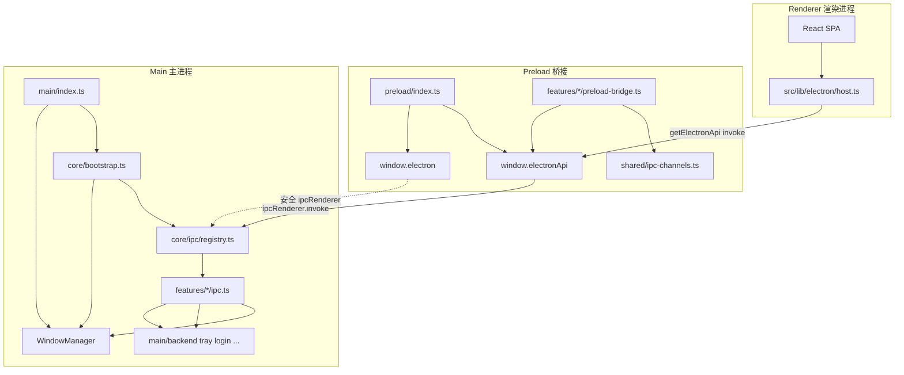
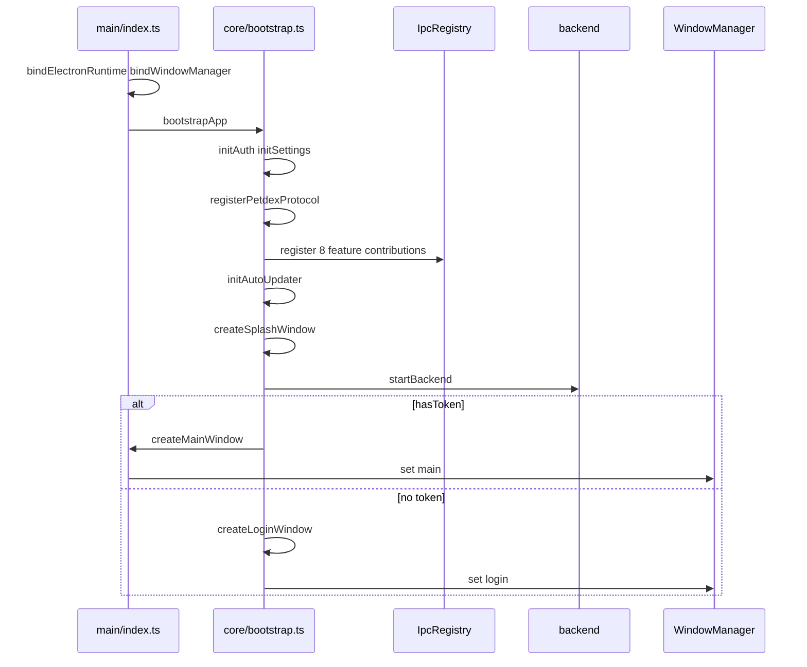
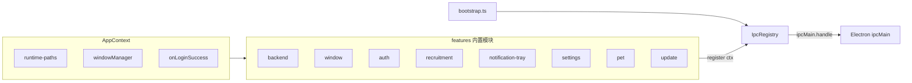
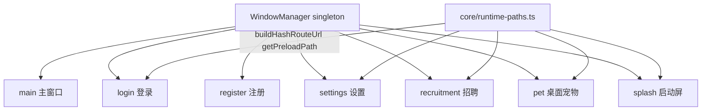
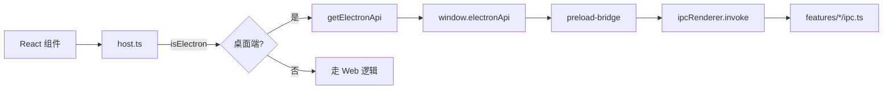
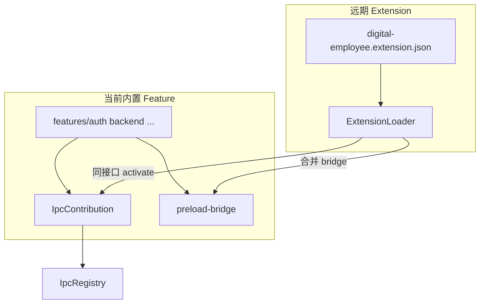

# Electron 架构

## 目录

```
electron/
├── core/                    # 基础设施层
│   ├── app-context.ts       # 共享应用上下文
│   ├── bootstrap.ts         # 启动编排
│   ├── feature.ts           # Feature 接口
│   ├── ipc/
│   │   ├── registry.ts      # IPC 集中注册
│   │   └── types.ts         # IPC 类型定义
│   ├── petdex-protocol.ts   # 协议处理
│   ├── runtime-paths.ts     # 路径工具
│   └── services/
│       ├── lifecycle.ts     # 生命周期管理
│       ├── window-manager.ts    # 窗口工厂 + 管理
│       └── window-registry.ts   # 单例绑定
├── features/                # 功能模块（IPC + Preload Bridge）
│   ├── index.ts             # 聚合所有 IpcContribution
│   ├── auth/
│   ├── backend/
│   ├── notification-tray/
│   ├── pet/
│   ├── recruitment/
│   ├── settings/
│   ├── update/
│   └── window/
├── main/                    # Main 进程入口 + 窗口模块
├── preload/                 # Preload 脚本
│   ├── index.ts             # contextBridge 入口
│   ├── invoke.ts            # 类型安全 invoke 封装
│   └── electron-api.ts      # 统一 API 聚合
├── shared/
│   └── ipc-channels.ts      # Channel 常量 + IpcInvokeMap
└── electron.d.ts            # 全局类型声明
```

## 架构图

### 总览：主进程 / Preload / 渲染进程



### 启动编排



### IPC 注册（Contribution 模式）



每个 feature 成对维护：

| 主进程 | Preload |
|--------|---------|
| `features/foo/ipc.ts` | `features/foo/preload-bridge.ts` |
| `IpcRegistry.register` | 合并进 `preload/electron-api.ts` |

Channel 名称统一来自 [`shared/ipc-channels.ts`](shared/ipc-channels.ts)。

### 窗口登记（WindowManager）



窗口类 IPC（最小化/关闭/最大化）通过 `ctx.windowManager.getMain()` 操作主窗，不再维护独立的 `mainWin` 模块变量。

### 渲染层 API 访问路径



### 与未来插件扩展的对应关系（规划）



## 渲染进程访问 API

请使用 [`src/lib/electron/host.ts`](../src/lib/electron/host.ts)：

```typescript
import { getElectronApi, isElectron } from "@/lib/electron/host"

if (isElectron()) {
  await getElectronApi()?.openSettings()
}
```

- `window.electron` — `@electron-toolkit/preload` 提供的安全 ipcRenderer
- `window.electronApi` — 业务 API（由 feature preload-bridge 合并）

---

# 自定义 electron-updater 服务

对于 electron-updater，需要按照特定的格式组织更新文件。客户端 feed 由 `electron/main/update.ts` 解析为 `{REMOTE_API_BASE_URL}/win32` 或 `/macos`。

假设你的 Nginx 根目录是 /usr/share/nginx/html，建议按以下结构组织：

```bash
/usr/share/nginx/html/
├── win32/
│   ├── latest.yml
│   ├── DigitalEmployee-Windows-0.1.2-Setup.exe
│   └── DigitalEmployee-Windows-0.1.2-Setup.exe.blockmap
└── macos/
    ├── latest-mac.yml          # 必须指向 .zip，不能仅上传 dmg
    ├── DigitalEmployee-Mac-0.1.2-Installer.zip
    ├── DigitalEmployee-Mac-0.1.2-Installer.zip.blockmap
    └── DigitalEmployee-Mac-0.1.2-Installer.dmg   # 可选，仅手动安装
```

**macOS 注意**：应用内更新只认 `latest-mac.yml` 里的 **ZIP**（内含 `.app`）。只上传 DMG 会报错 `ZIP file not provided`。打包需在 `electron-builder.json5` 的 `mac.target` 中包含 `zip`。

## 首先配置 Nginx

```nginx
# /etc/nginx/conf.d/update-server.conf
server {
    listen 80;
    server_name your-update-server.com;  # 替换为你的域名

    # 启用目录浏览（可选）
    autoindex on;

    # 设置跨域
    add_header Access-Control-Allow-Origin *;
    add_header Access-Control-Allow-Methods 'GET, POST, OPTIONS';
    add_header Access-Control-Allow-Headers 'DNT,X-Mx-ReqToken,Keep-Alive,User-Agent,X-Requested-With,If-Modified-Since,Cache-Control,Content-Type,Authorization';

    location / {
        root /usr/share/nginx/html;

        # 设置正确的 MIME 类型
        types {
            application/octet-stream exe;
            text/yaml yml;
        }

        # 禁用缓存，确保始终获取最新的更新信息
        add_header Cache-Control no-cache;

        # 如果文件较大，可以启用 gzip 压缩
        gzip on;
        gzip_types application/octet-stream;
    }
}
```

## latest.yml 文件格式示例

```yaml
version: 0.1.2
files:
  - url: app-0.1.2.exe
    sha512: xxxxxxxxxxxxx
    size: 68540879
path: app-0.1.2.exe
sha512: xxxxxxxxxxxxx
releaseDate: '2024-04-09T14:28:00.000Z'
```

## 发布更新流程

构建产物在 `apps/web/release/`（`pnpm --filter digital-employee build:app`）。

### Windows

```bash
# 上传到 {REMOTE_API_BASE_URL}/win32/
scp release/latest.yml your-server:/usr/share/nginx/html/win32/
scp release/DigitalEmployee-Windows-*-Setup.exe your-server:/usr/share/nginx/html/win32/
scp release/DigitalEmployee-Windows-*-Setup.exe.blockmap your-server:/usr/share/nginx/html/win32/
```

### macOS

```bash
# 上传到 {REMOTE_API_BASE_URL}/macos/（yml 与 zip 必须同目录，且 yml 中 url 指向 zip）
scp release/latest-mac.yml your-server:/usr/share/nginx/html/macos/
scp release/DigitalEmployee-Mac-*-Installer.zip your-server:/usr/share/nginx/html/macos/
scp release/DigitalEmployee-Mac-*-Installer.zip.blockmap your-server:/usr/share/nginx/html/macos/
# DMG 可选，不参与 electron-updater 下载
scp release/DigitalEmployee-Mac-*-Installer.dmg your-server:/usr/share/nginx/html/macos/
```

## 检查更新服务是否正常

```bash
# Windows
curl http://your-update-server.com/win32/latest.yml
curl -I http://your-update-server.com/win32/DigitalEmployee-Windows-0.1.2-Setup.exe

# macOS（确认 path 为 .zip）
curl http://your-update-server.com/macos/latest-mac.yml
curl -I http://your-update-server.com/macos/DigitalEmployee-Mac-0.1.2-Installer.zip
```

## node作为更新服务

```ts
// app/server/update-server.ts
import express from 'express'
import cors from 'cors'
import path from 'path'

const app = express()
const port = 8080

// 启用 CORS
app.use(cors())

// 静态文件目录配置
const UPDATES_DIR = path.join(__dirname, '../updates')

// 静态文件服务
app.use(
  '/win32',
  express.static(UPDATES_DIR, {
    setHeaders: (res) => {
      // 设置响应头
      res.set('Access-Control-Allow-Origin', '*')
      res.set('Cache-Control', 'no-cache')
      // 根据文件类型设置正确的 Content-Type
      res.set(
        'Content-Type',
        (res.getHeader('Content-Type') as string)?.replace('application/x-yaml', 'text/yaml') ||
          'application/octet-stream',
      )
    },
  }),
)

// 版本检查接口
app.get('/win32/latest.yml', (req, res) => {
  res.sendFile(path.join(UPDATES_DIR, 'latest.yml'))
})

// 下载更新包
app.get('/win32/:file', (req, res) => {
  const { version, file } = req.params
  res.sendFile(path.join(UPDATES_DIR, `${file}`))
})

// 错误处理
app.use((err: Error, req: express.Request, res: express.Response, next: express.NextFunction) => {
  console.error(err)
  res.status(500).send('Internal Server Error')
})

app.listen(port, () => {
  console.log(`Update server is running at http://localhost:${port}`)
})
```
