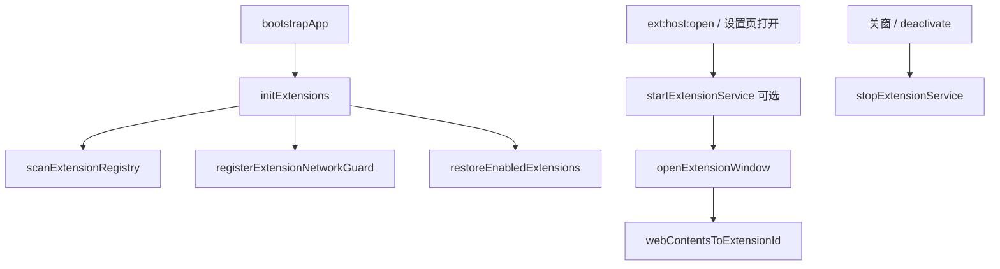

# Extension（插件）主进程模块

本目录实现 Electron **插件宿主**：发现 manifest、启停本地 `service`、打开插件 UI 窗、IPC、出网策略与 zip 安装。

上层总览与分期能力见 [`../../README.md`](../../README.md) 中「插件（Extension）机制」。

- **插件作者开发规范**：[docs/extension-development-guide.md](../../../../docs/extension-development-guide.md)
- **示例包**：[examples/](../../../../examples/)
- **尚未实现、低优先级备忘**：[`待实现.md`](待实现.md)

Channel 定义见 [`../../shared/extension-ipc-channels.ts`](../../shared/extension-ipc-channels.ts)。插件页 preload 为 [`../../preload/extension-preload.ts`](../../preload/extension-preload.ts)。

## 目录与职责

| 文件 | 职责 |
|------|------|
| [`manifest-schema.ts`](manifest-schema.ts) | `digital-employee.extension.json` 的 Zod 校验；`permissions`、`network.allowlist`、`ui` / `service` 结构 |
| [`extension-paths.ts`](extension-paths.ts) | 插件根目录 `~/.boban-staff/extensions/`、路径解析、`isAllowedDevUrl`（仅 `127.0.0.1` / `localhost`） |
| [`extension-store.ts`](extension-store.ts) | 启用/禁用、dev URL 覆盖（electron-store） |
| [`extension-registry.ts`](extension-registry.ts) | 扫描磁盘 manifest、激活标记、`resolveExtensionUiTarget`（`loadFile` / dev `loadUrl`）、`getExtensionDevOrigin` |
| [`extension-loader.ts`](extension-loader.ts) | `initExtensions`：扫描、注册网络 guard、恢复 enabled 插件；`activate` / `deactivate` / `listExtensions` |
| [`extension-window.ts`](extension-window.ts) | 创建/关闭插件 `BrowserWindow`；`webContentsId → extensionId`；`webSecurity: false`；关窗时停 service |
| [`extension-service-host.ts`](extension-service-host.ts) | 子进程 spawn（`ManagedProcess`）、`getServiceBaseUrl`、`start` / `stop` |
| [`extension-context.ts`](extension-context.ts) | 组装 `getContext` 载荷（`authToken`、`serviceBaseUrl`、`permissions` 等） |
| [`extension-permissions.ts`](extension-permissions.ts) | `permissions` 常量、`invoke` 方法 → 所需权限、`listExtensionInvokeMethods` |
| [`extension-invoke-router.ts`](extension-invoke-router.ts) | `extension.invoke(method)` 分发（通知、存储、backend.health、设置/桌宠/招聘等） |
| [`extension-plugin-store.ts`](extension-plugin-store.ts) | 插件隔离 KV（`host.storage`） |
| [`extension-host-events.ts`](extension-host-events.ts) | 宿主推事件到已开窗插件；headless 时 POST 到 `serviceBaseUrl` |
| [`extension-network-policy.ts`](extension-network-policy.ts) | 出站 URL 判定：allowlist、主后端端口 SSRF、本插件 service origin、dev UI origin |
| [`extension-network-guard.ts`](extension-network-guard.ts) | `session.webRequest`：`onBeforeRequest` 拦截 + `onBeforeSendHeaders` 注入 Bearer |
| [`extension-installer.ts`](extension-installer.ts) | 从 zip 安装到 extensions 目录（防 zip slip） |
| [`extension-uninstaller.ts`](extension-uninstaller.ts) | 卸载：停窗/停 service、删目录、清 store |
| [`ipc.ts`](ipc.ts) | 注册 `ext:host:*` / `ext:plugin:*`；插件窗禁止调用敏感 `ext:host:*` |
| [`preload-bridge.ts`](preload-bridge.ts) | 主应用 `electronApi` 侧 extension 相关 invoke 封装 |

## 启动与生命周期



- 应用在 [`bootstrap.ts`](../../core/bootstrap.ts) 中调用 `initExtensions()`（早于主窗/登录窗）。
- 仅有 `service` 的 **headless** 插件：启用时只 `startExtensionService`，不创建 BrowserWindow。

## IPC 分工

| 前缀 | 调用方 | 入口 |
|------|--------|------|
| `ext:host:*` | 主应用 SPA（设置页等） | [`ipc.ts`](ipc.ts) + [`preload-bridge.ts`](preload-bridge.ts) |
| `ext:plugin:*` | 插件窗 `window.extension` | [`ipc.ts`](ipc.ts) + [`extension-preload.ts`](../../preload/extension-preload.ts) |

`assertTrustedHostCaller`：插件窗不得调用 `getContext`（host）、`installFromZip` 等宿主管理 API。

## 插件 UI 出网（webRequest）

仅 **插件 BrowserWindow** 的 `http/https/ws/wss` 受控；主应用窗口与其它 session 请求不拦截。


| 规则 | 说明 |
|------|------|
| `host.network` + `network.allowlist` | 允许访问清单内公网主机 |
| 主后端 SSRF | 拒绝 `localhost` / `127.0.0.1` / `::1` 上 [`getBackendPort()`](../../features/backend/backend-process.ts) |
| 本插件 service | `getServiceBaseUrl(id)` 的 origin 允许（不要求 `host.network`） |
| dev UI | 未打包时，允许该插件 dev UI 的 origin（`getExtensionDevOrigin`） |
| `auth.read` | 对已放行请求自动加 Bearer（请求头未带 `Authorization` 时） |
| `service` 子进程 | **不**经过 webRequest，出站不受 allowlist 约束 |

插件窗设置 `webSecurity: false`，避免 `file://` 或 dev origin 的 CORS 问题。

**已移除**：`window.extension.fetch` / `ext:plugin:fetch`（主进程代发）；请使用原生 `fetch` + 上述策略。

## Manifest 要点

- 路径：`~/.boban-staff/extensions/<id>/digital-employee.extension.json`
- 至少包含 `ui` 和/或 `service` 之一
- 外网访问需声明 `permissions: ["host.network"]` 且配置 `network.allowlist`
- 示例：[`examples/extension-demo-fetch`](../../../../../examples/extension-demo-fetch)、[`extension-demo-service`](../../../../../examples/extension-demo-service)、[`extension-demo-invoke`](../../../../../examples/extension-demo-invoke)

## 依赖关系（简图）

```
ipc.ts
  → loader / registry / window / service-host / installer / invoke-router / context

extension-window.ts
  → registry, service-host, window-manager

extension-network-guard.ts
  → network-policy, extension-window (webContents 映射), auth-store

extension-network-policy.ts
  → registry, service-host, backend-process (端口), permissions
```

## 扩展新能力时

1. 在 [`manifest-schema.ts`](manifest-schema.ts) 增加 permission 枚举（若需要）。
2. 在 [`extension-permissions.ts`](extension-permissions.ts) 登记 `invoke` 方法映射。
3. 在 [`extension-invoke-router.ts`](extension-invoke-router.ts) 实现 handler。
4. 若涉及插件 UI 出网，只改 [`extension-network-policy.ts`](extension-network-policy.ts) / [`extension-network-guard.ts`](extension-network-guard.ts)，勿在插件页绕过 webRequest。
5. 更新 [`../../README.md`](../../README.md) 对外契约，并补充 `examples/` 示例。
