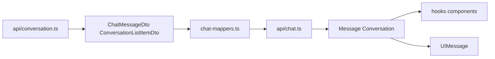

# 聊天数据类型分层

## 三层模型

| 层 | 类型 | 位置 | 用途 |
|----|------|------|------|
| API DTO | `ChatMessageDto`、`ConversationListItemDto` | `api/types.ts` | HTTP JSON（snake_case、数字 id、ISO 时间字符串） |
| UI 域 | `Message`、`Conversation` | `types/chat.ts` | 组件、Zustand、React Query、localStorage |
| 流式 UI | `UIMessage`（`ai` 包） | `message-utils.ts` | `useChat` 列表渲染 |

## 文件职责

| 文件 | 职责 |
|------|------|
| `api/conversation.ts` | 原始 `request`，返回 DTO；**仅** `api/` 与 `chat-mappers` 引用 |
| `api/chat.ts` | Facade：域模型 fetch + re-export 流/HITL/资源等端点 |
| `lib/chat/chat-mappers.ts` | DTO → `Message` / `Conversation` |
| `lib/chat/message-utils.ts` | `Message` → `UIMessage` |
| `types/chat.ts` | UI 域类型定义 |

## 约定

- **组件 / hooks / stores**：只 import `@/types/chat` 与 `@/api/chat`，不要 import `@/api/conversation` 或聊天 DTO。
- **新增 API 字段**：先改 `api/types` DTO，再改 `chat-mappers`，最后改 UI 类型（若需要新字段）。
