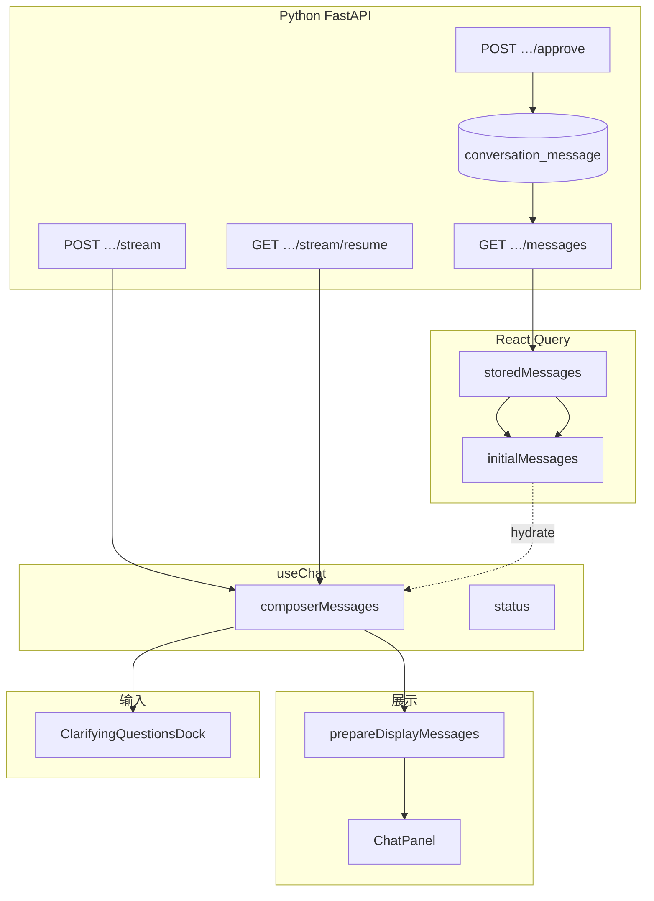
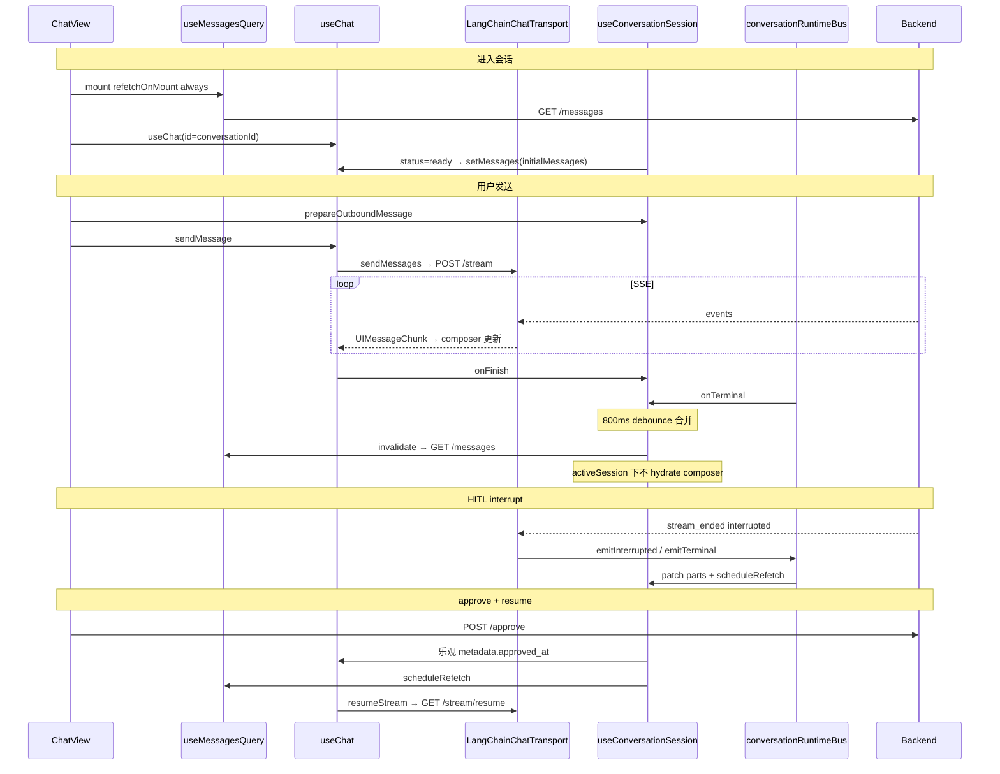

# 前端会话消息流转全景

本文描述 **单会话聊天** 中消息数据如何在前端分层、与后端同步、经 SSE 更新并渲染。与本文互补的专题文档：

| 文档 | 内容 |
|------|------|
| [CHAT_DATA_TYPES.md](./CHAT_DATA_TYPES.md) | DTO / `Message` / `UIMessage` 类型分层 |
| [resume-flow.md](./resume-flow.md) | 发送、SSE 解析、resume  ASCII 流程（偏 transport） |
| [langchain-stream-parser-flow.md](./langchain-stream-parser-flow.md) | LangChain SSE → `UIMessageChunk` |
| [messages/MESSAGE_RENDER_FLOW.md](../../components/chat/messages/MESSAGE_RENDER_FLOW.md) | 气泡内 `classifyMessageParts` 渲染 |
| [hitl-architecture.md](../../../server/docs/hitl-architecture.md) | HITL 端到端（含后端） |
| [use-conversation-session.ts](../../hooks/use-conversation-session.ts) | hydrate / refetch / resume 粘合层源码 |

**入口视图**（结构相同）：`ConversationChatView`、`ChatDraftView`、`CuratorView`（总管内嵌聊天）。

---

## 一、核心结论：三条管道

| 管道 | 数据 | 来源 | 主要消费者 |
|------|------|------|------------|
| **DB 快照** | `storedMessages: Message[]` | `useMessagesQuery` → `GET …/messages` | `initialMessages`、hydrate、resume 判定 |
| **运行时** | `composerMessages`（`useChat.messages`） | SSE、`setMessages`、HITL patch、approve 乐观更新 | Dock、`findPendingHitl`、发消息 / resume |
| **展示** | `displayMessages` | `prepareDisplayMessages(source)` | `ChatPanel` 气泡列表 |

**权威数据源**：持久化以 **DB** 为准；同屏进行中以 **composer（SSE）** 为准；展示层在两者之上做 **只读变换**（merge / enrich / dedupe）。



---

## 二、类型与映射链

```
GET /messages (ChatMessageDto[])
  → chat-mappers.ts → Message[] (storedMessages)
  → message-utils.ts mapStoredMessagesToUIMessages → UIMessage[] (initialMessages)
```

| 字段（UI） | 用途 |
|------------|------|
| `messageParts` | assistant 气泡 parts（含 `tool-*` HITL） |
| `metadata.approved_at` | HITL 封存段；`findPendingHitl` 跳过该行 |
| `streamState` | `streaming` / `interrupted` / `completed` 等；resume 与列表状态 |

详见 [CHAT_DATA_TYPES.md](./CHAT_DATA_TYPES.md)。

---

## 三、视图层组装（以 ConversationChatView 为例）

```text
useMessagesQuery(conversationId)     → storedMessages
useMemo(mapStored…)                → initialMessages

useChat({ transport: chatTransport, onFinish → session.onStreamFinish })
  → messages (composer), status, setMessages, resumeStream

useConversationSession({ storedMessages, initialMessages, composerMessages, status, … })
  → hitlMessageId, onHitlApproved, onStreamFinish, prepareOutboundMessage

shouldUseLiveMessages =
  messages.length > 0 || status === 'submitted' || status === 'streaming'

displayMessages = prepareDisplayMessages(
  shouldUseLiveMessages ? messages : initialMessages
)

ChatPanel messages={displayMessages} composerMessages={messages}
```

**分工**：

- **气泡**：`displayMessages`（可 merge 连续 assistant）。
- **Dock / 审批 message_id**：`composerMessages`，**不 merge**。
- **占位 / 禁用发送**：`findPendingHitl(composer)` + `hitlMessageId`。

---

## 四、展示管道（仅影响 UI，不改 DB）

实现：`apps/web/src/lib/chat/hitl/display-pipeline.ts`

```text
prepareDisplayMessages(messages)
  → mergeConsecutiveAssistantMessages   // 连续 assistant 合成一条气泡
  → enrichHitlResolvedPartsInMessage    // 已答 HITL input → Answers 展示块
  → dedupeHitlPartsInMessages           // 同 toolCallId 已有 output 时去掉陈旧 pending part
```

Composer 列表在进管道前保持 **一行 DB 消息 ↔ 一条 UIMessage**（便于 `POST /approve` 的 `message_id`）。

---

## 五、生命周期时序



---

## 六、`useConversationSession` 同步规则

实现：`apps/web/src/hooks/use-conversation-session.ts`  
查询：`apps/web/src/hooks/use-chat-queries.ts`（`useMessagesQuery`：`staleTime 30s`，`refetchOnMount: "always"`）。

| 时机 | 行为 |
|------|------|
| `status === ready` 且已有 DB 数据 | `setMessages(initialMessages)` **整表 hydrate** |
| `status === streaming` / `submitted` | **不 hydrate**（避免覆盖 SSE 累积的 parts） |
| `onFinish` + bus `onTerminal` | Query cache 乐观改最后 assistant `stream_state`；**800ms 后** `invalidate` → GET `/messages` |
| `onInterrupted` | `patchAssistantWithInterruptParts`（**整体替换** `message_parts`）+ `scheduleMessagesRefetch`；transport 有 `message_parts` 时不再 `buildHitlInterruptStreamChunks` |
| `onHitlApproved` | `patchApprovedAtOnComposerMessages` + cache；`scheduleMessagesRefetch`；`resumeStream` |
| 切走会话 | 组件 `stop()` 断本端 SSE；**不**调 `/stream/cancel`；后台任务可继续 |
| 再进会话 | `refetchOnMount` 拉全量；若最后一条 `stream_state === streaming` 则 `GET /stream/resume` |

### 6.1 流结束 refetch

`completed` 与其它终态均在 `onTerminal` / `onStreamFinish` 后 **800ms debounce** 合并为一次 `GET /messages`，对齐 DB 与 Query cache。同会话内 **`activeSessionRef`** 阻止 `ready` 时用 `initialMessages` 覆盖 composer（SSE 累积的 parts 仍为准）。`onHitlApproved` 单独 schedule refetch，供 resume 后 cache 含新 assistant 行。

### 6.2 界面「闪一下」

refetch → `storedMessages` 更新 → 若未持 `activeSessionRef` 可能 hydrate 整表替换 composer；持锁时仅 cache 更新。HITL Dock 收起靠 approve **乐观 `approved_at`**（`hitl/approve-optimistic.ts`）。

---

## 七、Transport 与 Runtime Bus

| 组件 | 路径 | 职责 |
|------|------|------|
| `LangChainChatTransport` | `langchain-chat-transport.ts` | `sendMessages` → POST stream；`reconnectToStream` → resume；SSE → chunks |
| `langchain-stream-parser` | `langchain-stream-parser.ts` | 事件 → `UIMessageChunk` |
| `conversationRuntimeBus` | `conversation-runtime-bus.ts` | 按 `conversationId` 广播 `onInterrupted` / `onTerminal` |
| `session-patch` | `hitl/session-patch.ts` | interrupt 时 `message_parts` 合并进目标 assistant 行 |

**SSE 终态**（`stream_ended` / `no_stream`）：

1. `conversationRuntimeBus.emitTerminal` → session 更新 cache + schedule refetch  
2. `enqueueFinish` → `useChat` `onFinish` → `onStreamFinish`（与上 debounce 合并为一次 invalidate）  
3. `status === interrupted` 时可能额外 `onInterrupted` 回调（旧 transport 钩子，HITL 以 bus 为准）

---

## 八、HITL 子流（前端要点）

| 步骤 | 前端行为 |
|------|----------|
| Agent 触发工具 | SSE 带 `message_parts`；行 `stream_state=interrupted` |
| 展示 pending | `findPendingHitl(composer)`：跳过 `metadata.approved_at`；按 **toolCallId** 判断已 resolved |
| Dock / 方案卡 | `ClarifyingQuestionsDock` / `DocumentPlanCard` → `POST /approve` |
| 成功后 | `onHitlApproved`：乐观 `approved_at` → Dock 立即收起；append 新 assistant 行 → `resumeStream` |
| 第二轮澄清 | 新 `toolCallId` 不被上一轮 output 误判为已办（见 `hitl/pending.ts`、`parts-dedupe.ts`） |

后端全貌：[hitl-architecture.md](../../../server/docs/hitl-architecture.md)。

---

## 九、HTTP 端点速查

| 方法 | 路径 | 前端触发点 |
|------|------|------------|
| GET | `/chat/conversations/{id}/messages` | `useMessagesQuery`、invalidate 后 refetch |
| POST | `/chat/conversations/{id}/stream` | `LangChainChatTransport.sendMessages` |
| GET | `/chat/conversations/{id}/stream/resume` | `resumeStream` / `reconnectToStream` |
| POST | `/chat/conversations/{id}/approve` | Dock / DocumentPlanCard |
| POST | `/chat/conversations/{id}/stream/cancel` | 用户点击停止 |

---

## 十、关键文件索引

| 文件 | 职责 |
|------|------|
| `hooks/use-chat-queries.ts` | `useMessagesQuery` |
| `hooks/use-conversation-session.ts` | hydrate、refetch 调度、resume、HITL 粘合 |
| `components/chat/views/chat-conversation-view.tsx` | 双源选择、`displayMessages` |
| `components/chat/panel/chat-panel.tsx` | 列表 + composer 区 |
| `components/chat/panel/chat-composer-area.tsx` | Dock、`onHitlApproved` 传参 |
| `lib/chat/message-utils.ts` | `Message` → `UIMessage` |
| `lib/chat/message-query-cache.ts` | 乐观改 cache `stream_state` |
| `lib/chat/hitl/pending.ts` | `findPendingHitl` |
| `lib/chat/hitl/approve-optimistic.ts` | approve 乐观 `approved_at` |
| `lib/chat/hitl/display-pipeline.ts` | `prepareDisplayMessages` |
| `lib/chat/merge-consecutive-assistant-messages.ts` | 展示用 merge |

---

## 修订记录

| 日期 | 说明 |
|------|------|
| 2026-05-23 | 初版：双管道 + hydrate/refetch/HITL/展示管道全景 |
