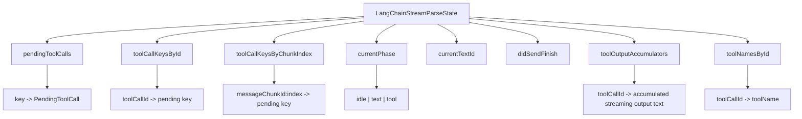
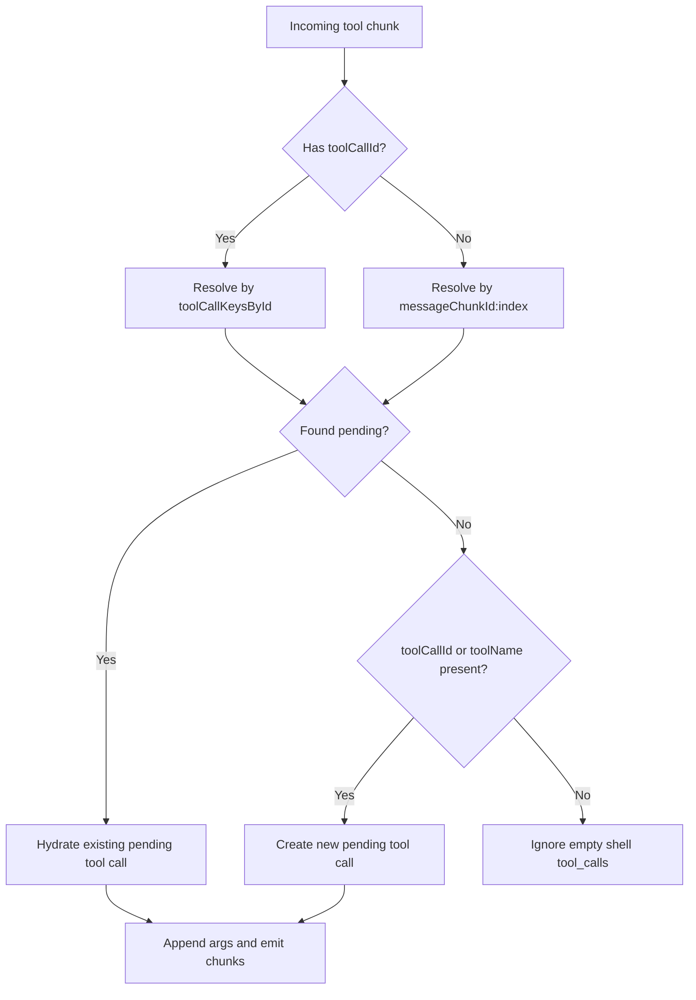
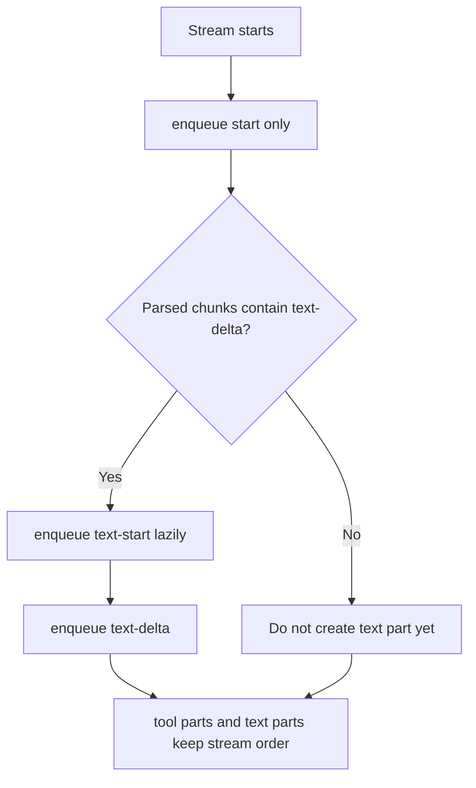
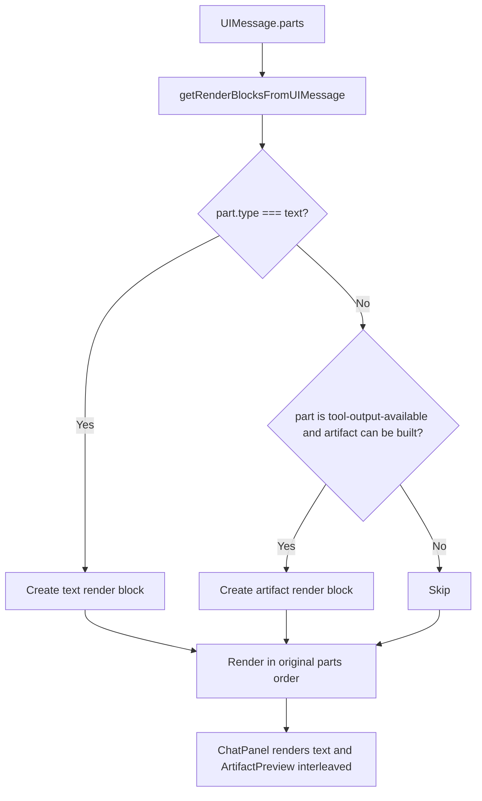
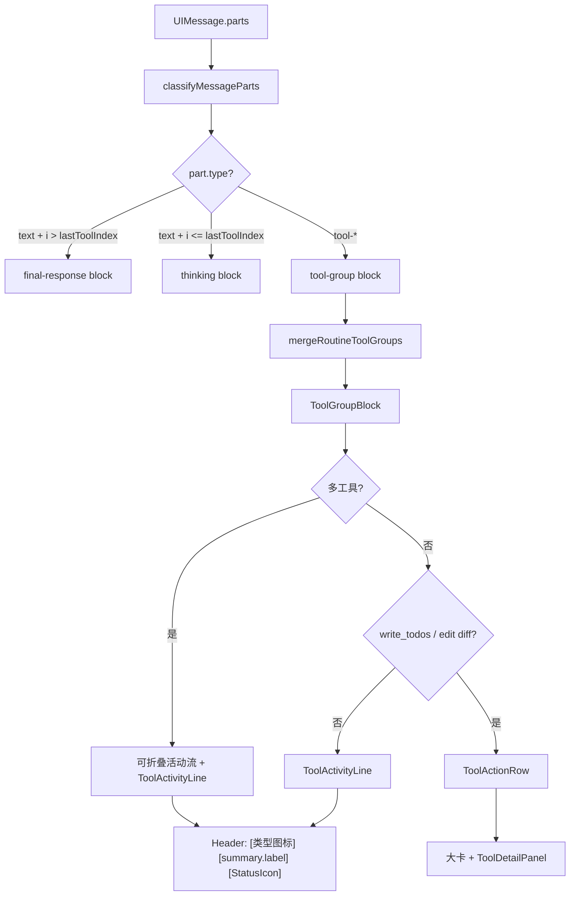
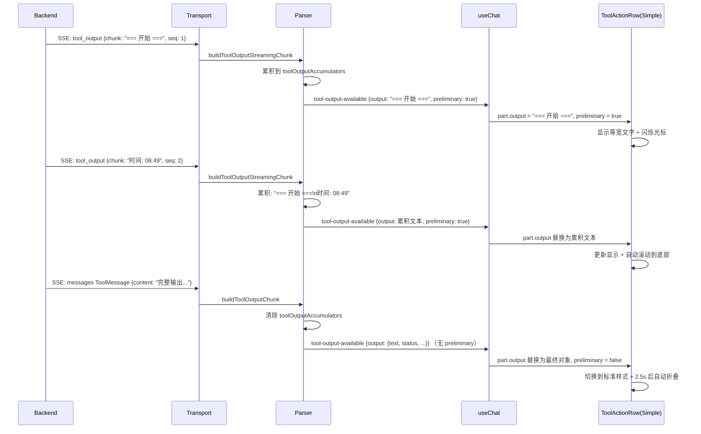
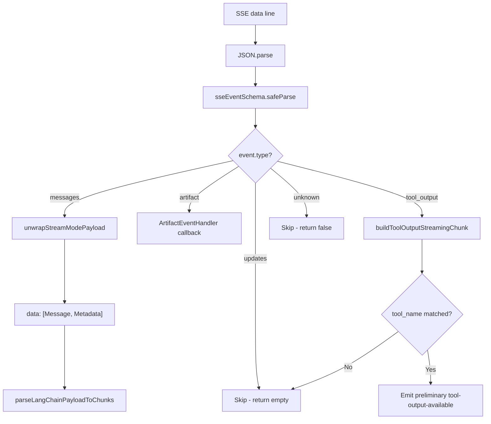
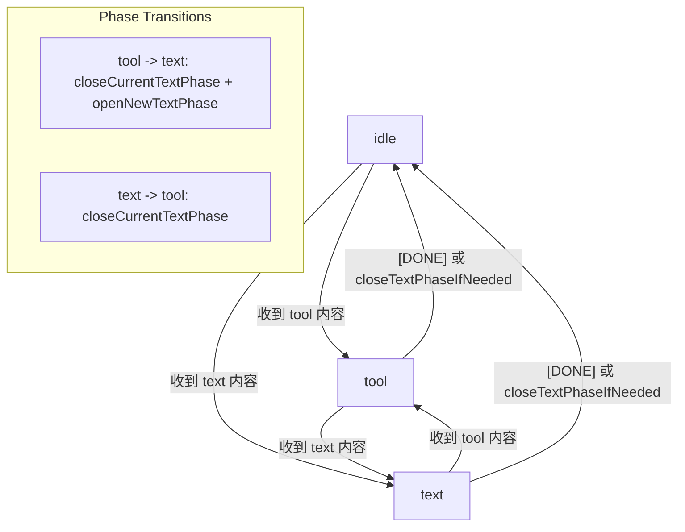
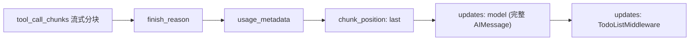
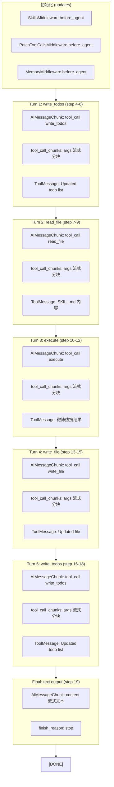

# LangChain Stream Parser Flow

基于当前实现：

- `apps/web/src/lib/chat/langchain-chat-transport.ts`
- `apps/web/src/lib/chat/langchain-stream-parser.ts`
- `apps/web/src/lib/chat/langchain-sse-schema.ts`
- `apps/web/src/lib/chat/message-classifier.ts`
- `apps/web/src/lib/chat/tool-summarizer.ts`
- `apps/web/src/components/chat/tool-action-row.tsx`
- `apps/web/src/components/chat/tool-action-row-simple.tsx`
- `apps/web/src/components/chat/tool-group-block.tsx`

## Overview

```mermaid
flowchart TD
  A[Backend SSE response] --> B[LangChainChatTransport.processResponseStream]
  B --> C[reader.read loop]
  C --> D[TextDecoder decode into buffer]
  D --> E[Split buffer by SSE boundary]
  E --> F[flushEvent eventText]
  F --> G[Collect all data: lines]
  G --> H{data === "[DONE]"?}
  H -- Yes --> I[enqueue text-end if text started]
  I --> J[enqueue finish]
  J --> K[close stream]
  H -- No --> L[JSON.parse data]
  L --> L1[sseEventSchema.safeParse]
  L1 --> L2{event.type?}
  L2 -- "artifact" --> L3[ArtifactEventHandler callback]
  L2 -- "tool_output" --> L3B[buildToolOutputStreamingChunk]
  L3B --> L3C{tool_name matched to pending toolCallId?}
  L3C -- Yes --> L3D[Emit tool-output-available with preliminary: true]
  L3C -- No --> L4[Skip]
  L3D --> AQ
  L2 -- "updates" --> L4[Skip - no UIMessageChunk]
  L2 -- "messages" --> M[parseLangChainPayloadToChunks]

  M --> N[buildToolOutputChunk]
  M --> O[buildToolInputChunks]
  M --> P[extractAssistantText]

  N --> Q{ToolMessage?}
  Q -- Yes --> R[Resolve tool_call_id]
  R --> S[Find pending input by toolCallId]
  S --> T[Emit tool-output-available or tool-output-error]

  O --> U{AIMessageChunk?}
  U -- Yes --> V[Read tool_calls]
  V --> W[Hydrate pending tool call]
  W --> X[Read tool_call_chunks]
  X --> Y{No valid tool_call_chunks?}
  Y -- Yes --> Z[Fallback to invalid_tool_calls]
  Y -- No --> AA[Use tool_call_chunks]
  Z --> AB[Resolve pending by toolCallId or messageChunkId:index]
  AA --> AB
  AB --> AC[Append args delta]
  AC --> AD{First delta?}
  AD -- Yes --> AE[Emit tool-input-start]
  AD -- No --> AF[Continue]
  AF --> AG{inputText JSON.parse succeeds?}
  AE --> AG
  AG -- Yes --> AH[Emit tool-input-available]
  AG -- No --> AI[Wait for more chunks]

  P --> AJ{content has text?}
  AJ -- Yes --> AK[Return text-delta chunk]
  AJ -- No --> AL[No text chunk]

  T --> AM[Return UIMessageChunk list]
  AH --> AM
  AK --> AM
  AL --> AM
  AM --> AN{contains text-delta?}
  AN -- Yes --> AO[enqueue text-start lazily]
  AO --> AP[enqueue parsed chunks in order]
  AN -- No --> AP
  AP --> AQ[useChat consumes UIMessageChunk]
```

## Parser State



## Tool Association Rules



关键点：

- `tool_call_id` 是工具的稳定主键
- `messageChunkId:index` 是流式分片阶段的回挂键
- 空壳 `tool_calls` 不会创建新的 fallback pending

## Text Ordering Rules



关键点：

- 不在流开始时立即发送 `text-start`
- 只有首次出现 `text-delta` 时才创建 text part
- 这样可以避免工具块总是被挤到文本后面

## UI Rendering Order



关键点：

- 不再把整条 assistant message 的文本合并后统一渲染
- 而是按 `message.parts` 原始顺序逐块渲染
- 这保证了展示顺序可以接近真实流式输出：
  1. 前置文本
  2. 工具产物
  3. 后置文本

## Output Chunks

- Text:
  - `start`
  - `text-start`
  - `text-delta`
  - `text-end`
  - `finish`
- Tool input:
  - `tool-input-start`
  - `tool-input-delta`
  - `tool-input-available`
- Tool output:
  - `tool-output-available` (final, from ToolMessage)
  - `tool-output-available` (preliminary, from `tool_output` SSE event)
  - `tool-output-error`

### Preliminary vs Final tool-output-available

| 属性 | preliminary (流式) | final (ToolMessage) |
|------|-------------------|---------------------|
| `preliminary` | `true` | 不设置 / `false` |
| `output` | 累积字符串（逐行追加） | `{ text, status, toolName, input, inputText }` 对象 |
| 触发来源 | `tool_output` SSE 事件 | `messages` SSE 事件中的 ToolMessage |
| 视觉效果 | 等宽字体 + 闪烁光标 | 标准样式 + 自动折叠 |

`useChat` 对同一 `toolCallId` 的 `tool-output-available` 是整体替换（非追加），所以每次 preliminary chunk 都包含完整的累积输出文本。最终 ToolMessage 到达时，`preliminary` 不设置，无缝替换。

## UI Rendering Pipeline



### ToolGroupBlock

- 连续 `ROUTINE_TOOL_NAMES`（shell、grep、glob、ls）由 `mergeRoutineToolGroups` 合并为单个 `tool-group`
- 多工具：可折叠组头 + 组内 `ToolActivityLine`（无独立灰条边框）
- 单工具：默认 `ToolActivityLine`；`write_todos`（含列表）与 `edit_file`（含 diff）仍用 `ToolActionRow`
- 行布局：`[类型图标] [summary.label] [状态]`，不展示 `toolName`

### message-classifier ToolGroupItem

每个 tool part 在分类时计算以下字段：

| 字段 | 说明 |
|------|------|
| `preliminary` | `true` 表示 `tool_output` 流式输出中，还未收到最终 ToolMessage |
| `toolPartIndex` | 该工具在 `message.parts[]` 中的索引 |
| `hasNewerActiveTool` | 是否有索引更大的、状态未完成的工具 part（用于自动折叠） |

### Tool Output Streaming Flow



## Summary

- `transport` 负责：读流、切帧、事件类型分发（artifact/tool_output/updates/messages）、懒创建 text part、分发 chunk、处理 artifact 事件
- `stream-parser` 负责：识别 LangChain 消息、聚合工具参数、累积 `tool_output` 流式输出、输出标准 `UIMessageChunk`
- `message-classifier` 负责：将 `UIMessage.parts` 分类为 thinking/tool-group/final-response 块，计算 preliminary/hasNewerActiveTool 等渲染辅助字段
- `tool-summarizer` + `tool-label-registry` 负责：语义化 `summary.label`（shell intent、业务工具固定文案）
- `merge-routine-tool-groups` 负责：合并相邻常规工具块
- `tool-activity-line` / `tool-action-row` 负责：紧凑行或富交互行 + `ToolDetailPanel`
- `tool-group-block` 负责：单工具/多工具活动流布局与 `toolAutoCollapseMap` 下发

## V2 Event Dispatch

LangGraph V2 SSE 流中存在四种事件类型，`transport` 层通过 `sseEventSchema` 验证后分发：



关键点：

- `messages` 事件：包含 `[AIMessageChunk|ToolMessage, LangGraphMetadata]`，是核心数据来源
- `updates` 事件：中间件状态更新（SkillsMiddleware、PatchToolCallsMiddleware、MemoryMiddleware、TodoListMiddleware）和节点状态更新（model、tools），不产生 `UIMessageChunk`
- `artifact` 事件：独立的 artifact 通知，走 `ArtifactEventHandler` 回调，不经过 parser
- `tool_output` 事件：工具执行过程中的流式输出（如 `execute` 命令的 stdout），由 transport 层直接拦截并生成 `preliminary: true` 的 `tool-output-available` chunk，不经过 `parseLangChainPayloadToChunks`

### Updates 事件详解

`updates` 事件传输中间件和节点的完整状态，包含以下子类型：

| 数据键 | 传输时机 | 内容 |
|--------|---------|------|
| `SkillsMiddleware.before_agent` | 模型调用前 | 可用技能列表元数据 |
| `PatchToolCallsMiddleware.before_agent` | 模型调用前 | 注入的 HumanMessage |
| `MemoryMiddleware.before_agent` | 模型调用前 | 读取的记忆文件内容 |
| `model` | 模型调用后 | 完整 AIMessage（含 tool_calls 或 content） |
| `tools` | 工具执行后 | ToolMessage 结果 |
| `TodoListMiddleware.after_model` | 模型调用后 | null（通知 todo 列表可能更新） |

当前解析器有意跳过所有 `updates` 事件，因为 `messages` 事件已经流式传输了相同的 AIMessageChunk 和 ToolMessage 数据。`updates` 中的数据是完整消息（非增量），可用于未来扩展（如断线重连时的状态恢复）。

## Phase State Machine

解析器维护一个三态阶段机来管理文本和工具的交错输出：



关键点：

- `idle` → `text`：首次收到 `text-delta` 时，发送 `text-start`，进入 text phase
- `idle` → `tool`：首次收到 tool 内容时，进入 tool phase（无需额外 start 信号）
- `text` → `tool`：关闭当前 text phase（发送 `text-end`），切换到 tool phase
- `tool` → `text`：关闭当前 text phase（如果有），打开新的 text phase（发送 `text-start`）
- 流结束时（`[DONE]` 或 buffer 耗尽）：通过 `closeTextPhaseIfNeeded` 关闭未闭合的 text phase

## Model Call End Pattern

每个模型调用（一个 langgraph_step）结束时，SSE 流会连续发送三个终止信号：



| 信号 | 说明 |
|------|------|
| `finish_reason: "tool_calls"` | 表示模型决定调用工具（之后进入 tools 节点） |
| `finish_reason: "stop"` | 表示模型完成最终文本回复（流即将结束） |
| `usage_metadata` | token 使用统计 |
| `chunk_position: "last"` | 当前 step 的最后一个 chunk |
| `updates: model` | 完整的 AIMessage（包含完整的 tool_calls 或 content） |
| `updates: TodoListMiddleware` | todo 列表中间件通知 |

解析器行为：

- `finish_reason`、`usage_metadata`、`chunk_position` chunk 的 content 为空、tool_calls 为空，不会产生任何 `UIMessageChunk`
- 这些信号被安全忽略，只有包含实际数据的 chunk 才会触发输出

## Multi-Turn Tool Call Flow

以下是一次完整的 LangGraph agent 交互流程（以 chunk.txt 为例）：



每个 turn 的 SSE 事件模式相同：
1. `messages` AIMessageChunk 流（tool_call + tool_call_chunks 增量）
2. `messages` 三信号终止（finish_reason + usage_metadata + chunk_position: last）
3. `updates` model（完整 AIMessage）
4. `updates` TodoListMiddleware
5. `tool_output` 流式输出事件（仅 `execute` 等长时间运行的工具，每个 stdout 行一个事件）
6. `messages` ToolMessage（工具执行结果）
7. `updates` tools（完整 ToolMessage）

Step 编号规则：奇数 step 是 model 节点，偶数 step 是 tools 节点。

## SSE Event Examples

### 1. AIMessageChunk — 文本流式输出

```
data: {"type": "messages", "ns": [], "data": [[{"lc":1,"type":"constructor","id":["langchain","schema","messages","AIMessageChunk"],"kwargs":{"content":"我来","response_metadata":{"model_provider":"openai"},"type":"AIMessageChunk","id":"lc_run--xxx","tool_calls":[],"invalid_tool_calls":[]}},{...metadata...}]]}
```

→ 产生 `text-delta` chunk

### 2. AIMessageChunk — 工具调用开始

```
data: {"type": "messages", "ns": [], "data": [[{"lc":1,"type":"constructor","id":["langchain","schema","messages","AIMessageChunk"],"kwargs":{"content":"","response_metadata":{"model_provider":"openai"},"type":"AIMessageChunk","id":"lc_run--xxx","tool_calls":[{"name":"execute","args":{},"id":"call_592da335778145aba76c0d22","type":"tool_call"}],"tool_call_chunks":[{"name":"execute","args":"","id":"call_592da335778145aba76c0d22","index":0,"type":"tool_call_chunk"}],"invalid_tool_calls":[]}},{...}]]}
```

→ 产生 `tool-input-start` chunk（name + id 首次出现）

### 3. AIMessageChunk — 工具参数流式分块

```
data: {"type": "messages", "ns": [], "data": [[{"kwargs":{"content":"","tool_calls":[],"invalid_tool_calls":[{"name":"","args":"\"command\": \"python","id":"","error":null,"type":"invalid_tool_call"}],"tool_call_chunks":[{"name":"","args":"\"command\": \"python","id":"","index":0}]}}]]}

data: {"type": "messages", "ns": [], "data": [[{"kwargs":{"content":"","invalid_tool_calls":[{"args":" C:\\\\","id":""}],"tool_call_chunks":[{"args":" C:\\\\","id":"","index":0}]}}]]}
```

→ 产生 `tool-input-delta` chunk（args 逐步拼接）
→ JSON.parse 成功后产生 `tool-input-available` chunk

### 4. tool_output — 命令流式输出（核心新增）

后端 `skill_shell_backend.py` 通过 `stream_writer` 发送，每行 stdout 一个事件：

```
data: {"type": "tool_output", "data": {"tool_name": "execute", "chunk": "=== 多输出间隔脚本开始 ===", "chunk_seq": 1, "stream": "stdout"}}

data: {"type": "tool_output", "data": {"tool_name": "execute", "chunk": "开始时间: 2026-04-25 08:49:39", "chunk_seq": 2, "stream": "stdout"}}

data: {"type": "tool_output", "data": {"tool_name": "execute", "chunk": "1. 这是第一个输出", "chunk_seq": 4, "stream": "stdout"}}
```

Transport 层拦截后生成：

```javascript
// 第一个 chunk
{ type: "tool-output-available", toolCallId: "call_592da335778145aba76c0d22", output: "=== 多输出间隔脚本开始 ===", preliminary: true }

// 第二个 chunk（累积）
{ type: "tool-output-available", toolCallId: "call_592da335778145aba76c0d22", output: "=== 多输出间隔脚本开始 ===\n开始时间: 2026-04-25 08:49:39", preliminary: true }
```

**关键约束**：`tool_output` 事件只有 `tool_name` 没有 `toolCallId`，必须通过 `state.toolNamesById`（toolCallId → toolName）反查。

### 5. ToolMessage — 最终工具结果

```
data: {"type": "messages", "ns": [], "data": [[{"lc":1,"type":"constructor","id":["langchain","schema","messages","ToolMessage"],"kwargs":{"content":"=== 多输出间隔脚本开始 ===\n开始时间: 2026-04-25 08:49:39\n\n1. 这是第一个输出\n...\n总耗时: 约10秒\n[Command succeeded with exit code 0]","type":"tool","name":"execute","id":"bf73a71a-xxx","tool_call_id":"call_592da335778145aba76c0d22","status":"success"}},{...}]]}
```

→ 产生最终 `tool-output-available` chunk（无 preliminary），替换之前的流式输出：

```javascript
{
  type: "tool-output-available",
  toolCallId: "call_592da335778145aba76c0d22",
  output: {
    status: "success",
    text: "=== 多输出间隔脚本开始 ===\n...\n总耗时: 约10秒\n[Command succeeded with exit code 0]",
    toolName: "execute",
    input: { command: "python \"C:\\Users\\ruanz\\Desktop\\multi_output_script.py\"" },
    inputText: "{\"command\": \"python \\\"C:\\\\Users\\\\ruanz\\\\Desktop\\\\multi_output_script.py\\\"\"}"
  }
}
```

### 6. updates — 中间件/节点状态

```
data: {"type": "updates", "ns": [], "data": {"SkillsMiddleware.before_agent": null}}
data: {"type": "updates", "ns": [], "data": {"PatchToolCallsMiddleware.before_agent": {"messages": {...}}}}
data: {"type": "updates", "ns": [], "data": {"model": {"messages": [AIMessage]}}}
data: {"type": "updates", "ns": [], "data": {"tools": {"messages": [ToolMessage]}}}
```

→ 不产生 `UIMessageChunk`，被 parser 跳过

### 7. artifact — 产物通知

```
data: {"type": "artifact", "data": {"type": "html", "content": "<div>...</div>", "title": "Preview"}}
```

→ 走 `ArtifactEventHandler` 回调，不经过 parser

### 完整 execute 调用时序

```
messages: AIMessageChunk (content: "我来执行这个脚本")
messages: AIMessageChunk (tool_call: execute, id: call_xxx)
messages: AIMessageChunk (tool_call_chunks: args delta...) × N
messages: AIMessageChunk (finish_reason: "tool_calls")
messages: AIMessageChunk (usage_metadata)
messages: AIMessageChunk (chunk_position: "last")
updates:   model (完整 AIMessage)
updates:   TodoListMiddleware
tool_output: {tool_name: "execute", chunk: "=== 开始 ===", seq: 1}  ← 新增
tool_output: {tool_name: "execute", chunk: "...", seq: 2}           ← 新增
tool_output: {tool_name: "execute", chunk: "...", seq: N}           ← 新增
messages: ToolMessage (content: "完整输出...", status: "success")
updates:   tools (完整 ToolMessage)
```
