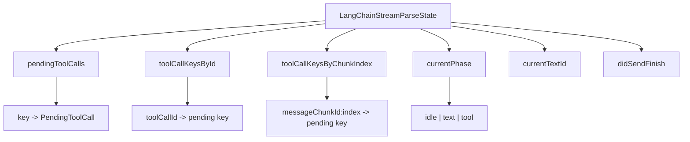
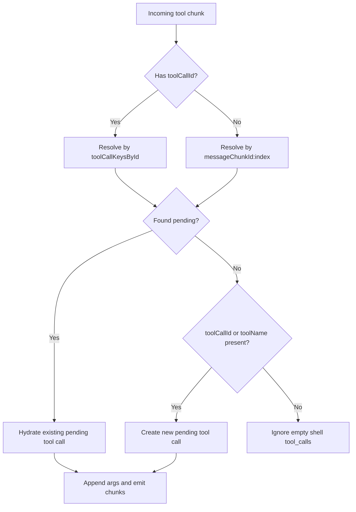
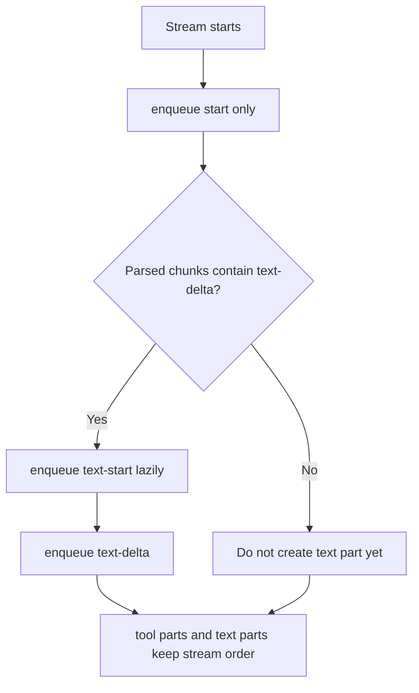
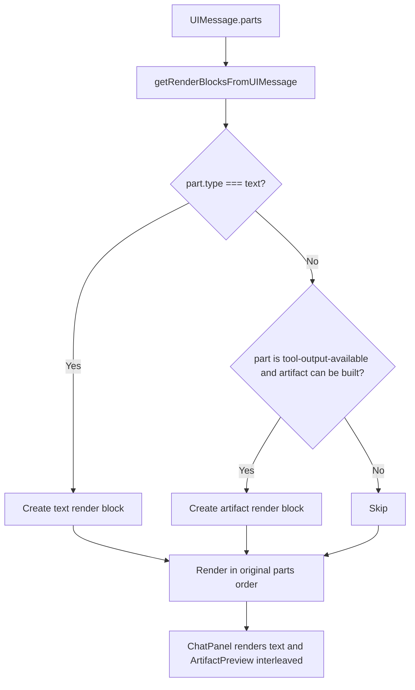
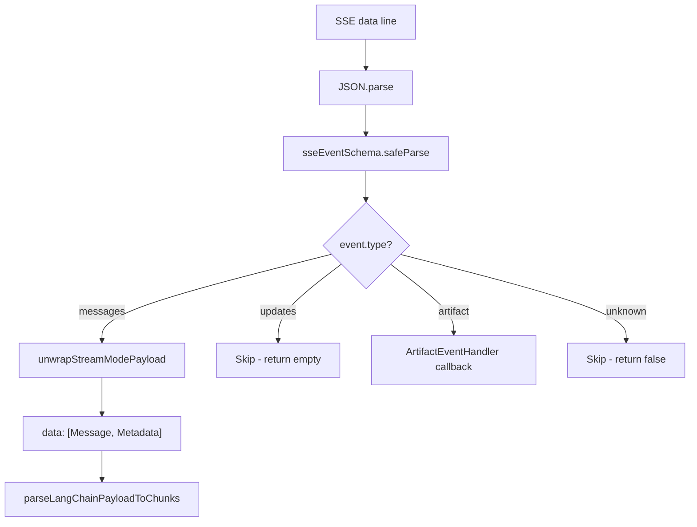
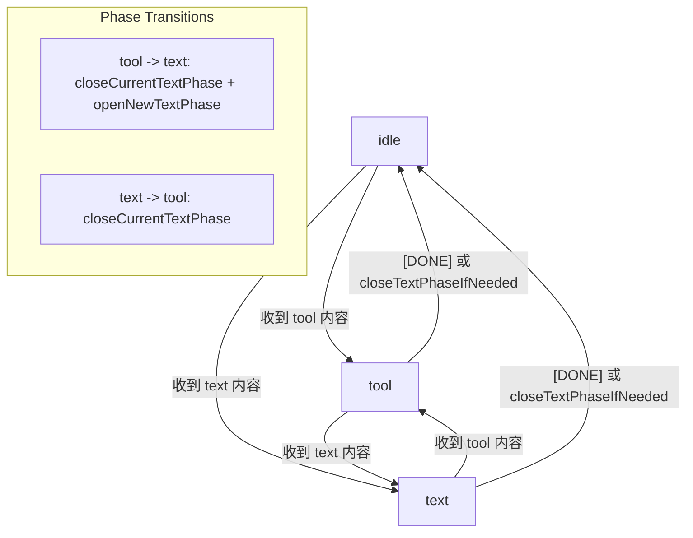
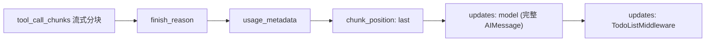
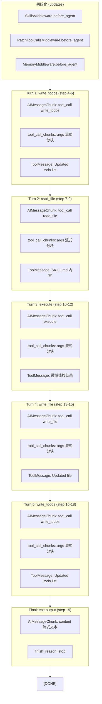

# LangChain Stream Parser Flow

基于当前实现：

- `apps/web/src/lib/chat/langchain-chat-transport.ts`
- `apps/web/src/lib/chat/langchain-stream-parser.ts`
- `apps/web/src/lib/chat/message-utils.ts`
- `apps/web/src/lib/chat/artifact-utils.ts`

## Overview

```mermaid
flowchart TD
  A[Backend SSE response] --> B[LangChainChatTransport.processResponseStream]
  B --> C[reader.read loop]
  C --> D[TextDecoder decode into buffer]
  D --> E[Split buffer by SSE boundary]
  E --> F[flushEvent eventText]
  F --> G[Collect all data: lines]
  G --> H{data === "[DONE]"?}
  H -- Yes --> I[enqueue text-end if text started]
  I --> J[enqueue finish]
  J --> K[close stream]
  H -- No --> L[JSON.parse data]
  L --> L1[sseEventSchema.safeParse]
  L1 --> L2{event.type?}
  L2 -- "artifact" --> L3[ArtifactEventHandler callback]
  L2 -- "updates" --> L4[Skip - no UIMessageChunk]
  L2 -- "messages" --> M[parseLangChainPayloadToChunks]

  M --> N[buildToolOutputChunk]
  M --> O[buildToolInputChunks]
  M --> P[extractAssistantText]

  N --> Q{ToolMessage?}
  Q -- Yes --> R[Resolve tool_call_id]
  R --> S[Find pending input by toolCallId]
  S --> T[Emit tool-output-available or tool-output-error]

  O --> U{AIMessageChunk?}
  U -- Yes --> V[Read tool_calls]
  V --> W[Hydrate pending tool call]
  W --> X[Read tool_call_chunks]
  X --> Y{No valid tool_call_chunks?}
  Y -- Yes --> Z[Fallback to invalid_tool_calls]
  Y -- No --> AA[Use tool_call_chunks]
  Z --> AB[Resolve pending by toolCallId or messageChunkId:index]
  AA --> AB
  AB --> AC[Append args delta]
  AC --> AD{First delta?}
  AD -- Yes --> AE[Emit tool-input-start]
  AD -- No --> AF[Continue]
  AF --> AG{inputText JSON.parse succeeds?}
  AE --> AG
  AG -- Yes --> AH[Emit tool-input-available]
  AG -- No --> AI[Wait for more chunks]

  P --> AJ{content has text?}
  AJ -- Yes --> AK[Return text-delta chunk]
  AJ -- No --> AL[No text chunk]

  T --> AM[Return UIMessageChunk list]
  AH --> AM
  AK --> AM
  AL --> AM
  AM --> AN{contains text-delta?}
  AN -- Yes --> AO[enqueue text-start lazily]
  AO --> AP[enqueue parsed chunks in order]
  AN -- No --> AP
  AP --> AQ[useChat consumes UIMessageChunk]
```

## Parser State



## Tool Association Rules



关键点：

- `tool_call_id` 是工具的稳定主键
- `messageChunkId:index` 是流式分片阶段的回挂键
- 空壳 `tool_calls` 不会创建新的 fallback pending

## Text Ordering Rules



关键点：

- 不在流开始时立即发送 `text-start`
- 只有首次出现 `text-delta` 时才创建 text part
- 这样可以避免工具块总是被挤到文本后面

## UI Rendering Order



关键点：

- 不再把整条 assistant message 的文本合并后统一渲染
- 而是按 `message.parts` 原始顺序逐块渲染
- 这保证了展示顺序可以接近真实流式输出：
  1. 前置文本
  2. 工具产物
  3. 后置文本

## Output Chunks

- Text:
  - `start`
  - `text-start`
  - `text-delta`
  - `text-end`
  - `finish`
- Tool input:
  - `tool-input-start`
  - `tool-input-delta`
  - `tool-input-available`
- Tool output:
  - `tool-output-available`
  - `tool-output-error`

## Summary

- `transport` 负责：读流、切帧、事件类型分发、懒创建 text part、分发 chunk、处理 artifact 事件
- `stream-parser` 负责：识别 LangChain 消息、聚合工具参数、输出标准 `UIMessageChunk`
- `message-utils` / `artifact-utils` 负责：把 `UIMessage.parts` 转成按顺序可渲染的文本块和 artifact 块

## V2 Event Dispatch

LangGraph V2 SSE 流中存在三种事件类型，`transport` 层通过 `sseEventSchema` 验证后分发：



关键点：

- `messages` 事件：包含 `[AIMessageChunk|ToolMessage, LangGraphMetadata]`，是核心数据来源
- `updates` 事件：中间件状态更新（SkillsMiddleware、PatchToolCallsMiddleware、MemoryMiddleware、TodoListMiddleware）和节点状态更新（model、tools），不产生 `UIMessageChunk`
- `artifact` 事件：独立的 artifact 通知，走 `ArtifactEventHandler` 回调，不经过 parser

### Updates 事件详解

`updates` 事件传输中间件和节点的完整状态，包含以下子类型：

| 数据键 | 传输时机 | 内容 |
|--------|---------|------|
| `SkillsMiddleware.before_agent` | 模型调用前 | 可用技能列表元数据 |
| `PatchToolCallsMiddleware.before_agent` | 模型调用前 | 注入的 HumanMessage |
| `MemoryMiddleware.before_agent` | 模型调用前 | 读取的记忆文件内容 |
| `model` | 模型调用后 | 完整 AIMessage（含 tool_calls 或 content） |
| `tools` | 工具执行后 | ToolMessage 结果 |
| `TodoListMiddleware.after_model` | 模型调用后 | null（通知 todo 列表可能更新） |

当前解析器有意跳过所有 `updates` 事件，因为 `messages` 事件已经流式传输了相同的 AIMessageChunk 和 ToolMessage 数据。`updates` 中的数据是完整消息（非增量），可用于未来扩展（如断线重连时的状态恢复）。

## Phase State Machine

解析器维护一个三态阶段机来管理文本和工具的交错输出：



关键点：

- `idle` → `text`：首次收到 `text-delta` 时，发送 `text-start`，进入 text phase
- `idle` → `tool`：首次收到 tool 内容时，进入 tool phase（无需额外 start 信号）
- `text` → `tool`：关闭当前 text phase（发送 `text-end`），切换到 tool phase
- `tool` → `text`：关闭当前 text phase（如果有），打开新的 text phase（发送 `text-start`）
- 流结束时（`[DONE]` 或 buffer 耗尽）：通过 `closeTextPhaseIfNeeded` 关闭未闭合的 text phase

## Model Call End Pattern

每个模型调用（一个 langgraph_step）结束时，SSE 流会连续发送三个终止信号：



| 信号 | 说明 |
|------|------|
| `finish_reason: "tool_calls"` | 表示模型决定调用工具（之后进入 tools 节点） |
| `finish_reason: "stop"` | 表示模型完成最终文本回复（流即将结束） |
| `usage_metadata` | token 使用统计 |
| `chunk_position: "last"` | 当前 step 的最后一个 chunk |
| `updates: model` | 完整的 AIMessage（包含完整的 tool_calls 或 content） |
| `updates: TodoListMiddleware` | todo 列表中间件通知 |

解析器行为：

- `finish_reason`、`usage_metadata`、`chunk_position` chunk 的 content 为空、tool_calls 为空，不会产生任何 `UIMessageChunk`
- 这些信号被安全忽略，只有包含实际数据的 chunk 才会触发输出

## Multi-Turn Tool Call Flow

以下是一次完整的 LangGraph agent 交互流程（以 chunk.txt 为例）：



每个 turn 的 SSE 事件模式相同：
1. `messages` AIMessageChunk 流（tool_call + tool_call_chunks 增量）
2. `messages` 三信号终止（finish_reason + usage_metadata + chunk_position: last）
3. `updates` model（完整 AIMessage）
4. `updates` TodoListMiddleware
5. `messages` ToolMessage（工具执行结果）
6. `updates` tools（完整 ToolMessage）

Step 编号规则：奇数 step 是 model 节点，偶数 step 是 tools 节点。
