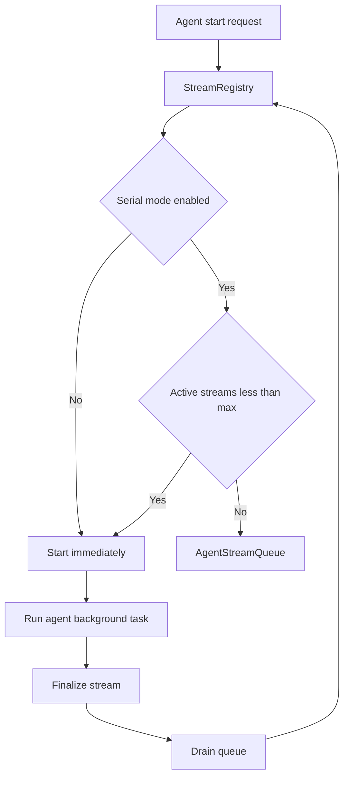

# Agent 串行模式与启动队列

## 背景

在低配设备、本地模型或 SQLite 写入压力较高的环境中，多路
`agent.astream()` 同时执行会抢占 CPU、内存和 LLM 上下文资源。应用需要一个
客户端可切换的运行时开关，让用户限制全局 Agent 并发（默认 1 路，可配置至 8 路）。

## 目标

- 用户可在客户端设置中开启或关闭 Agent 串行对话模式。
- 开关存储在 `config_kvs`，保存后由后端立即生效。
- 串行开启时，所有流式 Agent 启动请求经 `StreamRegistry` 统一排队。
- 用户聊天、HITL 续跑、总管委派和 skill 定时任务共享同一队列。

## 配置

| 项           | 说明                                                         |
| ------------ | ------------------------------------------------------------ |
| KV Key       | `AGENT_SERIAL_MODE`                                          |
| `1`          | 开启串行/限流模式，启用全局队列                                |
| `0` 或未配置 | 关闭串行模式，保持原有并发行为（`max_concurrent_streams=0`） |
| KV Key       | `AGENT_MAX_CONCURRENT_STREAMS`（仅串行开启时生效）           |
| 默认 `1`     | 全局最多 N 路 Agent 流，合法范围 1–8，非法值回退为 1         |
| 存储位置     | `config_kvs`                                                 |
| 前端位置     | 设置 -> 通用 -> 性能与资源                                   |

该开关不是 `RuntimeCapabilities` 的一部分。`RuntimeCapabilities` 表示部署能力
和远程功能可用性；Agent 串行模式是用户可切换的资源偏好。

## 现状与改造点

改造前的并发控制只有局部约束：

- `StreamRegistry._tasks` 只记录正在执行的会话流。
- 同一 `conversation_id` 已有 active stream 时拒绝重复启动。
- 总管委派通过 `can_assign_to_employee()` 做每员工并发上限。
- APScheduler 的 `max_instances=1` 只限制同一条定时任务不重叠。

不同会话、不同员工、不同定时任务仍可同时启动多路 Agent。

## 队列设计

`AgentStreamQueue` 位于 `apps/server/src/service/agent_stream_queue.py`，
由 `StreamRegistry` 组合使用。



### 优先级

数值越小越优先；同优先级按入队顺序 FIFO。

| Priority | Source          | 说明                 |
| -------- | --------------- | -------------------- |
| `0`      | `hitl_resume`   | 人机协同审批后的续跑 |
| `10`     | `user_chat`     | 用户主动发起的聊天   |
| `20`     | `orchestration` | 总管委派的员工任务   |
| `30`     | `scheduled`     | skill 定时任务       |

## 启动结果

`StreamRegistry.request_start()` 返回：

| 结果       | 含义                                        |
| ---------- | ------------------------------------------- |
| `started`  | 已立即启动后台 Agent                        |
| `queued`   | 已加入队列，等待当前流结束后自动启动        |
| `rejected` | 同会话已有 active/queued 任务，拒绝重复启动 |

`StreamRegistry.start()` 与 `request_start()` 相同，返回 `started` /
`queued` / `rejected`。委派与定时任务仅在 `rejected` 时关闭总管 DB 会话。

`registry.is_busy(conv_id)` 在总管仍 **streaming 或 queued** 时阻塞员工委派启动。
`can_assign_to_employee()` 将 `queued` 计入员工并发，避免串行模式下无限堆队。

## Runtime API

`GET /system/runtime` 增加：

```json
{
  "llm_label": "通义 / qwen-max",
  "agent_runtime": {
    "serial_mode": true,
    "max_concurrent_streams": 1,
    "active_streams": 1,
    "queued_starts": 2,
    "active_items": [
      {
        "conversation_id": 12,
        "title": "总管",
        "source": "user_chat"
      }
    ],
    "queued_items": [
      {
        "conversation_id": 34,
        "title": "任务A",
        "source": "scheduled",
        "priority": 30
      }
    ]
  }
}
```

- `llm_label`：当前激活的供应商与模型（API 仍返回，状态栏不展示）。
- `active_items` / `queued_items`：各最多 5 条会话摘要（含 `title`、`source`）。

## 底部状态栏（AppStatusBar）

全局挂在根布局 [`apps/web/src/routes/__root.tsx`](../apps/web/src/routes/__root.tsx) 底部，**常驻**一行（登录/激活等页隐藏）。

| 区域 | 内容 |
|------|------|
| 左 | 部署在线/离线 · 串行/并行（链到设置）· Agent 状态文案 |
| 右 | 浏览器网络断开 · 授权剩余天数 |

- 串行模式约 **4s** 轮询 `/system/runtime`，并行约 **15s**。
- 左侧在存在排队或快照项时可点击，Popover 列出执行中/排队会话，点击跳转对应聊天。
- 组件：[`apps/web/src/components/app-status-bar.tsx`](../apps/web/src/components/app-status-bar.tsx)。

## SSE 事件

当用户聊天进入队列时，后端发送：

```json
{
  "type": "agent_queued",
  "data": {},
  "position": 1,
  "message": "已加入执行队列，等待其他对话完成"
}
```

前端将其渲染为普通提示文本，不作为错误处理。队首出队后，同一 SSE 连接继续接收
实际 Agent 流事件。

## 边界

- 队列是进程内队列，应用重启后不会恢复未启动项。
- MCP 定时任务不经过 `StreamRegistry`，暂不受 Agent 串行模式限制。
- HITL `interrupted` 状态不占用 active 槽；用户确认后以最高优先级排队或启动。
- 用户取消 queued 会话时，会从内存队列移除，并将消息状态标为 `cancelled`。
- 串行关闭时不启用全局队列，保留原有并发能力。
- `_drain_queue` 若槽位仍被占用会 **重新入队**；僵尸 `streaming`（无 asyncio 任务）
  会被清理后再出队。
- 有新启动请求且槽位空闲时，会 **先 drain 队首** 再决定是否立即启动，避免插队。
- 进程重启后 DB 中残留的 `queued` 消息在 `resume` 时会自动修复为 `error`。
- 底部 `AppStatusBar` 常驻展示 Agent/模型/授权等状态（见上一节）。
- 委派启动 `REJECTED` 时会推送 `task_failed` 工作区事件。
- 总管定时任务在 `registry.start` 前使用 `get_orchestrator_agent(bind_context=False)`，
  仅在流真正 `_run_agent_background` 时 `set_context`；`reset_context(conv_id)` 按会话
  作用域清理，避免串行模式下其他流结束误清当前总管 DB 上下文。

## 验证建议

- 开启串行模式，会话 A 运行中，会话 B 发消息应进入队列。
- 会话 A 完成后，会话 B 自动开始输出。
- 总管一次确认多个即时任务时，员工任务应依次执行。
- 多个 skill 定时任务同时触发时，除第一条外应进入队列。
