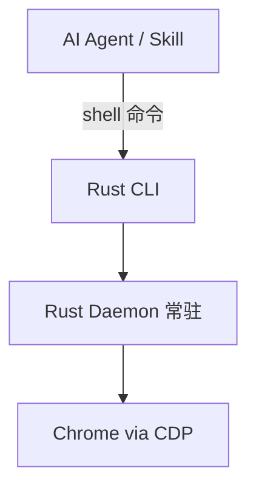

# agent-browser 调研摘要

> 调研对象：[vercel-labs/agent-browser](https://github.com/vercel-labs/agent-browser)  
> 目的：为数字员工「内嵌浏览器 + browser-runtime Skill + browserctl」方案提供参考，**不**引入或替换 agent-browser。  
> 关联计划：`.cursor/plans/browser_cli_runtime`（browser-runtime Skill 化、去掉 Python `browser_*` 工具链）

---

## 1. 产品定位

| 维度 | 说明 |
|------|------|
| 是什么 | 面向 AI Agent 的**浏览器自动化 CLI**（非 MCP 服务） |
| 实现 | **Rust CLI + Rust Daemon + CDP**（直连 Chrome，不依赖 Playwright） |
| 安装 | `npm i -g agent-browser`、`brew install agent-browser`、`cargo install`；首次 `agent-browser install` 下载 Chrome for Testing |
| Agent 用法 | 通过 **Shell** 执行命令；Cursor Skill 常见 `allowed-tools: Bash(agent-browser:*)` |
| 官网 | [agent-browser.dev](https://agent-browser.dev/) |

官方推荐的最小工作流：

```bash
agent-browser open example.com
agent-browser snapshot -i          # 可交互元素 + @eN ref
agent-browser click @e2
agent-browser fill @e3 "test@example.com"
agent-browser screenshot page.png
agent-browser close
```

---

## 2. 架构



要点：

1. **Client-Daemon**：首条命令拉起 daemon，后续命令复用同一浏览器实例，避免反复冷启动。
2. **传输**：CLI 与 daemon 通信；daemon 通过 CDP 控制 Chrome（或 Lightpanda、云浏览器 provider）。
3. **性能取向**：Rust 原生实现；README 强调比「每次起浏览器 + 整页 DOM」更省 token、更低延迟。
4. **空闲退出**：`AGENT_BROWSER_IDLE_TIMEOUT_MS` 可配置 daemon 空闲后关闭。

与早期第三方文章不同，当前 README 写明 **daemon 亦为 Rust + 直接 CDP**，不再依赖 Node/Playwright 常驻层。

---

## 3. Skill 设计（最值得借鉴）

agent-browser 采用 **「薄 Skill stub + CLI 动态文档」** 两层结构。

### 3.1 仓库内：discovery stub

项目内示例见 [`.agents/skills/agent-browser/SKILL.md`](../../.agents/skills/agent-browser/SKILL.md)（约 50 行）：

- 安装说明
- **真正工作流从 CLI 拉取**：`agent-browser skills get core`
- 专项：`skills get electron`、`slack`、`dogfood` 等
- `allowed-tools: Bash(agent-browser:*)`

**好处**：Skill 正文不随版本腐烂；与已安装 CLI 版本一致。

### 3.2 CLI 内置：版本化 Skill 内容

```bash
agent-browser skills list
agent-browser skills get core
agent-browser skills get core --full
agent-browser skills path [name]
```

环境变量 `AGENT_BROWSER_SKILLS_DIR` 可覆盖技能目录。

### 3.3 对 browser-runtime 的映射

| agent-browser | 建议 browser-runtime |
|---------------|----------------------|
| 薄 SKILL → `skills get core` | 首期静态 `SKILL.md` + `reference.md`；远期 `browserctl skills get` |
| 专项 skill（electron 等） | `embedded-panel.md`（右栏视口、HITL、生命周期） |
| Skill 只写何时用 + 工作流 | 业务 Skill（oa-overtime 等）只写业务流程 |

---

## 4. 核心命令与工作流

### 4.1 感知：snapshot + @eN

- `snapshot` 基于 **Accessibility Tree**，输出紧凑文本 + `@e1`、`@e2`…
- 常用过滤：`snapshot -i`（仅可交互）、`-c`（compact）、`-d N`（深度）、`-s "#selector"`（作用域）
- `--json` 返回结构化 `{ snapshot, refs }`
- **页面变化后必须重新 snapshot**，旧 ref 失效

与数字员工现状：[`browser-debugger-controller.ts`](../../apps/web/electron/features/browser/browser-debugger-controller.ts) 已用 `Accessibility.getFullAXTree` 生成 `@eN`，模型一致。

### 4.2 操作：ref 与选择器

```bash
agent-browser click @e2
agent-browser fill @e3 "text"
agent-browser click "#submit"              # CSS 亦支持
agent-browser find role button click --name "Submit"
```

### 4.3 批处理与链式（性能关键）

```bash
# Shell 链（daemon 常驻时安全）
agent-browser open example.com && agent-browser wait --load networkidle && agent-browser snapshot -i

# batch：单次 CLI 多命令
agent-browser batch "open https://example.com" "snapshot -i" "click @e1"
echo '[["open","https://x.com"],["snapshot","-i"]]' | agent-browser batch --json
```

**教训**：若只有「每步 spawn 新进程」而无 daemon/batch，Agent 高频调用可能更慢。browserctl 应对标 **`rpc --stdio` + `batch`**。

### 4.4 其它高频能力（MVP 可不做，远期参考）

- `wait`（元素、时间、networkidle、JS 条件）
- `get url` / `get text` / `extract`
- `screenshot` / `screenshot --annotate`（图上标号对应 @eN）
- `tab` / `frame` / `dialog`
- `network route` / HAR
- `state save/load`、profile、`auth vault`
- `dashboard`（4848 观测）、`stream` WebSocket 预览
- 安全：`--allowed-domains`、`--confirm-actions`、`--action-policy`

---

## 5. 与 Electron 的关系（易混淆）

agent-browser **默认自起 Chrome**。连接已有浏览器：

```bash
agent-browser connect 9222
agent-browser --cdp 9222 snapshot
agent-browser --auto-connect open example.com
```

并有专项 Skill：`agent-browser skills get electron`（VS Code、Slack、Discord 等**外部** Electron 应用，经 CDP）。

| | agent-browser | 数字员工内嵌浏览器 |
|--|---------------|-------------------|
| 浏览器实例 | 独立 Chromium / 云浏览器 | 主窗口 **WebContentsView** |
| UI | headless 或 `--headed` 另窗 | **右栏面板** + 视口 sync |
| HITL | CLI `--confirm-*` / policy | React 确认 + [`requestBrowserConfirmation`](../../apps/web/electron/features/browser/browser-http-bridge.ts) |
| 调用链 | Shell → daemon → CDP | Skill → `shell_execute` → **HTTP 127.0.0.1:34555** → 主进程 |

**结论**：不要用 agent-browser 替换内嵌面板；学 **CLI + Skill + ref 工作流**，runtime 仍绑自有 Electron。

---

## 6. Agent 集成方式

README 推荐三种：

1. **直接告诉 Agent**：「用 agent-browser 测登录；`agent-browser --help` 看命令」
2. **安装 Skill**：`npx skills add vercel-labs/agent-browser`（Cursor / Claude Code 等）
3. **AGENTS.md / CLAUDE.md** 写死核心四步：`open → snapshot -i → click/fill → re-snapshot`

数字员工对应：

- 基础 Skill：`build-in-skills/browser-runtime`
- 执行：`shell_execute` + `browserctl`（已有 [`employee.py`](../../apps/server/src/service/agent/employee.py) shell 工具）
- **删除** `create_browser_tools()`，能力靠 **员工分配 Skill**

---

## 7. 安全与会话（远期参考）

| 能力 | 说明 |
|------|------|
| `--session` / `AGENT_BROWSER_SESSION` | 多隔离浏览器实例 |
| `--session-name` | 自动持久化 cookies/localStorage |
| `--profile` | 复用 Chrome 配置或持久目录 |
| `--state` / `state save` | JSON 状态文件 |
| `auth save` / `auth login` | 本地加密凭证库 |
| `--allowed-domains` | 导航与资源域名白名单 |
| `--confirm-actions` | 敏感操作需确认 |
| `--content-boundaries` | 页面输出边界标记（防 prompt 注入） |

数字员工已有：**点击 HITL**、关闭浏览器确认、切会话销毁实例；域名白名单可后续在 bridge 或 Skill 层补充。

---

## 8. 与当前代码库对照

| agent-browser 能力 | 数字员工现状 | 缺口 |
|--------------------|--------------|------|
| `@eN` + a11y snapshot | [`browser-debugger-controller.ts`](../../apps/web/electron/features/browser/browser-debugger-controller.ts) | snapshot 过滤选项（-i/-c/-d）可增强 |
| CSS selector | 支持 | — |
| `find role/text/label` | 无 | 可后期加 |
| `wait networkidle` | navigate 内部分等待 | 可独立 wait 命令 |
| HTTP bridge | [`browser-http-bridge.ts`](../../apps/web/electron/features/browser/browser-http-bridge.ts) `:34555` | 加 `/health`、统一 envelope |
| Python `browser_*` tools | [`browser_tool.py`](../../apps/server/src/service/agent/browser_tool.py) | **计划删除** |
| `batch` / daemon | 无 | **browserctl batch + rpc --stdio** |
| 多 session | 仅 `default` | 可按对话扩展 session id |
| 连接外部 Electron CDP | agent-browser 支持 | **不需要**（内嵌 runtime） |

---

## 9. browser-runtime 建议（实施 checklist）

### 9.1 应对齐的 agent-browser 形态

1. 独立基础 Skill `browser-runtime`（`apps/server/build-in-skills/`）
2. CLI 命令名接近：`open`/`navigate`、`snapshot`、`click`、`fill`、`get url`、`screenshot`、`health`
3. 默认 JSON 输出；可选人类可读 snapshot 文本
4. 文档工作流：`navigate → snapshot → act → re-snapshot`
5. 执行通道：`shell_execute` → `browserctl`

### 9.2 必须保留的产品差异

1. 导航时 `browser:request-open` + 视口 layout（[`handleNavigate`](../../apps/web/electron/features/browser/browser-http-bridge.ts)）
2. 右栏生命周期（最小化 / 关闭确认 / 切会话 `destroyBrowser`）
3. HITL 走桌面 UI，非纯 TTY
4. Bridge 仅 `127.0.0.1`，与桌面端同机

### 9.3 建议 MVP 命令集

```bash
browserctl health
browserctl open <url>              # 别名 navigate
browserctl snapshot [--interactive] [--max-nodes 200] [--json]
browserctl click <@eN|selector> [--confirm "…"]
browserctl fill <@eN|selector> <text>
browserctl get url
browserctl extract-text
browserctl screenshot [--json]
browserctl batch …                 # Phase 2
browserctl rpc --stdio             # Phase 2，对标 daemon
```

### 9.4 Skill 目录结构（建议）

```
apps/server/build-in-skills/browser-runtime/
├── SKILL.md
├── reference.md
├── embedded-panel.md    # 右栏、视口、HITL、与 agent-browser 差异
└── examples.md          # baidu-search / oa-overtime 组合
```

---

## 10. 结论与实施顺序

1. **学 agent-browser 的 Skill + CLI + @eN + batch/daemon 形态**，不引入其独立 Chrome。
2. **去掉 Python `browser_*` 与 FastAPI browser 代理**，与「Shell 驱动、Skill 分配能力」一致。
3. **必须做 `browserctl rpc --stdio` 或 `batch`**，否则仅 CLI 壳子可能慢于现有 Python httpx 路径。
4. **能力 = Skill 分配**：`browser-runtime`（怎么操作浏览器）+ 业务 Skill（为什么操作）+ 员工挂载（谁有权用）。

推荐实施顺序：

1. Electron bridge：`/health` + 统一 `{ ok, data, error, code }`
2. `browserctl` MVP + 与 34555 联调
3. `browser-runtime` Skill 文档
4. 删除 Python 层 + 迁移 `baidu-search` / `oa-overtime`
5. `batch` + `rpc --stdio`

---

## 参考链接

- GitHub：https://github.com/vercel-labs/agent-browser  
- 文档站：https://agent-browser.dev/  
- Skills 安装：`npx skills add vercel-labs/agent-browser`  
- 本项目内嵌浏览器 PRD：[embedded-browser-panel-prd.md](./embedded-browser-panel-prd.md)  
- Electron 浏览器实现说明：[apps/web/electron/features/browser/README.md](../../apps/web/electron/features/browser/README.md)
