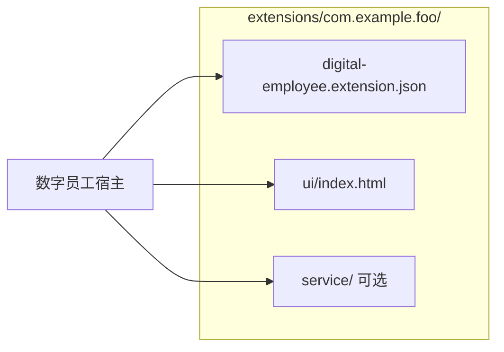

# 数字员工桌面端 · 插件开发规范

本文档面向**插件作者**，说明如何在数字员工 Electron 客户端中开发、调试与发布插件。宿主实现细节见 [apps/web/electron/features/extension/README.md](../apps/web/electron/features/extension/README.md)；规划中的能力见 [待实现.md](../apps/web/electron/features/extension/待实现.md)。

---

## 1. 概述

### 1.1 插件是什么

插件是安装在用户本机 `~/.digital-employee/extensions/<id>/` 下的独立包，包含：

- **Manifest**：`digital-employee.extension.json`（元数据、权限、网络策略等）
- **UI（可选）**：任意 `index.html` 或独立前端 SPA，在专用 **插件 BrowserWindow** 中运行
- **Service（可选）**：由宿主拉起的**本地子进程**（Node、Python、打包二进制等），通过 `http://127.0.0.1:<port>` 与 UI 或 headless 逻辑通信

插件 UI **不**接入主应用 TanStack Router，**不**合并进主应用 preload；仅通过 `window.extension` 与宿主交互。

### 1.2 三种形态

| 形态 | manifest | 行为 |
|------|----------|------|
| 仅 UI | 有 `ui`，无 `service` | 设置页「打开」→ 加载插件 HTML |
| UI + 本地服务 | 有 `ui` + `service` | 先启 service，再开插件窗；`getContext().serviceBaseUrl` 注入 UI |
| Headless | 有 `service`，无 `ui` | 启用后只跑子进程，无插件窗；可收宿主 HTTP 事件 |



### 1.3 运行环境

- 插件窗使用独立 preload：`window.extension`（[extension-preload.ts](../apps/web/electron/preload/extension-preload.ts)）
- 插件窗 `webSecurity: false`，便于 `file://` 或 dev 源访问外网 API（仍受出站策略约束）
- 开发模式下插件窗会自动打开 DevTools

---

## 2. 包结构与命名

### 2.1 目录布局

```
~/.digital-employee/extensions/
└── com.company.my-plugin/          # 目录名必须与 manifest.id 一致
    ├── digital-employee.extension.json
    ├── ui/
    │   └── index.html              # ui.entry 指向的入口
    └── service/                    # 可选
        ├── server.mjs
        └── ...
```

### 2.2 ID 规则

- 反向域名：`com.company.product`（每段以小写字母开头，可含数字与连字符）
- 与 [manifest-schema](../apps/web/electron/features/extension/manifest-schema.ts) 中 `extensionIdRegex` 一致

### 2.3 约定

| 项 | 说明 |
|----|------|
| `ui.entry` | 相对插件根目录，如 `ui/index.html` |
| `service.cwd` | 相对插件根目录，默认 `.` |
| `service.command` |  argv 数组，首项可为 `bundledBinary` 相对路径 |
| 废弃字段 | **不要使用** 旧版 `kind` 字段（扫描时会剔除） |

---

## 3. Manifest 参考

文件名固定为 **`digital-employee.extension.json`**。至少包含 **`ui` 和/或 `service` 之一**。

### 3.1 顶层字段

| 字段 | 类型 | 必填 | 说明 |
|------|------|------|------|
| `id` | string | 是 | 与文件夹名一致 |
| `version` | string | 是 | 语义化版本字符串 |
| `displayName` | string | 是 | 设置页展示名称 |
| `minHostVersion` | string | 否 | 最低宿主版本；不满足则扫描时跳过 |
| `permissions` | string[] | 否 | 默认 `[]`，见第 4 节 |
| `network` | object | 条件 | 外网出站时需 `host.network` + `network.allowlist` |
| `ui` | object | 条件 | 插件窗配置 |
| `service` | object | 条件 | 本地子进程配置 |

### 3.2 `network`

```json
{
  "network": {
    "allowlist": ["api.example.com", "*.cdn.example.com"]
  }
}
```

- 须同时声明权限 `host.network`
- 匹配规则：精确主机名，或 `*.suffix`（子域匹配）
- 当前**不**支持按端口限制；默认允许该主机上的 http/https

### 3.3 `ui`

| 字段 | 说明 |
|------|------|
| `entry` | HTML 入口相对路径 |
| `title` | 窗口标题 |
| `width` / `height` | 窗口尺寸（默认 960×720） |
| `devEntry` | 可选；开发时完整 URL，仅 `http://127.0.0.1` 或 `http://localhost` |

### 3.4 `service`

| 字段 | 说明 |
|------|------|
| `command` | 启动命令 argv，如 `["node", "server.mjs"]` |
| `cwd` | 工作目录，相对插件根 |
| `port` | `0` 表示由宿主分配空闲端口 |
| `host` | 固定 `127.0.0.1` |
| `envPortKey` | 写入子进程 env 的端口变量名，默认 `PORT` |
| `env` | 额外环境变量 |
| `ready` | 就绪探测，见 8.2 |
| `bundledBinary` | 可选；替换 `command[0]` 为插件内二进制路径 |
| `hostEventsPath` | headless 收宿主 POST 的路径，默认 `/_digital-employee/host-events` |

### 3.5 最小示例

**仅 UI**（见 [examples/extension-demo](../examples/extension-demo)）：

```json
{
  "id": "com.example.demo",
  "version": "1.0.0",
  "displayName": "示例插件",
  "minHostVersion": "0.0.49",
  "permissions": ["context.read"],
  "ui": {
    "entry": "ui/index.html",
    "title": "示例插件",
    "width": 800,
    "height": 600
  }
}
```

**UI + service**（见 [examples/extension-demo-service](../examples/extension-demo-service)）：

```json
{
  "id": "com.example.demo-service",
  "version": "1.0.0",
  "displayName": "示例插件（含本地服务）",
  "permissions": ["context.read"],
  "ui": { "entry": "ui/index.html", "title": "示例", "width": 800, "height": 600 },
  "service": {
    "command": ["node", "server.mjs"],
    "cwd": "service",
    "port": 0,
    "host": "127.0.0.1",
    "envPortKey": "PORT",
    "ready": { "type": "stdout", "pattern": "listening on" }
  }
}
```

**Headless**（见 [examples/extension-demo-headless](../examples/extension-demo-headless)）：

```json
{
  "id": "com.example.demo-headless",
  "version": "1.0.0",
  "displayName": "示例插件（后台服务）",
  "permissions": ["host.events"],
  "service": {
    "command": ["node", "server.mjs"],
    "cwd": "service",
    "port": 0,
    "host": "127.0.0.1",
    "envPortKey": "PORT",
    "ready": { "type": "stdout", "pattern": "listening on" }
  }
}
```

---

## 4. 权限（permissions）

遵循**最小权限**：未在 manifest 中声明的权限，对应 API 会失败。

| 权限 | 用途 | 典型场景 |
|------|------|----------|
| `context.read` | 调用 `getContext()` / `getPluginId()` | 几乎所有插件 |
| `auth.read` | `getContext().authToken`；出站请求自动加 `Authorization: Bearer`（未手动设置时） | 调用企业 SaaS API |
| `host.network` | 插件 UI 访问 allowlist 内外网 | 须配合 `network.allowlist` |
| `host.storage` | `invoke('storage.get'/'storage.set')` | 插件私有 KV |
| `host.events` | `onHostEvent`；headless 收宿主 POST | 与主应用联动 |
| `host.backend.read` | `invoke('backend.getPort'/'backend.health')` | 展示主 Python 后端状态 |
| `host.notification` | `invoke('notification.show')` | 系统通知 |
| `host.window.main` | `invoke('window.focusMain')` | 唤起主窗口 |
| `host.window.settings` | `invoke('window.openSettings')` | 打开设置页 |
| `host.pet` | `invoke('pet.show'/'pet.hide')` | 桌宠 |
| `host.recruitment` | `invoke('recruitment.open')` | 招聘窗 |

**注意**：

- `host.backend.read` **不能**让插件 UI 用 `fetch` 直连 `127.0.0.1:<主后端端口>`（会被 webRequest 拦截）
- `auth.read` 会把 token 放入 `getContext()`；敏感逻辑建议放 service，UI 依赖自动注入即可

---

## 5. 插件 UI API（`window.extension`）

`apiVersion` 当前为 **`1`**。

| 方法 | 返回值 | 说明 |
|------|--------|------|
| `getPluginId()` | `Promise<string>` | 当前插件 id |
| `getContext()` | `Promise<ExtensionContextPayload>` | 见下表 |
| `close()` | `Promise<void>` | 关闭当前插件窗 |
| `invoke(method, payload?)` | `Promise<unknown>` | 调用宿主能力，见第 6 节 |
| `listInvokeMethods()` | `Promise<{ method, permission, allowed }[]>` | 开发期发现 API |
| `onHostEvent(handler)` | `() => void` | 取消订阅函数；需 `host.events` |

### 5.1 `getContext()` 字段

| 字段 | 说明 |
|------|------|
| `pluginId` | 同 manifest `id` |
| `displayName` | 展示名 |
| `version` | 插件版本 |
| `hostVersion` | 宿主应用版本 |
| `permissions` | 已声明权限列表 |
| `authToken` | 有 `auth.read` 且已登录时存在 |
| `serviceBaseUrl` | 有 `service` 且已启动时，如 `http://127.0.0.1:54321` |

### 5.2 已废弃

**不要使用** `window.extension.fetch`。外网请求请使用浏览器原生 **`fetch`** / XHR（见第 7 节）。

---

## 6. `extension.invoke` 方法

调用前可用 `await extension.listInvokeMethods()` 查看当前 manifest 是否 `allowed: true`。

### 6.1 方法一览

| 方法 | 所需 permission | payload | 返回值 |
|------|-----------------|---------|--------|
| `notification.show` | `host.notification` | `{ title, body, silent? }` | `void` |
| `window.focusMain` | `host.window.main` | 无 | `void` |
| `storage.get` | `host.storage` | `{ key }` | `unknown` |
| `storage.set` | `host.storage` | `{ key, value }` | `void` |
| `backend.getPort` | `host.backend.read` | 无 | `{ port: number }` |
| `backend.health` | `host.backend.read` | 无 | `{ ready, running, port, healthy }` |
| `window.openSettings` | `host.window.settings` | `{ tab? }` 可选 | `void` |
| `pet.show` | `host.pet` | 无 | `void` |
| `pet.hide` | `host.pet` | 无 | `void` |
| `recruitment.open` | `host.recruitment` | 无 | `void` |

### 6.2 `window.openSettings` 的 `tab`

可选值：`account` | `general` | `shortcuts` | `models` | `pet` | `extensions` | `about`。

示例：引导用户安装插件 → `await extension.invoke('window.openSettings', { tab: 'extensions' })`

### 6.3 代码示例

```javascript
// 通知
await window.extension.invoke('notification.show', {
  title: '插件',
  body: '任务完成',
})

// 插件私有存储
await window.extension.invoke('storage.set', { key: 'lastRun', value: Date.now() })
const last = await window.extension.invoke('storage.get', { key: 'lastRun' })

// 主 Python 后端健康（非插件 service）
const health = await window.extension.invoke('backend.health')
console.log(health.healthy, health.port)
```

### 6.4 常见错误

| 错误信息 | 原因 |
|----------|------|
| `lacks permission: host.xxx` | manifest 未声明对应 permission |
| `Unknown extension.invoke method` | 方法名拼写错误或宿主版本过旧 |
| `Main window is not available` | 主窗口尚未创建 |

---

## 7. 网络与 HTTP

插件 UI 出站由宿主 **`session.webRequest`** 统一管控（[extension-network-guard.ts](../apps/web/electron/features/extension/extension-network-guard.ts)）。

### 7.1 插件 UI 窗

- 使用原生 **`fetch`**、XHR、WebSocket
- **外网**：须 `host.network` + `network.allowlist` 匹配目标主机名
- **`auth.read`**：对已放行的请求，若请求头无 `Authorization`，宿主自动添加 `Bearer <token>`
- **禁止**：渲染层访问主 Python 后端 `127.0.0.1:{getBackendPort()}`（默认端口 `34567`，可由 `VITE_BACKEND_PORT` 配置）
- **允许（无需 `host.network`）**：
  - 本插件 `getContext().serviceBaseUrl` 的 origin（访问自己的 service）
  - 开发未打包时，与 `ui.devEntry` / 环境变量 `EXTENSION_DEV_<ID>` 同 origin 的请求

### 7.2 Service 子进程

- 出站 **不受** allowlist 限制
- 大文件上传/下载、multipart、密钥处理等，**推荐在 service 实现 HTTP**，UI 只请求 `serviceBaseUrl`

### 7.3 推荐模式

| 场景 | 推荐做法 |
|------|----------|
| 公网 JSON API | UI `fetch` + `host.network` + allowlist |
| 需登录态的外网 API | 加 `auth.read`，无需在 JS 里手写 Bearer（也可读 `authToken`） |
| 大文件 / 二进制 / 流式 | service 提供 HTTP，UI `fetch(serviceBaseUrl + '/...')` |
| 查主后端是否在线 | `invoke('backend.health')`，不要 UI `fetch` 打主后端端口 |

### 7.4 示例

```javascript
// manifest: permissions 含 host.network，network.allowlist 含 api.example.com
const res = await fetch('https://api.example.com/v1/status')
const data = await res.json()

// 访问本插件 service（无需 host.network）
const ctx = await window.extension.getContext()
const local = await fetch(`${ctx.serviceBaseUrl}/api/hello`)
```

---

## 8. 本地 Service 开发

### 8.1 生命周期

- 打开插件窗（含 UI）或启用 headless 插件时，宿主 **spawn** 子进程
- 关闭插件窗、禁用插件、卸载插件或退出应用时 **停止** 子进程
- `port: 0` 时宿主分配端口并写入 `process.env[envPortKey]`

### 8.2 就绪探测 `ready`

**stdout 正则**：

```json
"ready": { "type": "stdout", "pattern": "listening on" }
```

子进程日志出现匹配行后视为就绪。

**HTTP 健康检查**：

```json
"ready": {
  "type": "health",
  "path": "/health",
  "intervalMs": 500,
  "timeoutMs": 30000
}
```

### 8.3 UI 访问 Service

```javascript
const ctx = await window.extension.getContext()
if (!ctx.serviceBaseUrl) throw new Error('service not ready')
const res = await fetch(`${ctx.serviceBaseUrl}/your-api`)
```

### 8.4 Headless 收宿主事件

- manifest 需 `host.events` + `service`
- 宿主 POST JSON 到 `serviceBaseUrl` + `hostEventsPath`（默认 `/_digital-employee/host-events`）
- body 格式：`{ type, payload?, timestamp }`

### 8.5 命令安全

`service.command` 各参数不得包含 `; & | \` $ < >` 等 shell 元字符（宿主校验）。

---

## 9. 宿主事件（UI 插件）

```javascript
const dispose = window.extension.onHostEvent((envelope) => {
  console.log(envelope.type, envelope.payload, envelope.timestamp)
})

// 不再需要时
dispose()
```

- 需 `host.events`
- 仅推送给**已打开**且订阅了的插件窗
- 主应用可通过宿主 API `emitExtensionHostEvent(type, payload)` 发送（设置页有测试按钮）

---

## 10. 开发、安装与卸载

### 10.1 本地开发

1. 将插件目录复制到 `~/.digital-employee/extensions/<id>/`
2. 在宿主 **设置 → 插件** 中启用并打开
3. 或使用热更新 URL（仅开发态）：
   - manifest `ui.devEntry`: `http://127.0.0.1:5173/`
   - 或环境变量：`EXTENSION_DEV_COM_EXAMPLE_DEMO=http://127.0.0.1:5173/`（id 中 `.` 换 `_` 并大写）

### 10.2 安装与卸载（终端用户）

| 操作 | 方式 |
|------|------|
| 安装 | 设置页「从 zip 安装」；zip 内含合法 manifest（**当前无签名校验**） |
| 卸载 | 设置页对应插件「删除」 |
| 手动 | 直接增删 `extensions/<id>/` 目录后「刷新列表」 |

### 10.3 版本兼容

- `minHostVersion` 与宿主 [package.json](../apps/web/package.json) 的 `version` 做 semver 比较
- 宿主升级后若 API 变更，应提高插件 `version` 并更新 `minHostVersion`

### 10.4 打包 zip 建议结构

```
my-plugin.zip
└── com.company.my-plugin/
    ├── digital-employee.extension.json
    ├── ui/
    └── service/
```

也可 zip 根目录即为插件 id 文件夹内容，安装器会在 zip 内查找 `digital-employee.extension.json` 并防 zip slip。

---

## 11. 安全与审查清单

- [ ] `permissions` 仅包含必要项
- [ ] `network.allowlist` 仅列业务域名，避免 `*`
- [ ] 不在 UI 硬编码密钥；优先 service + 环境变量
- [ ] `service.command` 使用捆绑二进制或固定脚本，避免用户可控参数拼进命令
- [ ] 告知用户：zip 安装前**无 Ed25519 验签**，仅安装可信来源（见 [待实现.md](../apps/web/electron/features/extension/待实现.md)）
- [ ] 不依赖已移除的 `extension.fetch`

---

## 12. 官方示例索引

| 示例 | 路径 | 演示点 |
|------|------|--------|
| 基础 UI | [extension-demo](../examples/extension-demo) | `getContext`、最小窗 |
| 本地 service | [extension-demo-service](../examples/extension-demo-service) | `serviceBaseUrl` |
| 出网 allowlist | [extension-demo-fetch](../examples/extension-demo-fetch) | 原生 `fetch` + webRequest |
| invoke / 事件 | [extension-demo-invoke](../examples/extension-demo-invoke) | invoke 与 `onHostEvent` |
| headless | [extension-demo-headless](../examples/extension-demo-headless) | 仅 service + 宿主 POST |

更多示例目录说明见 [examples/README.md](../examples/README.md)。

---

## 13. 附录

### 13.1 相关文档

| 文档 | 读者 |
|------|------|
| [extension/README.md](../apps/web/electron/features/extension/README.md) | 宿主维护者 |
| [electron/README.md](../apps/web/electron/README.md) | Electron 架构与分期能力 |
| [待实现.md](../apps/web/electron/features/extension/待实现.md) | 签名、市场等规划 |

### 13.2 类型与 Channel

- IPC 约定：[extension-ipc-channels.ts](../apps/web/electron/shared/extension-ipc-channels.ts)
- 插件页类型：[extension-renderer.d.ts](../apps/web/electron/extension-renderer.d.ts)

### 13.3 后续规划（尚未实现）

Ed25519 签名校验、插件市场 OTA、`settings.get/set`、service 出站代理等，见 [待实现.md](../apps/web/electron/features/extension/待实现.md)。

---

*文档版本与宿主 `digital-employee` 包版本同步维护；若行为与本文冲突，以仓库内 TypeScript 实现为准。*
