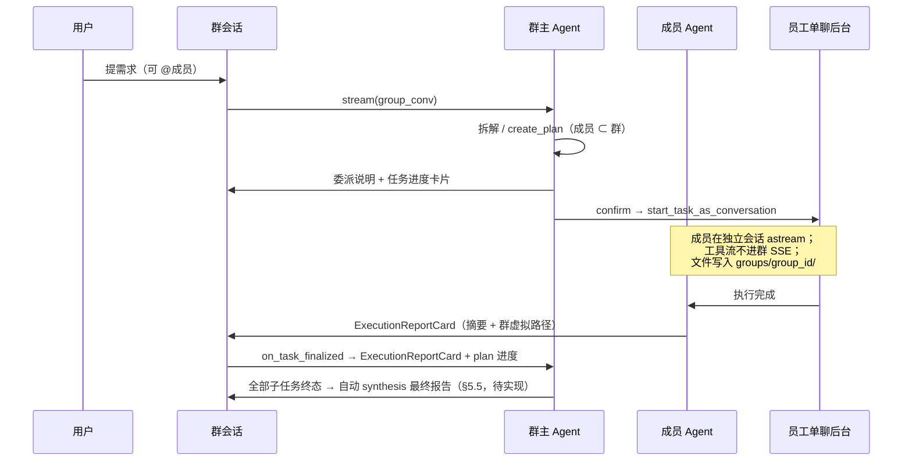
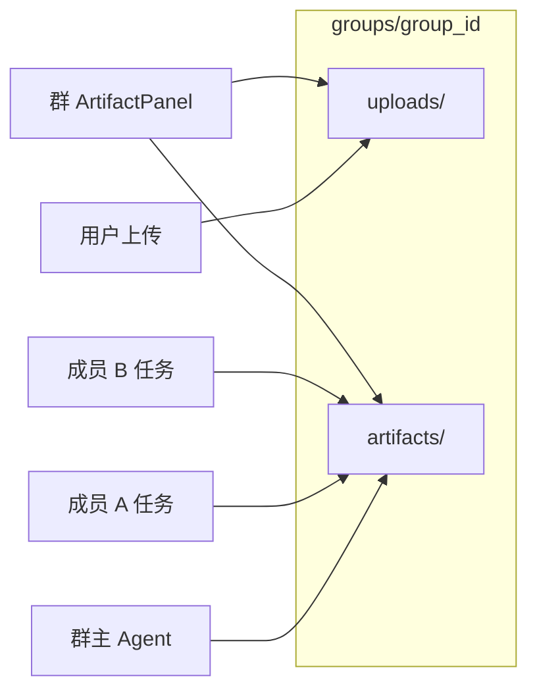
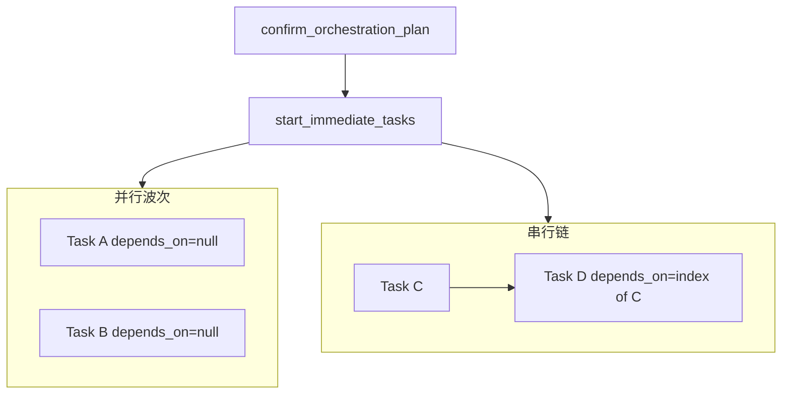
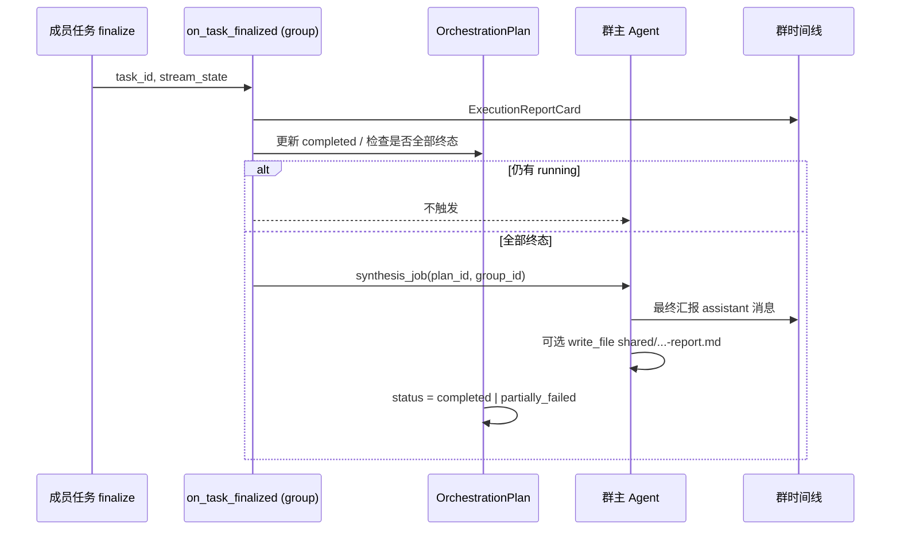

# 群聊功能设计

> **版本**：v0.4（讨论稿）  
> **状态**：未实现；本文档汇总产品模型、架构方向、已拍板决策与边界/异常清单，供后续排期与开发对照。  
> **编排复用**：群群主复用总管编排引擎；**§5.4 执行模式**、**§5.5 群主汇总** 与 [多智能体编排](./multi-agent-orchestration-plan.md) 对齐。  
> **相关文档**：[多智能体编排](./multi-agent-orchestration-plan.md)、[任务生命周期](./task-lifecycle.md)、[总管/员工 SSE 隔离](../apps/server/docs/orchestrator-employee-stream-isolation.md)、[HITL 架构](../apps/server/docs/hitl-architecture.md)、[文件上传到 uploads](./tasks/file-upload-to-artifacts.md)

### 文档导读


| 章节        | 读者      | 内容                   |
| --------- | ------- | -------------------- |
| §一～§二     | 产品 / 设计 | 定位、角色、弱化能力           |
| §三～§四     | 产品 + 前端 | 时序、时间线 UX、群共享目录      |
| §5.4～§5.6 | 后端编排    | 执行模式、汇总、plan_json 示例 |
| §六～§八     | 全员      | 缺口、实现清单、路线           |
| §九～§十     | 决策      | 已拍板、待决               |
| §十一       | 联调 / QA | 边界与异常                |
| §十二～§十四   | 开发      | 代码索引、术语表             |


---

## 一、产品定位

### 1.1 群聊 vs 总管编排


| 路径              | 状态      | 典型场景                                           |
| --------------- | ------- | ---------------------------------------------- |
| **总管对话 + 编排委派** | 已可用     | 「这个项目要设计+开发+测试，帮我分工」→ 总管拆任务、派给 workspace 内任意员工 |
| **群聊**          | **未开放** | 「在这个项目群里 @后端 做 API」→ 固定成员池内的协作项目室              |


群聊**不是**替代总管，而是补一种交互形态：**持续、可见、同上下文的多人协作**，成员池固定为群成员。

总管 Prompt 与使用手册当前明确：**群聊尚未开放**；用户要多人协作时应走总管编排或分别单聊（总管内可用 `@` 指定员工）。见 `apps/server/src/service/agent/orchestrator/prompts.py`、`apps/server/orchestrator_skills/user-usage-manual/SKILL.md`。

### 1.2 一句话定位（已共识）

> **群聊 = 用户与群主的协作频道；成员是后台工单执行者，通过任务卡片回执；群维护一份共享的 `uploads/` / `artifacts/` 工作区，群主与所有被派成员对同一虚拟路径可读写；群任务产出的文件强制写入群目录。**

---

## 二、角色与职责


| 角色      | 是谁                                      | 在群里做什么                           | 不做什么                       |
| ------- | --------------------------------------- | -------------------------------- | -------------------------- |
| **用户**  | 人类管理者                                   | 提需求、确认方案、`@` 指定人选、看进度与结果         | —                          |
| **群主**  | 固定 1 个协调 Agent（建议复用总管能力，**成员范围 = 群成员**） | 听懂需求 → 拆任务 → 派活 → 汇总成员反馈 → 向用户汇报 | 不代替成员长篇交付（与现有总管 Prompt 一致） |
| **群成员** | 群内的数字员工                                 | **后台干活**，完成后**结构化反馈**到群时间线       | **不在群里自由聊天**、不互相 `@`、不抢话   |


**核心约束**：群时间线 = **用户 ↔ 群主** 的对话面 + 成员 **「工单回执」**，不是 N 个员工轮流发言的讨论区。

### 2.1 弱化的能力

- 成员之间没有「@李四 你觉得呢？」式自由讨论
- 成员不在群里流式输出 `read_file` / `shell_execute` 等工具细节（沿用总管 SSE 隔离策略）
- 用户 `@成员` = 告诉群主「优先派给这人」，**不是**用户与成员直连（除非点卡片进员工单聊看详情）

### 2.2 群主如何知晓上下文

建议三层上下文，而非把全员聊天记录灌给群主：


| 层级             | 内容                    | 来源                                                                         |
| -------------- | --------------------- | -------------------------------------------------------------------------- |
| **群会话史**       | 用户诉求、群主委派说明、确认过的 plan | `Conversation(target_type=group)` messages                                 |
| **任务态**        | 谁在干、进度、成败、依赖          | `OrchestrationPlan` + `TaskExecutionLog`（scoped 到 `group_conversation_id`） |
| **成员回执 + 群产物** | 摘要、虚拟路径、关键 output     | `ExecutionReportCard` + 群 `artifacts/` / 可选 `manifest.json`                |


成员干完后：

1. **UI 层**：`on_task_finalized` → 群时间线插入 `ExecutionReportCard`（复用 `CuratorView` 模式）
2. **Agent 层**：群主下一轮通过 `list_tasks` + 群产物清单汇总；**禁止**代读成员技能目录（现有总管 Prompt 已有）

---

## 三、消息与执行链路




### 3.1 与现有总管模式的映射


| 现有（总管单聊）                                         | 群聊（目标）                            |
| ------------------------------------------------ | --------------------------------- |
| `Conversation(target_type=curator)`              | `Conversation(target_type=group)` |
| 可派任意 workspace 员工                                | **只能派 `group.members`**           |
| `CuratorView` = messages + `ExecutionReportCard` | 群聊视图 = **同一套时间线组件**               |
| `orchestrator_conversation_id` 关联执行 log          | `group_conversation_id`（或等价字段）    |
| 用户 ↔ 总管                                          | 用户 ↔ **群主**；成员仅回执                 |


SSE 隔离：成员执行仍在员工单聊 `astream`，**不回灌 tool 流到群 SSE**。见 [orchestrator-employee-stream-isolation.md](../apps/server/docs/orchestrator-employee-stream-isolation.md)。

### 3.2 群时间线 UX（目标态）

```
┌─ 群：「智能客服项目组」────────────────────────┐
│ [用户] 做一个客服 demo，@李四 负责后端              │
│ [群主] 已拆 2 个子任务：李四-API、王五-前端…        │
│ ┌ TaskProgressBar ─ 1/2 执行中 ─────────────┐  │
│ └───────────────────────────────────────────┘  │
│ ┌ ExecutionReportCard ─ 李四 · 成功 · API ──┐  │
│ │ 产物 /artifacts/lisi/api-spec.md           │  │
│ │ [查看文件] [查看详情 → 员工单聊]             │  │
│ └───────────────────────────────────────────┘  │
│ [群主] 后端已完成；等前端完成后给你总汇报。          │
└────────────────────────────────────────────────┘
```

---

## 四、群共享文件（uploads / artifacts）

### 4.1 产品语义：「共享、成员可感知」

三个层次须同时满足：


| 层次            | 含义                                              |
| ------------- | ----------------------------------------------- |
| **存储共享**      | 群相关 uploads/artifacts 落在同一物理目录                  |
| **Agent 可感知** | 群主、任一被派成员 `read_file("/artifacts/...")` 指向同一套文件 |
| **UI 可感知**    | 群 ArtifactPanel、执行卡片链接、成员回执路径均指向群共享空间           |


### 4.2 共享范围


| 虚拟路径          | 是否群共享 | 说明             |
| ------------- | ----- | -------------- |
| `/uploads/`   | ✅     | 用户在群里上传、本机路径导入 |
| `/artifacts/` | ✅     | 任一成员交付物、群主汇总稿  |
| `/memories/`  | ❌     | 仍 per-employee |
| `/skills/`    | ❌     | 仍 per-employee |


**共享文件，不共享聊天内容**：成员不需读彼此气泡，但需读群目录里的文件。

### 4.3 存储模型（已拍板）

群级目录与 `ChatGroup.id` 绑定：

```
~/.digital-employee/conversations/
  └── groups/
      └── <group_id>/
          ├── artifacts/          ← 群共享交付物
          ├── uploads/            ← 群共享上传
          └── manifest.json       ← 可选：产物索引（作者、任务、时间）
```

**挂载规则**：


| 运行时            | `/artifacts/`、`/uploads/` 物理根           |
| -------------- | --------------------------------------- |
| 群会话（群主 stream） | `groups/<group_id>/`                    |
| 从群派出的成员任务      | **同样** `groups/<group_id>/`（不是员工单聊会话目录） |
| 员工单聊（非群任务）     | 仍 `/<conversation_id>/`（现状不变）           |


虚拟路径**不改名**，仍用 `/artifacts/`、`/uploads/`；仅 backend root 解析改为群目录。




### 4.4 群任务强制写群目录（已拍板）

**群任务**：由群会话群主创建/确认、且 `group_id` 已绑定的编排子任务。


| 类型       | 物理根                                                         |
| -------- | ----------------------------------------------------------- |
| **群任务**  | `groups/<group_id>/uploads/`、`groups/<group_id>/artifacts/` |
| **非群任务** | 现有 per-conversation 逻辑                                      |


**硬约束**：

1. 群任务 Agent 的 `CompositeBackend` **只挂载群目录**，不用员工单聊会话下的 artifacts/uploads 作为主存储。
2. 群任务内 `write_file` / `edit_file` 等到 `/artifacts/` 的产出**必须**落在 `groups/<group_id>/artifacts/`。
3. **禁止**群任务完成后以员工私有会话目录作为产物主副本（员工单聊可**只读**挂载群目录供「查看详情」，可选）。
4. 用户在群里上传 → 直接写入 `groups/<group_id>/uploads/`，成员 prompt 使用 `/uploads/...`，**无需**总管→员工 uploads 复制。

**路径习惯（推荐写进派活 prompt）**：

```text
/artifacts/<doc-slug>/...              ← 长文档（沿用 AGENTS.md）
/artifacts/<employee-slug>/...         ← 单人交付（建议 employee_code）
/artifacts/shared/...                  ← 多人协作终稿
```

`**depends_on` 后继任务**：B 启动时 prompt 直接 `read_file("/artifacts/...")`，文件已在群 mount，无需 copy。

### 4.5 UI 触点


| 触点                      | 行为                                      |
| ----------------------- | --------------------------------------- |
| 群聊 ArtifactPanel        | 绑定 `group_id`，展示群目录 artifacts + uploads |
| ExecutionReportCard     | 产物链接为群虚拟路径；「查看详情」进员工单聊看 tool 过程         |
| 文件变更 / pending resource | SSE 带 `group_id`，群会话订阅后刷新面板             |


---

## 五、群主 Agent 策略

### 5.1 推荐方案：总管实例（scoped）

- 每个群一个协调会话；群主 Agent 的可用员工表**仅注入群成员**
- 复用 `get_orchestrator_agent` + 现有编排 tools，增加 `group_id` / `allowed_employee_ids` 校验
- 群 = **「固定班底的总管项目室」**

备选：独立 Group Facilitator Agent（Prompt 更短，但与总管 tools 大量重复）——**本期不推荐**。

### 5.2 编排 scoped 到群

- `OrchestrationPlan.conversation_id` → 群会话 ID
- `EmployeeTask` / `TaskExecutionLog` 增加 `group_id`、`group_conversation_id`（或明确 `source_conversation_id` 语义）
- 创建子任务时校验 `employee_id ∈ group.members`
- `create_orchestration_plan` 来自群上下文时，非群成员 400

### 5.3 群主 Tools 边界（待拍板，实现前须定白名单）

复用 scoped 总管时，下列能力与群场景的默认建议：


| 能力                                                            | 群聊建议   | 说明                                   |
| ------------------------------------------------------------- | ------ | ------------------------------------ |
| `create_orchestration_plan` / `confirm_orchestration_plan`    | ✅ 核心   | 仅允许 `employee_id ∈ group.members`    |
| `list_tasks` / `update_task` / `cancel_plan` / `delete_task`* | ✅      | 仅 scoped 到本群 plan                    |
| `list_workspace_employees`                                    | ⚠️ 只读  | 返回结果过滤为群成员，或仅作校验                     |
| `recruit_employee` / `hire_*`                                 | ❌ 或 ⚠️ | 默认禁用；若开放，新人**不自动入群**                 |
| `delete_employee` / `update_employee`（技能/MCP）                 | ❌      | 改 workspace 员工会影响群池，应在群外操作           |
| 总管亲自 `read_file` / `write_file` / `shell_execute`             | ⚠️     | 用户明确要求「群主你来做」时可写**群目录**；默认只汇总不代交付    |
| 定时任务 `execute_mode=scheduled`                                 | ⚠️ G5+ | 需约定 cron 任务卡片出现在哪条群会话、是否仍 scoped 群成员 |


### 5.4 任务执行模式（串行 / 并行 / 条件 / 定时）

群主的「拆任务 → 确认 → 派活 → 收结果 → 总汇报」与总管共用 `OrchestrationPlan` + `EmployeeTask` + `start_immediate_tasks()`（`apps/server/src/service/agent/orchestrator/execution.py`）。群聊多一层：成员池 scoped、`group_id` 挂载、`on_task_finalized` 回灌群时间线。

#### 5.4.1 模式定义（产品 ↔ plan_json）


| 模式       | 用户说法示例           | plan_json / 字段                                                                | 运行时（已有）                                                                                |
| -------- | ---------------- | ----------------------------------------------------------------------------- | -------------------------------------------------------------------------------------- |
| **并行**   | 「李四和王五同时做」       | 多条 task，`depends_on` 均为 `null`                                                | 同一轮 `ready_ids` 内、`can_assign_to_employee` 为真则同批 `start_task_as_conversation`          |
| **串行**   | 「先 PRD 再开发」      | B 的 `depends_on` = A 在 **tasks 数组下标**（0-based）                                | 见 §5.4.4：**当前实现**为前置 task **已启动**即解锁后继（非等 success）；群聊/G5 建议改为 **success finalize** 后解锁 |
| **条件执行** | 「若 API 失败则不要测前端」 | **一期**：依赖失败 → 后继不启动 **二期**：`when: on_success | on_failure | always`（待 schema） | 一期已有 DAG 门控；无显式失败分支派活                                                                  |
| **定时**   | 「明天 9 点让李四发日报」   | `cron` 非空 → `execute_mode=scheduled`                                          | `TaskSchedulerService.reload_jobs()`；触发仍走 `start_task_as_conversation`                 |


**注意**：`depends_on` 是 **tasks 数组下标**，不是 `employee_id` 或 `task_id`。




#### 5.4.2 与并发的关系

- **跨员工并行**：受 `MAX_CONCURRENT_PER_EMPLOYEE`（`orchestrator/runtime.py`）限制；槽满则留在 `ready_ids` 等待。
- **同员工**：`create_orchestration_plan` 禁止同一 `employee_id` 多条子任务；多步合并为一条 `prompt`。
- **群主 stream vs 员工 stream**：员工任务仍等群主 conv stream idle 后再 `registry.start`（见 SSE 隔离文档）。

#### 5.4.3 依赖完成后的上下文（群增强）


| 能力       | 总管现状                                    | 群聊目标                                            |
| -------- | --------------------------------------- | ----------------------------------------------- |
| 后继读前置产物  | 门控已有；prompt 自动注入前置 output/artifacts 待落地 | B 启动时 prompt 含群 mount 下 `/artifacts/<slug>/...` |
| 群主可见进度   | `list_tasks` + workspace `task_*` 事件    | 群时间线 `TaskProgressBar` + `ExecutionReportCard`  |
| 全部终态后总汇报 | 文档 Phase 5.4；无统一自动 synthesis            | **§5.5**                                        |


#### 5.4.4 `depends_on` 实现语义（与代码对齐）

`start_immediate_tasks()`（`orchestrator/execution.py`）行为摘要：


| 步骤    | 行为                                                                                  |
| ----- | ----------------------------------------------------------------------------------- |
| 解析    | `plan_json[i].depends_on` 为 **int** 时，视为 `tasks` 列表下标，映射为前置 `EmployeeTask.id`       |
| 就绪集   | `dep_count == 0` 的任务进入 `ready_ids`                                                  |
| 解锁    | 某任务 **调用 `start_task_as_conversation` 成功** 后，对其后继 `dep_count--`；为 0 则加入 `ready_ids` |
| 未启动原因 | 仍 pending 时区分：`dep_count > 0` →「前置未完成」；槽满 → 并发上限文案                                  |


**与产品「先做完 A 再做 B」的差距**：解锁发生在 **A 已启动**，而非 **A 流式结束且 `TaskExecutionLog.run_status=success`**。若 A 运行很久或失败，B 可能已并行跑起来。

**建议演进（总管 + 群共用）**：

```text
finalize(A, success) → unlock dependents
finalize(A, failed|cancelled|timeout) → 默认不 unlock（条件分支见二期 when）
```

群聊文档与对外 Prompt 在修复前应写：**串行 = 启动顺序依赖**；修复后改为 **交付顺序依赖**。

#### 5.4.5 编排计划 JSON 示例

**并行（两人同时）**：

```json
{
  "summary": "智能客服：前后端并行",
  "tasks": [
    { "employee_id": 2, "task_name": "后端 API", "prompt": "…", "depends_on": null, "priority": 1 },
    { "employee_id": 3, "task_name": "前端页面", "prompt": "…", "depends_on": null, "priority": 1 }
  ]
}
```

**串行（PRD → 开发）**：

```json
{
  "tasks": [
    { "employee_id": 1, "task_name": "PRD", "prompt": "…", "depends_on": null },
    { "employee_id": 2, "task_name": "后端实现", "prompt": "读 /artifacts/…/prd.md 后实现 API", "depends_on": 0 }
  ]
}
```

**定时 + 即时混排**：

```json
{
  "tasks": [
    { "employee_id": 2, "task_name": "今日联调", "prompt": "…", "cron": null },
    { "employee_id": 2, "task_name": "每日站报", "prompt": "…", "cron": "30 9 * * *" }
  ]
}
```

注意：第二条若与第一条同 `employee_id`，`create_orchestration_plan` **校验会拒绝**——同员工多 task 须合并为一条 `prompt` 或拆到不同员工。

### 5.5 群主自动汇总与最终报告

**目标**：所有子任务进入终态（`success` / `failed` / `cancelled` / `timeout`）后，群主**自动**收集组员成果，向群时间线输出**最终报告**（自然语言 + 可选 `/artifacts/shared/final-report.md`）。

#### 5.5.1 已有可复用能力


| 环节    | 实现位置                                                                   | 群聊用法                                      |
| ----- | ---------------------------------------------------------------------- | ----------------------------------------- |
| 单任务结束 | `stream_registry._finalize_task_stream` → `registry.on_task_finalized` | 群 handler：`ExecutionReportCard` + plan 进度 |
| 子任务摘要 | `TaskExecutionLog.output_json`、员工会话最后 assistant                        | 卡片 + 汇总 prompt                            |
| 群共享产物 | §4 `groups/<group_id>/artifacts/`                                      | 汇总时 scan 群目录 / `manifest.json`            |
| 计划进度  | `OrchestrationPlan.completed_tasks` / `total_tasks`                    | 进度条（finalize 路径需核对递增规则）                   |


#### 5.5.2 建议汇总流水线（待实现）




**触发策略（建议）**：


| 策略                                           | 说明               |
| -------------------------------------------- | ---------------- |
| **A. 全自动**（推荐默认）                             | 全部终态自动 synthesis |
| **B. 用户点「生成总汇报」**                            | 省成本，多一步          |
| **C. Tool `generate_group_report(plan_id)`** | 用户说「先给个阶段性小结」时调用 |


**推荐**：**A + C 兜底**。

**汇总输入契约（实现时固定）**：

```text
[计划] #{plan_id} {summary} — 状态 {status}
[子任务] 员工名 | task_name | run_status | 摘要(output 截断) | conversation_id
[群产物] scan groups/<group_id>/artifacts/ 或 manifest 最近 N 条
[用户原始诉求] plan.user_input 或最近 user message
```

**输出**：(1) 群 assistant 一条；(2) 可选 `artifacts/shared/<plan-slug>-report.md`；(3) 汇总轮不代读成员 `/skills/`。

#### 5.5.3 与路线 G4 的关系

- **G4a**：`on_task_finalized` → 群 `ExecutionReportCard`（per 任务）
- **G4b**：plan 全部终态 → **自动 synthesis**（本节）
- **G4c**（可选）：running 中按用户请求阶段性汇报

---

## 六、现状与缺口

### 6.1 已有


| 层        | 内容                                                                                                        |
| -------- | --------------------------------------------------------------------------------------------------------- |
| 后端       | `ChatGroup`、`group_members`；群 CRUD API；`Conversation.target_type=group`；`_validate_target` 含 group        |
| 前端       | 联系人展示群、`CreateGroupDialog`、`GroupDetailDialog`、群头像；`chat-panel` 群 `@mention` 候选；`fetchContacts` 合并 groups |
| 编排       | 总管 + `ExecutionReportCard` + `on_task_finalized` + workspace 事件（可复用到群时间线）                                 |
| **执行模式** | `depends_on` 拓扑 + 并行波次 + `execute_mode` immediate/scheduled（`orchestrator/execution.py`）                  |
| **确认执行** | `create_orchestration_plan` / `confirm_orchestration_plan` / `execute_plan`                               |


### 6.2 缺口


| 项                   | 说明                                                                     |
| ------------------- | ---------------------------------------------------------------------- |
| **群版 synthesis**    | plan 全部终态后自动总汇报（§5.5.2）；总管侧亦未统一实现，可共用一条管线                              |
| **条件分支 when**       | 显式 `on_failure` / `on_success` 后继派活（§5.4.1 二期）                         |
| **depends_on 产物注入** | 后继 task prompt 自动带前置 artifacts/output（群 mount 路径）                      |
| **group stream**    | `stream_conversation_answer` 对 `target_type=group` 当前抛 400，未路由群主 Agent |
| **建群 UI**           | `handleCreateGroup` 仍为 `console.log`，未调 `createContactGroup`           |
| **删群**              | 后端有 DELETE；前端群删除未完全接 API                                               |
| **群存储**             | 无 `groups/<group_id>/` 目录与 mount 逻辑                                    |
| **群任务标记**           | `EmployeeTask` 无 `group_id`；`get_agent` 无 `group_id` 参数                |
| **ResourceService** | `list_resources` 仅按 `conversation_id`，无群维度                             |
| **多说话人**            | 群 assistant 消息无 `speaker_employee_id`；时间线未做群版 CuratorView              |
| **depends_on 传播**   | 跨员工产物传递仍属后续「群聊协同阶段」（见 `.cursor/plans/编排任务上下文传播_759ac194.plan.md`）      |
| **边界/HITL/生命周期**    | 见 §十一；群成员变更、取消、HITL 桥接、并发冲突等尚未实现                                       |


---

## 七、技术要点（实现清单）

### 7.1 运行时区分群任务

```text
is_group_task = (group_id is not None)

start_task_as_conversation:
  if is_group_task:
    agent = get_agent(..., conversation_id=employee_conv_id, group_id=group_id)
  else:
    agent = get_agent(..., conversation_id=employee_conv_id)

get_agent / get_orchestrator_agent:
  if group_id:
    base = artifacts_path / "groups" / str(group_id)
  else:
    base = artifacts_path / str(conversation_id)
```

### 7.2 需改动模块（概要）


| 模块                                      | 改动                                             |
| --------------------------------------- | ---------------------------------------------- |
| `chat_service.py`                       | `target_type=group` → scoped orchestrator      |
| `employee.py` / `orchestrator/agent.py` | `group_id` → 挂载 `groups/<id>/`                 |
| `orchestrator/execution.py`             | 派活写入 `group_id`；`get_agent(..., group_id=...)` |
| `orchestrator/tools.py`                 | 群上下文校验成员；plan 关联群会话                            |
| `resource_service.py`                   | 群会话 / `GET /groups/{id}/resources` 扫群目录        |
| `group_service.py`                      | 建群时 `mkdir groups/<group_id>/`                 |
| 前端群视图                                   | 复用 CuratorView 时间线 + scoped executions API     |
| 前端建群 / ArtifactPanel                    | 接 API；`group_id` 绑定资源面板                        |


### 7.3 应拦住的越界

- 群任务写到 `conversations/<员工conv>/artifacts/`
- 群里上传、成员任务读不同 uploads 根
- 执行卡片链接指向员工私有路径，群面板不可见

### 7.4 可选 manifest

任务 finalize 时追加：

```json
{
  "path": "/artifacts/lisi/api-spec.md",
  "employee_id": 4,
  "task_id": 12,
  "created_at": "2026-05-30T10:00:00+08:00"
}
```

供群主 prompt 列举 `[群共享产物]` 与 UI 展示「谁产的」。

---

## 八、分阶段路线


| 阶段      | 交付                                                                           | 说明              |
| ------- | ---------------------------------------------------------------------------- | --------------- |
| **G1**  | 建群 API 接通；创建 `groups/<group_id>/`；群上传进 `uploads/`                            | 有「项目室」与共享目录     |
| **G2**  | group stream → scoped orchestrator；plan 只能派群成员                               | **群主协调派活**      |
| **G3**  | `get_agent(..., group_id)`；**群任务强制写群 artifacts**                             | 存储真相源落地         |
| **G4a** | 群时间线 `ExecutionReportCard` + 群 ArtifactPanel + `on_task_finalized(group_id)` | **成员回执 + 文件感知** |
| **G4b** | plan 全部终态 → 群主 **自动 synthesis** 最终报告（§5.5）                                   | **收齐成果 + 总汇报**  |
| **G5**  | `depends_on` 产物 prompt 注入、manifest、可选 `when` 条件分支                            | 串行协作深化          |


G2～G4b 形成可演示闭环（含并行/串行/定时）；全程**无成员自由讨论**。G2 确认执行后即可用现有编排引擎。

---

## 九、已拍板决策


| 决策        | 结论                                                            |
| --------- | ------------------------------------------------------------- |
| 交互模型      | 群主协调派活；成员干活回执；弱化成员互聊                                          |
| 群主身份      | 复用总管 Agent，成员池 scoped 到群                                      |
| 用户 `@成员`  | 优先派给该成员，非直连对话                                                 |
| 群文件       | uploads + artifacts 群共享；memories/skills 不共享                   |
| **群任务存储** | **强制写 `groups/<group_id>/`；虚拟路径仍为 `/artifacts/`、`/uploads/`** |
| 成员执行位置    | 仍在员工单聊后台 stream；文件不进员工私有目录                                    |
| SSE       | 工具流不进群；结果走卡片（同总管）                                             |


## 十、待决事项（汇总）

高影响项优先；完整场景见 §十一。


| 项            | 选项 / 建议                                                 |
| ------------ | ------------------------------------------------------- |
| 删群后群目录       | 归档 `groups/_archived/<id>/` vs 直接删除（**建议默认归档**）         |
| 产物子目录        | 扁平 vs `/artifacts/<employee-slug>/`（**推荐后者**，见 §11.6）   |
| 员工单聊「查看详情」   | 是否只读挂载群目录（**建议做**）                                      |
| 成员完成后        | 仅 ExecutionReportCard vs 群主再发自然语言摘要                     |
| **一群多会话**    | 一群一会话 vs 多项目线程（**建议：支持多会话，共享同一 `group_id` 目录**）         |
| **HITL 操作面** | 群卡片跳转单聊 vs 群内嵌 interrupt UI（**建议：群时间线状态卡片 + 跳转员工单聊操作**） |
| **改成员/删群**   | running 任务时禁止 vs 仅影响后续派活（**建议：有 running 时禁止减员/删群**）     |
| **群主 tools** | 白名单（见 §5.3）                                             |


---

## 十一、边界与异常

主路径见 §一～§八；本节为横切边界与异常路径，联调/上线前须逐项拍板或实现。

### 11.1 群生命周期与成员变更


| 场景                          | 风险                                                                  | 建议策略（待确认）                                          |
| --------------------------- | ------------------------------------------------------------------- | -------------------------------------------------- |
| **改群成员**（`PUT /groups` 增删人） | 进行中任务仍绑旧成员；新成员无历史 plan 上下文                                          | 存在 `run_status=running` 的群任务时**禁止减员**；增员仅影响后续派活    |
| **删员工**                     | 员工仍在 `group_members` 或仍有群任务                                         | 删员工前从所有群移除；其 running 群任务标记 failed 或 cancel         |
| **删群**                      | 进行中子任务、群目录、任务关联                                                     | 有 running 任务时禁止删群；否则 `cancel_plan` + 目录**归档**（非硬删） |
| **同一员工在多个群**                | `MAX_CONCURRENT_PER_EMPLOYEE=2`（**全局**，见 `orchestrator/runtime.py`） | 多群 + 总管派活共享槽位；群 UI 展示「忙碌/等待槽位」                     |
| **群成员含总管（`is_curator`）**    | 群主已是协调 Agent，成员不应再含总管                                               | **禁止** curator 加入 `group_members`                  |
| **有效成员不足**                  | 建群 UI 要求 ≥2 员工；减员后只剩 1 人                                            | 允许保留群但提示「无法分工派活」                                   |


### 11.2 会话模型


| 场景              | 说明                                            | 建议                                                       |
| --------------- | --------------------------------------------- | -------------------------------------------------------- |
| **一群多会话**       | `list_conversations(target_type=group)` 已支持多条 | **多会话 = 多个项目线程**；`groups/<group_id>/` **全群共享**           |
| **草稿会话**        | 总管有 `isDraftConversation`                     | 群新建对话可沿用草稿；**首条发送前**不上传/不写群目录                            |
| **清空群会话**       | 总管清空会 scoped 删 execution log                  | 清空**消息与任务记录**时**不删**群目录文件；删文件走 ArtifactPanel 或单独「清空项目文件」 |
| **群会话 vs 员工单聊** | 群任务产物在群目录；私聊任务在私有目录                           | 群 = **协调面**；员工单聊 = **执行现场**（深链看 tool 过程）                 |


### 11.3 执行、并发与取消


| 场景                       | 说明                                                                                                     |
| ------------------------ | ------------------------------------------------------------------------------------------------------ |
| **同群多任务并行**              | 多员工可并行；同一员工多子任务仍受编排规则禁止（同员工拆多 task 报错）                                                                 |
| **并发写 artifacts**        | 并行任务须 prompt 约定不同路径（§11.6）；禁止默写同一路径                                                                    |
| **取消群主流**                | `cancel_conversation_stream` 仅停群主 Agent；**已 confirm 的员工任务继续跑** unless 另调 `cancel_plan` / `delete_task` |
| **取消单个子任务**              | 复用总管 `delete_task`；群 UI 是否暴露给用户待决（默认：用户跟群主说，群主调 tool）                                                  |
| **群 + 多员工 SSE**          | 1 个群流 + N 个员工后台流；`on_task_finalized` 须带 `group_id` 刷新群时间线，避免与总管 executions 串台                          |
| **定时群任务**                | `execute_mode=scheduled` 的 cron 任务须绑定 `group_id`；卡片出现在**来源群会话**时间线                                     |
| **群会话 `status=running`** | 仅群主 stream 活跃时 running，还是「任一群任务 running 即 running」——**建议后者**，便于进度条                                     |


### 11.4 HITL（澄清 / 方案确认）

测试场景见 `apps/server/docs/hitl-test-scenarios.md` P2-4。群聊须明确 **协调面 vs 执行面** 桥接：


| 问题                     | 建议（待确认）                                                               |
| ---------------------- | --------------------------------------------------------------------- |
| interrupt 发生在哪         | 员工后台流的 `submit_clarifying_questions` / `submit_document_plan`         |
| 用户在哪操作                 | **群时间线**展示「李四 · 待澄清 / 待确认方案」卡片；**操作**在员工单聊（或卡片一键跳转）                   |
| `message_id` / approve | HITL approve 仍绑员工会话 assistant 行；群卡片仅 deep link，不 duplicate approve 语义 |
| 群主代填 HITL              | **默认禁止**；用户只与群主对话，但 HITL 须用户本人确认                                      |


### 11.5 与总管 / 员工单聊的产品边界


| 场景                 | 说明                                                                               |
| ------------------ | -------------------------------------------------------------------------------- |
| **双入口**            | 总管可派 workspace 任意员工；群只能派成员——产品引导：固定班底用群，临时抽调用总管                                  |
| **任务归属**           | 员工单聊若跑的是群任务，会话列表/标题建议标记「来自群 XXX」                                                 |
| **重复派活**           | 总管与群同时对同一员工派活，共享全局并发槽                                                            |
| **Executions API** | 群须 `group_conversation_id` 或 `group_id` 查询参数，与 `orchestrator_conversation_id` 隔离 |


### 11.6 共享文件细边

「强制写群目录」（§4.4）解决**写哪**；本节解决**冲突与权限**。


| 场景                   | 建议                                                                             |
| -------------------- | ------------------------------------------------------------------------------ |
| **并发写同一路径**          | 派活 prompt **强制** `/artifacts/<employee_code>/...`；群主合并稿写 `/artifacts/shared/`  |
| **改他人产物**            | 群任务默认可读全群 artifacts；**写/改**限制在本员工 slug 子目录 + `/artifacts/shared/`（群主可写 shared） |
| **用户删群文件**           | ArtifactPanel 删除允许；若被 running 任务引用，提示风险；manifest 以**磁盘扫描为准**                   |
| **配额**               | 单文件 200MB（现状）；群目录无总配额——长期运行需后续「归档/清理」能力                                        |
| `**/skills-draft/`** | **不纳入群共享**；群任务内不改 skill，与 §4.2 一致                                              |
| **版本覆盖**             | 同 `<doc-slug>` 二次任务：prompt 要求新 slug 或带日期后缀，避免静默覆盖                              |
| **manifest stale**   | 用户删文件后 manifest 可能过期；注入群主 prompt 前 **scan 磁盘** 或与 manifest merge               |


### 11.7 技能、MCP 与输入框


| 场景         | 说明                                                        |
| ---------- | --------------------------------------------------------- |
| **群聊技能选择** | 输入框技能下拉作用于**群主**；群主拆 task 时把 `skill_id` 写入 `EmployeeTask` |
| **MCP 任务** | `dispatch_type=mcp` 从群派出时仍须群成员绑定；产物未必有 artifacts          |
| **外部任务**   | 见 `docs/external-task-guide.md`；若支持，须显式 `group_id` 关联     |


### 11.8 离线、激活与能力开关


| 场景               | 说明                                                        |
| ---------------- | --------------------------------------------------------- |
| **OFFLINE_MODE** | 群聊可与本地员工 CRUD 同开；远程招聘/远程技能导入在群内禁用（与总管 offline 一致）         |
| **能力表**          | 可选 `capabilities.group_chat` 独立开关；未开放时入口可见但 stream 返回明确错误 |


### 11.9 体验与可观测性


| 能力           | 说明                                                                |
| ------------ | ----------------------------------------------------------------- |
| **群级通知**     | `WorkspaceEventBus` `task_completed` 带 `group_id` 时，用户不在群页可 toast |
| **最近联系人**    | 群任务完成 bump **群**会话；不因群任务 bump 成员单聊                                |
| **搜索 / 导出**  | 群消息搜索、按 `group_id` 打包 artifacts zip——后续能力                         |
| **Skill 评分** | `ExecutionReportCard` 星级可关联 `group_id` + `task_id`                |
| **审计**       | manifest 记录 `path, employee_id, task_id, created_at` 作为最小审计       |


### 11.10 实现层易漏点

1. **ResourceService / 上传 API**：群会话须 `conversation_id → group_id` 映射，否则上传进错目录。
2. `**artifact-store`**：pending 索引除 `conversationId` 外，群面板宜用 `group_id` 作 key。
3. `**source_conversation_id` vs `group_conversation_id**`：群任务建议二者并存——前者为群会话（用户↔群主），后者用于 executions API；员工执行会话 ID 单独字段。
4. **DB 删群 CASCADE**：`group_members` 已 CASCADE；`EmployeeTask.group_id` 删群后历史任务是否保留 `group_id` 为 NULL 仅作审计。
5. **群产物列表 token**：manifest 注入群主 prompt 过长时走 summarization 或只注入最近 N 条 + 目录 scan。

### 11.11 高影响优先拍板（实现 G2 前建议锁定）

1. HITL：**群卡片 + 跳转员工单聊操作**（§11.4）
2. 成员变更 / 删群：**有 running 群任务时禁止减员/删群**（§11.1）
3. 会话：**多会话共享一群目录**；清空会话不删群文件（§11.2）
4. 文件：**强制 employee slug 子目录 + 读写边界**（§11.6）
5. 群主 **tools 白名单**（§5.3）

---

## 十二、相关代码索引


| 路径                                                             | 说明                                 |
| -------------------------------------------------------------- | ---------------------------------- |
| `apps/server/src/models/chat_group.py`                         | 群模型                                |
| `apps/server/src/service/group_service.py`                     | 群 CRUD                             |
| `apps/server/src/service/chat_service.py`                      | 会话/stream（group 未实现 stream）        |
| `apps/server/src/service/agent/employee.py`                    | per-conversation artifacts mount   |
| `apps/server/src/service/agent/orchestrator/`                  | 总管编排（群群主可复用）                       |
| `apps/server/src/service/resource_service.py`                  | 资源列表/上传                            |
| `apps/web/src/components/chat/curator/curator-view.tsx`        | 时间线 + 执行卡片（群 UI 参考）                |
| `apps/web/src/components/chat/dialogs/create-group-dialog.tsx` | 建群 UI（未接 API）                      |
| `docs/task-lifecycle.md`                                       | 任务卡片与进度条 UX                        |
| `.cursor/plans/编排任务上下文传播_759ac194.plan.md`                     | depends_on / 群聊协同占位                |
| `apps/server/docs/hitl-test-scenarios.md`                      | P2-4 群聊 HITL 测试占位                  |
| `apps/server/src/service/agent/orchestrator/runtime.py`        | `MAX_CONCURRENT_PER_EMPLOYEE`、并发槽位 |


---

## 十三、变更记录


| 日期         | 说明                                                                |
| ---------- | ----------------------------------------------------------------- |
| 2026-05-30 | v0.1：汇总群聊产品模型、群主派活、群共享目录、群任务强制写群目录等讨论结论                           |
| 2026-05-30 | v0.2：新增 §5.3 群主 Tools 边界、§十一 边界与异常（生命周期/HITL/并发/文件冲突等）；扩展 §十 待决事项 |
| 2026-05-31 | v0.3：§5.4 串行/并行/条件/定时；§5.5 群主自动汇总；G4→G4a/G4b；§6 编排能力与缺口；§3 时序图    |


