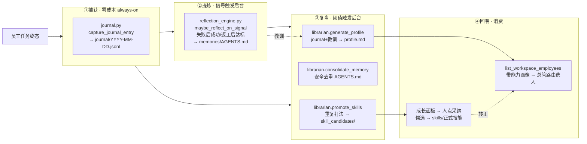
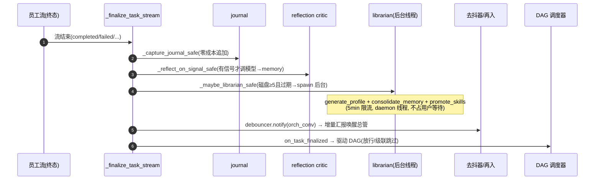
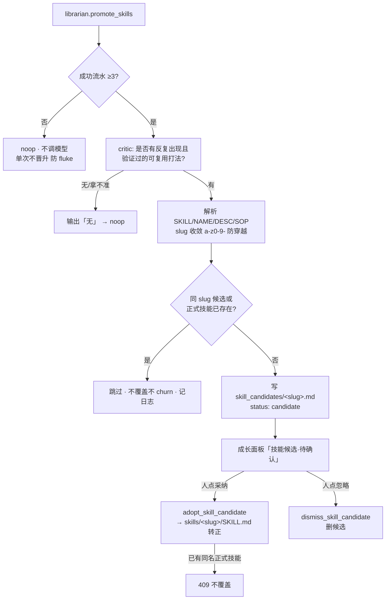

# 学习闭环与自主进化（Learning Loop / Self-Evolution）

> 数字员工「越用越厚」的引擎：每个员工带一个**私有大脑**，在真实任务里**自动**积累经验、**信号触发**地提炼知识、**后台**复盘沉淀、再**回喂**到路由与执行。
> 本文是代码实证版（真实模块/函数/字段/触发链）；抽象设计原则见 [agent-orchestration-methodology.md](agent-orchestration-methodology.md) §3，系统全局位置见 [orchestrator-architecture.md](orchestrator-architecture.md) §4。
> 路径相对 `apps/server/`（前端另注）。

---

## 1. 核心理念

一句话：**便宜的地方全自动、贵且要质量的地方信号把关、能腐化的地方自清理。**

| 取舍 | 含义 | 体现 |
|------|------|------|
| 便宜处 always-on | 捕获不调模型、近零成本 | `journal` 每个任务终态自动追加一行 |
| 贵处信号把关 | 调模型的提炼只在**强信号**时跑 | `reflection_engine` 仅「失败后成功 / 返工后达标」触发 |
| 单次不晋升 | 防把侥幸当真理 | 软知识单次可写；硬技能须重复+验证，且只产「候选」待人确认 |
| 不在等待路径反思 | 不拖慢用户 | critic / librarian 全后台异步，finalize 钩子里 fire-and-forget |
| 自清理防腐化 | 记忆/名册能瘦身 | `consolidate_memory` 安全去重；候选 no-clobber 防 churn |

---

## 2. 鸟瞰：四环节



---

## 3. 两种经验、两道闸门

| 形态 | 是什么 | 载体 | 写入成本 | 闸门（何时写） |
|------|--------|------|---------|---------------|
| **情景记忆 episodic** | 这类活上次怎么干、用了什么工具、成没成、产物在哪 | `journal/*.jsonl` | 近零（不调模型） | **每个任务终态，自动** |
| **零散教训 memory（软）** | 偏好这样、那个坑别再踩、这么改才对 | `memories/AGENTS.md` | 贵（调 critic） | **强信号才触发**（失败后成功 / 返工后达标） |
| **可复用技能 skill（硬）** | 这类活的标准打法/SOP | `skill_candidates/<slug>.md` → 人确认 → `skills/<slug>/SKILL.md` | 贵（调 critic） | **重复且验证过**才提炼候选；**人确认**才转正 |

> **核心防坑：单次成功不直接晋升硬技能。** 单次强信号只进软知识（教训）；只有**重复出现 / 被验证**才晋升为硬知识（技能），且产出的是**候选**、不自动生效。

---

## 4. 信号集（什么算「强信号」）

| 信号 | 状态 | 实现 |
|------|------|------|
| **失败后成功** | ✅ 已实现 | `detect_failure_then_success`：同 task_id 先 failed 后 success → 提炼「上次为何炸、这次怎么对」→ memory |
| **验收返工后达标** | ✅ 已实现 | `detect_rework_then_success`：同 task_id 有更早的 `superseded`（总管打回）后 success → 返工 critic 读会话「【系统·返工】」提炼教训 → memory（优先级高于失败后成功） |
| **重复模式** | ✅ 已实现 | `librarian.promote_skills`：≥3 条成功流水体现同一套打法 → 提炼技能候选 |
| **显式记住** | ✅ 复用 | `remember_memory_tool`（员工/总管直接写 memory） |
| **用户纠正** | ⬜ 延后(v2) | 需消息语义打点，尚未埋点 |

信号优先级（`maybe_reflect_on_signal`）：**返工后达标 > 失败后成功**——返工是总管亲口纠错，比员工自己重试更具体、更强。

---

## 5. 四环节详解（代码级）

### ①捕获 — journal（零成本，always-on）

- **入口**：`learning/journal.py::capture_journal_entry(db, log)`，在 `_finalize_task_stream` 里第一个跑。
- **字段**：`ts / task_id / task_name / employee_id / status / duration_ms / conclusion(output 截断 500) / error / tools_used`（从会话最后一条 assistant 消息的 `message_parts` 解析 tool-use）。
- **落盘**：`<brain>/journal/YYYY-MM-DD.jsonl`，纯 append、不调模型。失败/取消也记（覆盖信号判定来源）。

### ②提炼 — reflection_engine（信号闸门 critic）

- **入口**：`reflection_engine.py::maybe_reflect_on_signal(db, log)`（替代旧的「每任务无条件反思」`run_reflection`）。
- **闸门**：仅当 `run_status==success` 且检测到信号才调模型；无信号 → 直接返回，**不烧 GPU**。
- **限流**：同员工 60s 一次（`_REFLECT_COOLDOWN`）。
- **写入**：`_append_memory_entries` 把新教训（`§` 开头）插到 `memories/AGENTS.md` 的 `---` 分隔线前。
- **模型**：`build_chat_model(apply_profile=False)`（后台辅助 LLM，不带画像、避免污染）。

### ③复盘 — librarian（阈值触发后台）

- **入口**：`learning/librarian.py::run_librarian(employee_id)`，编排三步：`generate_profile` → `consolidate_memory` → `promote_skills`。
- **触发**：`note_journal_and_maybe_run`（finalize 里 `_maybe_librarian_safe` 调）——按**磁盘** journal 条数（重启不丢），≥ `_LIBRARIAN_THRESHOLD`（5）且画像缺失/过期 → 起**后台 daemon 线程**跑。
- **限流**：同员工 5min（`_LIBRARIAN_COOLDOWN`）。
- 三步：
  - `generate_profile`：读 journal 摘要 **+ `memories/AGENTS.md` 教训（末 2000 字）** → 归纳能力画像写 `profile.md`。读教训这步闭合了「教训→画像→路由」的消费端。
  - `consolidate_memory`：LLM 去重合并 `AGENTS.md`，**安全护栏**：仅当输出非空 + 保留分节标题 + 长度 ≥ 原文 50% 才写，否则跳过；写前留 `AGENTS.md.bak`。
  - `promote_skills`：见 §7。

### ④回喂 — 路由 + 采纳

- **路由**：`list_workspace_employees` → `build_employee_capability_context` 把各员工 `profile.md`（能力画像）并入名册，总管组队时据此**挑人/复用老员工**。
- **采纳**：成长面板把技能候选亮给人，点「采纳」→ 候选转为该员工正式技能（见 §7）。

---

## 6. 触发链与时序

每条员工任务终态在 `_finalize_task_stream` 里串起整条闭环（全部容错、不阻塞）：



> 学习闭环（J/RF/LB）与编排回流（DB2/SCH）在 finalize 里**并列触发但互不依赖**：经验沉淀是后台副作用，不挡交付主线。

---

## 7. 硬技能晋升（重复打法 → 技能候选 → 人确认转正）

这是「自主进化」里最强的一环：员工反复成功的打法被自动提炼为可复用技能，但**绝不自动生效**——产出「候选」，人在成长面板确认才转正。



**护栏（经独立 code-review 确认成立）**：
1. 成功流水 < 3 → 不调模型（防 fluke），critic prompt 也要求「拿不准就输出无」。
2. 只造候选、**绝不**写进 active `skills/`、**绝不**自动安装；转正只能经人点「采纳」。
3. 同 slug 候选/正式技能已存在 → 跳过（不覆盖、不 churn）。
4. slug 经 `_slugify` + anchored 正则收敛为 `[a-z0-9-]`，**采纳/忽略端点再次严格校验**，无路径穿越。
5. 全程容错；解析失败一律返回 None 不写垃圾。

**相关符号**：`librarian.promote_skills` / `_parse_skill_candidate`；`EmployeeService.adopt_skill_candidate` / `dismiss_skill_candidate` / `_validate_skill_slug`；端点 `POST /employees/{id}/growth/skill-candidates/{slug}/adopt|dismiss`；前端 `growth-brain-section.tsx`。

---

## 8. QA 代码兜底与闭环的关系

`qa_delivery_check.py` 不是学习闭环的一环，但与之同源（都为「质量不靠模型自觉」）：注入总管执行快照时，若员工**自报**了二进制交付物（.docx/.pptx/.xlsx/.pdf）却在产物区找不到对应非空文件，快照里直接标红「疑似假交付」。它保证了**喂进 journal/反思的「成功」是真成功**——避免把假交付当正样本污染学习闭环。

---

## 9. 数据载体：员工私有大脑

```
<skill_path>/<employee_id>/        ← 大脑根 = resolve_employee_memories_dir(eid).parent
├── journal/YYYY-MM-DD.jsonl       ← ①情景记忆(零成本, 复盘原料)
├── memories/AGENTS.md             ← ②软教训(critic 写, librarian 去重, 留 .bak)
├── profile.md                     ← ③能力画像(librarian 生成, 读 journal+教训, 回喂路由)
├── skill_candidates/<slug>.md     ← 硬技能候选(promote 产出, 待人确认)
└── skills/<slug>/SKILL.md         ← 正式技能(人采纳后, agent 兜底加载 + 面板展示)
```

**记忆私有、产物共享**：大脑（经验）每员工私有、互不可见，成长归个体；产物（交付）落项目共享区 `$ARTIFACTS_DIR`、全队互见。好打法要全队共享靠复盘半自动提升，不自动扩散。

---

## 10. 能力画像「一物三用」

`profile.md` 一处产出、三处消费：

1. **路由**：总管组队读画像决定派给谁 / 是否复用老员工（路由本质是检索）。
2. **回喂**：画像里浓缩了成败模式与避坑经验（已读入教训），派活更准。
3. **查看**：成长面板的头条 = 画像 + 技能 + 记忆 + 学习日志 + 技能候选。

---

## 11. 关键不变量（改代码勿破坏）

1. **捕获零成本、always-on**：journal 不调模型；提炼/复盘才调模型，且后台异步。
2. **信号闸门**：普通成功**不**触发反思（省 GPU、避噪声）；只有强信号才提炼。
3. **单次不晋升硬技能**：软知识单次可写；硬技能须重复+验证，且只产候选、人确认才转正。
4. **不在用户等待路径反思**：critic/librarian 全后台 daemon + 限流（反思 60s / 复盘 5min）。
5. **自清理有护栏**：`consolidate_memory` 非空+保留分节+不显著变短才写并留备份；候选 no-clobber。
6. **记忆私有、产物共享**：经验归个体大脑，交付落共享产物区，二者不混用。
7. **容错降级**：每个钩子（捕获/反思/复盘）异常都只 warning、不上抛，绝不拖垮 finalize 主线。

---

## 12. 残留 / 待办

- **硬技能晋升小限制**（v1 可接受，即「第二件事」）：
  - ① 候选已存在时，`promote_skills` 仍会先调一次 LLM 才在 no-clobber 处跳过（白调一次，受 5min 限流+阈值约束，影响小）。
  - ② 近义 slug 可能产生多个近重复候选（如 `chip-research-report` vs `chip-survey`），靠人在面板复审去重。根治需语义去重。
- **用户纠正信号**：方法论 §3.3 列为最强软信号，但需消息语义打点，尚未实现（v2）。
- **前端候选卡片**：已实现基础「采纳/忽略」；更丰富的预览（展开 SOP 正文/编辑后采纳）可后续增强。

> 演进记录见 `feat/orchestrator-centric` 各 commit（画像消费教训 / QA 代码兜底 / 硬技能晋升 / 候选采纳 UI）。
