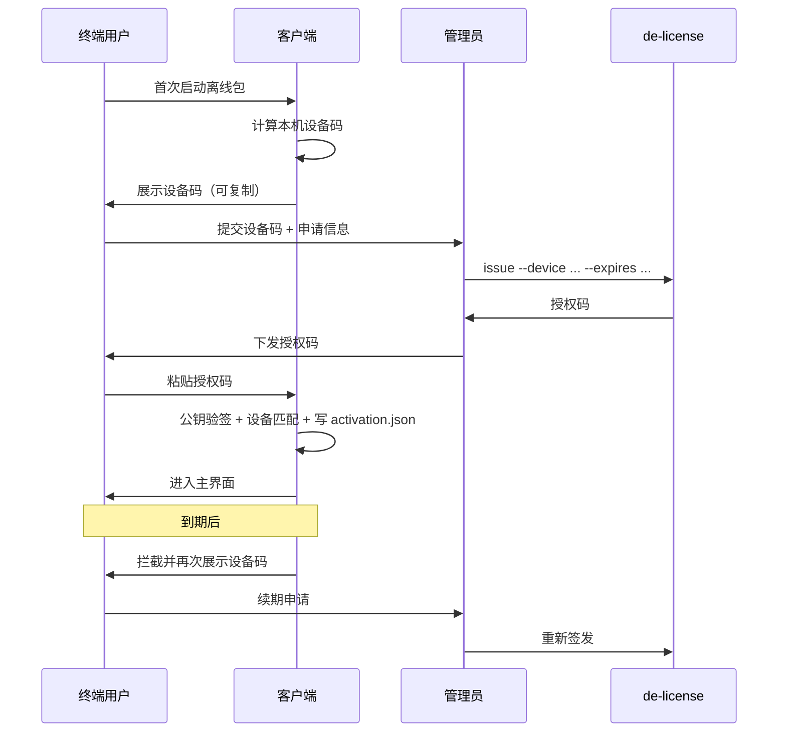
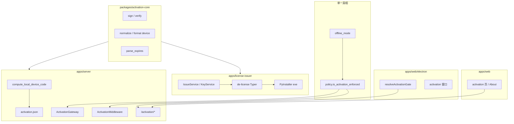

# 离线版设备激活与授权签发

本文档描述「离线版应用激活机制」的业务需求、技术方案与运维流程，涵盖客户端激活、管理员签发工具及共享密码学库。

相关入口：

| 文档 / 代码 | 说明 |
|-------------|------|
| [AGENTS.md](../AGENTS.md) | 离线模式与激活开关速查 |
| [apps/license-issuer/README.md](../apps/license-issuer/README.md) | 管理员 CLI / 二进制 |
| [packages/activation-core/README.md](../packages/activation-core/README.md) | 签名验签共享库 |
| [scripts/activation/README.md](../scripts/activation/README.md) | 公钥嵌入仓库脚本 |

---

## 1. 需求背景

### 1.1 目标

- **离线版**（`OFFLINE_MODE` / 打包含 `.offline` 标记）在无账号登录的前提下，仍需控制软件使用范围与期限。
- 绑定**本机设备**（基于 MAC + 平台 machine-id 的指纹），防止 casual 拷贝安装包或数据目录到其他机器直接使用。
- **纯离线**：激活与日常校验不依赖公司内网授权服务器；管理员人工审批后签发授权码。
- **可维护、可拔插**：业务代码（聊天、Agent、技能等）不散落激活逻辑；在线版是否启用激活仅改策略一处。

### 1.2 非目标（当前版本）

- 不提供在线吊销、seat 统计、多租户授权平台。
- 不提供 DRM 级防破解（客户端验签可被逆向绕过）。
- 管理员签发工具 Phase 1 为 **CLI + 可选 exe**，图形界面为后续扩展（已预留 `IssueService`）。

### 1.3 用户故事

| 角色 | 行为 |
|------|------|
| 终端用户 | 首次启动离线包 → 看到设备码 → 发给管理员 → 收到授权码后粘贴激活 → 到期后重复流程 |
| 管理员 | 生成/保管私钥 → 根据设备码与有效期签发授权码 → 可选自测 `verify` |
| 研发 | 更新嵌入公钥 → 重打客户端；或调整 `is_activation_enforced()` 使在线版也要求激活 |

---

## 2. 业务流程



**到期策略（默认）**

- 无宽限期：`now >= expires_at` 即失效。
- 剩余 ≤7 天：主界面 toast 提醒（读 `/activation/status`）。
- 记录 `last_seen_at`，极端时钟回拨（>24h）要求重新激活。

---

## 3. 密码学与密钥

### 3.1 密钥职责

| 密钥 | 持有方 | 用途 |
|------|--------|------|
| **私钥** `private_key.pem` | 与 `de-license.exe` 同目录（**不进仓库、不进 exe**）；组织统一下发 | 签发授权码 |
| **公钥** `public_key.pem` | 嵌入每个客户端（`apps/server/src/core/activation/public_key.pem`） | 验证授权码签名 |

组织内通常只有**一套**密钥对：一把私钥签所有设备的授权码；所有客户端嵌入同一公钥。

### 3.2 授权码格式

```
授权码 = base64url(payload_json) + "." + base64url(ed25519_signature)
```

**Payload（JSON，紧凑字段）：**

```json
{
  "d": "设备码规范形式（无横线、大写）",
  "exp": "2026-12-31T23:59:59Z",
  "iat": "2026-05-30T10:00:00Z",
  "v": 1
}
```

签名对象为 **payload 的 base64url 字符串**（避免 JSON 规范化歧义）。算法：**Ed25519**（`cryptography`）。

实现见 [`packages/activation-core/src/activation_core/license.py`](../packages/activation-core/src/activation_core/license.py)。

### 3.3 设备码

- **展示格式**：`XXXX-XXXX-XXXX-XXXX-XXXX`（20 位 hex 分组）。
- **计算（仅客户端后端）**：`SHA256(主网卡 MAC hex | 平台 machine-id)[:20]`，见 [`apps/server/src/core/activation/device.py`](../apps/server/src/core/activation/device.py)。
- **enforcement 真相在后端**：Electron 只展示 API 返回的设备码；拷贝 `~/.digital-employee` 到其他机器会因指纹变化而失效。

---

## 4. 架构与模块划分

设计原则对齐离线模式：**能力表 + 网关 + 边界层 + 业务零分支**。



### 4.1 `packages/activation-core`

| 模块 | 职责 |
|------|------|
| `license.py` | `generate_keypair`、`sign_license`、`verify_license`、`parse_payload` |
| `device.py` | `normalize_device_code`、`format_device_code` |
| `expiry.py` | `parse_expires`（`+30d` / `YYYY-MM-DD` / ISO8601） |

**无** FastAPI、Electron、文件持久化依赖。

### 4.2 `apps/server`（客户端运行时）

| 模块 | 职责 |
|------|------|
| `device.py` | 本机指纹 `compute_local_device_code` |
| `keys.py` | 加载嵌入公钥 / `ACTIVATION_PUBLIC_KEY_PEM` |
| `storage.py` | 读写 `~/.digital-employee/data/activation.json` |
| `policy.py` | `is_activation_enforced()`、`ACTIVATION_BYPASS` |
| `activation_service.py` | 激活编排、状态查询 |
| `activation_gateway.py` | `ensure_activated()` |
| `middleware/activation_middleware.py` | 未激活时 API 403（白名单见下） |
| `api/activation_api.py` | HTTP 边界 |

`license.py` 为对 `activation_core` 的薄 re-export。

### 4.3 `apps/license-issuer`（管理员工具）

| 模块 | 职责 |
|------|------|
| `service.py` | `IssueService`、`KeyService`（**未来 GUI 只接此层**） |
| `cli.py` | Typer：`keys` / `issue` / `verify` |
| `config.py` | 默认同目录 `private_key.pem`（exe 旁或 `apps/license-issuer/`） |

### 4.4 Electron / 前端

| 路径 | 职责 |
|------|------|
| `electron/features/activation/gate.ts` | 启动门控：查 `/activation/status` |
| `electron/core/bootstrap.ts` | `activation` → 激活窗，否则 login/main |
| `src/routes/activation.tsx` | 激活页 UI |
| `src/components/activation/*` | 表单、About 区、到期提醒 |
| `src/lib/runtime/*` | `activation_enforced`、`useActivationRequired` |

---

## 5. HTTP API（客户端）

| 方法 | 路径 | 说明 |
|------|------|------|
| GET | `/activation/device` | 本机设备码（展示用） |
| GET | `/activation/status` | `enforced` / `activated` / `expires_at` / `days_remaining` / `reason` |
| POST | `/activation/activate` | body: `{ "license_code": "..." }` |
| GET | `/system/runtime` | 含 `activation` 与 `capabilities.activation_enforced` |

**Middleware 白名单**（`activation_enforced` 时未激活可访问）：

- `/activation/*`
- `/system/runtime`
- `/docs`、`/openapi.json` 等

---

## 6. 拔插开关

| 开关 | 来源 | 效果 |
|------|------|------|
| `offline_mode` | `.offline` 文件或 `OFFLINE_MODE=1` | 离线功能集（见 [AGENTS.md](../AGENTS.md)） |
| `activation_enforced` | 默认 `offline_mode && !ACTIVATION_BYPASS` | 是否强制激活 |
| `ACTIVATION_BYPASS=1` | 环境变量（仅开发） | 跳过激活窗与 Middleware |

**在线版也要激活**：只修改 [`apps/server/src/core/activation/policy.py`](../apps/server/src/core/activation/policy.py) 中 `is_activation_enforced()` 的判定（例如 `return not is_activation_bypassed()`），并确保 Electron `gate.ts` 依据后端 `enforced` 字段而非仅 `isOfflineMode()`。

---

## 7. 本地持久化

路径：`~/.digital-employee/data/activation.json`

```json
{
  "device_code": "ABCDEFGH12345678ABCD",
  "license_code": "eyJkIjoi...",
  "expires_at": "2026-12-31T23:59:59Z",
  "activated_at": "2026-05-30T10:00:00Z",
  "last_seen_at": "2026-05-30T12:00:00Z"
}
```

仅 [`storage.py`](../apps/server/src/core/activation/storage.py) 读写；业务 service 不直接操作文件。

---

## 8. 管理员运维

### 8.1 环境准备（研发机）

```powershell
# 仓库根目录
uv sync

# 若 uv sync 报「拒绝访问」无法删除 .venv 内文件：关闭占用 Python 的进程（后端、IDE、终端）后重试
```

### 8.2 组织密钥（仅首次建钥或轮换）

由**密钥保管人**执行一次 `keys generate`，勿让每个签发员各自生成（会与仓库公钥不一致）。

```powershell
uv run de-license keys generate --out-dir apps/license-issuer/release
```

- **私钥**：`release/private_key.pem`，通过内网盘 / 密码库 / U 盘分发给各管理员，**勿提交 Git**。
- **公钥**：写入客户端仓库（与仓库已有 `public_key.pem` 对齐时，仅轮换需要 export）：

```powershell
uv run de-license keys export-public -o apps/server/src/core/activation/public_key.pem
```

然后 **重新打包客户端**（`pnpm build:server` / `pnpm build:app:offline`），使公钥进入 `backend.exe`。

### 8.3 日常签发

`de-license` **默认**读取与可执行文件**同目录**的 `private_key.pem`（`uv run` 时为 `apps/license-issuer/private_key.pem`）。

```powershell
cd apps/license-issuer/release
.\de-license.exe issue --device "用户提供的设备码" --expires +365d
```

开发机：

```powershell
# 将组织 private_key.pem 放到 apps/license-issuer/ 后
uv run de-license issue --device "ABCD-EFGH-..." --expires 2026-12-31
```

自测（公钥可用客户端仓库路径）：

```powershell
uv run de-license verify --license "..." --device "用户设备码" `
  --public-key apps/server/src/core/activation/public_key.pem
```

### 8.4 分发给无 Python 的管理员

整包下发（推荐目录结构）：

```text
de-license/
  de-license.exe
  private_key.pem    ← 组织私钥（与仓库 public_key.pem 成对）
```

```powershell
pnpm build:license-issuer
# 将组织 private_key.pem 拷贝到 apps/license-issuer/release/
cd apps/license-issuer/release
.\de-license.exe issue --device "..." --expires +30d
```

私钥**不要**打进 exe。仍可用 `--private-key` 或 `DE_LICENSE_PRIVATE_KEY`；若同目录无私钥，回退 `~/.digital-employee-admin/private_key.pem`。

### 8.5 密钥轮换

1. `de-license keys generate --force` 生成新密钥对  
2. 导出公钥并更新 `apps/server/.../public_key.pem`  
3. 重打并分发新客户端  
4. 用**新私钥**为所有有效设备重新签发授权码（旧码将无法通过新公钥验证）

---

## 9. 开发与验证

### 9.1 本地开发（跳过激活）

```powershell
$env:OFFLINE_MODE="1"
$env:ACTIVATION_BYPASS="1"
pnpm dev:server
# 另一终端
$env:OFFLINE_MODE="1"
$env:ACTIVATION_BYPASS="1"
pnpm --filter digital-employee dev:app
```

### 9.2 本地开发（走激活流程）

```powershell
$env:OFFLINE_MODE="1"
# 不设 ACTIVATION_BYPASS
pnpm dev:server
pnpm --filter digital-employee dev:app
```

### 9.3 测试

```powershell
uv run --directory packages/activation-core pytest
uv run --directory apps/license-issuer pytest
uv run --directory apps/server pytest tests/test_activation_service.py
```

### 9.4 打包离线客户端

```powershell
pnpm build:app:offline
# 或
python scripts/build-offline-app.py
```

验证：`GET http://127.0.0.1:<port>/system/runtime` 中 `offline_mode: true`、`activation.enforced: true`。

---

## 10. 安全与限制

| 能力 | 支持程度 |
|------|----------|
| 防止用户随意编造授权码 | 有（需私钥签名） |
| 防止授权码用于其他设备 | 有（payload 绑定设备码 + 本机指纹校验） |
| 到期停用 | 有（`exp` + 本地时间） |
| 远程立即吊销 | 无 |
| 防止逆向 patch 客户端 | 弱（商务 + 合同约束为主） |

换网卡、VPN 虚拟网卡、系统重装等可能导致设备码变化，需重新签发（见运维说明）。

---

## 11. 后续扩展（未实现）

- **GUI**：在 `IssueService` 上接本地 Web（127.0.0.1）或 Electron 管理端。  
- **签发审计**：issuer 侧 SQLite 记录设备码、操作者、时间。  
- **在线激活 / 吊销**：需独立授权服务，与当前离线验签并存或替换。  
- **多公钥版本**：payload `v` 字段已预留，可支持 gradual key rotation。

---

## 12. 目录索引（实现后）

```
packages/activation-core/          # 共享密码学
apps/license-issuer/               # de-license CLI + exe
apps/server/src/core/activation/   # 客户端运行时 + public_key.pem
apps/web/electron/features/activation/
apps/web/src/components/activation/
apps/web/src/routes/activation.tsx
scripts/activation/embed-public-key.py
```

---

*文档版本：与「离线激活 + activation-core + license-issuer」实现同步。*
