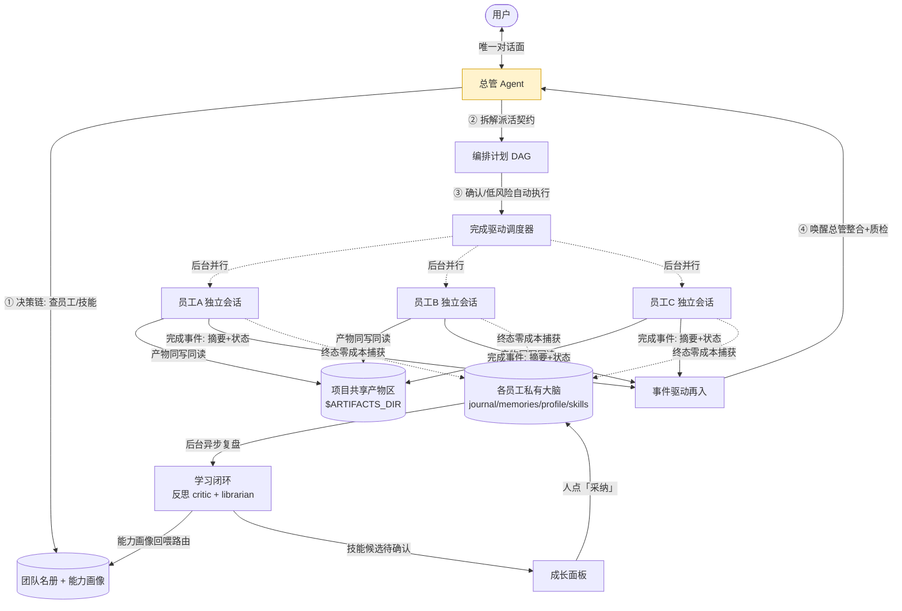
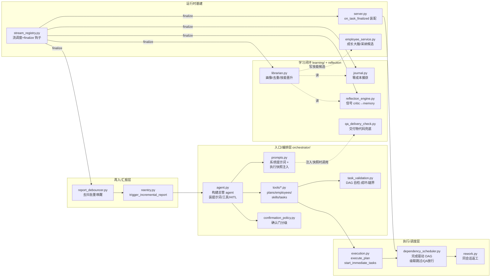
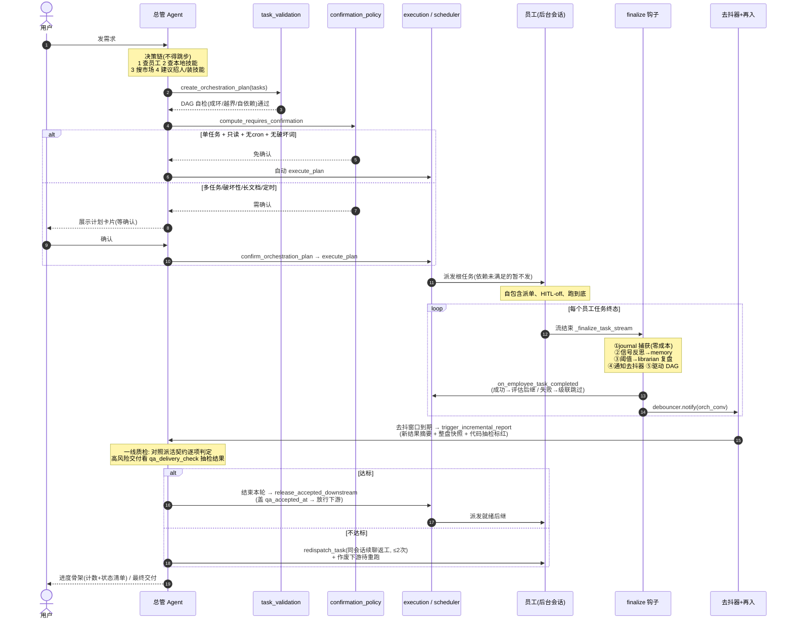
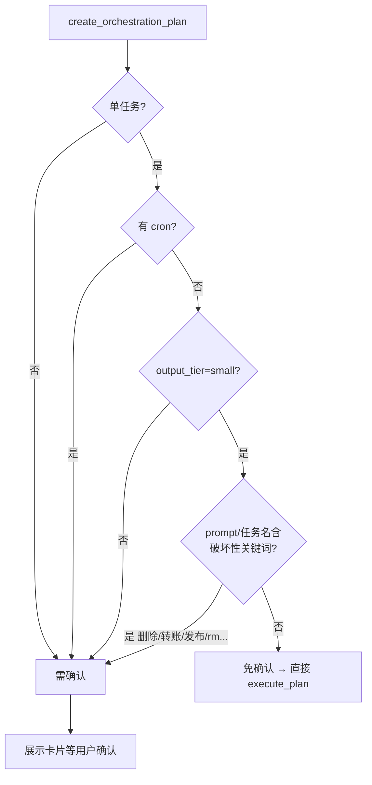
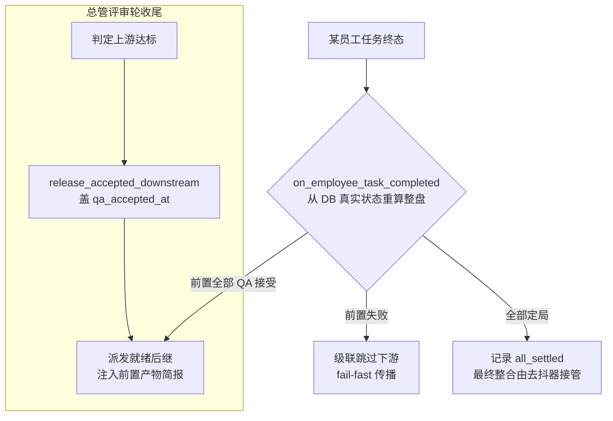
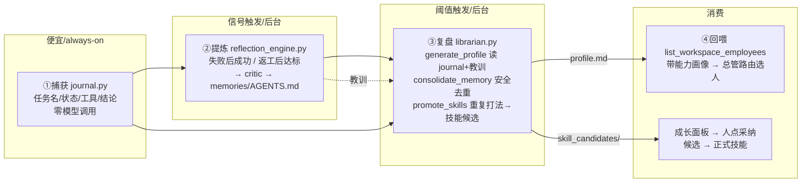

# 总管（Orchestrator）架构与工作流程

> 本文是**代码实证**的总管系统地图——鸟瞰图、架构图、工作流程图，配关键模块清单与设计不变量。
> 与抽象方法论 [agent-orchestration-methodology.md](agent-orchestration-methodology.md) 互补：那篇讲「为什么这么设计」（可迁移原则），本篇讲「代码里到底怎么跑」（真实模块/函数/文件）。
> 适用分支：`feat/orchestrator-centric`。所有路径相对 `apps/server/`（前端另注）。

---

## 1. 鸟瞰图（Bird's-eye）

总管是数字员工团队的**唯一对话入口**：理解用户意图 → 拆解组队 → 后台派活 → 回流整合质检 → 交付；员工在幕后独立会话执行，从不直接对用户说话。一切「成长」沉淀进各员工私有大脑。



**三条贯穿原则**（对应方法论 §1）：唯一对话面 · 共享桌 + 私有脑 · 涌现式成长（复用优先、复盘防膨胀）。

---

## 2. 架构图（模块与依赖）

总管相关代码集中在 `src/service/agent/orchestrator/`，学习闭环在 `src/service/learning/` 与 `src/service/reflection_engine.py`，回流驱动挂在 `src/service/stream_registry.py` + `src/server.py`。



**层与职责**

| 层 | 模块 | 职责 |
|----|------|------|
| 入口/编排 | `agent.py` `prompts.py` `tools/` | 构建总管 agent、系统提示词、对外工具（建计划/管员工/管技能） |
| 决策守卫 | `confirmation_policy.py` `task_validation.py` | 确认门分级、计划 DAG 结构自检 |
| 执行/调度 | `execution.py` `dependency_scheduler.py` `rework.py` | 派发根任务、完成驱动放行下游、级联跳过、返工 |
| 再入/汇报 | `reentry.py` `report_debouncer.py` | 事件驱动唤醒总管、去抖批量防风暴 |
| 学习闭环 | `journal.py` `reflection_engine.py` `librarian.py` `qa_delivery_check.py` | 捕获→提炼→复盘→回喂；交付物代码核验 |
| 基建 | `stream_registry.py` `server.py` `employee_service.py` | 流生命周期 + finalize 钩子装配 + 成长大脑读写 |

---

## 3. 工作流程图（请求生命周期）

一条用户需求从进入到交付的完整时序（含低风险自动执行、确认门、DAG 放行、质检返工）。



### 3.1 确认门分级（P1-A）



> 被派员工以 `enable_hitl=False` 执行，自动放行后无 HITL 拦截，故判定**保守**：宁可误确认、不可误放行。见 `confirmation_policy.py`。

### 3.2 完成驱动 DAG 调度与 QA 门控



关键点：
- **真 DAG**：后继在前置**真正完成且被总管 QA 接受**后才派（`qa_accepted_at`），不是启动时就递减计数（修了历史伪 DAG）。
- **DB 派生状态**：每次从 `TaskExecutionLog` 重算，进程重启不丢、并发无需内存锁。
- **返工**：`redispatch_task` 在**原员工会话续聊**（非新建），并**作废下游子树**待上游重新达标后自动重跑；每任务自动返工上限 2 次。

---

## 4. 学习闭环（让员工越用越厚）



**两种经验、两道闸门**（方法论 §3）：
- **软知识（教训）**：单次强信号即写 `memories/AGENTS.md`（失败后成功、返工后达标）。
- **硬知识（技能）**：**单次不晋升**——`promote_skills` 要求成功流水 ≥3 且体现同一套打法，才提炼成**技能候选**（`skill_candidates/<slug>.md`），且**只造候选、不自动转正**，人在成长面板点「采纳」才转为正式技能（`skills/<slug>/SKILL.md`）。
- **技能在用中自改进**（与上互补：改老技能）：员工干活中发现已加载技能错/缺/过时，用 `update_skill` 工具**只改自己的私有副本**（不写库、不广播同事，改进按员工隔离；2026-06-25 路2，见 [技能单一真相 spec](specs/2026-06-25-skill-single-source-of-truth-design.md)）→ 改前备份可回滚 → `reconcile_employee_skills` 投影到 DB → 审计入 `skill_edits.jsonl`（成长面板「技能修订记录」可见）。详见 [learning-loop-self-evolution.md §7.5](learning-loop-self-evolution.md)。
- **生命周期 curator（防膨胀：闲置退场）**：`learning/curator.py` 搭 librarian 后台 pass，技能按 last_used 老化 active→stale(30d)→archived(90d)（**绝不删、pinned 豁免、可恢复**，archived 从 `available_skills` 逻辑隐藏）；近重复候选合并；员工闲置 90 天产**归档建议**（只读、不自动）。状态存 `skill_lifecycle.json`。详见 [learning-loop-self-evolution.md §7.6](learning-loop-self-evolution.md)。

**QA 代码兜底**（`qa_delivery_check.py`）：注入执行快照时，若员工自报了交付物却在产物区找不到对应非空文件，快照里直接标红「疑似假交付」，不依赖总管主动抽检。自报判定两路控误报：① 二进制交付物（docx/pptx/xlsx/pdf）全文匹配；② 其余文件仅在含「交付动词」的行里取、排除脚本扩展名。

---

## 5. 员工私有大脑目录布局

```
<skill_path>/<employee_id>/        ← 大脑根 = resolve_employee_memories_dir(eid).parent
├── skills/<slug>/SKILL.md         ← 正式技能(agent 兜底加载源 + 成长面板展示)
├── skill_candidates/<slug>.md     ← 技能候选(待人确认, 自动晋升产出)
├── skill_hints/<技能名>.md         ← 改进线索(低分反馈 → 加载时注入提示引导 update_skill, 改后清除)
├── skill_edits.jsonl              ← 技能修订审计(update_skill 写, 成长面板「技能修订记录」可见)
├── skill_lifecycle.json           ← 技能老化状态(curator 写: active/stale/archived + pinned, archived 逻辑隐藏)
├── memories/AGENTS.md             ← 长期记忆/教训(reflection 写, librarian 去重)
├── journal/YYYY-MM-DD.jsonl       ← 结构化流水(零成本捕获, 复盘原料)
└── profile.md                     ← 能力画像(librarian 生成, 回喂路由)
```

产物则不在大脑里，而在**项目共享产物区** `$ARTIFACTS_DIR`（= `$WORKSPACE_DIR`）：全队同写同读、扁平、同名后写覆盖先写（并行写同名有 `basic_file_write` 告警兜底）。

---

## 6. 关键模块清单（代码导航）

| 文件 | 关键符号 | 作用 |
|------|---------|------|
| `orchestrator/agent.py` | `get_orchestrator_agent` | 构建总管 agent：模型/提示词/工具/HITL/产物根/执行快照 |
| `orchestrator/prompts.py` | `ORCHESTRATOR_SYSTEM_PROMPT_TEMPLATE`、`build_delegation_execution_context`、`build_employee_capability_context` | 系统提示词；每轮注入「整盘执行快照」（含 QA 抽检标红）；名册+能力画像 |
| `orchestrator/tools/plans.py` | `create_orchestration_plan`、`confirm_orchestration_plan`、`cancel_plan` | 建计划（校验+自检+低风险自动执行）/确认/取消 |
| `orchestrator/confirmation_policy.py` | `compute_requires_confirmation` | 确认门分级（仅只读单任务免确认） |
| `orchestrator/task_validation.py` | `validate_orchestration_tasks` | 同员工拆分拦截 + DAG 成环/越界/自依赖自检 |
| `orchestrator/execution.py` | `execute_plan`、`start_immediate_tasks`、`start_task_as_conversation` | 确认后派发根任务、起员工流 |
| `orchestrator/dependency_scheduler.py` | `on_employee_task_completed`、`release_accepted_downstream`、`invalidate_downstream` | 完成驱动放行、级联跳过、QA 接受放行、返工作废下游 |
| `orchestrator/rework.py` | `redispatch_task_in_session` | 同员工会话续聊返工（上限 2、gate 前置）；亦供用户「改改/重试」端点复用 |
| `orchestration_lifecycle.py` | `cancel_orchestration_plan`、`update_pending_plan_task`、`collect_plan_deliverables` | 取消计划；确认前编辑子任务(prompt/换员工)；聚合各子任务产出文件(回流主对话「团队交付物」卡，存在性过滤去临时脚本) |
| `orchestrator/reentry.py` | `trigger_incremental_report`、`trigger_orchestrator_reentry` | 用新结果+快照唤醒总管整合/质检 |
| `orchestrator/report_debouncer.py` | `ReportDebouncer`、`get_report_debouncer` | 去抖批量唤醒，防风暴，占线时延后补触发 |
| `reflection_engine.py` | `maybe_reflect_on_signal`、`detect_failure_then_success`、`detect_rework_then_success` | 信号闸门 critic → 写教训记忆 |
| `learning/journal.py` | `capture_journal_entry` | 终态零成本捕获结构化流水 |
| `learning/librarian.py` | `run_librarian`、`generate_profile`、`consolidate_memory`、`promote_skills` | 后台复盘：画像（含教训）/记忆去重/硬技能晋升 |
| `orchestrator/qa_delivery_check.py` | `check_log_delivery`、`detect_missing_delivery_artifacts` | 交付物真伪代码兜底（自报 vs 磁盘） |
| `agent/command_safety.py` | `check_hardline`、`normalize_command` | shell 灾难命令硬底线（接入 `SkillAwareShellBackend.execute/aexecute` 单一咽喉，对所有 agent 生效、永不执行；floor 非完整沙箱） |
| `agent/path_authorization.py` | `is_granted`、`record_grant`、`is_outside_workspace`、`guard_external_write`、`guard_external_shell`、`extract_command_paths`、`get/set_external_dir_mode` | 工作区外写授权核心：边界判定 + 6 级检查链（auto列/mode auto/永久DB/会话/once令牌）+ 按 scope 落地 + 守卫（write/edit 路径判定、shell 启发式抽路径判定）+ 会话三态模式读写 |
| `agent/write_guard_registry.py` | `register_write_guard`、`lookup_write_guard`、`run_shell_guard`、`conv_id_from_runtime` | 按 conversation_id 注册/反查 roots+workspace_id（仿 `_stream_sessions`）；`run_write_guard`(在 compatible_filesystem_middleware)/`run_shell_guard` 据此查表 + fail-open。员工/总管构造期 `register_write_guard` |
| `agent/external_dir_request_tool.py` | `request_external_dir_access`、`build_request_external_dir_tool(mode)`、`strip_external_dir_interrupt`、`EXTERNAL_DIR_INTERRUPT_ON` | 员工/总管主动请求授权工具，ask 模式触发 HITL 卡片（仅这次/本会话/永久/放行所有/拒绝）；auto/deny 时经 `strip_external_dir_interrupt` 移出 interrupt_on 不弹卡、_run 返回 mode 相应回执 |
| `hitl_pending_parts.py` | `HITL_TOOL_NAMES`、`build_pending_hitl_parts` | 中断时给前端合成 `input-available` 待确认 part（HITL 工具名清单**之一**，新增 HITL 工具须登记） |
| `compatible_filesystem_middleware.py` | 覆盖 `_create_write_file_tool`/`_create_edit_file_tool`、`run_write_guard` | 比照 read_file 覆盖写工具，validate_path 后插守卫；deepagents 基类工具的工作区边界闸 |
| `stream_registry.py` | `_finalize_task_stream`、`on_task_finalized` | 流终态钩子：捕获/反思/复盘/去抖/驱动 DAG |
| `server.py` | `_on_task_finalized`（lifespan 装配） | 把终态事件接到调度器 + 推前端事件 |
| `employee_service.py` | `build_employee_growth_brain`、`adopt_skill_candidate`、`dismiss_skill_candidate` | 成长大脑只读聚合 + 候选采纳/忽略 |
| 前端 `growth-brain-section.tsx` | `GrowthBrainSection` | 成长面板：画像/技能(置顶·已归档折叠·恢复)/记忆/日志/**技能候选(采纳·忽略)**/**技能修订记录**/**员工归档建议** |
| `agent/update_skill_tool.py` | `create_update_skill_tool`、`_apply_skill_update`、`_backup_skill_version_private` | 技能在用中自改进：只改员工私有副本(不写库/不广播)→reconcile 投影→备份/审计/清线索 |
| `learning/curator.py` | `run_curator`(挂 librarian)、`_age_status`、`archived_skill_names`、`restore_skill`/`set_pinned`、`_merge_near_dup_candidates`、`employee_archive_suggestion` | 生命周期 curator：技能闲置老化/候选合并/员工归档建议(保守可逆) |

---

## 7. 关键设计不变量（改代码时勿破坏）

1. **唯一对话面**：员工永不直接对用户说话，所有人机交互（澄清/确认）只在总管层。
2. **自包含派单 + 员工无澄清**：员工 `enable_hitl=False`、拿到契约四要素（目标/输出/资源/非目标）跑到底，缺信息写进结果带回，不阻塞等人。员工 HITL-off，故由 `command_safety` shell 硬底线（见不变量 9）兜灾难命令。
3. **真 DAG，完成驱动**：后继在前置**真正完成且 QA 接受**后才派；状态从 DB 派生，重启不丢。
4. **确认门保守**：仅「单任务 + 只读 + 无 cron + 无破坏词」免确认自动执行；其余必确认。
5. **质检结果导向 + 代码兜底**：对照派活契约判达标；高风险交付有 `qa_delivery_check` 代码核验标红，不全靠模型遵从。
6. **学习闭环：单次不晋升硬技能**：软知识（教训）单次可写；硬知识（技能）须重复+验证，且只产「候选」、人确认才转正。
7. **轻量再入 + 编排层与主上下文分离**：完成事件只带摘要+状态，去抖批量唤醒；子任务全过程留编排层，总管主上下文只收精炼结论。
8. **不自爆内部机制**：自动放行/DAG/快照注入/reported_at 等是内部规则，正文只对用户说人话。
9. **shell 灾难命令硬底线**：所有 agent（含 HITL-off 员工）的 shell 命令经 `command_safety.check_hardline` 过一道——`rm -rf 根/家目录`、`mkfs/dd` 写盘、fork bomb 等**永不执行**，不靠模型/确认门遵从。是 floor（挡直接灾难命令）非完整沙箱（挡不住"写脚本再跑"，彻底边界需 OS 沙箱）。
10. **工作区外目录写授权**：写工具（`write_file`/`edit_file`，覆盖 deepagents 基类）+ `shell_execute`（启发式抽命令里的绝对路径）被守卫拦截——目标在工作区外且未授权时，`write_file` 返回提示让 agent 调 `request_external_dir_access`、shell 在 backend 层与硬底线同层挡回。**员工与总管对称覆盖**（各自构造期 `register_write_guard` 填 roots+workspace_id 进注册表，工具/守卫据 conversation_id 反查；ctx 缺失 fail-open）。授权走声明式 `interrupt_on`+`/approve` 链路：弹 HITL 卡片，用户选 仅这次/本会话/永久/放行所有/拒绝，`record_grant` 按 scope 落库（永久挂 workspace、其余挂会话 session_flags，前缀匹配）。会话级**三态模式硬生效**（`external_dir_mode` 端点 + 前端药丸「目录·询问/自动/严禁」）：**ask** 弹卡；**auto** 把请求工具移出 interrupt_on→静默放行；**deny** 同样移出→硬拒绝、**不可被卡片批准覆盖**（守卫调用期实时按 mode 拦截兜底）。读操作静默放行；删除经 shell 由本守卫的启发式 + `command_safety` 共同兜底。**后台子任务（`enable_hitl=False`）整体放行**（可用性取舍——无人弹卡片授权，挂了会卡住；待后续做后台预授权/异步审批）。**维护提醒**：新增 HITL 工具须同时登记 4 处清单（后端 `HITL_INTERRUPT_ON` + `hitl_pending_parts.HITL_TOOL_NAMES`，前端 `HITL_TOOL_NAMES` + `HITL_TOOL_TYPES`）。

---

## 8. 已知残留 / 待办（截至本文）

- **学习闭环小限制**（v1 可接受）：① `promote_skills` 在候选已存在时仍会先调一次 LLM 才跳过；② 近义 slug 可能产生多个近重复候选，靠人复审去重。
- **二次复盘其它残留**：单评审者 QA 无对抗校验；产物撞名仅事后日志、不 prevent；增量汇报 token 成本随计划规模上升；决策链线性、每需求重查名册；级联跳过为严格 fail-fast。

> 历史演进与优化记录见各 commit（`feat/orchestrator-centric`）；方法论层面的「为什么」见 [agent-orchestration-methodology.md](agent-orchestration-methodology.md)。
