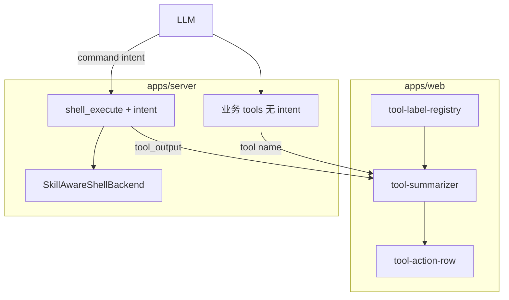

# 工具调用语义化标题 PRD

> 版本：v1.2 | 日期：2026-05-18 | 状态：已实现（待三端冒烟与 Unix 路径改写优化）

## 1. 背景与问题

### 1.1 用户可见问题

| # | 现象 | 影响 |
|---|------|------|
| 1 | Shell 类工具标题为「执行 xxx.py」 | 缺少业务语义，与 Cursor 等产品的自然语言步骤不一致 |
| 2 | deepagents 内置 `execute` 无法扩展 `intent` 等 UI 字段 | 契约受框架限制 |
| 3 | 编排/招聘等自研 `@tool` 仅显示工具英文名或生硬动词 | 总管场景下步骤可读性差 |

### 1.2 技术约束

- 使用 **deepagents 0.5.9** + LangGraph；内置 `execute` 由 `HarnessProfile.excluded_tools` 按名排除后，需注册**不同名**的自定义工具（不可再叫 `execute`）。
- 实际命令执行仍依赖既有 **`SkillAwareShellBackend`**（`subprocess` + `shell=True`），非容器沙箱。
- 流式 stdout 通过 LangGraph `tool_output` 事件推送，前端按 `tool_name` 匹配活跃 tool call。

---

## 2. 目标

### 2.1 产品目标

1. **Shell 工具语义标题**：`shell_execute` 通过模型可选 `intent`（中文 ≤20 字）作为工具行主标题。
2. **自研业务工具固定标题**：编排、招聘、`session_search` 等由**前端注册表**映射固定中文，后端不传 `intent`。
3. **跨平台可运行**：Windows / macOS / Linux 沿用同一执行后端；命令使用各平台真实物理路径（由系统 prompt 注入）。

### 2.2 非目标（本期不做）

- 自研业务工具的后端 `intent` 参数或 prompt 要求模型填写 intent。
- 为 `intent` 做服务端校验/拒绝（shell 仅 schema `max_length` + prompt 约束）。
- 容器化或 syscall 级沙箱隔离。
- 改造 deepagents 内置 filesystem 工具（`read_file` 等）的 `intent`。
- ToolRow 展开/收起交互策略（不在本文档范围）。

---

## 3. 功能需求

### 3.1 shell_execute（替代内置 execute）

#### 工具契约

| 字段 | 类型 | 必填 | 说明 |
|------|------|------|------|
| `command` | string | 是 | 实际 shell 命令；须使用系统提示中的**真实物理路径** |
| `intent` | string | 否 | 界面标题；中文；≤20 字；不参与 subprocess |

#### 后端行为

1. `HarnessProfile.excluded_tools = frozenset({"execute"})` 隐藏内置工具。
2. `create_shell_execute_tool(shell_backend)` 注册 `shell_execute`，内部调用 `SkillAwareShellBackend.aexecute` / `execute`。
3. 流式事件 `tool_output.data.tool_name` 固定为 **`shell_execute`**。
4. 员工 Agent 与编排 Agent 均挂载该工具。
5. `checkpointer.py` 仅对 `shell_execute` 配置 `tool_description_overrides`（含 intent 说明）。

#### intent 写作规范（系统 prompt）

- 描述**正在做的事 / 要达到的目的**，不复述 `command`。
- **禁止**：脚本/文件名、路径片段、「执行」「运行 xxx」、工具名 `shell_execute`。
- **示例**：`command` 含 `hello.js` 时 → intent「验证示例代码输出」✅；「运行 hello.js」❌。

#### 涉及文件

- `apps/server/src/service/agent/shell_execute_tool.py`
- `apps/server/src/service/agent/checkpointer.py`
- `apps/server/src/service/agent/employee.py`
- `apps/server/src/service/agent/orchestrator/agent.py`
- `apps/server/src/service/agent/prompts.py`
- `apps/server/src/service/skill_shell_backend.py`

---

### 3.2 自研业务工具（仅前端映射）

#### 策略

自研业务工具语义固定，**不在后端增加 `intent` 参数**，不要求模型填写。展示文案由前端唯一配置源维护。

#### 适用范围

| 模块 | 工具 | 前端固定标题（示例） |
|------|------|----------------------|
| `recruitment_tools.py` | `recruit_employee`, `hire_employee` | 招聘候选人、录用员工 |
| `tools.py` | 编排 7 工具 | 生成编排计划、执行编排计划、查看团队… |
| `employee.py` | `session_search` | 检索历史 |

#### 前端注册表

[`apps/web/src/lib/chat/tool-label-registry.ts`](apps/web/src/lib/chat/tool-label-registry.ts)：

- `TOOL_DISPLAY_MAP`：图标、`label`（主标题）、`verb`、`simple`（运行中/完成/失败）
- `BUSINESS_TOOL_NAMES`：自研业务工具集合
- `SHELL_TOOL_NAMES`：`execute`（历史）、`shell_execute`
- `getToolDisplay` / `isBusinessTool`

[`tool-summarizer.ts`](apps/web/src/lib/chat/tool-summarizer.ts) 逻辑：

- **业务工具**：始终 `display.label`，忽略 `input.intent`（兼容旧消息误带 intent）
- **Shell**：优先 `input.intent` → command 文件名回退 → verb
- **内置 FS 工具**：`verb` + `pathKey` basename

---

### 3.3 历史兼容

- 旧会话 **`execute`**：仍展示；无 intent 时「执行 xxx.py」回退。
- 新会话应仅出现 **`shell_execute`**。

---

## 4. 跨平台要求（shell 执行）

### 4.1 架构说明

`shell_execute` 不实现新的 subprocess 引擎；执行能力继承 `SkillAwareShellBackend`。

### 4.2 平台差异与风险

| 项 | Windows | macOS / Linux |
|----|---------|----------------|
| 路径风格 | `C:\...`（已实测） | `/...`，由 prompt 注入 |
| 虚拟路径改写 | `list2cmdline` | Unix 上 MSVC 引号风险（待优化） |

### 4.3 待优化项

- `_rewrite_command_virtual_paths` 在 Unix 上改用 `shlex.join`。
- 三端自动化冒烟 / CI。

---

## 5. 系统架构

---

## 6. 验收标准

### 6.1 shell_execute

- [ ] 新对话仅出现 `shell_execute`。
- [ ] 带 `intent` 时标题为 intent（≤20 字）。
- [ ] stdout 流式正常，`tool_output.tool_name === shell_execute`。

### 6.2 自研业务工具

- [ ] `recruit_employee` 等标题为注册表固定文案（如「招聘候选人」），不依赖模型参数。
- [ ] 旧消息 args 含 `intent` 时，业务工具标题仍不变。

### 6.3 跨平台（建议手工）

- [ ] macOS / Linux：绝对路径 + `python3`/`node` 执行 artifacts 脚本。

---

## 7. 测试建议

| 类型 | 内容 |
|------|------|
| 前端 | `pnpm exec tsc --noEmit`（web） |
| 后端 | 导入 `shell_execute`、`recruit_employee`（server） |
| 联调 | SSE 中 `shell_execute` + `intent` |

---

## 8. 变更清单

### 8.1 后端

| 文件 | 变更摘要 |
|------|----------|
| `agent/shell_execute_tool.py` | `shell_execute` + `intent`（`INTENT_MAX_LENGTH=20`） |
| `agent/checkpointer.py` | 排除 `execute`；仅 `shell_execute` override |
| `agent/orchestrator/recruitment_tools.py` | 无 intent |
| `agent/orchestrator/tools.py` | 无 intent |
| `agent/employee.py` | `session_search` 无 intent |
| `agent/orchestrator/prompts.py` | 无「工具 intent」专节 |
| `skill_shell_backend.py` | 流式 `tool_name` → `shell_execute` |

已删除：`agent/tool_intent.py`（`drop_intent` 不再需要）。

### 8.2 前端

| 文件 | 变更摘要 |
|------|----------|
| `lib/chat/tool-label-registry.ts` | **新建**：统一展示配置 |
| `lib/chat/tool-summarizer.ts` | 业务固定 label；shell 读 intent |
| `components/chat/message-blocks/tool-shared.tsx` | `COMMAND_TOOLS` |

---

## 9. 后续迭代

1. Unix 命令拼接优化。
2. shell `intent` prompt 持续收紧。
3. 同步 `deep-agent-execution-optimization.md` 文档。

---

## 10. 附录：标题来源对照

| 工具 | 标题来源 | 示例 |
|------|----------|------|
| `shell_execute` | 模型 `intent` 或 command 回退 | 验证示例代码输出 |
| `recruit_employee` | 前端 `TOOL_DISPLAY_MAP.label` | 招聘候选人 |
| `create_orchestration_plan` | 前端固定 | 生成编排计划 |
| `read_file` | verb + 文件名 | 读取 report.md |

---

## 11. 修订记录

| 版本 | 日期 | 说明 |
|------|------|------|
| v1.0 | 2026-05-18 | 初版 |
| v1.1 | 2026-05-18 | 聚焦语义标题；移除 ToolRow 收起 |
| v1.2 | 2026-05-18 | 自研工具改为仅前端 `tool-label-registry`；shell 保留后端 intent；删除 `tool_intent.py` |
