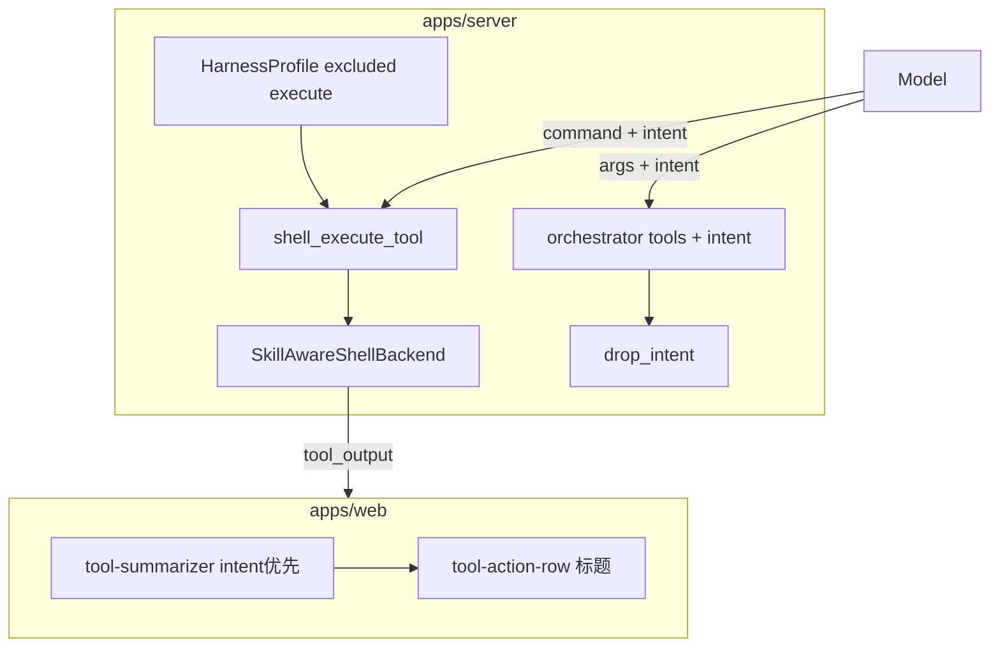

# 工具调用语义化标题（intent）PRD

> 版本：v1.1 | 日期：2026-05-18 | 状态：已实现（待三端冒烟与 Unix 路径改写优化）

## 1. 背景与问题

### 1.1 用户可见问题

| # | 现象 | 影响 |
|---|------|------|
| 1 | Shell 类工具标题为「执行 xxx.py」 | 缺少业务语义，与 Cursor 等产品的自然语言步骤不一致 |
| 2 | deepagents 内置 `execute` 无法扩展 `intent` 等 UI 字段 | 契约受框架限制 |
| 3 | 编排/招聘等自研 `@tool` 仅显示工具英文名或固定动词 | 总管场景下步骤可读性差 |

### 1.2 技术约束

- 使用 **deepagents 0.5.9** + LangGraph；内置 `execute` 由 `HarnessProfile.excluded_tools` 按名排除后，需注册**不同名**的自定义工具（不可再叫 `execute`）。
- 实际命令执行仍依赖既有 **`SkillAwareShellBackend`**（`subprocess` + `shell=True`），非容器沙箱。
- 流式 stdout 通过 LangGraph `tool_output` 事件推送，前端按 `tool_name` 匹配活跃 tool call。

---

## 2. 目标

### 2.1 产品目标

1. **Shell 工具语义标题**：用可选 `intent`（中文 ≤20 字）作为工具行主标题，描述业务目的而非文件名或命令原文。
2. **自研工具统一 intent**：编排、招聘、`session_search` 等与 `shell_execute` 共用同一套 UI 契约。
3. **跨平台可运行**：Windows / macOS / Linux 沿用同一执行后端；命令使用各平台真实物理路径（由系统 prompt 注入）。

### 2.2 非目标（本期不做）

- 为 `intent` 做服务端校验/拒绝（仅 schema `max_length` + prompt 约束）。
- 容器化或 syscall 级沙箱隔离。
- 改造 deepagents 内置 filesystem 工具（`read_file` 等）的 `intent`。
- ToolRow 展开/收起交互策略（与语义标题无关，不在本文档范围）。

---

## 3. 功能需求

### 3.1 shell_execute（替代内置 execute）

#### 工具契约

| 字段 | 类型 | 必填 | 说明 |
|------|------|------|------|
| `command` | string | 是 | 实际 shell 命令；须使用系统提示中的**真实物理路径** |
| `intent` | string | 否 | 界面标题；中文；≤20 字；不参与 subprocess |

#### 后端行为

1. `HarnessProfile.excluded_tools = frozenset({"execute"})` 隐藏内置工具。
2. `create_shell_execute_tool(shell_backend)` 注册 `shell_execute`，内部调用 `SkillAwareShellBackend.aexecute` / `execute`。
3. 流式事件 `tool_output.data.tool_name` 固定为 **`shell_execute`**（与工具名一致，便于前端匹配）。
4. 员工 Agent（`employee.get_agent`）与编排 Agent（`orchestrator/agent.get_orchestrator_agent`）均挂载该工具。

#### intent 写作规范（系统 prompt）

- 描述**正在做的事 / 要达到的目的**，不复述 `command`。
- **禁止**：脚本/文件名（`.py` `.js` `.sh` 等）、路径片段、「执行」「运行 xxx」、工具名 `shell_execute`。
- **推荐**：结合用户任务与 `write_todos` 当前步骤的动词短语。
- **示例**：`command` 含 `hello.js` 时 → intent「验证示例代码输出」✅；「运行 hello.js」❌。

#### 涉及文件

- `apps/server/src/service/agent/shell_execute_tool.py`
- `apps/server/src/service/agent/checkpointer.py`（`excluded_tools` + `tool_description_overrides`）
- `apps/server/src/service/agent/employee.py`
- `apps/server/src/service/agent/orchestrator/agent.py`
- `apps/server/src/service/agent/prompts.py`（`build_system_prompt` 文件系统小节）
- `apps/server/src/service/skill_shell_backend.py`（执行与流式；`tool_name` 字段）

---

### 3.2 自研工具统一 intent

#### 适用范围

| 模块 | 工具 |
|------|------|
| 编排 `recruitment_tools.py` | `recruit_employee`, `hire_employee` |
| 编排 `tools.py` | `list_workspace_employees`, `create_orchestration_plan`, `confirm_orchestration_plan`, `update_task`, `delete_task`, `cancel_plan`, `list_tasks` |
| 员工 `employee.py` | `session_search`（动态创建） |

#### 实现约定

- 各工具增加可选参数 `intent: str | None = None`。
- 业务逻辑入口调用 `drop_intent(intent)`（`apps/server/src/service/agent/tool_intent.py`），不传入下游 API。
- 编排系统 prompt（`orchestrator/prompts.py`）增加「工具 intent」专节及示例。
- `checkpointer.py` 对招聘/编排核心工具补充 `tool_description_overrides`。

#### intent 写作规范（总管）

- 与 shell 规则一致：业务目的，勿复述工具名、参数名、员工 ID、计划 ID、JSON 字段名。
- 示例：`recruit_employee` →「为客服岗筛选候选人」；`confirm_orchestration_plan` →「开始执行协作计划」。

---

### 3.3 前端标题展示

#### 优先级

```
input.intent（trim + 截断 20 字）
  → 工具专用回退（如 shell 的 command 文件名、文件工具的 basename）
  → TOOL_META.verb / 工具名
```

#### 配置

- `apps/web/src/lib/chat/tool-summarizer.ts`：`labelFromIntent`、`TOOL_META`、`SIMPLE_LABELS`（含编排/招聘/shell_execute）。
- `apps/web/src/components/chat/message-blocks/tool-shared.tsx`：`COMMAND_TOOLS` 含 `execute`（历史）与 `shell_execute`。

#### 历史兼容

- 旧会话中的 **`execute`** 工具调用仍展示；无 `intent` 时回退「执行 xxx.py」逻辑。
- 新会话应仅出现 **`shell_execute`**。

---

## 4. 跨平台要求（shell 执行）

### 4.1 架构说明

`shell_execute` **不实现新的 subprocess 引擎**；执行能力完全继承 `SkillAwareShellBackend`（`LocalShellBackend` 子类）：

- `shell=True`：Windows 使用 cmd；Unix 使用 `/bin/sh`。
- `cwd`：会话 `artifacts` 目录（`Path` 跨平台）。
- 输出解码：UTF-8 优先，Windows 回退 GBK/cp936。
- 异步 `aexecute`：临时文件 + 轮询 stdout，避免 PIPE 死锁；`tool_output` 流式推送。

### 4.2 平台差异与风险

| 项 | Windows | macOS / Linux |
|----|---------|----------------|
| 路径风格 | `C:\...`（已实测流式成功） | 须用 `/...`，由 prompt 注入 `artifacts_real_path` |
| 虚拟路径改写 | `list2cmdline` 符合 cmd | 改写后使用 MSVC 规则拼串，复杂命令在 `/bin/sh` 下可能有差异 |
| 解释器 | `node` / `python` | 需保证 PATH 中有 `python3` 等 |
| 编码 | GBK 回退有意义 | 主要 UTF-8 |

### 4.3 待优化项（未在本 PRD 版本实现）

- `_rewrite_command_virtual_paths` 在 Unix 上改用 `shlex.join` 而非 `subprocess.list2cmdline`。
- 三端自动化冒烟 / CI 矩阵。
- 更新 `apps/server/docs/deep-agent-execution-optimization.md` 中「内置 execute」表述为 `shell_execute`。

---

## 5. 系统架构



---

## 6. 验收标准

### 6.1 shell_execute 与语义标题

- [ ] 新对话仅出现 `shell_execute`，不出现内置 `execute`。
- [ ] 带 `intent` 时工具行标题为 intent 文案（≤20 字），非「执行 xxx.py」。
- [ ] stdout 流式正常，`tool_output.tool_name === shell_execute`。
- [ ] 命令 exit code 非 0 时展示 Exit code 与输出。
- [ ] Windows：`node`/`python` + 绝对路径可跑 artifacts 脚本（已在 conversation 68 流日志验证）。

### 6.2 自研工具 intent

- [ ] 总管触发 `recruit_employee` / `create_orchestration_plan` 等时，模型可传 `intent`。
- [ ] 前端有 intent 时显示 intent；无 intent 时显示 `TOOL_META` 回退文案。

### 6.3 跨平台（建议手工）

- [ ] macOS：绝对路径 + `python3`/`node` 执行 artifacts 脚本。
- [ ] Linux：同上。
- [ ] 含 `/skills/` 虚拟路径的命令在三端各测一条（路径改写场景）。

---

## 7. 测试建议

| 类型 | 内容 |
|------|------|
| 前端 | `apps/web` 下 `pnpm exec tsc --noEmit` |
| 后端 | `apps/server` 下导入 `shell_execute`、`recruit_employee` 等工具 |
| 联调 | 抓 SSE `chunks`：确认 `shell_execute` + `intent` + `tool_output` |
| 回归 | 旧会话含 `execute` 的消息仍可正常展示标题回退逻辑 |

---

## 8. 变更清单（实现索引）

### 8.1 后端

| 文件 | 变更摘要 |
|------|----------|
| `agent/shell_execute_tool.py` | 新建 `shell_execute` 工具 |
| `agent/tool_intent.py` | 新建 `drop_intent`、`INTENT_MAX_LENGTH` |
| `agent/checkpointer.py` | 排除 `execute`；工具描述 override |
| `agent/employee.py` | 挂载 `shell_execute`；`session_search` + intent |
| `agent/orchestrator/agent.py` | 挂载 `shell_execute` |
| `agent/orchestrator/recruitment_tools.py` | 招聘工具 + intent |
| `agent/orchestrator/tools.py` | 编排工具 + intent |
| `agent/prompts.py` | shell_execute / intent 规范 |
| `agent/orchestrator/prompts.py` | 总管 intent 专节 |
| `skill_shell_backend.py` | 流式 `tool_name` → `shell_execute` |

### 8.2 前端（语义标题相关）

| 文件 | 变更摘要 |
|------|----------|
| `lib/chat/tool-summarizer.ts` | intent 优先；编排工具 META / SIMPLE_LABELS |
| `components/chat/message-blocks/tool-shared.tsx` | `COMMAND_TOOLS` 含 shell_execute |

---

## 9. 后续迭代

1. **Unix 命令拼接**：`skill_shell_backend._rewrite_command_virtual_paths` 按 OS 选择 `list2cmdline` / `shlex.join`。
2. **intent 质量**：持续收紧 prompt；可选服务端 strip 文件名模式（弱校验）。
3. **deepagents 内置工具**：评估是否为 `read_file` 等增加展示名（非本期）。
4. **文档**：同步 `deep-agent-execution-optimization.md` 与 AGENTS.md 中的 execute 表述。

---

## 10. 附录：intent 示例表

| 工具 | 推荐 intent 示例 | 不推荐 |
|------|------------------|--------|
| `shell_execute` | 验证示例代码输出 | 运行 hello.js |
| `recruit_employee` | 为客服岗筛选候选人 | recruit_employee |
| `hire_employee` | 录用选定的数字员工 | 录用 name=小明 |
| `create_orchestration_plan` | 生成多员工协作计划 | create plan #12 |
| `confirm_orchestration_plan` | 开始执行协作计划 | confirm 12 |
| `list_workspace_employees` | 查看团队可用成员 | list_workspace_employees |
| `session_search` | 检索过往讨论 | session_search query=… |

---

## 11. 修订记录

| 版本 | 日期 | 说明 |
|------|------|------|
| v1.0 | 2026-05-18 | 初版 |
| v1.1 | 2026-05-18 | 聚焦工具语义化标题；移除 ToolRow 收起交互范围 |
